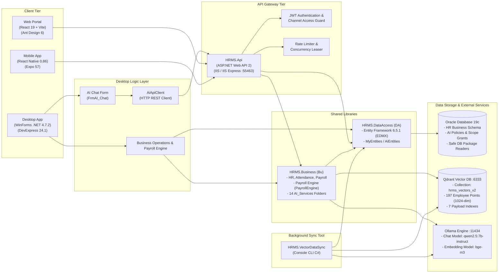
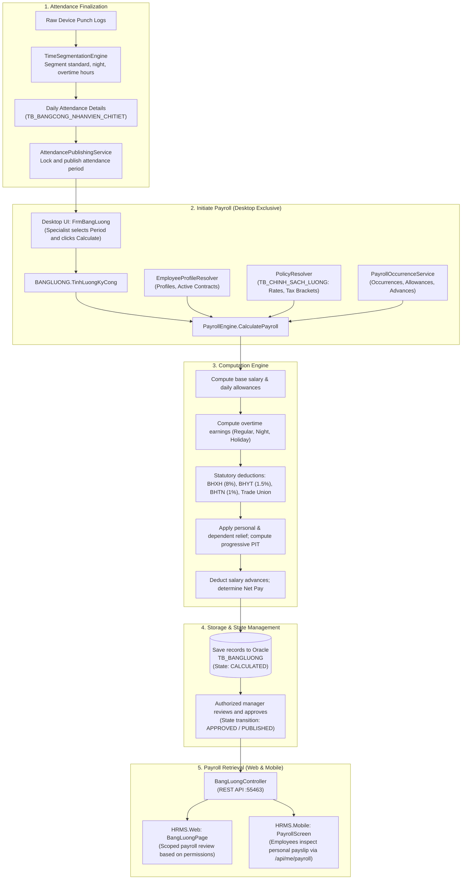
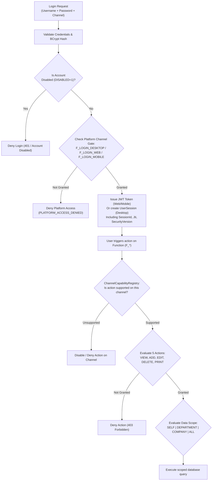
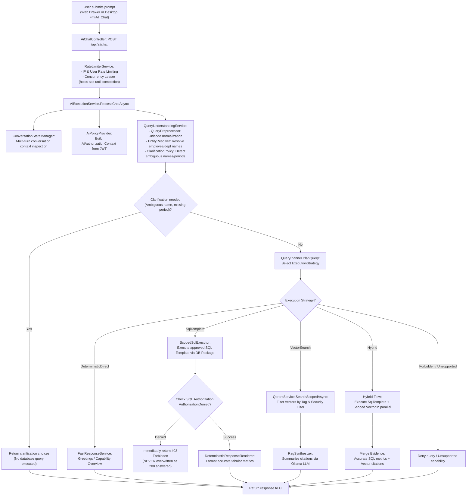
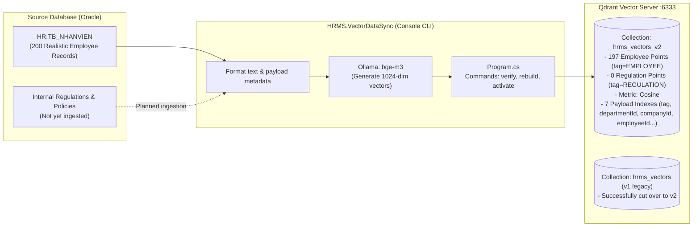

# Human Resource Management System (HRMS)

[Tiếng Việt](README.md) | [English](README.en.md) | [日本語](README.ja.md)

A multi-platform Human Resource Management System comprising Desktop (Windows WinForms), Web (React), and Mobile (React Native Expo) clients. It uses Oracle Database as the centralized business storage, combined with Qdrant vector database and local Ollama large language models for internal AI-assisted information retrieval.

This document was updated on **October 9, 2026**, based on current source code, configuration files, and recorded verification results across the repository.

---

## Four Status Levels Used in This Documentation

To ensure factual accuracy and objective assessment, information in this document follows four status levels:
1. **Available in source code:** The module, screen, controller, service, or database table exists in the source code; this does not guarantee it has been fully validated in production.
2. **Verified:** Tested with an explicit date, command/scope, and recorded outcome; conclusions apply strictly within that tested scope.
3. **Not yet verified / Known limitations:** End-to-end testing environment is missing, target database schema is unverified, or known issues were reproduced during reviews.
4. **Development roadmap:** Planned architectural improvements or future features; not currently implemented in the codebase.

---

## Table of Contents

1. [Overview and Purpose](#1-overview-and-purpose)
2. [Intended Users](#2-intended-users)
3. [Roles of Desktop, Web, and Mobile](#3-roles-of-desktop-web-and-mobile)
4. [Business Features](#4-business-features)
5. [System Architecture](#5-system-architecture)
6. [Technologies and Their Roles](#6-technologies-and-their-roles)
7. [Repository Structure](#7-repository-structure)
8. [Business Workflows](#8-business-workflows)
9. [Authentication and Authorization](#9-authentication-and-authorization)
10. [AI, SQL, and RAG](#10-ai-sql-and-rag)
11. [Data and Vector Synchronization](#11-data-and-vector-synchronization)
12. [Local Setup and Execution](#12-local-setup-and-execution)
13. [Verification and Recorded Results](#13-verification-and-recorded-results)
14. [Deployment and Operation](#14-deployment-and-operation)
15. [Current Challenges and Limitations](#15-current-challenges-and-limitations)
16. [Development Direction](#16-development-direction)
17. [Related Documentation](#17-related-documentation)
18. [Documentation Maintenance and Licensing](#18-documentation-maintenance-and-licensing)

---

## 1. Overview and Purpose

This HR management project includes Desktop, Web, and Mobile clients and uses Oracle for business data. Payroll calculation is initiated from Desktop. Web and Mobile provide management or lookup features according to user permissions. AI supports data and document lookup, with some workflows still under development.

The system is built to address core enterprise HR challenges:
- **Centralized Personnel Records & Lifecycle:** Manage employee profiles, identity documents, education, job history, employment contracts, awards, disciplinary actions, salary increases, job transfers, and terminations.
- **Automated Timekeeping & Time Segmentation:** Ingest clock-in/out records, calculate standard working units, actual work shifts, night shifts, holidays, annual leaves, and detect attendance anomalies.
- **Policy-Driven Payroll Computation:** Execute compensation rules based on verified attendance, allowances, overtime, statutory deductions (Social Insurance - BHXH, Health Insurance - BHYT, Unemployment Insurance - BHTN, Trade Union fees), progressive Personal Income Tax (PIT/TNCN), family relief deductions, and salary advances.
- **Employee Self-Service (ESS) & Multi-Tier Approvals:** Allow employees to submit leave requests, overtime registrations, attendance adjustments, and salary advances online, while managers review and approve requests on Web and Mobile.
- **Enterprise AI-Assisted Retrieval:** Integrate local language models and scoped vector retrieval to answer internal policy queries and employee lookups strictly within granted permissions.

---

## 2. Intended Users

1. **HR Specialists:**
   - Manage organizational structure (Companies, Departments, Divisions, Job Titles).
   - Maintain employee profiles, draft and issue employment contracts, track personnel lifecycle events (promotions, transfers, awards, penalties, resignations).
   - Primarily operate on the Desktop application and Web administration portal.
2. **Timekeeping and Payroll Specialists:**
   - Configure work shifts, attendance types, holiday calendars, and time tracking policies.
   - Review detailed attendance sheets, resolve anomalies, and finalize/publish monthly attendance periods.
   - Initiate payroll runs on Desktop, verify statutory deductions, tax withholdings, allowances, salary adjustments, and manage payroll publication states.
3. **Department Managers / Team Leads:**
   - Monitor attendance and workforce availability in their respective teams.
   - Review, approve, or reject employee leave requests, overtime submissions, salary advances, and attendance explanations via Web or Mobile.
4. **Employees:**
   - Access personal profiles, active contracts, daily punch records, and published monthly payslips.
   - Submit leave requests, register for overtime, request salary advances, and track approval status via Web or Mobile.
5. **System Administrators:**
   - Manage user accounts, user groups, 3-platform channel permissions (Desktop, Web, Mobile) across 5 actions (View, Add, Edit, Delete, Print).
   - Administer AI data scope grants (Self, Department, Company, All), monitor active sessions, and configure shared system parameters.

---

## 3. Roles of Desktop, Web, and Mobile

The three platforms have strictly separated operational responsibilities:

```
+-----------------------------------------------------------------------------------+
|                           PLATFORM ROLE SPECIFICATION                             |
+-----------------------------------------------------------------------------------+
|  HRMS.Desktop (Windows WinForms)                                                  |
|  - Deep operational workstation for HR & Payroll departments                      |
|  - Data entry for profiles, contracts, organizational catalogs, DevExpress reports|
|  - SOLE INITIATOR OF MONTHLY PAYROLL (FrmBangLuong -> PayrollEngine)              |
|  - Directly links C# Business Library & DataAccess to Oracle                      |
|  - Embedded AI Chat connects via HTTP REST API (AiApiClient)                      |
+-----------------------------------------------------------------------------------+
|  HRMS.Web (React 19 + TypeScript + Ant Design)                                    |
|  - Administrative portal for managers and HR staff                                |
|  - Executive KPI Dashboards, employee directory, contracts, attendance matrix     |
|  - Unified Approval Center (ApprovalCenterPage)                                   |
|  - 3-Platform channel permission matrix (PhanQuyenModal), AI scope grants         |
|  - Read published payroll sheets (Read-Only); CANNOT trigger payroll calculation  |
|  - Integrated AI Copilot Drawer (authenticated chat)                              |
|  - 100% communicates via REST API (HRMS.Api) with JWT authentication              |
+-----------------------------------------------------------------------------------+
|  HRMS.Mobile (React Native + Expo)                                                |
|  - Employee Self-Service (ESS) application on personal mobile devices             |
|  - View personal profile, monthly attendance, published payslips (api/me)        |
|  - Submit leave, overtime, and salary advance requests                            |
|  - Quick approval screen for managers on the go (ManagerApprovalsScreen)          |
|  - NO capability to trigger payroll runs or manage system configurations          |
|  - 100% communicates via REST API (HRMS.Api) with JWT authentication              |
+-----------------------------------------------------------------------------------+
```

---

## 4. Business Features

### 4.1. Platform Capability Matrix

| Business Module | Desktop | Web | Mobile | Required Permission | Technical Status |
| :--- | :---: | :---: | :---: | :---: | :--- |
| **Employee Profiles** | Full Management | Manage & Lookup | View Own Profile | `F_DM_NHANVIEN` | In source code; Web/Mobile via API |
| **Employment Contracts** | Draft, Print, Sign | Manage Directory | View Own Contract | `F_NV_HOPDONG` | In source code; used by payroll engine |
| **Catalogs & Shifts** | Full Configuration | View Catalogs | Not supported | `F_DM_*`, `F_CC_*` | In source code on Desktop & API |
| **Time & Attendance** | Import device logs, close | View Matrix, KPI | View Own Attendance | `F_CC_BANGCONG` | In source code; time segmentation engine |
| **Trigger Payroll Run** | **Exclusive Trigger** | Not supported | Not supported | `F_CC_BANGLUONG` (Desktop) | Verified via NUnit; WinForms calls Engine |
| **Payroll Lookup** | View details, print | Scoped Lookup | View Own Payslip | `F_CC_BANGLUONG`, `/me` | In source code; Web/Mobile read via API |
| **Salary Adjustments** | Enter adjustments | View by Period | Not supported | `F_CC_PHUCAP`, `F_CC_UNGLUONG` | In source code on Desktop |
| **Awards & Penalties** | Issue Decisions | View List | View Own Records | `F_NV_KHENTHUONG`, `KYLUAT` | In source code |
| **Employee Self-Service** | Limited | Submit requests | Submit requests | User Token (`/api/me`) | In source code; Web & Mobile active |
| **Approval Workflow** | Non-primary | Approval Center | Mobile Approvals | Manager Approval Rights | In source code on API, Web, Mobile |
| **Reports & Analytics** | DevExpress Reports | Dashboard Charts | Mobile Dashboard | `F_BC_BAOCAO`, `F_DB_*` | In source code; Desktop print templates |
| **RBAC & User Admin** | User Management | 3-Channel Matrix | Not supported | `F_SYSTEM_USER`, `PQ_CHUCNANG` | Verified 32/32 tests; atomic batch API |
| **AI Assistant & RAG** | Chat Form (via API) | Chat Drawer (via API)| Not integrated | `F_SYSTEM_AI` + Scope Grant | Verified 234 tests; v2 cutover complete |

### 4.2. Core Module Details

#### A. Employee Profiles and Employment Contracts
- **Purpose:** Store employee demographic data, identification, education, and career history; maintain contract validity periods, base salary, pay grade, and agreed allowances.
- **Inputs:** Personal records, department, division, job title, contract type, social insurance wage, effective and expiration dates.
- **Primary Actions:** Create employee records, scan IDs, issue new contracts, renew contracts, issue transfer/promotion decisions, process resignations.
- **Outputs:** Database records in `TB_NHANVIEN` and `TB_HOPDONG`, directly consumed by `EmployeeProfileResolver` during payroll calculation.

#### B. Timekeeping and Shift Segmentation
- **Purpose:** Manage monthly attendance periods, capture actual punch logs, accurately segment regular hours, night shifts, standard overtime, weekend overtime, and holiday overtime.
- **Inputs:** Raw device punch timestamps, approved leave forms, and authorized overtime slips.
- **Primary Actions:** Update daily logs, resolve tardiness/early departure exceptions, compute standard units via `TimeSegmentationEngine`, publish attendance matrices via `AttendancePublishingService`.
- **Outputs:** Summary table `TB_BANGCONG` and daily detail records `TB_BANGCONG_NHANVIEN_CHITIET`.

#### C. Payroll Calculation (Core Business Workflow)
- **Initiation Rule:** Payroll calculation is **strictly initiated from Desktop** (`FrmBangLuong` -> `BANGLUONG.TinhLuongKyCong` -> `PayrollEngine`).
- **Inputs:** Finalized attendance period, active labor contracts, tax and insurance policies in `TB_CHINH_SACH_LUONG`, payroll occurrences (`TB_PHATSINH_LUONG`), salary advances (`TB_UNGLUONG`), and allowances (`TB_PHUCAP`).
- **Calculation Sequence:**
  1. Validate attendance period lock status.
  2. Load active tax and insurance policies via `PolicyResolver`.
  3. Compute standard daily rate, actual work compensation, and daily allowances.
  4. Compute overtime earnings (regular, night, weekend, holiday).
  5. Calculate statutory employee withholdings: Social Insurance (8%), Health Insurance (1.5%), Unemployment Insurance (1%), Trade Union fee.
  6. Apply personal and dependent family relief; compute progressive Personal Income Tax (PIT).
  7. Deduct salary advances and other withholdings; determine Net Pay (`THUC_LINH`).
- **Outputs:** Stored in `TB_BANGLUONG`. Web and Mobile strictly read this data via `BangLuongController` and `MeController` once the period is marked as `APPROVED` or `PUBLISHED`.

---

## 5. System Architecture

### 5.1. Component Interaction Diagram



### 5.2. Architectural Principles
- **Hybrid n-Tier Architecture:** Not an isolated microservices deployment, but a pragmatic hybrid n-tier architecture with shared class libraries. Desktop links directly to shared assemblies (`Bu.dll`, `DA.dll`), while Web and Mobile strictly pass through the centralized `HRMS.Api` gateway.
- **Desktop AI Channel Decoupling:** Desktop AI Chat (`FrmAI_Chat`) **does not** open direct Oracle or Qdrant connections. Instead, it utilizes `AiApiClient` to issue HTTP requests to `HRMS.Api`, guaranteeing identical Rate Limiting, JWT validation, and Scope Grant enforcement as Web requests.

---

## 6. Technologies and Their Roles

| Technology | Configured Version | Technical Role in Project | Constraints & Notes |
| :--- | :--- | :--- | :--- |
| **C# / .NET Framework** | `v4.7.2` | Core backend for API, Business, DataAccess, Desktop, and VectorDataSync | Windows target; compiled via MSBuild from Visual Studio 2022 |
| **WinForms** | .NET 4.7.2 | Workstation UI for HR and payroll administrators | Windows environment required; event-driven UI |
| **DevExpress** | `24.1` | Advanced desktop controls: GridView, TreeList, Ribbon, XtraReports | Requires DevExpress 24.1 developer installation and license |
| **ASP.NET Web API 2** | `5.2.9` | RESTful API backend serving Web, Mobile, and Desktop AI clients | Hosted on IIS / IIS Express (default port `55463`) |
| **Entity Framework** | `6.5.1` | Database-First ORM connecting to Oracle via EDMX | `MyEntities` (business) and `AiEntities` (read-only AI views) |
| **Oracle Client** | `23.7.0` (Managed) | Official .NET data provider for Oracle Database 19c | Utilizes `Oracle.ManagedDataAccess` package |
| **Oracle Database** | 19c Enterprise / XE | Primary operational data store (HR schema) and AI security policies | Authoritative source of truth for all compensation records |
| **React** | `19.2.0` | UI framework for the administrative Web SPA | Functional components with Hooks and Theme Context |
| **TypeScript** | `~5.9.3` / TS 6 | Strict type-safety across the entire Web frontend | Strict compilation via `tsc -b` with zero errors |
| **Vite** | `^8.0.0` | Fast frontend build tool and local development server | Port `5173`; proxies `/api` to IIS Express backend |
| **Ant Design** | `^6.3.0` | Enterprise UI component system for Web (Table, Modal, Drawer, Form) | Integrated Dark/Light mode and i18n locale switching |
| **Expo** | `~57.0.0` | Mobile application development and bundling framework | Enables testing via Expo Go on physical devices and emulators |
| **React Native** | `0.86.0` | Mobile framework for iOS and Android | Focused on Employee Self-Service workflows |
| **Qdrant Vector DB** | `v1.12.1` / `v1.19.0` | Vector search engine for employee embeddings and internal documents | Active target: `hrms_vectors_v2` (1024-dim, Cosine) |
| **Ollama** | Local runtime | Local Large Language Model (LLM) and text embedding server | Chat model: `qwen2.5:7b-instruct`; Embedding model: `bge-m3` |
| **NUnit** | `3.14.0` | Automated testing framework for backend .NET code | Runs via NUnit3TestAdapter in Visual Studio & CLI |

---

## 7. Repository Structure

```text
QuanLyNhanSu/
├── HRMS.sln                                # Primary .NET Solution
├── README.md                               # Primary documentation (Vietnamese)
├── README.en.md                            # English documentation
├── README.ja.md                            # Japanese documentation (日本語)
│
├── HRMS.Desktop/                           # Windows Forms application (.NET Framework 4.7.2)
│   ├── FORM_NHANSU/                        # Employee records, contracts, awards forms
│   ├── FORM_CHAMCONG/                      # Attendance, payroll (FrmBangLuong), allowances forms
│   ├── FORM_SYSTEM/                        # Users, RBAC, AI configuration (FrmOllamaConfig) forms
│   ├── FORM_BAOCAO/ & Reports/             # DevExpress print reports and payslip templates
│   └── Functions/                          # AiApiClient, AiBootstrap, workstation helpers
│
├── HRMS.Api/                               # Backend REST API (ASP.NET Web API 2)
│   ├── Controllers/                        # AiChat, BangLuong, ChamCong, Me, User, ScopeAdmin...
│   ├── Filters/                            # JwtAuthorize, RateLimitAttribute...
│   ├── Services/                           # RateLimiterService, JwtService...
│   └── App_Start/                          # WebApiConfig, RouteConfig, CorsHandler...
│
├── HRMS.Business/                          # Shared business library (Namespace: Bu)
│   ├── CLASS_NHANSU/                       # Employee, contract, department business logic
│   ├── CLASS_CHAMCONG/                     # BANGLUONG (payroll facade), TimeSegmentationEngine...
│   ├── CLASS_PAYROLL/                      # PayrollEngine, PolicyResolver, EmployeeProfileResolver...
│   ├── CLASS_SECURITY/                     # ChannelCapabilityRegistry, PlatformAccessGuard...
│   ├── CLASS_SYSTEM/                       # UserSession, SYS_USER, SYS_CONFIG...
│   ├── DTO/                                # Data Transfer Objects
│   └── Services/AI_Services/               # 53 C# files organized across 14 functional directories:
│       ├── Bootstrap/                      # AiServiceLocator
│       ├── Configuration/                  # AiConfigurationCoordinator
│       ├── Chat/                           # AiExecutionService, ChatboxManager
│       ├── Understanding/                  # QueryUnderstandingService, EntityResolver, ClarificationPolicy...
│       ├── Planning/                       # QueryPlanner, ExecutionPlan
│       ├── Retrieval/                      # ScopedSqlExecutor, QdrantService, HybridRagService...
│       ├── Responses/                      # DeterministicResponseRenderer, RagSynthesizer, FastResponseService
│       ├── Providers/                      # OllamaService (LLM & Embedding HTTP client)
│       ├── Prompts/                        # JsonPromptManager (application prompt loader)
│       ├── Memory/                         # AiCacheCoordinator, ConversationStateManager...
│       ├── Security/                       # AiAuthorizationService, AiScopeEvaluator, ScopeGrantManagement...
│       ├── Indexing/                       # AiDataSyncHub, QdrantOutboxManager
│       ├── Interfaces/                     # IVectorService, ILlmService, IScopedSqlExecutor...
│       └── Runtime/                        # SystemClockProvider, FakeClockProvider
│
├── HRMS.DataAccess/                        # Data access layer using EF 6 (Namespace: DA)
│   ├── QLNhanSu.edmx                       # Database-First Oracle Model
│   ├── MyEntities.cs                       # Primary business DbContext
│   └── MyEntities.ChannelRights.cs         # 3-Channel RBAC and TB_SYS_RIGHT_CHANNEL mappings
│
├── HRMS.Web/                               # Web Administration Portal (React 19 + TypeScript + Vite)
│   ├── src/pages/                          # DashboardPage, NhanVienPage, BangLuongPage, ApprovalCenterPage...
│   ├── src/components/                     # PhanQuyenModal, AiChatDrawer, CommandPaletteModal...
│   └── src/locales/                        # Locales: vi, en, ja, ko, zh-CN
│
├── HRMS.Mobile/                            # Mobile ESS Application (React Native Expo 57)
│   └── src/                                # Screens (Profile, Attendance, Payroll), Navigation, Api...
│
├── HRMS.VectorDataSync/                    # Console CLI for vector index management
│   └── Program.cs                          # CLI: preflight, verify, rebuild, activate, reconcile...
│
├── HRMS.Tests/                             # Automated testing suite using NUnit 3 (net472)
│   ├── PlatformAccessAndSessionEnforcementTests.cs # 32 Platform access test cases
│   ├── PostReviewRemediationVerificationTests.cs    # Qdrant v2 cutover & coordinator verification
│   └── AntigravityUnifiedAiAndPermissionsVerificationTests.cs # AI & Scope integration tests
│
├── database/                               # Database migration and seed scripts
│   ├── migrations/                         # Migrations V1_0 through V1_33 (DDL, DML, Rollback, Verify)
│   ├── realistic200/                       # Realistic 200-employee test dataset
│   └── backups/                            # Metadata and configuration backups
│
├── docs/                                   # Project documentation (13 active documents)
│   ├── README.md                           # Documentation directory index
│   ├── ai-services-guide.md                # 53 C# AI files guide across 14 directories
│   ├── ai-rag-and-account-permissions-guide.md # RAG & Platform RBAC guide
│   └── archive/                            # Historical technical reports and design documents
│
├── docker-compose.yml                      # Infrastructure containers: Oracle, Qdrant, Ollama, Web
├── start_local_backend.bat                 # Script to launch IIS Express backend on port 55463
└── build_deploy.ps1                        # Local deployment and packaging script
```

---

## 8. Business Workflows

### 8.1. Payroll Calculation and Verification Workflow



### 8.2. Request and Approval Lifecycle (ESS)
1. **Submission:** An employee opens Web (`ApprovalCenterPage`) or Mobile (`LeaveRequestScreen`, `OvertimeRequestScreen`, `AdvanceSalaryScreen`), enters details (dates, rationale, advance amount).
2. **API Receipt:** `MeController` receives the request, validates the JWT caller identity, and inserts a record into `TB_YEUCAU` with state `PENDING`.
3. **Manager Notification:** The direct department manager sees the item in their pending approval queue.
4. **Decision:** The manager approves or rejects with comments. `ApprovalController` verifies managerial rights, updates state to `APPROVED` or `REJECTED`, records audit logs, and synchronizes downstream data (leaves, punches, or advances).

---

## 9. Authentication and Authorization

### 9.1. Three-Tier Security Matrix



### 9.2. Core Authorization Principles
- **Platform Channel Gates:** `F_LOGIN_DESKTOP`, `F_LOGIN_WEB`, and `F_LOGIN_MOBILE` act as gating permissions. If an account has a channel gate revoked, all sub-permissions on that platform are instantly disabled, even for administrators.
- **Fail-Closed Security:** Authorization never relies on username string comparisons like `USERNAME == "admin"`. Every user (including administrators) must possess explicit grant records in `TB_SYS_RIGHT_CHANNEL` or `TB_AI_SCOPE_GRANT`.
- **Zero-Trust Session Guards:** Every request validates the active session identity (`SessionId`, `Jti`, `TokenVersion`). If permissions change or an account is locked, `TokenVersion` increments, invalidating outstanding tokens immediately.
- **Atomic Batch Save:** The permission modal (`PhanQuyenModal`) calls `SaveBatchChannelPermissions` to commit permissions across all three channels in a single database transaction, preventing partial commit states.

---

## 10. AI, SQL, and RAG

### 10.1. Copilot Conversation Flow



### 10.2. AI Safety and Security Controls
- **SQL Injection Prevention:** Arbitrary LLM-generated SQL queries are strictly forbidden. The system exclusively executes predefined parameterized templates (`SqlTemplate`) cataloged in `AiCapabilityCatalog` using typed `OracleParameter` instances.
- **Fail-Closed in Hybrid Execution:** In hybrid queries (combining numerical SQL with textual vector citations), if the SQL sub-branch is denied or errors, the response immediately returns `forbidden` (403) or `error` (500), never masked as an answered 200 response.
- **Multi-Tier Vector Security Filters:** Vector search in Qdrant enforces effective scope:
  - `SELF`: Only vectors matching the caller's own employee ID are retrieved (`employeeId`).
  - `DEPARTMENT`: Only vectors within allowed department IDs are retrieved (`departmentId`). Employees without an assigned department (`departmentId <= 0`) are strictly blocked from seeing department-wide data.
  - `COMPANY` / `ALL`: Bounded by corporate boundaries or full administrative scope.
- **Concurrency Lease Retention:** Active leases in `RateLimiterService` remain locked throughout LLM text generation and are released only when the request completes, preventing resource starvation.

---

## 11. Data and Vector Synchronization

### 11.1. Vector Store Topology (Qdrant)



### 11.2. Observed State (Recorded October 9, 2026)
- **Active Collection:** `hrms_vectors_v2` is configured as the active default collection in `QdrantService.cs`.
- **Vector Point Count:** Exactly **197 valid employee vector points** exist (out of 200 total employee records, as 2 records lack department assignments and 1 probation record is unactivated).
- **Regulation Corpus Status:** `tag = "REGULATION"` currently has **0 points** (no approved regulation documents have been ingested yet). When queried about internal policies, the AI truthfully states that source documents are missing instead of hallucinating fictitious rules.
- **7 Payload Indexes:** Field indexes are established in Qdrant for: `tag` (keyword), `departmentId` (integer), `companyId` (integer), `employeeId` (integer), `domain` (keyword), `documentType` (keyword), `visibility_profile` (keyword).
- **Read-Only Invariant:** `SearchScopedAsync` only executes `GET /collections/{name}` and never issues `PUT` calls to create collections on read paths.

---

## 12. Local Setup and Execution

### 12.1. Prerequisites
- **Operating System:** Windows 10 / 11 or Windows Server 2019 / 2022.
- **Development Tools:** Visual Studio 2022 (Community, Professional, or Enterprise) with *.NET desktop development* workload and *.NET Framework 4.7.2 targeting pack*.
- **UI Component Suite:** DevExpress V24.1 (required to build and launch `HRMS.Desktop`).
- **Database:** Oracle Database 19c (Local or Docker) with imported `HR` schema and AI policy tables.
- **Node.js & npm:** Node.js version `>= 20.19.0` (Node 20 LTS or 22 LTS recommended).
- **AI Services:**
  - Local Ollama running at `http://localhost:11434` (`ollama pull qwen2.5:7b-instruct` and `ollama pull bge-m3`).
  - Qdrant running at `http://localhost:6333`.

### 12.2. Service Startup Order

#### Step 1: Start Database and AI Services
Start Oracle, Ollama, and Qdrant containers or services:
```powershell
# Verify Ollama service
curl http://localhost:11434/api/tags

# Verify Qdrant service
curl http://localhost:6333/collections
```

#### Step 2: Configure and Launch Backend API
1. Open [HRMS.Api/Web.config](HRMS.Api/Web.config) and verify Oracle connection strings under `connectionStrings`:
   - `QLNhanSuEntities` (primary `HR` schema).
   - `AiEntities` (AI read-only views).
2. Compile the solution using Visual Studio or MSBuild CLI:
   ```powershell
   & "C:\Program Files\Microsoft Visual Studio\2022\Enterprise\MSBuild\Current\Bin\MSBuild.exe" HRMS.Api\HRMS.Api.csproj /p:Configuration=Debug /v:m
   ```
3. Launch the backend on IIS Express via the provided root script:
   ```powershell
   .\start_local_backend.bat
   ```
   *The backend API will listen on:* `http://localhost:55463`

#### Step 3: Launch Web Portal
Open a new terminal:
```powershell
cd HRMS.Web
npm ci
npm run dev
```
*The Web portal will start at:* `http://localhost:5173`. Vite automatically proxies `/api` calls to `http://localhost:55463`.

#### Step 4: Launch Desktop Application
1. Open `HRMS.sln` in Visual Studio 2022.
2. Set `HRMS.Desktop` as the Startup Project.
3. Press **F5** or **Ctrl + F5** to launch.
4. Log in using an account with Desktop privileges (e.g., `ADMIN`).

#### Step 5: Launch Mobile Application (Optional)
Open a new terminal:
```powershell
cd HRMS.Mobile
npm ci
npm run start
```
Use the Expo Go app on an Android/iOS device or emulator. Ensure `API_BASE_URL` in [HRMS.Mobile/src/config/index.ts](HRMS.Mobile/src/config/index.ts) is configured to your host machine's LAN IP address (do not use `localhost` on physical devices).

---

## 13. Verification and Recorded Results

The following test suites and probes were verified on the codebase on **October 9, 2026**:

| Test Suite / Probe | Tool / Command | Verification Scope | Recorded Outcome | Known Scope Limits |
| :--- | :--- | :--- | :---: | :--- |
| **Platform Access RBAC** | `dotnet test --filter "PlatformAccess..."` | 32 platform permission, token version, wildcard scenarios | **32/32 PASSED (100%)** | Offline mock context tests |
| **AI Security & RBAC** | `dotnet test --filter "Ai|Antigravity|Rate..."` | 234 tests covering Prompt Injection, Cache, Scope, Rate Limiter | **234/234 PASSED (100%)** | Test schema & in-memory probes |
| **Qdrant v2 Cutover & Index** | `FollowupReviewProbe.exe` | 11 probes verifying security filter, concurrency leaser, v2 target | **11/11 PASSED (100%)** | Verified against local Qdrant |
| **Web Frontend Tests** | `npm test` in `HRMS.Web` | 5 test suites: KPI, Intro, Carousel, AI Chatbot, Permission Modal | **5/5 SUITES PASSED** | Logic tested on node test runner |
| **TypeScript Compilation** | `npx tsc -b` in `HRMS.Web` | Full TypeScript codebase in Web frontend | **0 ERRORS (Build Succeeded)** | Strict type-safety verified |
| **Backend C# Compilation** | MSBuild for Business, Api, Tests | Entire C# solution after 14 AI folders reorganization | **0 ERRORS (Build Succeeded)** | All 53 AI C# files preserved |
| **Qdrant Corpus Inspection** | HTTP GET `/collections/hrms_vectors_v2` | Point count and 7 payload indexes verification | **197 employee points, 0 regulation points** | Approved corpus ingestion pending |

---

## 14. Deployment and Operation

- **Backend Environment:** Windows Server 2019/2022 running IIS 10, Application Pool configured for `.NET CLR Version v4.0.30319`, Pipeline Mode: *Integrated*.
- **Web Frontend:** Static bundle generated via `npm run build` into `dist/`, served via IIS (with URL Rewrite) or Nginx reverse proxy.
- **Environment Variables and Secrets:**
  - `HRMS_JWT_SECRET`: Secret key for JWT signing (minimum 32 characters, set in server environment variables).
  - Oracle connection strings stored in server configuration files, encrypted via `aspnet_regiis` in production.
  - CORS configuration: Explicitly restricted to authorized Web domains; wildcard `*` is prohibited.
- **Backup Procedures:**
  - Periodic Oracle Database export using `expdp` (`HR_BACKUP.DMP`).
  - Periodic Qdrant snapshot generation via `POST /collections/{name}/snapshots`.

---

## 15. Current Challenges and Limitations

1. **Heterogeneous Technology Stack:** The system combines legacy .NET Framework 4.7.2 (WinForms, Web API 2) with a modern frontend stack (React 19, TypeScript, Expo 57). There is no single cross-platform toolchain; workstation onboarding requires Visual Studio, DevExpress, and Node.js.
2. **Desktop Dependency for Payroll Runs:** Because the deep payroll engine and DevExpress reporting templates are embedded within `HRMS.Desktop`, payroll calculations must currently be triggered from a Windows machine with a DevExpress license.
3. **Distributed Configuration:** Connection strings and server URLs are split across `Web.config`, `App.config`, `.env`, and database table `TB_CONFIG`, requiring careful coordination when altering hostnames.
4. **Missing Regulation Vector Corpus:** The vector database currently only indexes employee data (`tag=EMPLOYEE`). Official internal company policies and regulation documents (`tag=REGULATION=0`) have not yet been ingested. The AI will truthfully indicate missing sources when asked about company policies.
5. **In-Memory Vector Outbox:** The current outbox mechanism relies on in-memory buffers; an abrupt process termination may require a manual reconciliation run via `HRMS.VectorDataSync --reconcile`.
6. **Incomplete Localization Coverage:** While the Web portal has full language support across 5 locales (vi, en, ja, ko, zh-CN), the Desktop WinForms UI remains predominantly Vietnamese, and some legacy database labels exhibit character encoding anomalies.

---

## 16. Development Direction

| Priority | Planned Direction | Target & Delivered Value | Acceptance Criteria |
| :---: | :--- | :--- | :--- |
| **P1** | **Approved Corpus Ingestion** | Ingest verified internal policies, leave regulations, and salary bylaws into Qdrant for policy question answering. | Vector count `tag=REGULATION` > 0; policy answers include valid document citations. |
| **P1** | **Durable Vector Outbox Store** | Persist employee data mutation events into an Oracle outbox table within the business database transaction. | Worker automatically recovers and replays events on restart without event loss. |
| **P2** | **Secure API Endpoint for Payroll Runs** | Package `PayrollEngine` as an independent service so the Web portal can safely trigger audited payroll runs. | Secure POST payroll endpoint with strict permissions, audit logging, and concurrency locks. |
| **P2** | **Desktop Localization Standardization** | Implement unified resource loading across Desktop forms and sanitize legacy character encoding. | Language switching on Desktop produces no character corruption (mojibake). |
| **P3** | **Platform Modernization (.NET 9 / EF Core)** | Assess migration feasibility from ASP.NET Web API 2 to modern ASP.NET Core for Linux container hosting. | Compatibility report, EF Core migration roadmap, and non-disruptive execution plan. |

---

## 17. Related Documentation

Detailed technical documentation is maintained in the [docs/](docs/) folder:
- [Documentation Index](docs/README.md): Overview of all project guides.
- [AI Services Architecture & Operations Guide](docs/ai-services-guide.md): Comprehensive map of 53 C# AI files across 14 directories, workflows, and extension guide.
- [RAG & Platform Authorization Guide](docs/ai-rag-and-account-permissions-guide.md): Details on 3-channel access control and AI safety.
- [Local Setup & Installation Guide](docs/installation.md): Developer environment onboarding.
- [System Architecture](docs/architecture.md): Layer interactions and data flows.
- [Current System Status](docs/current-status.md): Engineering review findings and pending tasks.
- [Timekeeping & Payroll Guide](docs/payroll.md): Calculation formulas, policies, and ledger verification.
- [Mobile Development Guide](docs/mobile.md): Setup, API configuration, and Expo build instructions.
- [Historical Archive](docs/archive/): Previous diagnostic reports and design plans.

---

## 18. Documentation Maintenance and Licensing

### 18.1. Tri-Lingual Synchronization
The root repository documentation is maintained in three synchronized language editions:
- [Tiếng Việt (README.md)](README.md) - Canonical source document.
- [English (README.en.md)](README.en.md) - English edition with identical 18 sections and matching tables.
- [日本語 (README.ja.md)](README.ja.md) - Japanese edition using natural business terminology while preserving Vietnamese labor and insurance context.

Any significant change to architecture, features, or test outcomes must be updated simultaneously across all three editions.

### 18.2. Copyright and Licensing
This codebase is proprietary enterprise software. The system incorporates open-source libraries under their respective licenses (MIT, Apache 2.0) and commercial DevExpress components (requiring a valid commercial license for production deployment). Unauthorized copying, redistribution, or publishing of this repository is strictly prohibited without prior written consent from the project owners.
