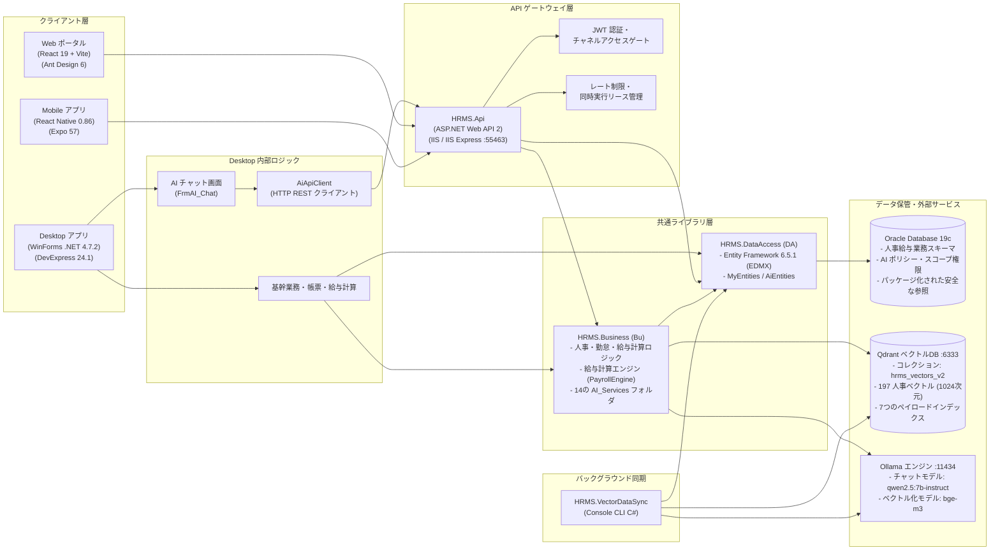
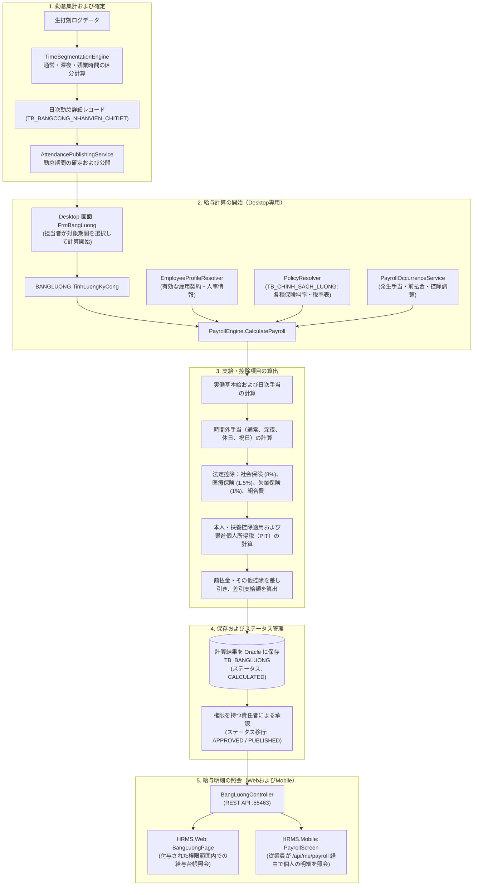
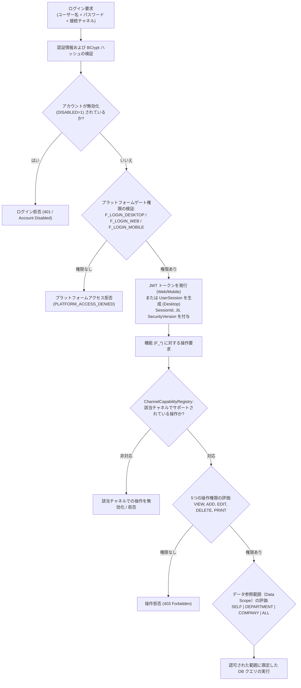
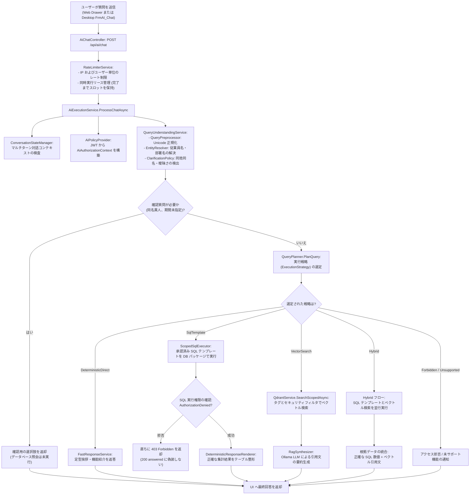
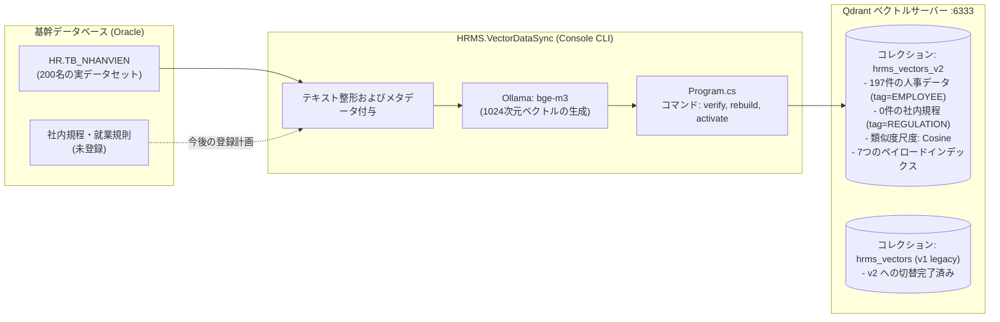

# 人事労務・給与管理システム (HRMS)

[Tiếng Việt](README.md) | [English](README.en.md) | [日本語](README.ja.md)

本システムは、Desktop（Windows WinForms）、Web（React）、Mobile（React Native Expo）の各クライアントで構成されるマルチプラットフォーム人事労務管理システムです。Oracle Database を基幹業務データのリポジトリとし、Qdrant ベクトルデータベースおよびローカルの Ollama 大規模言語モデルを組み合わせた社内 AI 検索・照会機能を提供します。

本ドキュメントは、リポジトリ内の現在のソースコード、設定ファイル、および記録された検証結果に基づき、**2026年10月9日**に更新されました。

---

## 本ドキュメントにおける4段階の状態定義

客観的かつ正確な情報提供を行うため、本ドキュメントの記述は以下の4つの検証基準に準拠しています：
1. **ソースコード上に存在（Có trong mã nguồn）：** 画面、APIコントローラー、サービス、またはテーブルがコード上に実装されている状態。実運用環境での正常動作を保証するものではありません。
2. **検証済み（Đã kiểm tra）：** 実施日、実行コマンド、スコープ、および結果が記録されている状態。結論は検証された範囲内に限定されます。
3. **未検証・制約事項（Chưa xác minh / còn hạn chế）：** エンドツーエンド検証環境の未整備、移行先スキーマの不整合、またはレビューで再現された既存課題が存在する状態。
4. **今後の開発方針（Hướng phát triển）：** 将来的に計画されているアーキテクチャの改善または機能。現行コードには未実装の状態。

---

## 目次

1. [概要と目的](#1-概要と目的)
2. [利用対象](#2-利用対象)
3. [Desktop・Web・Mobileの役割](#3-desktopwebmobileの役割)
4. [業務機能](#4-業務機能)
5. [システム構成](#5-システム構成)
6. [使用技術と役割](#6-使用技術と役割)
7. [リポジトリ構成](#7-リポジトリ構成)
8. [業務処理の流れ](#8-業務処理の流れ)
9. [認証と権限管理](#9-認証と権限管理)
10. [AI・SQL・RAG](#10-aisqlrag)
11. [データとベクトル同期](#11-データとベクトル同期)
12. [ローカル環境の準備と実行](#12-ローカル環境の準備と実行)
13. [検証と記録された結果](#13-検証と記録された結果)
14. [配置と運用](#14-配置と運用)
15. [現在の課題と制約](#15-現在の課題と制約)
16. [今後の開発方針](#16-今後の開発方針)
17. [関連ドキュメント](#17-関連ドキュメント)
18. [ドキュメント保守とライセンス](#18-ドキュメント保守とライセンス)

---

## 1. 概要と目的

この人事管理プロジェクトは、Desktop・Web・Mobileの各クライアントで構成され、業務データをOracleに保存します。給与計算はDesktopから開始します。WebとMobileでは、利用者の権限に応じて管理や参照を行います。AIによるデータ・文書検索にも対応していますが、一部の処理は引き続き改善が必要です。

本システムは、企業の人事労務における中核的課題の解決を目的としています：
- **人事情報・ライフサイクルの集中管理：** 従業員プロフィール、本人確認情報、学歴、職歴、雇用契約、表彰・懲戒、昇給、異動、退職の一元管理。
- **勤怠管理と時間区分の自動化：** 打刻データの集計、標準労働単位、実働時間、深夜業、休日出勤、年次有給休暇の算出および勤怠異常の検出。
- **規定に基づく給与計算処理：** 確定勤怠、手当、残業、法定控除（ベトナム社会保険 BHXH、医療保険 BHYT、失業保険 BHTN、労働組合費）、累進個人所得税（PIT/TNCN）、扶養控除、前払金の算出。
- **従業員セルフサービス（ESS）と多段階承認：** 休暇申請、残業申請、勤怠修正、給与前払申請のオンライン提出と、管理職による Web・Mobile での承認。
- **社内規定の AI 検索支援：** ローカル言語モデルと権限フィルタリング付きベクトル検索を統合し、認可された範囲内での社内規定や人事データの問い合わせを支援。

---

## 2. 利用対象

1. **人事担当者（HR Specialist）：**
   - 組織構造（会社、部署、部門、役職）の維持管理。
   - 従業員情報の登録、雇用契約の締結・更新、異動・昇給・表彰・懲戒・退職手続きの管理。
   - 主に Desktop アプリケーションおよび Web 管理ポータルを操作。
2. **勤怠・給与担当者（Payroll Specialist）：**
   - 勤務シフト、勤怠区分、祝日カレンダー、集計ルールの設定。
   - 月次勤怠明細の点検、勤怠異常の解決、勤怠期間の確定および公開。
   - Desktop からの給与計算の実行、保険・税金・各種手当・差引調整の検証、給与明細公開ステータスの管理。
3. **部門管理者・マネージャー（Department Head / Manager）：**
   - 所属部門の勤怠状況および人員配置のモニタリング。
   - 部下から提出された休暇申請、残業申請、給与前払申請、勤怠理由書の Web または Mobile での承認・却下。
4. **一般従業員（Employee）：**
   - 自身のプロフィール、有効な雇用契約、日次打刻履歴、公開済み給与明細の照会。
   - 休暇申請、残業申請、給与前払申請の提出および承認進捗の確認（Web / Mobile）。
5. **システム管理者（System Administrator）：**
   - ユーザーアカウント、ユーザーグループ、3プラットフォーム（Desktop, Web, Mobile）× 5操作（閲覧、追加、編集、削除、印刷）の権限マトリクス管理。
   - AI データ参照範囲（Self, Department, Company, All）の認可付与、アクティブセッション監視、共通環境設定。

---

## 3. Desktop・Web・Mobileの役割

3つのプラットフォームは、それぞれの運用環境に応じて責任が明確に分離されています：

```
+-----------------------------------------------------------------------------------+
|                            プラットフォーム別の役割分担                           |
+-----------------------------------------------------------------------------------+
|  HRMS.Desktop (Windows WinForms)                                                  |
|  - 人事部および給与計算担当者向けの基幹業務ワークステーション                      |
|  - 人事情報、契約書、組織マスタ、DevExpress 帳票・印刷の高度なデータ入力           |
|  - 月次給与計算を実行可能な唯一の環境（FrmBangLuong -> PayrollEngine）            |
|  - C# 共通ビジネスライブラリおよび DataAccess を通じて Oracle に直接接続           |
|  - 内蔵 AI チャット画面は HTTP REST API（AiApiClient）を経由して接続               |
+-----------------------------------------------------------------------------------+
|  HRMS.Web (React 19 + TypeScript + Ant Design)                                    |
|  - 管理職および人事担当者向けの情報ポータル・ダッシュボード                        |
|  - 経営 KPI ダッシュボード、従業員一覧、契約一覧、勤怠集計マトリクス               |
|  - 統合承認センター（ApprovalCenterPage）                                         |
|  - 3プラットフォーム権限設定（PhanQuyenModal）、AI スコープ認可設定                |
|  - 公開済み給与台帳の閲覧（参照専用、給与計算の実行は不可）                        |
|  - AI Copilot Drawer（ログインユーザーの権限に応じた対話）                        |
|  - 100% JWT 認証付き REST API（HRMS.Api）経由で通信                                |
+-----------------------------------------------------------------------------------+
|  HRMS.Mobile (React Native + Expo)                                                |
|  - 個人のスマートフォン端末向け従業員セルフサービス（ESS）アプリ                  |
|  - 個人プロフィール、月次勤怠、公開済み給与明細の照会（api/me）                   |
|  - 休暇・残業・給与前払のオンライン申請                                           |
|  - 外出先からの管理職向け迅速承認画面（ManagerApprovalsScreen）                   |
|  - 給与計算の実行やシステム管理機能は非搭載                                       |
|  - 100% JWT 認証付き REST API（HRMS.Api）経由で通信                                |
+-----------------------------------------------------------------------------------+
```

---

## 4. 業務機能

### 4.1. プラットフォーム別機能マトリクス

| 業務モジュール | Desktop | Web | Mobile | 必要権限 | 技術的状態 |
| :--- | :---: | :---: | :---: | :---: | :--- |
| **人事情報管理** | 全機能管理 | 管理・検索 | 自身の情報照会 | `F_DM_NHANVIEN` | ソースコード上に存在（Web/MobileはAPI経由） |
| **雇用契約管理** | 作成・印刷・締結 | 一覧管理 | 自身の契約照会 | `F_NV_HOPDONG` | ソースコード上に存在（給与計算が直接参照） |
| **マスタ・シフト設定** | 全設定可能 | 参照のみ | 非対応 | `F_DM_*`, `F_CC_*` | Desktop・API のソースコード上に存在 |
| **勤怠・打刻管理** | 機器データ取込・確定 | 集計閲覧・KPI | 自身の勤怠照会 | `F_CC_BANGCONG` | ソースコード上に存在（時間区分エンジン） |
| **給与計算の実行** | **専用実行画面** | 非対応 | 非対応 | `F_CC_BANGLUONG` (Desktop) | NUnit にて検証済み（WinForms が Engine 呼出） |
| **給与明細照会** | 詳細照会・印刷 | 権限内照会 | 自身の明細照会 | `F_CC_BANGLUONG`, `/me` | ソースコード上に存在（Web/MobileはAPI経由） |
| **給与差引調整** | 調整入力・手当 | 期間別照会 | 非対応 | `F_CC_PHUCAP`, `F_CC_UNGLUONG` | Desktop のソースコード上に存在 |
| **表彰・懲戒処分** | 決定発令 | 一覧照会 | 自身の処分照会 | `F_NV_KHENTHUONG`, `KYLUAT` | ソースコード上に存在 |
| **セルフサービス（ESS）** | 一部制限 | 申請・結果確認 | 申請・結果確認 | ユーザーToken (`/api/me`) | ソースコード上に存在（Web・Mobile稼働） |
| **申請承認フロー** | 非推奨 | 承認センター | モバイル承認 | 管理職承認権限 | API・Web・Mobile のソースコード上に存在 |
| **帳票・分析** | DevExpress 印刷 | ダッシュボード | 簡易ダッシュボード | `F_BC_BAOCAO`, `F_DB_*` | ソースコード上に存在（Desktop印刷テンプレート） |
| **権限・アカウント管理** | ユーザー管理 | 3チャネルマトリクス | 非対応 | `F_SYSTEM_USER`, `PQ_CHUCNANG` | 32/32テスト検証済み（アトミックバッチAPI） |
| **AI アシスタント・RAG** | チャット（API経由） | チャット（API経由） | 未統合 | `F_SYSTEM_AI` + Scope Grant | 234テスト検証済み（v2切替完了） |

### 4.2. 主要業務の詳細仕様

#### A. 人事情報および雇用契約管理
- **目的：** 従業員の基本属性、身元証明、学歴、職歴の保持。契約期間、基本給、号俸、合意された諸手当の管理。
- **入力情報：** 個人情報、所属部署、部門、役職、契約種別、社会保険算定基礎給与、発効日および満了日。
- **主要操作：** 新規雇用登録、身分証スキャン、契約締結・更新、昇給・降給発令、異動辞令、退職手続き。
- **出力情報：** `TB_NHANVIEN`（従業員マスタ）および `TB_HOPDONG`（契約マスタ）に登録され、給与計算時に `EmployeeProfileResolver` から直接読み込まれます。

#### B. 勤怠管理および時間区分集計
- **目的：** 月次勤怠期間の管理、実打刻ログの記録、日中勤務、深夜業、法定時間外労働、休日出勤、祝日出勤の正確な区分集計。
- **入力情報：** タイムレコーダーの生打刻ログ、承認済み有給申請、承認済み残業申請。
- **主要操作：** 日次打刻の補正、遅刻・早退の例外処理、`TimeSegmentationEngine` による標準労働単位の算出、`AttendancePublishingService` による勤怠期間の公開。
- **出力情報：** 月次勤怠サマリ `TB_BANGCONG` および日次明細 `TB_BANGCONG_NHANVIEN_CHITIET`。

#### C. 給与計算処理（中核的業務フロー）
- **実行条件：** 給与計算処理は **Desktop アプリケーションからのみ開始可能** です（`FrmBangLuong` -> `BANGLUONG.TinhLuongKyCong` -> `PayrollEngine`）。
- **入力情報：** 確定済み勤怠期間、有効な雇用契約、`TB_CHINH_SACH_LUONG` の保険・税率ポリシー、給与発生項目（`TB_PHATSINH_LUONG`）、前払金（`TB_UNGLUONG`）、各種手当（`TB_PHUCAP`）。
- **計算シーケンス：**
  1. 勤怠期間の確定（ロック）状態を確認。
  2. `PolicyResolver` を通じて有効な保険料率および税率ブラケットをロード。
  3. 日割り基礎額、実働給与、日次手当を計算。
  4. 時間外手当（通常、深夜、休日、祝日）を計算。
  5. 従業員負担の法定控除を計算：社会保険（8%）、医療保険（1.5%）、失業保険（1%）、労働組合費。
  6. 本人控除および扶養控除を適用後、累進課税方式で個人所得税（PIT/TNCN）を計算。
  7. 前払金およびその他控除を差し引き、差引支給額（Net Pay / `THUC_LINH`）を確定。
- **出力情報：** `TB_BANGLUONG` に保存。Web および Mobile は、ステータスが `APPROVED` または `PUBLISHED` に移行した後にのみ、`BangLuongController` および `MeController` を通じて参照可能です。

---

## 5. システム構成

### 5.1. コンポーネント間連携図



### 5.2. アーキテクチャの設計指針
- **ハイブリッド n層構成：** 分散マイクロサービスではなく、クラスライブラリを共有する実用的な多層アーキテクチャを採用しています。Desktop は共通アセンブリ（`Bu.dll`, `DA.dll`）を直接参照しますが、Web および Mobile は一元管理された `HRMS.Api` を経由します。
- **Desktop AI チャットの分離：** Desktop の AI チャット画面（`FrmAI_Chat`）は Oracle や Qdrant に直接接続せず、`AiApiClient` を介して `HRMS.Api` に HTTP リクエストを送信します。これにより、Web と同様のレート制限、JWT 検証、スコープ認可が確実に適用されます。

---

## 6. 使用技術と役割

| 技術要素 | 設定バージョン | プロジェクトにおける役割 | 制約事項および備考 |
| :--- | :--- | :--- | :--- |
| **C# / .NET Framework** | `v4.7.2` | バックエンド（API, Business, DataAccess, Desktop, VectorDataSync）の中核 | Windows 環境専用；Visual Studio 2022 の MSBuild でコンパイル |
| **WinForms** | .NET 4.7.2 | 人事・労務担当者向けリッチクライアント UI | Windows 環境が必要；イベント駆動型 |
| **DevExpress** | `24.1` | 高度な Desktop UI（GridView, TreeList, Ribbon, XtraReports） | 開発およびビルド時に DevExpress 24.1 ライセンスが必要 |
| **ASP.NET Web API 2** | `5.2.9` | Web、Mobile、および Desktop AI 向け RESTful API | IIS / IIS Express（既定ポート `55463`）でホスト |
| **Entity Framework** | `6.5.1` | EDMX を介して Oracle に接続する Database-First ORM | `MyEntities`（業務）と `AiEntities`（AI参照ビュー） |
| **Oracle Client** | `23.7.0` (Managed) | Oracle Database 19c への公式 .NET マネージドプロバイダー | `Oracle.ManagedDataAccess` パッケージを利用 |
| **Oracle Database** | 19c Enterprise / XE | 基幹業務データ（HRスキーマ）および AI セキュリティポリシーの保管 | すべての勤怠・給与計算結果のマスターデータストア |
| **React** | `19.2.0` | 管理用 Web SPA の UI ライブラリ | React Hooks およびテーマコンテキストによる状態管理 |
| **TypeScript** | `~5.9.3` / TS 6 | Web フロントエンド全域における厳格な型安全性 | `tsc -b` による厳格なコンパイルでエラーゼロを維持 |
| **Vite** | `^8.0.0` | 高速なフロントエンドビルドツールおよび開発サーバー | ポート `5173`；`/api` を IIS Express にリバースプロキシ |
| **Ant Design** | `^6.3.0` | Web 向けエンタープライズ UI コンポーネント群 | ダーク/ライトモード切替および多言語対応を内蔵 |
| **Expo** | `~57.0.0` | モバイルアプリの開発およびバンドルフレームワーク | 実機 Expo Go アプリおよびエミュレーターでのテストに対応 |
| **React Native** | `0.86.0` | iOS / Android 向けモバイルクライアント | 従業員セルフサービス（ESS）に特化 |
| **Qdrant Vector DB** | `v1.12.1` / `v1.19.0` | 従業員属性ベクトルおよび社内文書のベクトル検索エンジン | 稼働対象：`hrms_vectors_v2`（1024次元、コサイン類似度） |
| **Ollama** | ローカル環境 | ローカル LLM（テキスト生成）および埋め込みベクトルの生成 | チャット：`qwen2.5:7b-instruct`；埋め込み：`bge-m3` |
| **NUnit** | `3.14.0` | バックエンド .NET 向けの自動テストフレームワーク | Visual Studio および CLI 上で NUnit3TestAdapter を使用 |

---

## 7. リポジトリ構成

```text
QuanLyNhanSu/
├── HRMS.sln                                # メインの .NET ソリューション
├── README.md                               # ベトナム語ドキュメント（正本）
├── README.en.md                            # 英語ドキュメント
├── README.ja.md                            # 日本語ドキュメント（本書）
│
├── HRMS.Desktop/                           # Windows Forms アプリケーション (.NET Framework 4.7.2)
│   ├── FORM_NHANSU/                        # 人事情報、雇用契約、表彰画面
│   ├── FORM_CHAMCONG/                      # 勤怠、給与計算 (FrmBangLuong)、手当画面
│   ├── FORM_SYSTEM/                        # ユーザー、権限、AI設定 (FrmOllamaConfig) 画面
│   ├── FORM_BAOCAO/ & Reports/             # DevExpress 給与明細・勤怠帳票テンプレート
│   └── Functions/                          # AiApiClient, AiBootstrap, 共通ヘルパー
│
├── HRMS.Api/                               # バックエンド REST API (ASP.NET Web API 2)
│   ├── Controllers/                        # AiChat, BangLuong, ChamCong, Me, User, ScopeAdmin...
│   ├── Filters/                            # JwtAuthorize, RateLimitAttribute...
│   ├── Services/                           # RateLimiterService, JwtService...
│   └── App_Start/                          # WebApiConfig, RouteConfig, CorsHandler...
│
├── HRMS.Business/                          # 共通ビジネスロジックライブラリ (Namespace: Bu)
│   ├── CLASS_NHANSU/                       # 従業員、契約、部署関連ロジック
│   ├── CLASS_CHAMCONG/                     # BANGLUONG (給与ファサード), TimeSegmentationEngine...
│   ├── CLASS_PAYROLL/                      # PayrollEngine, PolicyResolver, EmployeeProfileResolver...
│   ├── CLASS_SECURITY/                     # ChannelCapabilityRegistry, PlatformAccessGuard...
│   ├── CLASS_SYSTEM/                       # UserSession, SYS_USER, SYS_CONFIG...
│   ├── DTO/                                # データ転送オブジェクト
│   └── Services/AI_Services/               # 14の機能別ディレクトリに配置された 53の C# ファイル:
│       ├── Bootstrap/                      # AiServiceLocator
│       ├── Configuration/                  # AiConfigurationCoordinator
│       ├── Chat/                           # AiExecutionService, ChatboxManager
│       ├── Understanding/                  # QueryUnderstandingService, EntityResolver, ClarificationPolicy...
│       ├── Planning/                       # QueryPlanner, ExecutionPlan
│       ├── Retrieval/                      # ScopedSqlExecutor, QdrantService, HybridRagService...
│       ├── Responses/                      # DeterministicResponseRenderer, RagSynthesizer, FastResponseService
│       ├── Providers/                      # OllamaService (LLM & 埋め込み HTTP クライアント)
│       ├── Prompts/                        # JsonPromptManager (アプリケーションプロンプト読み込み)
│       ├── Memory/                         # AiCacheCoordinator, ConversationStateManager...
│       ├── Security/                       # AiAuthorizationService, AiScopeEvaluator, ScopeGrantManagement...
│       ├── Indexing/                       # AiDataSyncHub, QdrantOutboxManager
│       ├── Interfaces/                     # IVectorService, ILlmService, IScopedSqlExecutor...
│       └── Runtime/                        # SystemClockProvider, FakeClockProvider
│
├── HRMS.DataAccess/                        # データアクセス層 EF 6 (Namespace: DA)
│   ├── QLNhanSu.edmx                       # Database-First Oracle モデル
│   ├── MyEntities.cs                       # 業務 DbContext
│   └── MyEntities.ChannelRights.cs         # 3チャネル権限と TB_SYS_RIGHT_CHANNEL マッピング
│
├── HRMS.Web/                               # 管理用 Web ポータル (React 19 + TypeScript + Vite)
│   ├── src/pages/                          # DashboardPage, NhanVienPage, BangLuongPage, ApprovalCenterPage...
│   ├── src/components/                     # PhanQuyenModal, AiChatDrawer, CommandPaletteModal...
│   └── src/locales/                        # 多言語リソース: vi, en, ja, ko, zh-CN
│
├── HRMS.Mobile/                            # モバイル ESS アプリ (React Native Expo 57)
│   └── src/                                # Screens (Profile, Attendance, Payroll), Navigation, Api...
│
├── HRMS.VectorDataSync/                    # ベクトルインデックス管理 CLI
│   └── Program.cs                          # CLI: preflight, verify, rebuild, activate, reconcile...
│
├── HRMS.Tests/                             # 自動テストスイート NUnit 3 (net472)
│   ├── PlatformAccessAndSessionEnforcementTests.cs # 32のプラットフォームアクセス検証
│   ├── PostReviewRemediationVerificationTests.cs    # Qdrant v2 切替および協調クラス検証
│   └── AntigravityUnifiedAiAndPermissionsVerificationTests.cs # AI・スコープ統合テスト
│
├── database/                               # データベーススクリプト
│   ├── migrations/                         # マイグレーション V1_0 〜 V1_33 (DDL, DML, Rollback, Verify)
│   ├── realistic200/                       # 200名規模のテストデータセット
│   └── backups/                            # バックアップメタデータ
│
├── docs/                                   # プロジェクトドキュメント (13の有効な文書)
│   ├── README.md                           # ドキュメント一覧インデックス
│   ├── ai-services-guide.md                # 14フォルダ・53の AI C# ファイル詳細仕様書
│   ├── ai-rag-and-account-permissions-guide.md # RAG とプラットフォームアクセス制御仕様
│   └── archive/                            # 過去の診断レポートおよび設計書アーカイブ
│
├── docker-compose.yml                      # インフラコンテナ：Oracle, Qdrant, Ollama, Web
├── start_local_backend.bat                 # IIS Express (ポート 55463) 起動スクリプト
└── build_deploy.ps1                        # ローカルビルドおよびパッケージングスクリプト
```

---

## 8. 業務処理の流れ

### 8.1. 給与計算および公開確認フロー



### 8.2. 申請・承認処理のライフサイクル（ESS）
1. **申請提出：** 従業員が Web（`ApprovalCenterPage`）または Mobile（`LeaveRequestScreen`, `OvertimeRequestScreen`, `AdvanceSalaryScreen`）から申請内容（日付、理由、前払希望額）を入力して送信。
2. **API 受付：** `MeController` がリクエストを受信し、JWT の送信者身元を検証の上、ステータス `PENDING` で `TB_YEUCAU` にレコードを登録。
3. **管理者通知：** 直属の上長管理者の未承認一覧に申請が表示。
4. **承認・却下：** 管理者がコメントを入力して承認または却下を実行。`ApprovalController` が承認権限を検証し、ステータスを `APPROVED` または `REJECTED` に更新し、監査ログを記録した上で関連データ（休暇日数、打刻、前払台帳）に反映。

---

## 9. 認証と権限管理

### 9.1. 3層セキュリティアーキテクチャ



### 9.2. 権限管理の基本原則
- **プラットフォームゲート権限（Platform Gate）：** `F_LOGIN_DESKTOP`, `F_LOGIN_WEB`, `F_LOGIN_MOBILE` は各環境への入口を制御します。いずれかのゲート権限が無効化された場合、管理者アカウントであっても該当プラットフォーム上のすべての個別権限が即座に無効化されます。
- **Fail-Closed 原則（安全側に倒す設計）：** `USERNAME == "admin"` のようなアカウント文字列による判定は排除されています。管理者を含むすべてのユーザーは、`TB_SYS_RIGHT_CHANNEL` または `TB_AI_SCOPE_GRANT` に明示的な権限レコードを保持している必要があります。
- **ゼロトラスト・セッションガード：** すべてのリクエストでセッションの同一性（`SessionId`, `Jti`, `TokenVersion`）を検証します。権限が変更された場合、`TokenVersion` がインクリメントされ、既存のトークンは即座に失効します。
- **アトミックバッチ更新：** 権限設定モーダル（`PhanQuyenModal`）は、3つのチャネルに対する権限変更を単一のデータベーストランザクション（`SaveBatchChannelPermissions`）内でコミットし、部分適用の不整合を防止します。

---

## 10. AI・SQL・RAG

### 10.1. Copilot 対話処理フロー



### 10.2. AI セキュリティと安全対策
- **SQL インジェクションの完全排除：** LLM による任意の SQL 自動生成は禁止されています。システムは `AiCapabilityCatalog` に登録された承認済みの固定パラメータ化テンプレート（`SqlTemplate`）のみを使用し、型付き `OracleParameter` でバインドします。
- **Hybrid 実行における Fail-Closed 原則：** 数値 SQL と文書ベクトルを併用するハイブリッド検索において、SQL 側の権限認可が拒否された場合、システムは直ちに `forbidden`（403）または `error`（500）を返却し、成功扱いに書き換えることはありません。
- **多層ベクトルセキュリティフィルタ：** Qdrant におけるベクトル検索には、以下の権限スコープフィルタが厳格に適用されます：
  - `SELF`：呼び出し元自身の従業員 ID（`employeeId`）に一致するベクトルのみを照会。
  - `DEPARTMENT`：許可された部署 ID（`departmentId`）内のベクトルのみを照会。未配属の従業員（`departmentId <= 0`）は、他部署のデータへのアクセスが遮断されます。
  - `COMPANY` / `ALL`：所属会社内または管理者スコープ全体に限定。
- **同時実行リースの保持：** `RateLimiterService` は、LLM のテキスト生成が完了するまで同時実行スロットを保持し、処理完了後に明示的に解放します。

---

## 11. データとベクトル同期

### 11.1. ベクトルストアの構成（Qdrant）



### 11.2. 実測状態（2026年10月9日時点）
- **アクティブコレクション：** `hrms_vectors_v2` が `QdrantService.cs` における既定のコレクションとして設定されています。
- **登録ベクトル件数：** 正常な従業員属性ベクトルは **197件** 存在します（全200名中、部署未配属の2名および未アクティブの試用期間1名を除く）。
- **規程コーパスの状態：** `tag = "REGULATION"` のベクトルは現在 **0件** です（承認済みの就業規則文書が未投入）。規程に関する質問に対し、AI は架空の回答を作成せず、根拠資料が存在しない旨を正確に回答します。
- **7つのペイロードインデックス：** Qdrant 側で以下のインデックスが作成済みです：`tag`（keyword）, `departmentId`（integer）, `companyId`（integer), `employeeId`（integer）, `domain`（keyword）, `documentType`（keyword）, `visibility_profile`（keyword）。
- **読み込み専用インバリアント：** `SearchScopedAsync` は `GET /collections/{name}` のみを発行し、読み取り時にコレクションを作成する `PUT` 要求は行いません。

---

## 12. ローカル環境の準備と実行

### 12.1. 動作要件
- **OS：** Windows 10 / 11 または Windows Server 2019 / 2022。
- **開発ツール：** Visual Studio 2022（Community, Professional, Enterprise のいずれか）＋ *.NET デスクトップ開発* ワークロードおよび *.NET Framework 4.7.2 Targeting Pack*。
- **UI ライブラリ：** DevExpress V24.1（`HRMS.Desktop` のビルドおよび実行に必須）。
- **データベース：** Oracle Database 19c（ローカルまたは Docker）＋ `HR` スキーマおよび AI ポリシーテーブル。
- **Node.js & npm：** Node.js バージョン `>= 20.19.0`（Node 20 LTS または 22 LTS 推奨）。
- **AI サービス：**
  - ローカル Ollama（`http://localhost:11434` にて `ollama pull qwen2.5:7b-instruct` および `ollama pull bge-m3` を実行済み）。
  - Qdrant サーバー（`http://localhost:6333`）。

### 12.2. 各サービスの起動手順

#### ステップ 1：データベースおよび AI サービスの起動
Oracle、Ollama、Qdrant サービスを開始します：
```powershell
# Ollama サービスの動作確認
curl http://localhost:11434/api/tags

# Qdrant サービスの動作確認
curl http://localhost:6333/collections
```

#### ステップ 2：バックエンド API の設定と起動
1. [HRMS.Api/Web.config](HRMS.Api/Web.config) を開き、`connectionStrings` の接続文字列を確認します：
   - `QLNhanSuEntities`（`HR` 業務スキーマ）。
   - `AiEntities`（AI 参照用ビュー）。
2. Visual Studio または MSBuild を使用してソリューションをビルドします：
   ```powershell
   & "C:\Program Files\Microsoft Visual Studio\2022\Enterprise\MSBuild\Current\Bin\MSBuild.exe" HRMS.Api\HRMS.Api.csproj /p:Configuration=Debug /v:m
   ```
3. リポジトリ直下のバッチファイルを使用して IIS Express で起動します：
   ```powershell
   .\start_local_backend.bat
   ```
   *バックエンド API のリッスン先：* `http://localhost:55463`

#### ステップ 3：Web 管理ポータルの起動
新しいターミナルを開きます：
```powershell
cd HRMS.Web
npm ci
npm run dev
```
*Web ポータルのアクセス先：* `http://localhost:5173`。Vite の設定により、`/api` 宛てのリクエストは自動的に `http://localhost:55463` へ転送されます。

#### ステップ 4：Desktop アプリの起動
1. Visual Studio 2022 で `HRMS.sln` を開きます。
2. `HRMS.Desktop` をスタートアッププロジェクトに設定します。
3. **F5** または **Ctrl + F5** を押して実行します。
4. Desktop 権限が付与されているアカウント（例：`ADMIN`）でログインします。

#### ステップ 5：Mobile アプリの起動（任意）
新しいターミナルを開きます：
```powershell
cd HRMS.Mobile
npm ci
npm run start
```
スマートフォンの Expo Go アプリまたは Android/iOS エミュレーターで QR コードを読み取ります。[HRMS.Mobile/src/config/index.ts](HRMS.Mobile/src/config/index.ts) の `API_BASE_URL` には、実機から到達可能な LAN 内のホスト IP アドレスを設定してください。

---

## 13. 検証と記録された結果

**2026年10月9日** に実施された実機テストおよび自動テストの検証結果は以下の通りです：

| 検証項目 | 実行ツール / コマンド | 検証範囲 | 記録された結果 | 認識された制限事項 |
| :--- | :--- | :--- | :---: | :--- |
| **プラットフォーム権限 (3チャネル)** | `dotnet test --filter "PlatformAccess..."` | 32のプラットフォーム権限、トークン失効、ワイルドカード検証 | **32/32 PASSED (100%)** | オフラインモックコンテキスト |
| **AI セキュリティ & RBAC** | `dotnet test --filter "Ai|Antigravity|Rate..."` | プロンプトインジェクション、キャッシュ、スコープ、レート制限 | **234/234 PASSED (100%)** | テストスキーマ & メモリ内プロブ |
| **Qdrant v2 切替 & インデックス** | `FollowupReviewProbe.exe` | セキュリティフィルタ、同時実行リース、v2 コレクション切替 | **11/11 PASSED (100%)** | ローカル Qdrant 実機で検証 |
| **Web フロントエンド検証** | `npm test` in `HRMS.Web` | 5つのテストスイート：KPI, Intro, Carousel, AI, Permission Modal | **5/5 SUITES PASSED** | Node テストランナーによる論理検証 |
| **TypeScript 型チェック** | `npx tsc -b` in `HRMS.Web` | Web フロントエンド全域の TypeScript コードベース | **エラー 0 件 (Build Succeeded)** | 厳格な型整合性を確認 |
| **C# バックエンドビルド** | MSBuild (Business, Api, Tests) | 14の AI フォルダ再構成後の全 C# ソースコード | **エラー 0 件 (Build Succeeded)** | 全53の AI C# ファイルを完全保持 |
| **Qdrant コーパス検証** | HTTP GET `/collections/hrms_vectors_v2` | ベクトル件数および 7つのペイロードインデックスの検査 | **人事データ197件、規程データ0件** | 承認済み規程の投入作業が必要 |

---

## 14. 配置と運用

- **バックエンド環境：** IIS 10 が稼働する Windows Server 2019/2022。アプリケーションプールは `.NET CLR Version v4.0.30319`、パイプラインモードは *Integrated* に設定。
- **Web フロントエンド環境：** `npm run build` により生成された静的ファイル群（`dist/`）を IIS（URL Rewrite 導入済み）または Nginx リバースプロキシ配下で配信。
- **環境変数とセキュリティ保護：**
  - `HRMS_JWT_SECRET`：JWT トークン署名用のシークレットキー（32文字以上、サーバー環境変数に設定）。
  - Oracle 接続文字列はサーバー側の構成ファイルに配置し、本番環境では `aspnet_regiis` で暗号化。
  - CORS 設定：管理ポータルのオリジンを明示的に指定し、ワイルドカード `*` の使用を禁止。
- **バックアップ手順：**
  - Oracle Database：`expdp` を用いた定期エクスポート（`HR_BACKUP.DMP`）。
  - Qdrant：`POST /collections/{name}/snapshots` による定期スナップショット生成。

---

## 15. 現在の課題と制約

1. **混在した技術スタック：** 旧来の .NET Framework 4.7.2（WinForms, Web API 2）と現代的なフロントエンド（React 19, TypeScript, Expo 57）が混在しており、単一のクロスプラットフォームビルドツールが存在しません。環境構築には Visual Studio、DevExpress、Node.js の準備が必要です。
2. **給与計算の Desktop 依存：** 深い給与計算エンジンと DevExpress 印刷帳票が `HRMS.Desktop` に密結合しているため、給与計算の実行は DevExpress ライセンスを保有する Windows ワークステーションに限定されます。
3. **分散した設定ファイル：** 接続文字列やエンドポイントが `Web.config`, `App.config`, `.env`, `TB_CONFIG` テーブルに分散しており、サーバー移転時の慎重な整合性確認が求められます。
4. **社内規程ベクトルの未整備：** ベクトルデータベースには人事データ（`tag=EMPLOYEE`）のみが格納されており、公式な就業規則や給与規程（`tag=REGULATION=0`）は未登録です。規程に関する質問に対しては、AI は根拠文書の不在を回答します。
5. **メモリ内アウトボックス同期：** 現在のイベント同期はメモリ内バッファに依存しているため、プロセスの突然の強制終了時には `HRMS.VectorDataSync --reconcile` による手動同期が必要になる場合があります。
6. **多言語化カバレッジの偏り：** Web ポータルは5言語（ベトナム語、英語、日本語、韓国語、中国語）に完全対応していますが、Desktop WinForms はベトナム語が主であり、一部の旧データベースラベルに文字化け（mojibake）の課題が残存しています。

---

## 16. 今後の開発方針

| 優先度 | 開発テーマ | 目的と提供価値 | 完了基準 |
| :---: | :--- | :--- | :--- |
| **P1** | **承認済み規程コーパスの登録（Approved Corpus Ingestion）** | 就業規則、休暇規程、給与体系文書を Qdrant に投入し、規程の正確な質疑応答を実現。 | `tag=REGULATION` のベクトル件数 > 0；規程回答に有効な出典引用が付与されること。 |
| **P1** | **高信頼アウトボックス機構（Durable Outbox）の実装** | 人事データの変更イベントを、業務トランザクションと同一の Oracle テーブルに永続化。 | プロセス再起動時にワーカーが自動で未処理イベントを検知・再同期し、イベント欠落が発生しないこと。 |
| **P2** | **安全な給与計算 API エンドポイントの整備** | `PayrollEngine` を独立サービス化し、Web からも監査付きで給与計算を安全に起動可能にする。 | 厳格な認可制御、監査ログ、排他ロックを備えた POST 給与計算 API の実装。 |
| **P2** | **Desktop 画面の多言語化と文字コード標準化** | Desktop 画面のリソースローダーを改善し、旧データベースラベルのエンコーディングを是正。 | Desktop 上での言語切替時に文字化け（mojibake）が発生しないこと。 |
| **P3** | **バックエンドのモダン化検討（.NET 9 / EF Core）** | ASP.NET Web API 2 から ASP.NET Core への移行可能性を評価し、Linux コンテナ運用を視野に入れる。 | 互換性評価レポート、EF Core 移行計画、無停止切り替え方針の策定。 |

---

## 17. 関連ドキュメント

詳細な技術資料は [docs/](docs/) ディレクトリに保管されています：
- [ドキュメント一覧](docs/README.md)：プロジェクトドキュメントの総合索引。
- [AI Services アーキテクチャ・運用ガイド](docs/ai-services-guide.md)：14ディレクトリ・53の AI C# ファイル詳細、処理フロー、拡張ガイド。
- [RAG & プラットフォーム権限管理ガイド](docs/ai-rag-and-account-permissions-guide.md)：3チャネルアクセス制御と AI セーフティの詳細。
- [ローカル環境構築手順書](docs/installation.md)：新規開発者向けの環境セットアップガイド。
- [システム設計・アーキテクチャ](docs/architecture.md)：レイヤー間データ連携仕様。
- [現状ステータス診断](docs/current-status.md)：コードレビュー結果と未解決課題の整理。
- [勤怠・給与計算業務手引](docs/payroll.md)：計算ロジック、ポリシー適用、台帳確認手順。
- [モバイル開発ガイド](docs/mobile.md)：Expo 環境構築、API 接続、ビルド手順。
- [過去資料アーカイブ](docs/archive/): 各フェーズの診断レポートおよび設計書保管庫。

---

## 18. ドキュメント保守とライセンス

### 18.1. 3言語ドキュメントの同期管理
リポジトリルートのドキュメントは、以下の3言語で同期して保守されています：
- [Tiếng Việt (README.md)](README.md) - マスタードキュメント（正本）。
- [English (README.en.md)](README.en.md) - 同一の18項目構成および技術テーブルを備えた英語版。
- [日本語 (README.ja.md)](README.ja.md) - ベトナムの労働法および社会保険制度の文脈を正しく保持した日本語版。

アーキテクチャ、機能仕様、またはテスト結果に変更が生じた場合、これら3つのファイルは同時に更新されなければなりません。

### 18.2. 著作権およびライセンス
本コードベースは、企業向け社内開発ソフトウェアです。本システムには、オープンソースソフトウェア（MIT, Apache 2.0 等）および商用コンポーネント（DevExpress）が含まれており、実運用には適切な商用ライセンスが必要です。プロジェクト所有者の事前の書面による承諾なしに、本リポジトリの複製、再配布、公開を行うことを固く禁じます。
