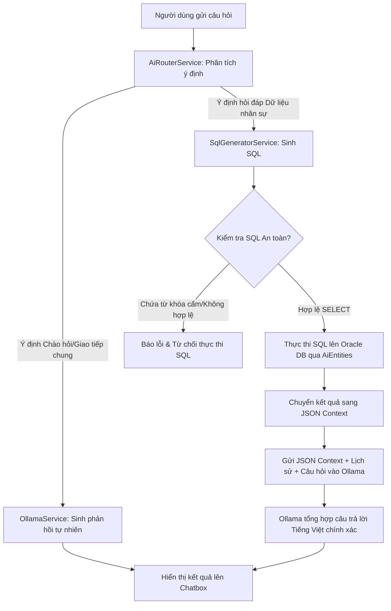

# 🏢 Enterprise Human Resource Management System (HRMS) with Local AI Assistant

Hệ thống quản lý nhân sự cấp doanh nghiệp (Enterprise HRMS) phát triển trên nền tảng **.NET Framework 4.7.2** kết hợp thư viện giao diện cao cấp **DevExpress WinForms**. Hệ thống sử dụng cơ sở dữ liệu **Oracle Database 19c** để đảm bảo khả năng mở rộng và xử lý khối lượng dữ liệu lớn, đồng thời tích hợp **Trợ lý AI On-Premise** (Chạy ngoại tuyến) thông qua mô hình ngôn ngữ **Qwen 2.5** / **Llama 3** (Ollama), giúp tìm kiếm và phân tích dữ liệu nhân sự bằng ngôn ngữ tự nhiên một cách bảo mật tuyệt đối.

[](https://dotnet.microsoft.com/)
[](https://www.oracle.com/database/)
[](https://www.devexpress.com/)
[](https://ollama.com/)

---

## 🌎 Ngôn ngữ / Languages
* [🇻🇳 Tiếng Việt (Bản Chi Tiết)](#-tiếng-việt-bản-chi-tiết)
* [🇺🇸 English (Detailed Overview)](#-english-detailed-overview)
* [🇯🇵 日本語 (Japanese Summary)](#-日本語-japanese-summary)

---

## 🇻🇳 Tiếng Việt (Bản Chi Tiết)

### 📌 Tổng Quan Dự Án
Dự án được xây dựng nhằm giải quyết bài toán quản trị nhân sự và chấm công - tính lương toàn diện cho doanh nghiệp. Điểm đặc biệt của hệ thống là việc ứng dụng kiến trúc **Hybrid RAG** (Sinh truy vấn lai ghép) kết hợp mô hình AI cục bộ, cho phép người quản lý tương tác với cơ sở dữ liệu bằng ngôn ngữ tự nhiên (Natural Language to SQL) mà không lo rò rỉ dữ liệu nhạy cảm ra ngoài internet.

#### ✨ Các Tính Năng Nghiệp Vụ Chính:
1. **Quản Lý Nhân Sự (HR Module):**
   * **Quản lý Hồ sơ Nhân viên (`FrmNhanVien`):** Lưu trữ thông tin cá nhân, ảnh chân dung (BLOB), phòng ban, chức vụ, trình độ học vấn, dân tộc, tôn giáo, giới tính, thông tin liên lạc.
   * **Điều chuyển Nhân sự (`FrmDieuChuyen_NhanVien`):** Lập quyết định và lưu trữ lịch sử luân chuyển phòng ban, bộ phận, chức vụ của nhân sự trong nội bộ công ty.
   * **Hợp đồng Lao động (`FrmHopDongLaoDong`):** Quản lý thời hạn hợp đồng, số lần ký kết, hệ số lương cơ bản và lưu trữ nội dung chi tiết của hợp đồng.
   * **Khen thưởng & Kỷ luật (`FrmKhenThuong`, `FrmKyLuat`):** Theo dõi việc ban hành quyết định khen thưởng hoặc kỷ luật của từng nhân sự kèm nội dung, ngày áp dụng.
   * **Tăng lương (`FrmNangLuong_NhanVien`):** Lưu vết lộ trình tăng lương, điều chỉnh hệ số lương của nhân viên theo định kỳ.
   * **Thôi việc (`FrmNhanVien_ThoiViec`):** Ghi nhận hồ sơ nghỉ việc, lý do thôi việc của nhân viên một cách có hệ thống.
   * **Quản lý danh mục nền:** Công ty (`FrmCongTy`), Phòng ban (`FrmPhongBan`), Bộ phận (`FrmBoPhan`), Chức vụ (`FrmChucVu`), Trình độ (`FrmTrinhDo`), Dân tộc (`FrmDanToc`), Tôn giáo (`FrmTonGiao`).

2. **Quản Lý Chấm Công & Tính Lương (Timekeeping & Payroll):**
   * **Quản lý Ca làm việc (`FrmLoaiCa`):** Thiết lập danh mục ca làm việc (ca ngày, ca đêm, ca gãy) đi kèm hệ số tính lương riêng biệt.
   * **Loại công (`FrmLoaiCong`):** Định nghĩa ngày công làm việc (ngày thường, nghỉ phép hưởng lương, nghỉ ốm, ngày lễ).
   * **Bảng công tháng (`FrmBangCong`, `FrmBangCong_ChiTiet`):** Theo dõi chi tiết giờ check-in/check-out hàng ngày của nhân viên, số ngày công thực tế, ngày nghỉ phép. Hỗ trợ cập nhật ngày công (`FrmCapNhatNgayCong`).
   * **Tăng ca (`FrmTangCa`):** Theo dõi số giờ tăng ca của nhân viên theo ngày, tháng, năm gắn với hệ số của loại ca tương ứng.
   * **Phụ cấp (`FrmPhuCap`):** Cài đặt danh mục phụ cấp (phụ cấp ăn trưa, xăng xe, điện thoại, trách nhiệm) và phân bổ phụ cấp cho nhân viên (`TB_NHANVIEN_PHUCAP`).
   * **Tạm ứng lương (`FrmUngLuong`):** Ghi nhận yêu cầu ứng lương giữa kỳ của nhân viên và duyệt trạng thái chi trả.
   * **Bảng lương (`FrmBangLuong`):** Tự động tính toán tổng thu nhập thực nhận sau khi tổng hợp: Lương cơ bản (từ hợp đồng) x Hệ số ngày công thực tế + Lương tăng ca + Phụ cấp - Tạm ứng.
   * **In ấn báo cáo (`FrmBangCongNV_IN`, `FrmBaoCaoChiTiet`):** Kết xuất dữ liệu bảng công, bảng lương ra biểu mẫu in ấn hoặc xuất file PDF/Excel cho nhân sự.

3. **Trợ Lý AI HRM Thông Minh (AI Assistant - Local Hybrid RAG):**
   * **Giao diện Chatbox (`FrmAI_Chat`):** Tích hợp trực tiếp trên ứng dụng desktop để HR trò chuyện tự nhiên với trợ lý AI.
   * **Tự động dịch sang SQL (NL2SQL):** Nhận diện ý định câu hỏi của người dùng và chuyển dịch thành câu lệnh Oracle SQL chính xác (Ví dụ: *"Ai là nhân viên phòng kế toán?", "Tính tổng số giờ tăng ca tháng 5 của Nguyễn Văn A"*).
   * **Trí nhớ Hội thoại (`AiChatHistory`):** Lưu trữ lịch sử chat ngắn hạn để AI hiểu ngữ cảnh của các câu hỏi tiếp theo.
   * **Bộ đệm thông minh (`AiCacheService`):** Lưu trữ các truy vấn SQL đã sinh ra trước đó để phản hồi tức thì đối với các câu hỏi tương tự mà không cần gọi lại mô hình AI.

---

### 🏗 Kiến Trúc Dự Án (System Architecture)
Dự án tuân thủ mô hình thiết kế 3 lớp (3-Tier Architecture) giúp mã nguồn sạch sẽ, dễ bảo trì và mở rộng:

```
QuanLyNhanSu.sln
 ├── 📂 QLyNSu          # Presentation Layer (WinForms, DevExpress) - Giao diện & Tương tác người dùng.
 ├── 📂 Bu              # Business Logic Layer (BLL) - Nghiệp vụ, Service AI, Cache & History.
 └── 📂 DA              # Data Access Layer (DAL) - Entity Framework 6, mô hình EDMX kết nối Oracle.
```

1. **Lớp Giao Diện (Presentation Layer - `QLyNSu`):**
   * Sử dụng DevExpress để hiển thị GridView, TreeList và các biểu mẫu nhập liệu mượt mà.
   * Chứa form Chatbot AI (`FrmAI_Chat`) dùng để tương tác trực tiếp với trợ lý nhân sự.
   * Chứa `AiBootstrap.cs` để khởi tạo kết nối ban đầu cho dịch vụ AI.
2. **Lớp Nghiệp Vụ (Business Logic Layer - `Bu`):**
   * Điều hướng xử lý dữ liệu và tính toán nghiệp vụ.
   * Tích hợp **AI Services** bao gồm:
     * `AiRouterService`: Phân loại ý định câu hỏi (Hỏi đáp chung vs. Truy vấn cơ sở dữ liệu).
     * `SqlGeneratorService`: Sinh câu lệnh SQL từ câu hỏi tiếng Việt, làm sạch và kiểm duyệt SQL an toàn.
     * `AiSchemaService`: Cung cấp cấu trúc schema cơ sở dữ liệu (View) cho AI hiểu cấu trúc bảng.
     * `OllamaService`: Kết nối và gửi request tới server Ollama chạy cục bộ.
     * `AiCacheService` & `AiChatHistory`: Quản lý bộ đệm và lịch sử hội thoại của AI.
     * `HybridRagService`: Đầu mối điều phối luồng Hybrid RAG tổng thể.
3. **Lớp Dữ Liệu (Data Access Layer - `DA`):**
   * Định nghĩa các thực thể CSDL (Entity Framework 6.4) ánh xạ tới cơ sở dữ liệu Oracle Database 19c.
   * Sử dụng hai kết nối riêng biệt để bảo vệ CSDL:
     * `QLNhanSuEntities`: Dùng cho các tác vụ quản lý dữ liệu HR thông thường (quyền Đọc/Ghi).
     * `AiEntities`: Chỉ ánh xạ các **View phục vụ AI** với quyền **Chỉ đọc (Read-Only)**.

---

### 🤖 Quy Trình Hybrid RAG & Bảo Mật Dữ Liệu AI

#### 1. Luồng xử lý dữ liệu (RAG Workflow)


#### 2. Cơ chế Bảo mật thông tin (Security Safeguards)
* **View-Restricted Access:** Tài khoản kết nối của AI (`AiEntities`) được phân quyền hạn chế ở mức CSDL. AI không được phép đọc trực tiếp các bảng gốc (`TB_NHANVIEN`, `TB_BANGCONG`, ...). Thay vào đó, AI chỉ được truy vấn qua các View được chuẩn hóa để che giấu các cột nhạy cảm hoặc không liên quan:
  * `V_AI_EMPLOYEE`: Chi tiết hồ sơ cơ bản của nhân viên.
  * `V_AI_ATTENDANCE`: Thông tin giờ vào/ra, chấm công hàng ngày.
  * `V_AI_OVERTIME`: Thông tin số giờ tăng ca của nhân sự.
  * `V_AI_INSURANCE`: Số sổ bảo hiểm, nơi cấp, nơi khám bệnh.
  * `V_AI_ADVANCE`: Số tiền và ngày tạm ứng lương.
  * `V_AI_ALLOWANCE`: Phụ cấp được nhận và kỳ công.
* **SQL Injection & Command Prevention:** Lớp `SqlGeneratorService` lọc sạch câu lệnh SQL sinh ra bởi AI:
  * Chỉ chấp nhận các câu lệnh khởi đầu bằng `SELECT`.
  * Quét và loại bỏ tất cả các câu lệnh có chứa từ khóa thao tác dữ liệu: `INSERT`, `UPDATE`, `DELETE`, `DROP`, `TRUNCATE`, `ALTER`.
* **Cơ chế Hardcode Fallback:** Tích hợp bộ phân tích mẫu Regex cho các câu hỏi tìm kiếm nhân viên theo Tên hoặc Mã số nhân viên để chạy câu lệnh SQL trực tiếp mà không cần gọi LLM, tăng tốc độ xử lý lên dưới 10ms và độ chính xác 100%.

---

### 🗄️ Cấu Trúc Cơ Sở Dữ Liệu (Database Schema)
Hệ thống sử dụng cơ sở dữ liệu quan hệ được backup chi tiết tại file [HR_backup.sql](file:///d:/QL_NS/QuanLyNhanSu/HR_backup.sql):

* **Thông tin cá nhân & Tổ chức:** `TB_NHANVIEN` (Bảng trung tâm), `TB_CONGTY`, `TB_PHONGBAN`, `TB_BOPHAN`, `TB_CHUCVU`, `TB_TRINHDO`, `TB_DANTOC`, `TB_TONGIAO`, `TB_GIOITINH`.
* **Quá trình làm việc & Biến động:** `TB_HOPDONG`, `TB_DIEUCHUYEN_NHANVIEN`, `TB_NHANVIEN_THOIVIEC`, `TB_NANGLUONG_NHANVIEN`, `TB_KHENTHUONG_KYLUAT`.
* **Chấm công & Tài chính:** `TB_BANGCONG`, `TB_LOAICONG`, `TB_TANGCA`, `TB_LOAICA`, `TB_BAOHIEM`, `TB_UNGLUONG`, `TB_PHUCAP`, `TB_NHANVIEN_PHUCAP`.

---

### 🛠 Công Nghệ Sử Dụng (Technology Stack)

* **Runtime:** .NET Framework 4.7.2
* **UI Library:** DevExpress WinForms
* **Database Engine:** Oracle Database 19c
* **ORM:** Entity Framework 6.4 (Database First via EDMX)
* **AI Engine Runtime:** Ollama (Local Server)
* **Primary LLM:** Qwen 2.5 (7B/14B) / Llama 3 (Mặc định cấu hình: `qwen2.5:latest`)
* **Libraries:** `Newtonsoft.Json` (Xử lý định dạng trao đổi dữ liệu), `Oracle.ManagedDataAccess` (Trình điều khiển Oracle thuần .NET).

---

### ⚙️ Hướng Dẫn Cấu Hình & Khởi Chạy (Setup & Configuration)

#### 1. Cấu hình Cơ sở dữ liệu Oracle 19c
* Thực thi file backup [HR_backup.sql](file:///d:/QL_NS/QuanLyNhanSu/HR_backup.sql) trên công cụ quản trị (SQL Developer / PL/SQL Developer) của bạn để khởi tạo toàn bộ cấu trúc bảng và ràng buộc.
* Tạo tài khoản quản trị hệ thống (ví dụ: `HR`) sở hữu các bảng để ứng dụng kết nối đọc ghi.
* Tạo tài khoản phụ phục vụ AI (ví dụ: `HR_AI`) và chỉ gán quyền `SELECT` trên 6 View `V_AI_...`.

#### 2. Cài đặt Ollama & Tải Model
* Tải và cài đặt Ollama từ [trang chủ chính thức](https://ollama.com/).
* Trong Terminal / CMD, chạy lệnh sau để tải và khởi động mô hình:
  ```bash
  ollama run qwen2.5:latest
  ```
* Đảm bảo Ollama API đang lắng nghe tại cổng mặc định `11434`.

#### 3. Cập nhật tệp tin `App.config`
Mở tệp tin `App.config` trong project `QLyNSu` và `Bu`, cập nhật chuỗi kết nối Oracle và đường dẫn Ollama phù hợp với môi trường của bạn:

```xml
<configuration>
  <connectionStrings>
    <!-- Chuỗi kết nối quyền Admin cho hệ thống HRM -->
    <add name="QLNhanSuEntities" connectionString="metadata=res://*/QLNhanSu.csdl|...;provider=Oracle.ManagedDataAccess.Client;provider connection string=&quot;DATA SOURCE=localhost:1521/orcl;PASSWORD=your_password;USER ID=HR&quot;" providerName="System.Data.EntityClient" />
    
    <!-- Chuỗi kết nối quyền chỉ đọc (Read-Only) cho AI truy vấn -->
    <add name="AiEntities" connectionString="metadata=res://*/AIEntities.csdl|...;provider=Oracle.ManagedDataAccess.Client;provider connection string=&quot;DATA SOURCE=localhost:1521/orcl;PASSWORD=your_ai_password;USER ID=HR_AI&quot;" providerName="System.Data.EntityClient" />
  </connectionStrings>
  
  <appSettings>
    <!-- Đường dẫn dịch vụ Ollama cục bộ -->
    <add key="OllamaUrl" value="http://localhost:11434/api/generate" />
    <!-- Mô hình ngôn ngữ sử dụng -->
    <add key="DefaultModel" value="qwen2.5:latest" />
  </appSettings>
</configuration>
```

---

## 🇺🇸 English (Detailed Overview)

### 📌 Project Description
This application is an enterprise-grade **Human Resource Management System (HRMS)** built on the **Microsoft .NET Framework 4.7.2** ecosystem. It utilizes **DevExpress WinForms** for a fluid, high-performance desktop experience tailored for corporate HR operators. The backing storage is powered by **Oracle Database 19c** to ensure transaction integrity and high availability.

A core innovation of this project is the integration of an **On-Premise AI Copilot** powered by **Ollama (Qwen 2.5 / Llama 3)**. By applying a custom **Hybrid RAG** (Retrieval-Augmented Generation) architecture, it allows administrators to search and analyze the employee database using plain natural language (NL2SQL) without compromising corporate data privacy.

### 🏗 Key Architectural Components
1. **Presentation Layer (`QLyNSu`):** A modern, responsive desktop interface designed using DevExpress components. It houses the visual windows for managing employees, attendance sheets, payroll, contracts, transfers, and system configurations.
2. **Business Logic Layer (`Bu`):** Implements core HR logic, validations, and the advanced AI Orchestrator service.
3. **Data Access Layer (`DA`):** Implements **Entity Framework 6.4 (EF6)** with Oracle Managed Driver for object-relational mapping.
4. **AI Intelligence Layer:** Executes structured SQL retrieval through a localized LLM server. It classifies queries (General vs. Data Query), retrieves context via read-only DB views, and synthesizes natural language answers.

### 🛡 AI Security & Isolation
* **Role-Based Connection Contexts:** The main application operates under the full-access `QLNhanSuEntities` connection string, while the AI assistant is bound to the restricted, read-only `AiEntities` connection string.
* **Restricted DB Views:** The database account dedicated to the AI has select-only permissions and is isolated to safe database views (prefixed with `V_AI_...`). Direct table access is completely disabled.
* **SQL Sanitization:** The SQL generator validates query patterns, ensuring they begin with `SELECT` and contain no modification keywords (`INSERT`, `UPDATE`, `DELETE`, `DROP`, `TRUNCATE`, `ALTER`).
* **Optimized Local Execution:** Features regex parsing for quick common lookups and cache stores to bypass LLM latency for duplicate queries.

---

## 🇯🇵 日本語 (Japanese Summary)

### 📌 プロジェクト概要
本システムは、Microsoft .NET Framework 4.7.2 および DevExpress WinForms に基づいて開発されたエンタープライズ向けの人事・勤怠・給与管理システム (HRMS) です。データベースには **Oracle Database 19c** を採用し、大量の組織データの安定的かつ高速な処理を実現しています。

本プロジェクトの最大の特徴は、**Ollama (Qwen 2.5 / Llama 3)** を利用した**オンプレミス AI アシスタント**との統合です。独自の **Hybrid RAG** アーキテクチャにより、機密性の高い個人情報や給与データを社外（クラウド環境）へ送信することなく、自然言語によるデータ検索や集計分析を安全に行うことができます。

### 🏗 アーキテクチャとセキュリティ対策
1. **プレゼンテーション層 (`QLyNSu`):** DevExpress コントロールを使用した高機能なデスクトップ画面を提供。
2. **ビジネスロジック層 (`Bu`):** コア業務処理、および AI ルーティング、SQL生成ロジックの実装。
3. **データアクセス層 (`DA`):** Entity Framework 6.4 を使用した Oracle 接続。
4. **AI セキュリティ分離:**
   * AI は参照専用アカウントを使用し、基幹テーブルにはアクセスせず、事前定義された安全なビュー（`V_AI_EMPLOYEE`, `V_AI_ATTENDANCE` 等）のみを参照します。
   * AI が生成した SQL は実行前に厳しく検査され、データ操作文（`INSERT`, `UPDATE`, `DELETE` 等）が含まれている場合は即座に遮断されます。
   * キャッシュ機能および正規表現パターンマッチングの導入により、AI 呼び出しの遅延を抑え、応答速度を最適化しています。
