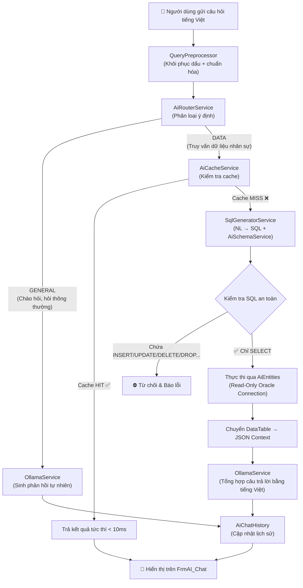
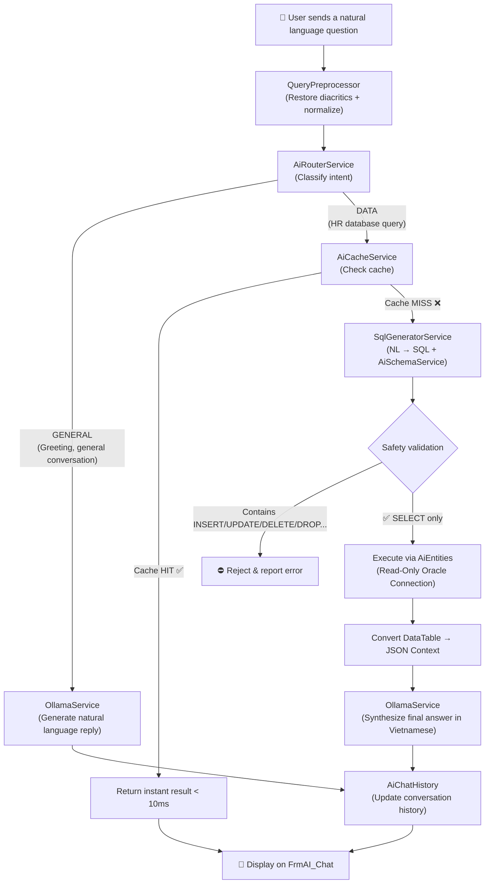
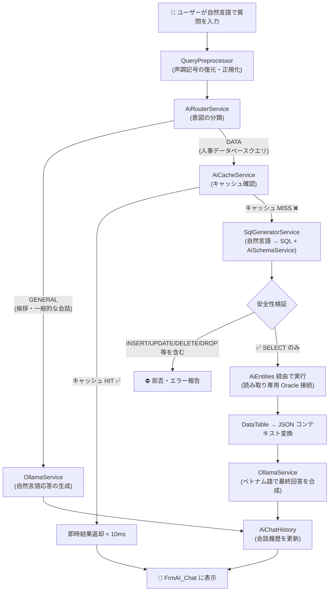

# 🏢 Hệ Thống Quản Lý Nhân Sự Doanh Nghiệp (HRMS) với Trợ Lý AI Cục Bộ

> **Enterprise Human Resource Management System** — Ứng dụng Desktop WinForms quản lý toàn diện nhân sự, chấm công, tính lương tích hợp **AI On-Premise** (NL2SQL) chạy hoàn toàn ngoại tuyến, bảo mật tuyệt đối.

[](https://dotnet.microsoft.com/)
[](https://www.oracle.com/database/)
[](https://www.devexpress.com/)
[](https://learn.microsoft.com/ef/)
[](https://ollama.com/)
[]()

---

## 🌐 Ngôn ngữ / Languages
- [🇻🇳 Tiếng Việt (Chi Tiết)](#-tiếng-việt)
- [🇺🇸 English (Overview)](#-english)
- [🇯🇵 日本語 (概要)](#-日本語)

---

## 🇻🇳 Tiếng Việt

### 📌 Tổng Quan Dự Án

Đây là hệ thống **Quản Lý Nhân Sự cấp doanh nghiệp** được xây dựng trên nền tảng **.NET Framework 4.7.2** với giao diện **DevExpress WinForms** cao cấp, sử dụng **Oracle Database 19c** làm hệ quản trị cơ sở dữ liệu. Điểm đột phá của hệ thống là tích hợp **Trợ Lý AI Cục Bộ (On-Premise AI Copilot)** với kiến trúc **Hybrid RAG** độc quyền: cho phép người quản lý đặt câu hỏi bằng tiếng Việt tự nhiên để truy vấn dữ liệu nhân sự mà không cần viết SQL, và toàn bộ xử lý diễn ra **nội bộ** — không một byte dữ liệu nào rời khỏi máy chủ công ty.

---

### 🗂 Kiến Trúc Dự Án (3-Tier Architecture)

Dự án tuân thủ mô hình **3 lớp (3-Tier)** tách biệt rõ ràng:

```
QuanLyNhanSu.sln
 ├── 📂 QLyNSu/          ← Presentation Layer (WinForms + DevExpress)
 │    ├── FORM_NHANSU/   ← Màn hình Quản lý Nhân sự
 │    ├── FORM_CHAMCONG/ ← Màn hình Chấm công & Tính lương
 │    ├── FORM_BAOCAO/   ← Màn hình In ấn & Báo cáo
 │    ├── FORM_SYSTEM/   ← Màn hình Hệ thống (Login, Phân quyền, AI Chat)
 │    └── Reports/       ← Crystal Reports / DevExpress Reports
 │
 ├── 📂 Bu/              ← Business Logic Layer (BLL)
 │    ├── CLASS_NHANSU/  ← Nghiệp vụ Nhân sự
 │    ├── CLASS_CHAMCONG/← Nghiệp vụ Chấm công & Lương
 │    ├── CLASS_BAOCAO/  ← Nghiệp vụ Báo cáo
 │    ├── CLASS_SYSTEM/  ← Nghiệp vụ Hệ thống & Phân quyền
 │    ├── DTO/           ← Data Transfer Objects
 │    └── Services/
 │         └── AI_Services/
 │              ├── Core/    ← HybridRagService, SqlGeneratorService, AiRouterService, ...
 │              ├── LLM/     ← OllamaService (giao tiếp với Ollama server)
 │              ├── Memory/  ← AiCacheService, AiChatHistory
 │              └── Vector/  ← VectorService (tìm kiếm tương đồng ngữ nghĩa)
 │
 └── 📂 DA/              ← Data Access Layer (Entity Framework 6)
      ├── QLNhanSu.edmx  ← EDMX model đầy đủ cho toàn bộ ứng dụng HR
      └── AIEntities.edmx← EDMX model chỉ đọc (Read-Only) dành riêng cho AI
```

---

### ✨ Tính Năng Nghiệp Vụ

#### 1. 👤 Quản Lý Nhân Sự (HR Module)

| Form | Chức năng |
|------|-----------|
| `FrmNhanVien` | Hồ sơ nhân viên: thông tin cá nhân, ảnh BLOB, phòng ban, chức vụ, trình độ, dân tộc, tôn giáo |
| `FrmDieuChuyen_NhanVien` | Lập quyết định và lưu lịch sử điều chuyển phòng ban / bộ phận / chức vụ |
| `FrmHopDongLaoDong` | Quản lý hợp đồng lao động: số lần ký, thời hạn, hệ số lương cơ bản |
| `FrmKhenThuong` | Quyết định khen thưởng: nội dung, ngày ban hành, đính kèm |
| `FrmKyLuat` | Quyết định kỷ luật: hình thức, mức độ, ngày hiệu lực |
| `FrmNangLuong_NhanVien` | Lộ trình tăng lương: lưu vết từng lần điều chỉnh hệ số lương |
| `FrmNhanVien_ThoiViec` | Hồ sơ nghỉ việc: lý do, ngày nghỉ, ghi chú |
| `FrmCongTy`, `FrmPhongBan`, `FrmBoPhan`, `FrmChucVu`, `FrmTrinhDo`, `FrmDanToc`, `FrmTonGiao` | Danh mục hệ thống (CRUD chuẩn) |

#### 2. ⏱ Chấm Công & Tính Lương (Timekeeping & Payroll)

| Form | Chức năng |
|------|-----------|
| `FrmLoaiCa` | Danh mục ca làm việc (ca ngày, ca đêm, ca gãy) + hệ số lương ca |
| `FrmLoaiCong` | Định nghĩa loại ngày công (thường, nghỉ phép, nghỉ ốm, lễ) |
| `FrmBangCong` | Bảng công tháng: tổng hợp ngày công thực tế, nghỉ phép của nhân viên |
| `FrmBangCong_ChiTiet` | Chi tiết giờ check-in / check-out hàng ngày từng nhân viên |
| `FrmCapNhatNgayCong` | Cập nhật, chỉnh sửa ngày công riêng lẻ |
| `FrmTangCa` | Theo dõi giờ tăng ca theo ngày/tháng, gắn với hệ số ca |
| `FrmPhuCap` | Danh mục phụ cấp (ăn trưa, xăng xe, điện thoại, trách nhiệm) + phân bổ cho nhân viên |
| `FrmUngLuong` | Ghi nhận và duyệt yêu cầu tạm ứng lương giữa kỳ |
| `FrmBangLuong` | **Tự động tính lương**: Lương CB × Hệ số ngày công + Lương tăng ca + Phụ cấp − Tạm ứng |

> **Công thức tính lương:**
> ```
> Thực lĩnh = (Lương_CB_HĐ × Ngày_Công_Thực_Tế / Ngày_Công_Chuẩn)
>            + (Giờ_Tăng_Ca × Hệ_Số_Ca × Lương_Giờ)
>            + Tổng_Phụ_Cấp
>            − Tổng_Tạm_Ứng
> ```

#### 3. 📄 In Ấn & Báo Cáo (Reports)

| Report | Nội dung |
|--------|----------|
| `rptBangCongTongHop` | Bảng công tổng hợp toàn công ty theo tháng |
| `rptBangCongCTNV` | Bảng công chi tiết từng nhân viên |
| `rptBaoCaoLuongNV` | Phiếu lương cá nhân (hỗ trợ xuất PDF/Excel) |
| `rptDSNhanVien` | Danh sách nhân viên theo phòng ban |
| `rptHopDongLaoDong` | In hợp đồng lao động theo mẫu |
| `rptKhenThuong` / `rptKyLuat` | In quyết định khen thưởng / kỷ luật |

#### 4. 🔐 Quản Trị Hệ Thống (System Administration)

| Form | Chức năng |
|------|-----------|
| `FrmDangNhap` | Đăng nhập với xác thực BCrypt + phân quyền theo nhóm |
| `FrmUser` / `FrmGroup` | Quản lý tài khoản người dùng và nhóm quyền |
| `FrmShowUser_Group` | Xem và gán thành viên vào nhóm |
| `FrmPhanQuyenChucNang` | Phân quyền truy cập từng chức năng (menu) theo nhóm |
| `FrmPhanQuyenBaoCao` | Phân quyền xem báo cáo theo nhóm |
| `FrmChangePassword` | Đổi mật khẩu cá nhân |
| `FrmSetting` | Cấu hình kết nối Ollama và model AI |
| `FrmCreateAccount` | Tạo tài khoản mới kèm thiết lập quyền ban đầu |

#### 5. 🤖 Trợ Lý AI Nhân Sự Thông Minh (AI Copilot)

| Form / Service | Vai trò |
|----------------|---------|
| `FrmAI_Chat` | Giao diện chatbox tích hợp trực tiếp trên ứng dụng desktop |
| `FrmAI` | Màn hình hiển thị kết quả truy vấn SQL dạng bảng dữ liệu |
| `HybridRagService` | Điều phối toàn bộ luồng RAG (Orchestrator trung tâm) |
| `AiRouterService` | Phân loại ý định: **GENERAL** (hỏi đáp thông thường) vs. **DATA** (truy vấn DB) |
| `QueryPreprocessor` | Chuẩn hóa câu hỏi: khôi phục dấu tiếng Việt, inject gợi ý schema |
| `SqlGeneratorService` | Sinh SQL từ câu hỏi tiếng Việt, làm sạch và kiểm duyệt an toàn |
| `AiSchemaService` | Cung cấp định nghĩa các View AI cho LLM hiểu cấu trúc dữ liệu |
| `OllamaService` | Gửi prompt và nhận phản hồi từ Ollama local server |
| `AiCacheService` | Cache kết quả SQL đã sinh để phản hồi tức thì cho câu hỏi lặp |
| `AiChatHistory` | Lưu lịch sử hội thoại ngắn hạn để AI hiểu ngữ cảnh đàm thoại |
| `VectorService` | Tìm kiếm tương đồng ngữ nghĩa (Vector Similarity Search) |

---

### 🤖 Kiến Trúc Hybrid RAG & Bảo Mật AI

#### Luồng Xử Lý (RAG Pipeline)



#### Cơ Chế Bảo Mật (Security Safeguards)

| Cơ chế | Chi tiết |
|--------|----------|
| **Tài khoản DB phân tách** | `QLNhanSuEntities` (Admin, đọc/ghi toàn bộ) vs `AiEntities` (chỉ đọc View AI) |
| **View-Restricted Access** | AI chỉ truy cập 6 View an toàn, không bao giờ động trực tiếp vào bảng gốc |
| **SQL Sanitization** | Chỉ chấp nhận câu lệnh bắt đầu bằng `SELECT`; loại bỏ mọi từ khóa DML/DDL |
| **Hardcode Regex Fallback** | Tìm kiếm nhân viên theo Tên/Mã số chạy trực tiếp không qua LLM, độ chính xác 100% |
| **Local-Only Execution** | Ollama chạy hoàn toàn cục bộ — không một dữ liệu nào gửi lên internet |
| **BCrypt Password Hashing** | Mật khẩu người dùng được băm bằng BCrypt.Net-Next trước khi lưu |

##### View AI (Dữ liệu AI được phép truy cập):

| View | Dữ liệu cung cấp |
|------|-----------------|
| `V_AI_EMPLOYEE` | Thông tin cơ bản nhân viên (tên, phòng ban, chức vụ, ngày vào làm) |
| `V_AI_ATTENDANCE` | Giờ check-in/check-out, số ngày công hàng tháng |
| `V_AI_OVERTIME` | Số giờ tăng ca theo ngày, hệ số ca |
| `V_AI_INSURANCE` | Mã số bảo hiểm, nơi cấp, nơi khám bệnh |
| `V_AI_ADVANCE` | Số tiền và ngày tạm ứng lương |
| `V_AI_ALLOWANCE` | Phụ cấp được nhận theo kỳ công |

---

### 🗄️ Cơ Sở Dữ Liệu (Database Schema)

> File backup đầy đủ: [HR_backup.sql](./HR_backup.sql) | Script khởi tạo dữ liệu: [import_data.sql](./import_data.sql)

#### Nhóm Bảng Nhân Sự & Tổ Chức

```
TB_NHANVIEN          — Bảng trung tâm, lưu toàn bộ hồ sơ nhân viên
TB_CONGTY            — Thông tin công ty
TB_PHONGBAN          — Danh mục phòng ban
TB_BOPHAN            — Danh mục bộ phận (con của phòng ban)
TB_CHUCVU            — Danh mục chức vụ
TB_TRINHDO           — Danh mục trình độ học vấn
TB_DANTOC            — Danh mục dân tộc
TB_TONGIAO           — Danh mục tôn giáo
TB_GIOITINH          — Danh mục giới tính
TB_QUOCTICH          — Danh mục quốc tịch
```

#### Nhóm Bảng Biến Động Nhân Sự

```
TB_HOPDONG           — Hợp đồng lao động (số lần ký, hệ số lương)
TB_DIEUCHUYEN_NHANVIEN — Lịch sử điều chuyển nội bộ
TB_NANGLUONG_NHANVIEN  — Lộ trình tăng lương
TB_KHENTHUONG_KYLUAT — Quyết định khen thưởng và kỷ luật
TB_NHANVIEN_THOIVIEC — Hồ sơ thôi việc
```

#### Nhóm Bảng Chấm Công & Tài Chính

```
TB_LOAICA            — Danh mục ca làm việc + hệ số lương ca
TB_LOAICONG          — Danh mục loại ngày công
TB_BANGCONG          — Bảng công tháng (tổng hợp)
TB_BANGCONG_CHITIET  — Chi tiết check-in/check-out hàng ngày
TB_KYCONG            — Kỳ công (chu kỳ tính lương)
TB_KYCONGCHITIET     — Chi tiết kỳ công từng nhân viên
TB_TANGCA            — Giờ tăng ca
TB_PHUCAP            — Danh mục phụ cấp
TB_NHANVIEN_PHUCAP   — Phân bổ phụ cấp cho nhân viên
TB_UNGLUONG          — Tạm ứng lương
TB_BANGLUONG         — Bảng lương tổng hợp
TB_BAOHIEM           — Thông tin bảo hiểm xã hội
```

#### Nhóm Bảng Hệ Thống (System Tables)

```
TB_SYS_USER          — Tài khoản người dùng (mật khẩu BCrypt)
TB_SYS_GROUP         — Nhóm quyền và mối quan hệ thành viên
TB_SYS_FUNCTION      — Danh mục chức năng trong hệ thống
TB_SYS_RIGHT         — Phân quyền chức năng theo người dùng/nhóm
TB_SYS_REPORT        — Danh mục báo cáo
TB_SYS_RIGHT_REPORT  — Phân quyền xem báo cáo
TB_CONFIG            — Cấu hình hệ thống (Ollama URL, model name, ...)
```

> **Trigger quan trọng:** [SYS_USER_triggers.sql](./DA/SYS_USER_triggers.sql) — Cascade delete khi xóa tài khoản người dùng (tự động dọn sạch nhóm, quyền hàm, quyền báo cáo).

---

### 🛠 Công Nghệ Sử Dụng

| Thành phần | Phiên bản / Chi tiết |
|-----------|----------------------|
| **Runtime** | .NET Framework 4.7.2 |
| **UI Library** | DevExpress WinForms (GridView, TreeList, RibbonControl) |
| **Database** | Oracle Database 19c |
| **ORM** | Entity Framework 6.5.1 (Database First — EDMX) |
| **Oracle Driver** | Oracle.ManagedDataAccess 23.7.0 (Thuần .NET, không cần Oracle Client) |
| **AI Runtime** | Ollama (Local Server, port 11434) |
| **LLM Model** | Qwen 2.5 (7B/14B) hoặc Llama 3 — mặc định: `qwen2.5:latest` |
| **JSON** | Newtonsoft.Json 13.0.4 |
| **Security** | BCrypt.Net-Next 4.0.3 (Hash mật khẩu) |
| **Async** | Microsoft.Bcl.AsyncInterfaces, System.Threading.Tasks |

---

### ⚙️ Hướng Dẫn Cài Đặt & Khởi Chạy

#### Bước 1: Thiết Lập Oracle Database 19c

1. Tạo tablespace và user HR trong Oracle:
   ```sql
   CREATE USER HR IDENTIFIED BY your_password;
   GRANT CONNECT, RESOURCE, DBA TO HR;
   ```

2. Thực thi file backup để tạo toàn bộ schema và dữ liệu mẫu:
   ```sql
   -- Chạy trong SQL Developer hoặc PL/SQL Developer
   @HR_backup.sql
   @import_data.sql
   ```

3. Tạo tài khoản phụ cho AI (chỉ đọc View):
   ```sql
   CREATE USER HR_AI IDENTIFIED BY ai_password;
   GRANT CREATE SESSION TO HR_AI;
   -- Chỉ cấp quyền SELECT trên 6 View AI
   GRANT SELECT ON HR.V_AI_EMPLOYEE   TO HR_AI;
   GRANT SELECT ON HR.V_AI_ATTENDANCE TO HR_AI;
   GRANT SELECT ON HR.V_AI_OVERTIME   TO HR_AI;
   GRANT SELECT ON HR.V_AI_INSURANCE  TO HR_AI;
   GRANT SELECT ON HR.V_AI_ADVANCE    TO HR_AI;
   GRANT SELECT ON HR.V_AI_ALLOWANCE  TO HR_AI;
   ```

4. Chạy trigger cascade delete:
   ```sql
   @DA/SYS_USER_triggers.sql
   ```

#### Bước 2: Cài Đặt Ollama & Tải Model AI

```bash
# 1. Tải và cài đặt Ollama từ https://ollama.com/
# 2. Tải mô hình ngôn ngữ (chọn một trong hai):
ollama pull qwen2.5:latest    # Khuyến nghị (tiếng Việt tốt hơn)
ollama pull llama3:latest     # Tùy chọn thay thế

# 3. Chạy server Ollama (mặc định port 11434)
ollama serve
```

#### Bước 3: Cấu Hình `App.config`

Cập nhật file `App.config` trong project **`QLyNSu`** và **`Bu`**:

```xml
<configuration>
  <connectionStrings>
    <!-- Kết nối chính: Quyền Admin cho toàn bộ hệ thống HR -->
    <add name="QLNhanSuEntities"
         connectionString="metadata=res://*/QLNhanSu.csdl|res://*/QLNhanSu.ssdl|res://*/QLNhanSu.msl;
                           provider=Oracle.ManagedDataAccess.Client;
                           provider connection string=&quot;DATA SOURCE=localhost:1521/ORCL;
                           PASSWORD=your_password;USER ID=HR&quot;"
         providerName="System.Data.EntityClient" />

    <!-- Kết nối AI: Chỉ đọc, giới hạn trên 6 View an toàn -->
    <add name="AiEntities"
         connectionString="metadata=res://*/AIEntities.csdl|res://*/AIEntities.ssdl|res://*/AIEntities.msl;
                           provider=Oracle.ManagedDataAccess.Client;
                           provider connection string=&quot;DATA SOURCE=localhost:1521/ORCL;
                           PASSWORD=ai_password;USER ID=HR_AI&quot;"
         providerName="System.Data.EntityClient" />
  </connectionStrings>

  <appSettings>
    <!-- URL Ollama server -->
    <add key="OllamaUrl" value="http://localhost:11434/api/generate" />
    <!-- Tên model AI đang dùng -->
    <add key="DefaultModel" value="qwen2.5:latest" />
  </appSettings>
</configuration>
```

#### Bước 4: Build & Chạy

1. Mở `QuanLyNhanSu.sln` bằng **Visual Studio 2019/2022**
2. Restore NuGet packages: `Tools → NuGet Package Manager → Restore`
3. Build Solution: `Ctrl + Shift + B`
4. Chạy project `QLyNSu` (Set as Startup Project)
5. Đăng nhập với tài khoản **Admin** được tạo từ `import_data.sql`

---

### 📁 Cấu Trúc File Quan Trọng

| File / Thư mục | Mô tả |
|----------------|-------|
| [`QuanLyNhanSu.sln`](./QuanLyNhanSu.sln) | Solution file chứa 3 project |
| [`HR_backup.sql`](./HR_backup.sql) | Script tạo toàn bộ schema Oracle (bảng, view, sequence, constraint) |
| [`import_data.sql`](./import_data.sql) | Dữ liệu mẫu để test (nhân viên, phòng ban, tài khoản admin) |
| [`DA/QLNhanSu.edmx`](./DA/QLNhanSu.edmx) | Entity Data Model đầy đủ (40+ bảng) |
| [`DA/AIEntities.edmx`](./DA/AIEntities.edmx) | Entity Data Model chỉ đọc cho AI (6 View) |
| [`DA/SYS_USER_triggers.sql`](./DA/SYS_USER_triggers.sql) | Oracle trigger cascade delete cho bảng người dùng |
| [`Bu/Services/AI_Services/Core/HybridRagService.cs`](./Bu/Services/AI_Services/Core/HybridRagService.cs) | Orchestrator trung tâm của toàn bộ luồng AI |
| [`Bu/Services/AI_Services/Core/SqlGeneratorService.cs`](./Bu/Services/AI_Services/Core/SqlGeneratorService.cs) | Dịch câu hỏi tiếng Việt → Oracle SQL |
| [`QLyNSu/FORM_SYSTEM/FrmAI_Chat.cs`](./QLyNSu/FORM_SYSTEM/FrmAI_Chat.cs) | Giao diện Chatbox AI tích hợp |

---

### 🧪 Hướng Dẫn Kiểm Thử (Unit Testing)

Hệ thống đi kèm với dự án kiểm thử tự động **`Bu.Tests`** sử dụng thư viện **NUnit** để kiểm thử các dịch vụ nghiệp vụ và AI cốt lõi:
- **`PasswordHasherTests.cs`**: Kiểm thử cơ chế băm mật khẩu bằng BCrypt, đảm bảo tính an toàn của mật khẩu cũ/mới và xử lý khoảng trắng (Oracle Fixed CHAR padding).
- **`QueryPreprocessorTests.cs`**: Kiểm thử bộ tiền xử lý câu hỏi tiếng Việt, kiểm tra việc phục hồi dấu tiếng Việt và tự động gợi ý schema thích hợp (Sinh nhật, Tăng ca, Phụ cấp, Bảo hiểm).
- **`AiCacheServiceTests.cs`**: Kiểm thử cơ chế cache dữ liệu SQL sinh ra từ AI, đảm bảo dữ liệu SQL được lưu và truy vấn chính xác dưới 10ms.
- **`DbQueryTests.cs`**: Kiểm thử các truy vấn Entity Framework trực tiếp trên cơ sở dữ liệu mẫu.

**Cách chạy kiểm thử:**
1. Mở `QuanLyNhanSu.sln` trên Visual Studio.
2. Chọn `Test -> Run All Tests` hoặc mở cửa sổ `Test Explorer` (`Ctrl + R, T`) để chạy tất cả hoặc từng ca kiểm thử cụ thể.

---

### ⚠️ Hướng Dẫn Xử Lý Sự Cố (Troubleshooting)

| Sự cố thường gặp | Nguyên nhân | Giải pháp |
|------------------|------------|-----------|
| **Lỗi kết nối Oracle Database** | TNS Service name chưa cấu hình hoặc Oracle database chưa khởi động. | Đảm bảo dịch vụ `OracleServiceORCL` và `OracleOraDB19Home1TNSListener` đang chạy trong Windows Services. Kiểm tra chuỗi kết nối `connectionString` trong `App.config` đã khớp với cổng (1521), SID (ORCL hoặc tên dịch vụ của bạn) và thông tin đăng nhập chưa. |
| **Không kết nối được Ollama** | Ollama local server chưa được khởi động hoặc port không khớp. | Chạy lệnh `ollama serve` trong terminal. Kiểm tra xem port 11434 có bị chiếm dụng không. Đảm bảo `<add key="OllamaUrl" value="..." />` trong `App.config` chỉ đúng địa chỉ chạy Ollama. |
| **AI sinh SQL sai hoặc bị từ chối** | Câu hỏi quá phức tạp hoặc có chứa các từ khóa nhạy cảm bị bộ lọc SQL chặn. | Đảm bảo câu hỏi rõ ràng, chứa thông tin thực thể (ví dụ: tên nhân viên cụ thể, phòng ban). Không sử dụng các từ mang nghĩa thay đổi dữ liệu như "thêm", "xóa", "sửa" nếu muốn truy vấn (bộ lọc SQL chỉ cho phép lệnh `SELECT` để đảm bảo an toàn). |
| **Lỗi tham chiếu DevExpress** | Thiếu thư viện DevExpress trên máy phát triển hoặc sai phiên bản. | Đảm bảo bạn đã cài đặt phiên bản DevExpress phù hợp (khuyên dùng v23.x). Sử dụng công cụ `DevExpress Project Converter` để nâng cấp/hạ cấp tham chiếu về đúng phiên bản máy đang có. |

---

### 🔧 Yêu Cầu Hệ Thống

| Thành phần | Yêu cầu tối thiểu |
|-----------|-------------------|
| **OS** | Windows 10/11 (64-bit) |
| **RAM** | 8 GB (16 GB khuyến nghị khi dùng AI) |
| **CPU** | Intel Core i5 thế hệ 8+ hoặc AMD Ryzen 5 |
| **GPU** | Tùy chọn — NVIDIA GPU (CUDA) tăng tốc Ollama đáng kể |
| **Oracle** | Oracle Database 19c (Express Edition miễn phí) |
| **Visual Studio** | 2019 / 2022 với workload ".NET Desktop Development" |
| **DevExpress** | v23.x hoặc tương thích với .NET Framework 4.7.2 |
| **Ollama** | Phiên bản mới nhất từ [ollama.com](https://ollama.com) |

---

### 🚀 Các Cập Nhật & Tối Ưu Hóa Gần Đây

Nhằm đáp ứng yêu cầu vận hành ở quy mô doanh nghiệp lớn, dự án đã được nâng cấp toàn diện về mặt hiệu năng CSDL, bảo mật AI và trải nghiệm người dùng:

1. **Tối ưu hóa triệt để lỗi N+1 Query trong EF 6**:
   * Sửa đổi toàn bộ các hàm tải danh sách trong 9 lớp nghiệp vụ cốt lõi: `NHANVIEN`, `NHANVIEN_THOIVIEC`, `NANGLUONG_NHANVIEN`, `DIEUCHUYEN_NHANVIEN`, `KHENTHUONG_KYLUAT`, `HOPDONGLAODONG`, `UNGLUONG`, `TANGCA`, và `BANGLUONG`.
   * Chuyển đổi từ cơ chế duyệt vòng lặp truy vấn đơn lẻ sang **LINQ LEFT JOIN & DTO Projection** giúp gom toàn bộ các bảng liên kết và nạp dữ liệu chỉ trong **1 câu truy vấn SQL duy nhất** gửi tới Oracle DB. Hiệu năng hiển thị danh sách tăng gấp **10x - 100x lần**.
2. **Thắt chặt bảo mật & Chống Jailbreak cho AI (NL2SQL)**:
   * Chuyển đổi bộ lọc bảo vệ của trợ lý AI trong [SqlGeneratorService.cs](./Bu/Services/AI_Services/Core/SqlGeneratorService.cs) từ **Blacklist** sang **Whitelist** nghiêm ngặt. Hệ thống chỉ cho phép thực thi các câu lệnh SELECT nhắm vào 6 View AI được chỉ định. Mọi nỗ lực truy vấn bảng nhạy cảm như tài khoản người dùng (`TB_SYS_USER`) hoặc các kỹ thuật AI Jailbreak đều bị chặn đứng.
   * Ngăn chặn hoàn toàn lỗi **SQL Injection** bằng cách tự động escape dấu nháy đơn (`'`) của người dùng nhập vào trước khi ghép chuỗi.
3. **Bộ nhớ đệm Embedding Vector (Local Embedding Cache)**:
   * Tích hợp cơ chế cache vector nhúng dạng in-memory trong [VectorService.cs](./Bu/Services/AI_Services/Vector/VectorService.cs), lưu trữ các embedding đã tạo từ Ollama. Nhờ đó, loại bỏ được các request HTTP trùng lặp sang server Ollama, giúp chatbot phản hồi nhanh chóng và mượt mà hơn.
4. **Trải nghiệm Giao diện Bất đồng bộ & Mượt mà**:
   * Chuyển đổi hàm tải biểu đồ lương `LoadData()` sang dạng bất đồng bộ `LoadDataAsync()` sử dụng `Task.Run` trong [FrmDashboardLuong.cs](./QLyNSu/FORM_BAOCAO/FrmDashboardLuong.cs), giúp giao diện chính không bị đơ cứng (freeze) khi tải các báo cáo lương lớn.
   * Giải quyết triệt để lỗi chuyển đổi tab của DevExpress `DocumentManager` (Tabbed MDI) trong [FormManager_Functions.cs](./QLyNSu/Functions/FormManager_Functions.cs). Hệ thống tự động kích hoạt đưa tab tương ứng lên hàng đầu ngay sau khi màn hình chờ (SplashScreen) đóng hẳn và mở khóa giao diện chính.
5. **Mã hóa & Bảo mật Connection String**:
   * Hỗ trợ nạp chuỗi kết nối Oracle động qua biến môi trường hệ thống (`HR_DB_CONNECTION` và `AI_DB_CONNECTION`), giúp loại bỏ việc lưu mật khẩu CSDL ở dạng văn bản rõ trong file cấu hình `App.config` ở môi trường sản xuất.

---

## 🇺🇸 English

### 📌 Project Overview

This is an **enterprise-grade Human Resource Management System (HRMS)** built on **.NET Framework 4.7.2** with a rich **DevExpress WinForms** UI and **Oracle Database 19c** backend. The system's standout feature is an integrated **On-Premise AI Copilot** using a custom **Hybrid RAG architecture** that enables HR managers to query employee data in plain natural language — without writing SQL — while keeping all corporate data completely offline and private.

The application covers the full HR lifecycle: employee profile management, internal transfers, labor contracts, reward and discipline tracking, salary raises, resignation records, daily time tracking, overtime, allowances, salary advances, and automated monthly payroll calculation. All of this is accessible through a premium DevExpress UI with rich grids, tree lists, and printable reports.

---

### 🗂 Project Architecture (3-Tier)

The solution enforces a clean separation of concerns across three projects:

```
QuanLyNhanSu.sln
 ├── 📂 QLyNSu/          ← Presentation Layer (WinForms + DevExpress)
 │    ├── FORM_NHANSU/   ← HR Management Screens
 │    ├── FORM_CHAMCONG/ ← Timekeeping & Payroll Screens
 │    ├── FORM_BAOCAO/   ← Reports & Print Preview Screens
 │    ├── FORM_SYSTEM/   ← System Screens (Login, Permissions, AI Chat)
 │    └── Reports/       ← DevExpress Report Layouts (.cs/.resx)
 │
 ├── 📂 Bu/              ← Business Logic Layer (BLL)
 │    ├── CLASS_NHANSU/  ← HR Business Rules
 │    ├── CLASS_CHAMCONG/← Timekeeping & Payroll Logic
 │    ├── CLASS_BAOCAO/  ← Report Logic
 │    ├── CLASS_SYSTEM/  ← System & Permission Logic
 │    ├── DTO/           ← Data Transfer Objects
 │    └── Services/
 │         └── AI_Services/
 │              ├── Core/    ← HybridRagService, SqlGeneratorService, AiRouterService, ...
 │              ├── LLM/     ← OllamaService (communicates with Ollama local server)
 │              ├── Memory/  ← AiCacheService, AiChatHistory
 │              └── Vector/  ← VectorService (semantic similarity search)
 │
 └── 📂 DA/              ← Data Access Layer (Entity Framework 6)
      ├── QLNhanSu.edmx  ← Full EDMX model for the entire HR application
      └── AIEntities.edmx← Read-Only EDMX model exclusively for the AI subsystem
```

---

### ✨ Feature Modules

#### 1. 👤 Human Resources (HR Module)

| Form | Functionality |
|------|--------------|
| `FrmNhanVien` | Employee profiles: personal info, portrait photo (BLOB), department, position, education level, ethnicity, religion, contact details |
| `FrmDieuChuyen_NhanVien` | Internal transfer decisions: record and track department / unit / position changes with full history |
| `FrmHopDongLaoDong` | Labor contract management: number of signings, validity period, base salary coefficient |
| `FrmKhenThuong` | Commendation decisions: content, issue date, attachments |
| `FrmKyLuat` | Disciplinary decisions: type of penalty, severity level, effective date |
| `FrmNangLuong_NhanVien` | Salary raise history: full audit trail of every salary coefficient adjustment |
| `FrmNhanVien_ThoiViec` | Resignation records: reason for leaving, departure date, notes |
| `FrmCongTy`, `FrmPhongBan`, `FrmBoPhan`, `FrmChucVu`, `FrmTrinhDo`, `FrmDanToc`, `FrmTonGiao` | Master data catalogs with standard CRUD operations |

#### 2. ⏱ Timekeeping & Payroll

| Form | Functionality |
|------|--------------|
| `FrmLoaiCa` | Work shift catalog (day shift, night shift, split shift) with individual pay rate coefficients |
| `FrmLoaiCong` | Work day type definitions (normal, paid leave, sick leave, public holiday) |
| `FrmBangCong` | Monthly attendance summary: total actual working days and leave days per employee |
| `FrmBangCong_ChiTiet` | Daily check-in / check-out details for each employee |
| `FrmCapNhatNgayCong` | Manual update and correction of individual attendance records |
| `FrmTangCa` | Overtime tracking by day and month, linked to shift pay rate coefficient |
| `FrmPhuCap` | Allowance catalog (meal, fuel, phone, responsibility) and per-employee allowance allocation |
| `FrmUngLuong` | Mid-cycle salary advance requests: record and approve payment status |
| `FrmBangLuong` | **Automated payroll**: calculates total net income for all employees each pay period |

> **Payroll Formula:**
> ```
> Net Pay = (Contract_Base_Salary × Actual_Working_Days / Standard_Working_Days)
>         + (Overtime_Hours × Shift_Coefficient × Hourly_Wage)
>         + Total_Allowances
>         − Total_Advances
> ```

#### 3. 📄 Reports & Printing

| Report | Content |
|--------|---------|
| `rptBangCongTongHop` | Monthly consolidated attendance report for the entire company |
| `rptBangCongCTNV` | Detailed per-employee attendance sheet |
| `rptBaoCaoLuongNV` | Individual payslip (supports PDF and Excel export) |
| `rptDSNhanVien` | Employee directory filtered by department |
| `rptHopDongLaoDong` | Printable labor contract form |
| `rptKhenThuong` / `rptKyLuat` | Commendation / disciplinary decision forms |

#### 4. 🔐 System Administration

| Form | Functionality |
|------|--------------|
| `FrmDangNhap` | Login screen with BCrypt password verification and group-based access control |
| `FrmUser` / `FrmGroup` | Manage user accounts and permission groups |
| `FrmShowUser_Group` | View and assign members to groups |
| `FrmPhanQuyenChucNang` | Grant or revoke access to individual menu functions per group |
| `FrmPhanQuyenBaoCao` | Grant or revoke access to individual reports per group |
| `FrmChangePassword` | Personal password change (BCrypt re-hash) |
| `FrmSetting` | Configure Ollama server URL and AI model name |
| `FrmCreateAccount` | Create new user accounts with initial permission assignment |

#### 5. 🤖 AI HR Copilot

| Form / Service | Role |
|----------------|------|
| `FrmAI_Chat` | Embedded chatbox UI — employees type natural language questions |
| `FrmAI` | Data result screen showing SQL query results as a formatted grid |
| `HybridRagService` | Central RAG orchestrator — coordinates the entire AI pipeline |
| `AiRouterService` | Intent classifier: **GENERAL** (conversation) vs. **DATA** (DB query) |
| `QueryPreprocessor` | Query normalization: restores Vietnamese diacritics, injects schema hints |
| `SqlGeneratorService` | Translates Vietnamese questions into Oracle SQL; sanitizes and validates output |
| `AiSchemaService` | Provides the LLM with the schema definition of all AI-accessible Views |
| `OllamaService` | Sends prompts to and receives completions from the local Ollama server |
| `AiCacheService` | Caches previously generated SQL for instant replies to repeated questions |
| `AiChatHistory` | Maintains short-term conversation history so the AI understands follow-up context |
| `VectorService` | Semantic similarity search over employee knowledge |

---

### 🤖 Hybrid RAG Architecture & AI Security

#### Processing Pipeline



#### Security Safeguards

| Mechanism | Detail |
|-----------|--------|
| **Dual DB Accounts** | `QLNhanSuEntities` (Admin — full read/write) vs. `AiEntities` (AI — read-only on Views only) |
| **View-Restricted Access** | The AI account can only query 6 pre-defined safe Views; direct table access is blocked at the DB level |
| **SQL Sanitization** | Only `SELECT` statements are accepted; any DML/DDL keyword (`INSERT`, `UPDATE`, `DELETE`, `DROP`, `TRUNCATE`, `ALTER`) causes immediate rejection |
| **Regex Hardcode Fallback** | Common lookups (by name or employee ID) use deterministic regex patterns — no LLM call, 100% accuracy, sub-10ms latency |
| **Local-Only Execution** | Ollama runs entirely on-premise; zero data egress to the internet |
| **BCrypt Password Hashing** | All user passwords are hashed with BCrypt.Net-Next before storage; plain-text passwords never touch the database |

##### AI-Accessible Views

| View | Exposed Data |
|------|-------------|
| `V_AI_EMPLOYEE` | Basic employee info (name, department, position, start date) |
| `V_AI_ATTENDANCE` | Daily check-in/check-out times, monthly working day totals |
| `V_AI_OVERTIME` | Overtime hours by day, shift rate coefficient |
| `V_AI_INSURANCE` | Social insurance number, issuing authority, medical facility |
| `V_AI_ADVANCE` | Salary advance amounts and dates |
| `V_AI_ALLOWANCE` | Allowances received per pay cycle |

---

### 🗄️ Database Schema

> Full backup script: [HR_backup.sql](./HR_backup.sql) | Sample data: [import_data.sql](./import_data.sql)

#### Employee & Organization Tables

```
TB_NHANVIEN              — Central table: stores the full employee profile (incl. portrait BLOB)
TB_CONGTY                — Company information
TB_PHONGBAN              — Department catalog
TB_BOPHAN                — Unit catalog (child of department)
TB_CHUCVU                — Job title / position catalog
TB_TRINHDO               — Education level catalog
TB_DANTOC                — Ethnicity catalog
TB_TONGIAO               — Religion catalog
TB_GIOITINH              — Gender catalog
TB_QUOCTICH              — Nationality catalog
```

#### HR Movement Tables

```
TB_HOPDONG               — Labor contracts (number of signings, salary coefficient)
TB_DIEUCHUYEN_NHANVIEN   — Internal transfer history
TB_NANGLUONG_NHANVIEN    — Salary raise audit trail
TB_KHENTHUONG_KYLUAT     — Commendation and disciplinary decisions
TB_NHANVIEN_THOIVIEC     — Resignation / termination records
```

#### Timekeeping & Finance Tables

```
TB_LOAICA                — Work shift catalog + pay rate coefficient
TB_LOAICONG              — Work day type catalog
TB_BANGCONG              — Monthly attendance summary
TB_BANGCONG_CHITIET      — Daily check-in/check-out detail
TB_KYCONG                — Pay cycle (defines the payroll period)
TB_KYCONGCHITIET         — Per-employee pay cycle detail
TB_TANGCA                — Overtime records
TB_PHUCAP                — Allowance type catalog
TB_NHANVIEN_PHUCAP       — Per-employee allowance allocation
TB_UNGLUONG              — Salary advance records
TB_BANGLUONG             — Monthly payroll summary
TB_BAOHIEM               — Social insurance information
```

#### System Tables

```
TB_SYS_USER              — User accounts (BCrypt-hashed passwords)
TB_SYS_GROUP             — Permission groups and group membership relations
TB_SYS_FUNCTION          — System function / menu item catalog
TB_SYS_RIGHT             — Function-level permissions per user or group
TB_SYS_REPORT            — Report catalog
TB_SYS_RIGHT_REPORT      — Report-level permissions per user or group
TB_CONFIG                — System configuration (Ollama URL, model name, ...)
```

> **Important trigger:** [SYS_USER_triggers.sql](./DA/SYS_USER_triggers.sql) — Cascade delete when a user account is removed (automatically cleans up group membership, function rights, and report rights).

---

### 🛠 Technology Stack

| Component | Version / Detail |
|-----------|-----------------|
| **Runtime** | .NET Framework 4.7.2 |
| **UI Library** | DevExpress WinForms (GridView, TreeList, RibbonControl) |
| **Database** | Oracle Database 19c |
| **ORM** | Entity Framework 6.5.1 (Database First — EDMX) |
| **Oracle Driver** | Oracle.ManagedDataAccess 23.7.0 (Pure managed .NET — no Oracle Client required) |
| **AI Runtime** | Ollama (Local Server, port 11434) |
| **LLM Model** | Qwen 2.5 (7B/14B) or Llama 3 — default: `qwen2.5:latest` |
| **JSON** | Newtonsoft.Json 13.0.4 |
| **Security** | BCrypt.Net-Next 4.0.3 |
| **Async Support** | Microsoft.Bcl.AsyncInterfaces, System.Threading.Tasks.Extensions |

---

### ⚙️ Setup & Configuration Guide

#### Step 1: Set Up Oracle Database 19c

1. Create the main HR user:
   ```sql
   CREATE USER HR IDENTIFIED BY your_password;
   GRANT CONNECT, RESOURCE, DBA TO HR;
   ```

2. Initialize the full schema and sample data:
   ```sql
   -- Run in SQL Developer or PL/SQL Developer
   @HR_backup.sql
   @import_data.sql
   ```

3. Create the restricted AI read-only user:
   ```sql
   CREATE USER HR_AI IDENTIFIED BY ai_password;
   GRANT CREATE SESSION TO HR_AI;
   -- Grant SELECT only on the 6 AI Views
   GRANT SELECT ON HR.V_AI_EMPLOYEE   TO HR_AI;
   GRANT SELECT ON HR.V_AI_ATTENDANCE TO HR_AI;
   GRANT SELECT ON HR.V_AI_OVERTIME   TO HR_AI;
   GRANT SELECT ON HR.V_AI_INSURANCE  TO HR_AI;
   GRANT SELECT ON HR.V_AI_ADVANCE    TO HR_AI;
   GRANT SELECT ON HR.V_AI_ALLOWANCE  TO HR_AI;
   ```

4. Apply the cascade delete trigger:
   ```sql
   @DA/SYS_USER_triggers.sql
   ```

#### Step 2: Install Ollama & Download the LLM

```bash
# Install Ollama from https://ollama.com/
# Pull one of the supported models:
ollama pull qwen2.5:latest    # Recommended (better Vietnamese comprehension)
ollama pull llama3:latest     # Alternative

# Start the Ollama server (default port 11434)
ollama serve
```

#### Step 3: Configure `App.config`

Update `App.config` in both the **`QLyNSu`** and **`Bu`** projects:

```xml
<configuration>
  <connectionStrings>
    <!-- Main connection: full admin access for the HR application -->
    <add name="QLNhanSuEntities"
         connectionString="metadata=res://*/QLNhanSu.csdl|res://*/QLNhanSu.ssdl|res://*/QLNhanSu.msl;
                           provider=Oracle.ManagedDataAccess.Client;
                           provider connection string=&quot;DATA SOURCE=localhost:1521/ORCL;
                           PASSWORD=your_password;USER ID=HR&quot;"
         providerName="System.Data.EntityClient" />

    <!-- AI connection: read-only, restricted to 6 safe Views -->
    <add name="AiEntities"
         connectionString="metadata=res://*/AIEntities.csdl|res://*/AIEntities.ssdl|res://*/AIEntities.msl;
                           provider=Oracle.ManagedDataAccess.Client;
                           provider connection string=&quot;DATA SOURCE=localhost:1521/ORCL;
                           PASSWORD=ai_password;USER ID=HR_AI&quot;"
         providerName="System.Data.EntityClient" />
  </connectionStrings>

  <appSettings>
    <!-- Local Ollama server endpoint -->
    <add key="OllamaUrl" value="http://localhost:11434/api/generate" />
    <!-- Active LLM model name -->
    <add key="DefaultModel" value="qwen2.5:latest" />
  </appSettings>
</configuration>
```

#### Step 4: Build & Run

1. Open `QuanLyNhanSu.sln` in **Visual Studio 2019 or 2022**
2. Restore NuGet packages: `Tools → NuGet Package Manager → Restore Packages`
3. Build the solution: `Ctrl + Shift + B`
4. Set `QLyNSu` as the startup project and run (`F5`)
5. Log in using the **Admin** account created by `import_data.sql`

---

### 📁 Key Files Reference

| File / Directory | Description |
|-----------------|-------------|
| [`QuanLyNhanSu.sln`](./QuanLyNhanSu.sln) | Visual Studio solution containing all 3 projects |
| [`HR_backup.sql`](./HR_backup.sql) | Full Oracle schema script (tables, views, sequences, constraints) |
| [`import_data.sql`](./import_data.sql) | Sample seed data (employees, departments, admin account) |
| [`DA/QLNhanSu.edmx`](./DA/QLNhanSu.edmx) | Full Entity Data Model (40+ tables) |
| [`DA/AIEntities.edmx`](./DA/AIEntities.edmx) | Read-only Entity Data Model for AI (6 Views only) |
| [`DA/SYS_USER_triggers.sql`](./DA/SYS_USER_triggers.sql) | Oracle cascade delete trigger for user accounts |
| [`Bu/Services/AI_Services/Core/HybridRagService.cs`](./Bu/Services/AI_Services/Core/HybridRagService.cs) | Central orchestrator of the entire AI pipeline |
| [`Bu/Services/AI_Services/Core/SqlGeneratorService.cs`](./Bu/Services/AI_Services/Core/SqlGeneratorService.cs) | Vietnamese natural language → Oracle SQL translator |
| [`QLyNSu/FORM_SYSTEM/FrmAI_Chat.cs`](./QLyNSu/FORM_SYSTEM/FrmAI_Chat.cs) | Embedded AI chatbox UI form |

---

### 🧪 Unit Testing Guide

The system includes the **`Bu.Tests`** project, utilizing **NUnit** to cover core business and AI components:
- **`PasswordHasherTests.cs`**: Tests BCrypt password hashing, validation of legacy/padded passwords (handling Oracle fixed CHAR padding).
- **`QueryPreprocessorTests.cs`**: Validates the Vietnamese query preprocessor, ensuring proper diacritic restoration and automatic database schema hinting (Birthday, Overtime, Allowance, Insurance).
- **`AiCacheServiceTests.cs`**: Validates SQL caching logic, ensuring pre-generated SQL requests bypass the LLM and return in under 10ms.
- **`DbQueryTests.cs`**: Tests Entity Framework query operations against the seed database.

**How to run tests:**
1. Open the solution in Visual Studio.
2. Select `Test -> Run All Tests` from the main menu, or open `Test Explorer` (`Ctrl + R, T`) to select and run specific test cases.

---

### ⚠️ Troubleshooting Guide

| Issue | Potential Cause | Solution |
|-------|-----------------|----------|
| **Oracle Connection Error** | The Oracle database service is stopped or TNS listener is offline. | Ensure that `OracleServiceORCL` and listener services are running. Verify the connection string in `App.config` points to the correct host, port (default 1521), and credentials. |
| **Ollama Connection Error** | The Ollama local server is not running or running on a different port. | Start the Ollama server by executing `ollama serve` in your terminal. Check if port 11434 is active, and confirm the `OllamaUrl` key in `App.config` matches. |
| **AI SQL Generation Rejected** | The natural language query is classified as a write/modify attempt or has unsafe keywords. | Ensure queries are read-only. The SQL sanitizer rejects any statement containing write-oriented keywords (`INSERT`, `UPDATE`, `DELETE`, `DROP`, etc.) to prevent malicious execution. |
| **DevExpress Assembly Missing** | The DevExpress libraries are not installed on the host machine. | Install the matching DevExpress developer SDK (v23.x recommended) or use the DevExpress Project Converter tool to realign the project references with your local installation. |

---

### 🔧 System Requirements

| Component | Minimum Requirement |
|-----------|-------------------|
| **OS** | Windows 10 / 11 (64-bit) |
| **RAM** | 8 GB (16 GB recommended when running AI features) |
| **CPU** | Intel Core i5 8th Gen+ or AMD Ryzen 5 |
| **GPU** | Optional — NVIDIA GPU with CUDA significantly accelerates Ollama inference |
| **Oracle** | Oracle Database 19c (Express Edition is free) |
| **Visual Studio** | 2019 / 2022 with ".NET Desktop Development" workload |
| **DevExpress** | v23.x or compatible with .NET Framework 4.7.2 |
| **Ollama** | Latest version from [ollama.com](https://ollama.com) |

---

### 🚀 Recent Optimizations & Enhancements

To meet the requirements of large-scale enterprise deployments, the application has been optimized for database query performance, AI security, and UI responsiveness:

1. **Resolution of EF 6 N+1 Query Bottlenecks**:
   * Refactored list-loading methods in 9 core business classes: `NHANVIEN`, `NHANVIEN_THOIVIEC`, `NANGLUONG_NHANVIEN`, `DIEUCHUYEN_NHANVIEN`, `KHENTHUONG_KYLUAT`, `HOPDONGLAODONG`, `UNGLUONG`, `TANGCA`, and `BANGLUONG`.
   * Replaced sequential loop lookups with **LINQ LEFT JOIN and DTO Projection**, consolidating all associated tables into a **single Oracle database query**. This optimization improves list loading times by **10x to 100x**.
2. **AI Security Hardening & Jailbreak Prevention**:
   * Replaced the blacklist approach in [SqlGeneratorService.cs](./Bu/Services/AI_Services/Core/SqlGeneratorService.cs) with a strict **SQL Whitelist**. The AI is now restricted to SELECT queries targeting the 6 dedicated AI Views. Any prompt injection, jailbreaking, or attempts to query system tables (like user accounts `TB_SYS_USER`) are instantly blocked.
   * Patched **SQL Injection** vulnerabilities by escaping single quotes (`'`) in user-supplied search parameters.
3. **Local Embedding Vector Caching**:
   * Implemented an in-memory embedding cache in [VectorService.cs](./Bu/Services/AI_Services/Vector/VectorService.cs) to store previously calculated text vectors from Ollama. This bypasses redundant HTTP calls to the local LLM server, greatly accelerating AI chat responses.
4. **UI Fluidity & MDI Tab Activation Fixes**:
   * Converted payroll dashboard loading to asynchronous operations (`LoadDataAsync()`) via `Task.Run` in [FrmDashboardLuong.cs](./QLyNSu/FORM_BAOCAO/FrmDashboardLuong.cs) to prevent UI thread blocking.
   * Fixed DevExpress `DocumentManager` MDI tab switching issues in [FormManager_Functions.cs](./QLyNSu/Functions/FormManager_Functions.cs). Tabs are now explicitly activated and brought to the foreground immediately after the lock splash screen is dismissed.
5. **Secure Connection Strings**:
   * Upgraded DB context constructors in the Data Access layer to support loading connection strings dynamically from environment variables (`HR_DB_CONNECTION` and `AI_DB_CONNECTION`), eliminating the risk of storing plaintext database credentials in `App.config` for production deployments.

---

## 🇯🇵 日本語

### 📌 プロジェクト概要

本システムは、**.NET Framework 4.7.2** と **DevExpress WinForms** を基盤とした、エンタープライズ向けの**人事・勤怠・給与管理システム (HRMS)** です。データベースには **Oracle Database 19c** を採用し、大規模な組織データの安定した処理と高可用性を実現しています。

最大の特徴は、**Ollama** を利用した**オンプレミス AI アシスタント**との統合です。独自の **Hybrid RAG アーキテクチャ**により、人事担当者がベトナム語の自然文で質問するだけで、SQL を書くことなく社内データベースを検索・集計できます。AIの処理はすべてローカルサーバーで完結し、**機密データが一切インターネットへ送信されません**。

本システムは、従業員プロファイル管理・社内異動・労働契約・表彰・懲戒・昇給・退職手続き・日次勤怠・残業・手当・給与前払い・月次給与計算という人事業務の全ライフサイクルをカバーしています。

---

### 🗂 プロジェクト構成 (3 層アーキテクチャ)

本ソリューションは、責務を明確に分離した **3 層アーキテクチャ**に従っています。

```
QuanLyNhanSu.sln
 ├── 📂 QLyNSu/          ← プレゼンテーション層 (WinForms + DevExpress)
 │    ├── FORM_NHANSU/   ← 人事管理画面
 │    ├── FORM_CHAMCONG/ ← 勤怠管理・給与計算画面
 │    ├── FORM_BAOCAO/   ← 帳票・レポート画面
 │    ├── FORM_SYSTEM/   ← システム管理画面 (ログイン・権限・AIチャット)
 │    └── Reports/       ← DevExpress レポートレイアウト
 │
 ├── 📂 Bu/              ← ビジネスロジック層 (BLL)
 │    ├── CLASS_NHANSU/  ← 人事業務ロジック
 │    ├── CLASS_CHAMCONG/← 勤怠・給与計算ロジック
 │    ├── CLASS_BAOCAO/  ← レポート生成ロジック
 │    ├── CLASS_SYSTEM/  ← システム・権限管理ロジック
 │    ├── DTO/           ← データ転送オブジェクト
 │    └── Services/
 │         └── AI_Services/
 │              ├── Core/    ← HybridRagService, SqlGeneratorService, AiRouterService ...
 │              ├── LLM/     ← OllamaService (ローカル Ollama サーバーと通信)
 │              ├── Memory/  ← AiCacheService, AiChatHistory
 │              └── Vector/  ← VectorService (意味的類似度検索)
 │
 └── 📂 DA/              ← データアクセス層 (Entity Framework 6)
      ├── QLNhanSu.edmx  ← HR システム全体の EDMX モデル (40+ テーブル)
      └── AIEntities.edmx← AI 専用読み取り専用 EDMX モデル (6 ビューのみ)
```

---

### ✨ 機能モジュール

#### 1. 👤 人事管理モジュール

| フォーム | 機能 |
|---------|------|
| `FrmNhanVien` | 従業員プロファイル: 個人情報、証明写真 (BLOB)、部門、役職、学歴、民族、宗教、連絡先 |
| `FrmDieuChuyen_NhanVien` | 社内異動記録: 部門・部署・役職変更の決定書の作成と履歴管理 |
| `FrmHopDongLaoDong` | 労働契約管理: 契約回数、有効期限、基本給係数 |
| `FrmKhenThuong` | 表彰決定: 内容、発令日、添付資料 |
| `FrmKyLuat` | 懲戒処分: 種別、重大度、発効日 |
| `FrmNangLuong_NhanVien` | 昇給履歴: 給与係数調整の完全な監査証跡 |
| `FrmNhanVien_ThoiViec` | 退職記録: 退職理由、退職日、備考 |
| `FrmCongTy`, `FrmPhongBan`, `FrmBoPhan`, `FrmChucVu`, `FrmTrinhDo`, `FrmDanToc`, `FrmTonGiao` | マスターデータ管理 (標準 CRUD) |

#### 2. ⏱ 勤怠管理・給与計算モジュール

| フォーム | 機能 |
|---------|------|
| `FrmLoaiCa` | 勤務シフトカタログ (日勤・夜勤・分割勤務) + シフト別給与係数 |
| `FrmLoaiCong` | 勤務日種別 (通常・有給休暇・病欠・祝日) の定義 |
| `FrmBangCong` | 月次勤怠サマリー: 従業員ごとの実勤務日数・休暇日数 |
| `FrmBangCong_ChiTiet` | 日次打刻詳細: 従業員ごとの出退勤時刻 |
| `FrmCapNhatNgayCong` | 個別勤怠データの手動修正・更新 |
| `FrmTangCa` | 残業記録: 日付・月別の残業時間、シフト係数との紐付け |
| `FrmPhuCap` | 手当カタログ (食事・交通・通話・責任手当) と従業員への手当配分 |
| `FrmUngLuong` | 給与前払いリクエストの記録・承認管理 |
| `FrmBangLuong` | **自動給与計算**: 全従業員の月次純支給額を一括算出 |

> **給与計算式:**
> ```
> 純支給額 = (契約基本給 × 実勤務日数 / 標準勤務日数)
>          + (残業時間 × シフト係数 × 時給)
>          + 手当合計
>          − 前払い合計
> ```

#### 3. 📄 帳票・レポートモジュール

| レポート | 内容 |
|---------|------|
| `rptBangCongTongHop` | 会社全体の月次勤怠集計表 |
| `rptBangCongCTNV` | 従業員別の詳細勤怠シート |
| `rptBaoCaoLuongNV` | 個人給与明細書 (PDF・Excel エクスポート対応) |
| `rptDSNhanVien` | 部門別従業員名簿 |
| `rptHopDongLaoDong` | 労働契約書の印刷フォーム |
| `rptKhenThuong` / `rptKyLuat` | 表彰・懲戒決定書の印刷フォーム |

#### 4. 🔐 システム管理モジュール

| フォーム | 機能 |
|---------|------|
| `FrmDangNhap` | BCrypt パスワード認証 + グループ別アクセス制御のログイン画面 |
| `FrmUser` / `FrmGroup` | ユーザーアカウントと権限グループの管理 |
| `FrmShowUser_Group` | グループメンバーの確認と割り当て |
| `FrmPhanQuyenChucNang` | グループ別メニュー機能へのアクセス権限の付与・剥奪 |
| `FrmPhanQuyenBaoCao` | グループ別レポート閲覧権限の付与・剥奪 |
| `FrmChangePassword` | 個人パスワードの変更 (BCrypt 再ハッシュ化) |
| `FrmSetting` | Ollama サーバー URL と AI モデル名の設定 |
| `FrmCreateAccount` | 新規ユーザーアカウントの作成と初期権限設定 |

#### 5. 🤖 AI 人事アシスタント

| フォーム / サービス | 役割 |
|------------------|------|
| `FrmAI_Chat` | アプリケーションに組み込まれたチャットボット UI |
| `FrmAI` | SQL クエリ結果をグリッド形式で表示する画面 |
| `HybridRagService` | AI パイプライン全体を調整する中央オーケストレーター |
| `AiRouterService` | 意図分類: **GENERAL** (一般会話) vs. **DATA** (DB クエリ) |
| `QueryPreprocessor` | クエリ正規化: ベトナム語の声調記号復元、スキーマヒントの注入 |
| `SqlGeneratorService` | 自然言語 → Oracle SQL の変換、出力のサニタイズと検証 |
| `AiSchemaService` | AI がアクセス可能な全ビューのスキーマ定義を LLM に提供 |
| `OllamaService` | ローカル Ollama サーバーへのプロンプト送信と応答受信 |
| `AiCacheService` | 生成済み SQL をキャッシュし、同一質問に即座に応答 |
| `AiChatHistory` | フォローアップ質問の文脈理解のための短期会話履歴管理 |
| `VectorService` | 従業員知識ベースに対する意味的類似度検索 |

---

### 🤖 Hybrid RAG アーキテクチャとAIセキュリティ

#### 処理パイプライン



#### セキュリティ対策

| 対策 | 詳細 |
|------|------|
| **DB アカウント分離** | `QLNhanSuEntities` (管理者 — 全読み書き権限) vs. `AiEntities` (AI — ビューのみ読み取り専用) |
| **ビュー制限アクセス** | AI アカウントは 6 つの事前定義済み安全ビューのみクエリ可能。元テーブルへの直接アクセスは DB レベルでブロック |
| **SQL サニタイズ** | `SELECT` 文のみ受け付ける。DML/DDL キーワード (`INSERT`, `UPDATE`, `DELETE`, `DROP`, `TRUNCATE`, `ALTER`) が含まれる場合は即時拒否 |
| **Regex ハードコード フォールバック** | 頻出クエリ (名前・従業員 ID による検索) は決定論的な正規表現パターンで処理。LLM 呼び出しなし、精度 100%、応答時間 10ms 以下 |
| **ローカル専用実行** | Ollama は完全オンプレミスで動作。データの外部送信ゼロ |
| **BCrypt パスワードハッシュ** | 全ユーザーパスワードは保存前に BCrypt.Net-Next でハッシュ化。平文パスワードはデータベースに触れない |

##### AI がアクセス可能なビュー

| ビュー | 提供データ |
|-------|----------|
| `V_AI_EMPLOYEE` | 従業員の基本情報 (氏名、部門、役職、入社日) |
| `V_AI_ATTENDANCE` | 日次打刻時刻、月次勤務日数合計 |
| `V_AI_OVERTIME` | 日付別残業時間、シフト係数 |
| `V_AI_INSURANCE` | 社会保険番号、発行機関、受診医療機関 |
| `V_AI_ADVANCE` | 給与前払い金額と日付 |
| `V_AI_ALLOWANCE` | 給与期間ごとに受け取る手当 |

---

### 🗄️ データベーススキーマ

> フルバックアップスクリプト: [HR_backup.sql](./HR_backup.sql) | サンプルデータ: [import_data.sql](./import_data.sql)

#### 従業員・組織テーブル

```
TB_NHANVIEN              — 中央テーブル: 従業員の全プロファイルを格納 (証明写真 BLOB 含む)
TB_CONGTY                — 会社情報
TB_PHONGBAN              — 部門カタログ
TB_BOPHAN                — 部署カタログ (部門の子)
TB_CHUCVU                — 役職カタログ
TB_TRINHDO               — 学歴カタログ
TB_DANTOC                — 民族カタログ
TB_TONGIAO               — 宗教カタログ
TB_GIOITINH              — 性別カタログ
TB_QUOCTICH              — 国籍カタログ
```

#### 人事変動テーブル

```
TB_HOPDONG               — 労働契約 (契約回数、給与係数)
TB_DIEUCHUYEN_NHANVIEN   — 社内異動履歴
TB_NANGLUONG_NHANVIEN    — 昇給の監査証跡
TB_KHENTHUONG_KYLUAT     — 表彰・懲戒決定記録
TB_NHANVIEN_THOIVIEC     — 退職・雇用終了記録
```

#### 勤怠・財務テーブル

```
TB_LOAICA                — 勤務シフトカタログ + 給与係数
TB_LOAICONG              — 勤務日種別カタログ
TB_BANGCONG              — 月次勤怠サマリー
TB_BANGCONG_CHITIET      — 日次打刻詳細
TB_KYCONG                — 給与期間 (給与計算サイクルの定義)
TB_KYCONGCHITIET         — 従業員別給与期間詳細
TB_TANGCA                — 残業記録
TB_PHUCAP                — 手当種別カタログ
TB_NHANVIEN_PHUCAP       — 従業員別手当配分
TB_UNGLUONG              — 給与前払い記録
TB_BANGLUONG             — 月次給与サマリー
TB_BAOHIEM               — 社会保険情報
```

#### システムテーブル

```
TB_SYS_USER              — ユーザーアカウント (BCrypt ハッシュ済みパスワード)
TB_SYS_GROUP             — 権限グループとグループメンバーシップの関係
TB_SYS_FUNCTION          — システム機能・メニュー項目カタログ
TB_SYS_RIGHT             — ユーザー/グループ別機能アクセス権限
TB_SYS_REPORT            — レポートカタログ
TB_SYS_RIGHT_REPORT      — ユーザー/グループ別レポート閲覧権限
TB_CONFIG                — システム設定 (Ollama URL、モデル名 等)
```

> **重要なトリガー:** [SYS_USER_triggers.sql](./DA/SYS_USER_triggers.sql) — ユーザーアカウント削除時のカスケード削除 (グループメンバーシップ・機能権限・レポート権限を自動クリーンアップ)。

---

### 🛠 使用技術スタック

| コンポーネント | バージョン / 詳細 |
|-------------|----------------|
| **ランタイム** | .NET Framework 4.7.2 |
| **UI ライブラリ** | DevExpress WinForms (GridView, TreeList, RibbonControl) |
| **データベース** | Oracle Database 19c |
| **ORM** | Entity Framework 6.5.1 (Database First — EDMX) |
| **Oracle ドライバー** | Oracle.ManagedDataAccess 23.7.0 (純粋マネージド .NET — Oracle Client 不要) |
| **AI ランタイム** | Ollama (ローカルサーバー、ポート 11434) |
| **LLM モデル** | Qwen 2.5 (7B/14B) または Llama 3 — デフォルト: `qwen2.5:latest` |
| **JSON** | Newtonsoft.Json 13.0.4 |
| **セキュリティ** | BCrypt.Net-Next 4.0.3 |
| **非同期サポート** | Microsoft.Bcl.AsyncInterfaces, System.Threading.Tasks.Extensions |

---

### ⚙️ セットアップ・設定手順

#### ステップ 1: Oracle Database 19c の設定

1. メイン HR ユーザーの作成:
   ```sql
   CREATE USER HR IDENTIFIED BY your_password;
   GRANT CONNECT, RESOURCE, DBA TO HR;
   ```

2. 完全なスキーマとサンプルデータの初期化:
   ```sql
   -- SQL Developer または PL/SQL Developer で実行
   @HR_backup.sql
   @import_data.sql
   ```

3. AI 専用の読み取り専用ユーザーの作成:
   ```sql
   CREATE USER HR_AI IDENTIFIED BY ai_password;
   GRANT CREATE SESSION TO HR_AI;
   -- 6 つの AI ビューに対してのみ SELECT 権限を付与
   GRANT SELECT ON HR.V_AI_EMPLOYEE   TO HR_AI;
   GRANT SELECT ON HR.V_AI_ATTENDANCE TO HR_AI;
   GRANT SELECT ON HR.V_AI_OVERTIME   TO HR_AI;
   GRANT SELECT ON HR.V_AI_INSURANCE  TO HR_AI;
   GRANT SELECT ON HR.V_AI_ADVANCE    TO HR_AI;
   GRANT SELECT ON HR.V_AI_ALLOWANCE  TO HR_AI;
   ```

4. カスケード削除トリガーの適用:
   ```sql
   @DA/SYS_USER_triggers.sql
   ```

#### ステップ 2: Ollama のインストールと LLM のダウンロード

```bash
# https://ollama.com/ から Ollama をインストール
# サポートするモデルのいずれかをダウンロード:
ollama pull qwen2.5:latest    # 推奨 (ベトナム語の理解度が高い)
ollama pull llama3:latest     # 代替オプション

# Ollama サーバーを起動 (デフォルトポート 11434)
ollama serve
```

#### ステップ 3: `App.config` の設定

**`QLyNSu`** プロジェクトと **`Bu`** プロジェクトの両方の `App.config` を更新します:

```xml
<configuration>
  <connectionStrings>
    <!-- メイン接続: HR アプリケーション全体への管理者アクセス -->
    <add name="QLNhanSuEntities"
         connectionString="metadata=res://*/QLNhanSu.csdl|res://*/QLNhanSu.ssdl|res://*/QLNhanSu.msl;
                           provider=Oracle.ManagedDataAccess.Client;
                           provider connection string=&quot;DATA SOURCE=localhost:1521/ORCL;
                           PASSWORD=your_password;USER ID=HR&quot;"
         providerName="System.Data.EntityClient" />

    <!-- AI 接続: 読み取り専用、6 つの安全なビューに限定 -->
    <add name="AiEntities"
         connectionString="metadata=res://*/AIEntities.csdl|res://*/AIEntities.ssdl|res://*/AIEntities.msl;
                           provider=Oracle.ManagedDataAccess.Client;
                           provider connection string=&quot;DATA SOURCE=localhost:1521/ORCL;
                           PASSWORD=ai_password;USER ID=HR_AI&quot;"
         providerName="System.Data.EntityClient" />
  </connectionStrings>

  <appSettings>
    <!-- ローカル Ollama サーバーのエンドポイント -->
    <add key="OllamaUrl" value="http://localhost:11434/api/generate" />
    <!-- 使用する LLM モデル名 -->
    <add key="DefaultModel" value="qwen2.5:latest" />
  </appSettings>
</configuration>
```

#### ステップ 4: ビルドと実行

1. **Visual Studio 2019 または 2022** で `QuanLyNhanSu.sln` を開く
2. NuGet パッケージを復元: `ツール → NuGet パッケージ マネージャー → ソリューションの NuGet パッケージの復元`
3. ソリューションをビルド: `Ctrl + Shift + B`
4. `QLyNSu` をスタートアッププロジェクトに設定して実行 (`F5`)
5. `import_data.sql` で作成された **Admin** アカウントでログイン

---

### 📁 重要ファイル一覧

| ファイル / ディレクトリ | 説明 |
|---------------------|------|
| [`QuanLyNhanSu.sln`](./QuanLyNhanSu.sln) | 3 プロジェクトを含む Visual Studio ソリューション |
| [`HR_backup.sql`](./HR_backup.sql) | 完全な Oracle スキーマスクリプト (テーブル・ビュー・シーケンス・制約) |
| [`import_data.sql`](./import_data.sql) | サンプルシードデータ (従業員・部門・管理者アカウント) |
| [`DA/QLNhanSu.edmx`](./DA/QLNhanSu.edmx) | 完全なエンティティデータモデル (40+ テーブル) |
| [`DA/AIEntities.edmx`](./DA/AIEntities.edmx) | AI 専用読み取り専用エンティティデータモデル (6 ビューのみ) |
| [`DA/SYS_USER_triggers.sql`](./DA/SYS_USER_triggers.sql) | ユーザーアカウントのカスケード削除トリガー |
| [`Bu/Services/AI_Services/Core/HybridRagService.cs`](./Bu/Services/AI_Services/Core/HybridRagService.cs) | AI パイプライン全体の中央オーケストレーター |
| [`Bu/Services/AI_Services/Core/SqlGeneratorService.cs`](./Bu/Services/AI_Services/Core/SqlGeneratorService.cs) | ベトナム語自然言語 → Oracle SQL 変換器 |
| [`QLyNSu/FORM_SYSTEM/FrmAI_Chat.cs`](./QLyNSu/FORM_SYSTEM/FrmAI_Chat.cs) | 組み込み AI チャットボット UI フォーム |

---

### 🧪 ユニットテスト実行手順 (Unit Testing)

本システムは **NUnit** を使用した自動テストプロジェクト **`Bu.Tests`** を含んでおり、主要なロジックをテストします：
- **`PasswordHasherTests.cs`**: BCrypt パスワードハッシュ化の検証、Oracle 固定長 CHAR 列の余白削除（Trim）処理のテスト。
- **`QueryPreprocessorTests.cs`**: ベトナム語のクエリ前処理（声調記号の復元、スキーマヒントの自動挿入）のテスト。
- **`AiCacheServiceTests.cs`**: AI 生成された SQL のキャッシュ機構のテスト（応答時間 10ms 以下）。
- **`DbQueryTests.cs`**: データベースに対する Entity Framework クエリ動作のテスト。

**テストの実行方法:**
1. Visual Studio で `QuanLyNhanSu.sln` を開きます。
2. `テスト -> すべてのテストを実行` を選択するか、`テストエクスプローラー` (`Ctrl + R, T`) から特定のテストを実行します。

---

### ⚠️ トラブルシューティング (Troubleshooting)

| エラー現象 | 原因 | 解決策 |
|----------|------|--------|
| **Oracle DB 接続エラー** | Oracle Database サービスまたは TNS リスナーが停止している。 | Windows サービスで `OracleServiceORCL` とリスナーサービスが実行中であることを確認してください。`App.config` の接続文字列内のホスト名、ポート番号（1521）、接続ユーザー名とパスワードを検証してください。 |
| **Ollama 接続エラー** | Ollama ローカルサーバーが起動していない、またはポート番号が異なる。 | コマンドプロンプト等で `ollama serve` を実行します。ポート 11434 が有効であること、また `App.config` の `OllamaUrl` キーが正しいことを確認します。 |
| **AI が SQL の生成に失敗、または拒否される** | 質問が複雑すぎるか、安全フィルターによって書き込み操作と誤判定された。 | 質問文を具体的に指定してください。本システムの AI セキュリティフィルターは `SELECT` のみ許可しており、`INSERT` / `UPDATE` / `DELETE` などの更新処理を試みる単語が含まれている場合は安全のためにクエリを拒否します。 |
| **DevExpress 参照エラー** | 開発機に適切なバージョンの DevExpress がインストールされていない。 | 推奨バージョン (v23.x) をインストールするか、`DevExpress Project Converter` を使用して、開発環境にインストールされているバージョンに参照を更新してください。 |

---

### 🔧 システム要件

| コンポーネント | 最小要件 |
|-------------|---------|
| **OS** | Windows 10 / 11 (64 ビット) |
| **RAM** | 8 GB (AI 機能使用時は 16 GB 推奨) |
| **CPU** | Intel Core i5 第 8 世代以降 または AMD Ryzen 5 |
| **GPU** | 任意 — NVIDIA GPU (CUDA) は Ollama の推論を大幅に高速化 |
| **Oracle** | Oracle Database 19c (Express Edition は無料) |
| **Visual Studio** | 2019 / 2022 (".NET デスクトップ開発" ワークロード必須) |
| **DevExpress** | v23.x または .NET Framework 4.7.2 対応バージョン |
| **Ollama** | [ollama.com](https://ollama.com) の最新バージョン |

---

### 🚀 最近の最適化と機能強化

大企業の運用要件に対応するため、データベースのパフォーマンス、AIのセキュリティ、およびUIの応答性が全面的に強化されました。

1. **EF 6 N+1 クエリ問題の解決**:
   * 主要な9つのビジネスロジッククラス（`NHANVIEN`、`NHANVIEN_THOIVIEC`、`NANGLUONG_NHANVIEN`、`DIEUCHUYEN_NHANVIEN`、`KHENTHUONG_KYLUAT`、`HOPDONGLAODONG`、`UNGLUONG`、`TANGCA`、`BANGLUONG`）におけるリスト読み込み処理をリファクタリングしました。
   * ループ内での個別クエリ実行を廃止し、**LINQ LEFT JOIN と DTO プロジェクション**を採用。関連データを**単一の SQL クエリ**でまとめて取得するようにしたことで、一覧表示のパフォーマンスが **10倍〜100倍** 向上しました。
2. **AIセキュリティの強化とジェイルブレイク（脱獄）対策**:
   * [SqlGeneratorService.cs](./Bu/Services/AI_Services/Core/SqlGeneratorService.cs) の SQL 生成処理において、従来のブラックリスト方式を廃止し、厳格な **ホワイトリスト方式** に変更。AIは指定された6つの安全なビューのみクエリ可能です。ユーザー情報テーブル（`TB_SYS_USER`）へのアクセスや、インジェクションによる脱獄行為は即座にブロックされます。
   * ユーザー入力パラメータのシングルクォーテーション（`'`）を自動エスケープし、**SQLインジェクション**の脆弱性を完全に修正しました。
3. **ローカルのベクター埋め込み（Embedding）キャッシュ**:
   * [VectorService.cs](./Bu/Services/AI_Services/Vector/VectorService.cs) 内にインメモリのキャッシュ領域を構築。以前に生成したテキストのベクトルデータを一時保持し、ローカルの Ollama サーバーに対する冗長な HTTP リクエストを回避することで、AI チャットの応答速度を大幅に高速化しました。
4. **UI の非同期化と DevExpress MDI タブ切り替えバグの修正**:
   * [FrmDashboardLuong.cs](./QLyNSu/FORM_BAOCAO/FrmDashboardLuong.cs) の給与ダッシュボード読み込みを `Task.Run` による非同期処理（`LoadDataAsync()`）に変更し、描画時の画面フリーズを解消。
   * [FormManager_Functions.cs](./QLyNSu/Functions/FormManager_Functions.cs) における DevExpress `DocumentManager` のタブ切り替え処理を改善。待機画面（SplashScreen）が完全に閉じられ、親フォームのロックが解除された直後に新しいタブを明示的に最前面にアクティブ化する仕組みを導入しました。
5. **接続文字列のセキュリティ強化**:
   * `App.config` にデータベース接続パスワードを平文で保存するリスクを回避するため、環境変数（`HR_DB_CONNECTION` および `AI_DB_CONNECTION`）から動的に接続文字列を読み込む機能をサポートしました。

---

## 📄 License

本プロジェクトは学術・教育目的で開発されました。商業利用の場合は作者にお問い合わせください。

This project was developed for academic/educational purposes. For commercial use, please contact the author.

Dự án này được phát triển cho mục đích học thuật. Vui lòng liên hệ tác giả nếu có nhu cầu thương mại.


### 🏗 Architecture

The solution follows a clean **3-Tier Architecture**:

| Layer | Project | Responsibility |
|-------|---------|---------------|
| **Presentation** | `QLyNSu` | WinForms + DevExpress UI, Forms, Reports, AI Chatbox |
| **Business Logic** | `Bu` | HR Rules, Payroll Calculation, AI Orchestration, Services |
| **Data Access** | `DA` | Entity Framework 6.5 (Database First), Oracle Connection |

### 🛡 AI Security Architecture

The AI subsystem is isolated at **multiple levels**:

1. **Separate DB Accounts**: The main app uses a full-access account (`HR`); the AI uses a read-only account (`HR_AI`) with no access to raw tables.
2. **View-Only Access**: AI queries are restricted to 6 pre-defined sanitized views (`V_AI_*`) that expose only safe, non-sensitive fields.
3. **SQL Sanitization**: All AI-generated SQL is validated — only `SELECT` statements are permitted; any DML/DDL keywords trigger an immediate rejection.
4. **Local Execution**: Ollama runs 100% on-premise. Zero data egress to the internet.
5. **Regex Fallback**: High-frequency queries (search by name/ID) are handled by deterministic regex patterns, bypassing the LLM entirely for sub-10ms responses.

### 🛠 Technology Stack

| Component | Technology |
|-----------|-----------|
| Runtime | .NET Framework 4.7.2 |
| UI | DevExpress WinForms |
| Database | Oracle 19c |
| ORM | Entity Framework 6.5.1 (EDMX) |
| AI Engine | Ollama (local, port 11434) |
| LLM | Qwen 2.5 / Llama 3 |
| Security | BCrypt.Net-Next password hashing |
| JSON | Newtonsoft.Json 13.0.4 |

### ⚙️ Quick Setup

1. **Oracle**: Create `HR` (admin) and `HR_AI` (read-only) users, run `HR_backup.sql` and `import_data.sql`.
2. **Ollama**: Install from [ollama.com](https://ollama.com), run `ollama pull qwen2.5:latest`.
3. **App.config**: Update connection strings for both Oracle accounts and set `OllamaUrl`.
4. **Build**: Open `QuanLyNhanSu.sln` in Visual Studio, restore NuGet packages, build and run `QLyNSu`.

---

## 🇯🇵 日本語

### 📌 プロジェクト概要

本システムは、**.NET Framework 4.7.2** と **DevExpress WinForms** を基盤とした、エンタープライズ向けの**人事・勤怠・給与管理システム (HRMS)** です。データベースには **Oracle Database 19c** を採用し、大規模な組織データの安定処理を実現しています。

最大の特徴は、**Ollama** による**オンプレミス AI アシスタント**の統合です。独自の **Hybrid RAG アーキテクチャ**により、人事担当者がベトナム語の自然文で質問するだけで、社内データベースを安全に検索・集計できます。AIの処理はすべてローカルで完結し、**一切のデータがインターネットへ送信されません**。

### 🏗 システム構成

| 層 | プロジェクト | 役割 |
|----|------------|------|
| **プレゼンテーション層** | `QLyNSu` | WinForms + DevExpress UI、帳票、AIチャット画面 |
| **ビジネスロジック層** | `Bu` | 人事業務ロジック、給与計算、AI オーケストレーター |
| **データアクセス層** | `DA` | Entity Framework 6.5 + Oracle 接続 (EDMX) |

### 🛡 AIセキュリティ対策

| 対策 | 詳細 |
|------|------|
| **DB アカウント分離** | HR (管理者) と HR_AI (読み取り専用) の 2 アカウント |
| **ビュー制限** | AI は `V_AI_*` の 6 つのビューのみ参照可能。元テーブルへの直接アクセス不可 |
| **SQLサニタイズ** | `SELECT` 文のみ許可。`INSERT`, `UPDATE`, `DELETE`, `DROP` 等は即時遮断 |
| **ローカル実行** | Ollama はローカルサーバーで動作。データの外部送信なし |
| **パスワード保護** | BCrypt による安全なパスワードハッシュ化 |

### ⚙️ セットアップ手順

1. Oracle 19c に `HR` (管理者) と `HR_AI` (読み取り専用) ユーザーを作成し、`HR_backup.sql` および `import_data.sql` を実行。
2. [ollama.com](https://ollama.com) から Ollama をインストールし、`ollama pull qwen2.5:latest` を実行。
3. `App.config` の接続文字列と `OllamaUrl` を環境に合わせて更新。
4. Visual Studio で `QuanLyNhanSu.sln` を開き、NuGet パッケージを復元してビルド・実行。

---

## 📄 License

本プロジェクトは学術・教育目的で開発されました。商業利用の場合は作者にお問い合わせください。

This project was developed for academic/educational purposes. For commercial use, please contact the author.

Dự án này được phát triển cho mục đích học thuật. Vui lòng liên hệ tác giả nếu có nhu cầu thương mại.


### 🌐 Kiến Trúc Đa Ngôn Ngữ (Multilingual Architecture)
Hệ thống Quản Lý Nhân Sự được thiết kế với kiến trúc đa ngôn ngữ kép (Hybrid Translation System) nhằm mục đích tối ưu hóa hiệu suất và tính mềm dẻo:
- **Từ điển Fix cứng (Hardcoded Dictionary):** Hơn 4000 từ vựng giao diện (UI Labels) được khai báo sẵn dưới dạng biến toàn cục `_dictionary` trong `TranslationManager.cs`. Cơ chế này giúp ứng dụng khởi động cực kỳ nhanh, dịch toàn bộ nút bấm, tiêu đề mà không gây tải lên Oracle DB.
- **Từ điển Database (Dynamic Data):** Ứng dụng đồng thời truy vấn bảng `TB_TRANSLATIONS` để nạp các dữ liệu động lên để **bổ sung và ghi đè (override)**. Nếu có bất kỳ sự chỉnh sửa nào trong Database, nó sẽ ngay lập tức được áp dụng thay thế cho từ vựng gốc bản, xóa bỏ nhược điểm phải Build lại code để sửa chính tả hay từ ngữ. Tất cả các Combo Box Data cũng dùng model chẩn `ComboDTO` để trích xuất ngôn ngữ từ Database này.

### 🔌 Cấu Hình Cơ Sở Dữ Liệu Động (Dynamic EF Connection)
Hệ thống được thiết kế linh hoạt để triển khai trên mọi môi trường mạng mà không cần biên dịch lại mã nguồn (Zero-recompile Deployment):
- **Giao diện cấu hình trực quan**: Tích hợp sẵn nút "Cấu hình DB" (⚙) ngay tại màn hình đăng nhập, cho phép kỹ thuật viên thiết lập thông số Oracle (Server IP, Port, Service Name, Username, Password).
- **Lưu trữ JSON độc lập**: Cấu hình được lưu an toàn tại tệp QLyNSu_DBConfig.json nằm cùng cấp với tệp thực thi.
- **Tiêm (Inject) Connection String tự động**: Ngay khi phần mềm khởi động (Program.cs), hệ thống sẽ đọc JSON, trích xuất ServerIP và Database, sau đó tự động định dạng thành chuỗi kết nối chuẩn của Entity Framework và ghi đè vào hệ thống mạng.
- **Khắc phục lỗi App.config**: Giải quyết triệt để bài toán mất chuỗi kết nối MyEntities hoặc lỗi The underlying provider failed on Open khi sao chép tệp thực thi (publish) sang các máy tính Client khác nhau.

---

### 🚀 Các Cập Nhật & Bổ Sung Mới Nhất (Recent Updates)
Trong phiên bản cập nhật gần đây nhất, hệ thống đã được bổ sung thêm một số Form và tính năng cốt lõi sau:

#### 1. Bổ sung Form chức năng mới
- **Thêm Form FrmDatabaseConfig**: Đây là màn hình cấu hình Cấu trúc Cơ sở dữ liệu (Database Configuration) dành cho kỹ thuật viên hoặc người quản trị. Form này cho phép người dùng nhập trực tiếp thông tin kết nối tới Oracle (như Server IP, Port, Username, Password, và tên Database) mà không cần can thiệp vào Source Code.

#### 2. Nâng cấp cốt lõi hệ thống & Entity Framework
- **Quản lý chuỗi kết nối động (Dynamic Connection String)**: 
  - Khắc phục hoàn toàn sự cố mất chuỗi kết nối (No connection string 'MyEntities') khi mang file thực thi .exe sang máy tính khác.
  - Thông số cấu hình nay được lưu trữ an toàn dưới dạng file **QLyNSu_DBConfig.json** nằm cùng cấp với file chạy.
  - Tại trạm trung chuyển Program.cs, hệ thống sẽ tự động đọc file JSON này, trích xuất ServerIP và Database, sau đó linh hoạt tái cấu trúc (inject) thành chuỗi kết nối chuẩn xác để tiêm vào Entity Framework trước khi ứng dụng khởi chạy.

#### 3. Cải tiến giao diện (UI/UX)
- **Tối giản hóa Màn hình Đăng Nhập (FrmDangNhap)**: Chuyển đổi 2 nút "Ngôn ngữ" và "Cấu hình DB" từ dạng nút bấm (Button) truyền thống sang dạng **Biểu tượng phẳng (Flat Icons)** (sử dụng ký tự Unicode 🌐 và ⚙) giống hệt như nút Exit (✕), mang lại trải nghiệm tối giản và liền mạch hơn cho màn hình Welcome.
- **Sửa lỗi mất tài nguyên khi Đóng gói (Publish)**: Cấu hình lại tệp .csproj để đảm bảo ảnh nền (login_bg.png) luôn được tự động copy (PreserveNewest) theo tệp thực thi khi xuất xưởng.

