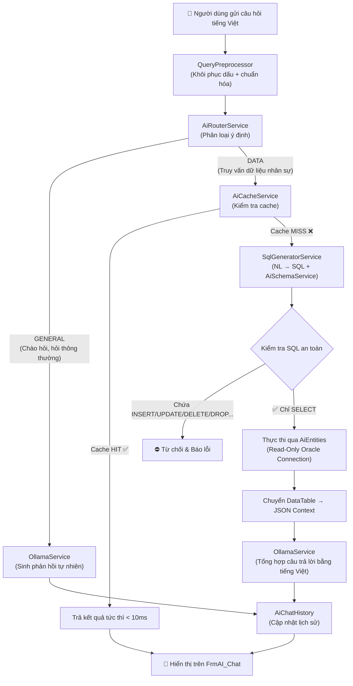

# 🏢 Hệ Thống Quản Lý Nhân Sự Doanh Nghiệp (HRMS) với Trợ Lý AI Cục Bộ

> **Enterprise Human Resource Management System** — Ứng dụng Desktop WinForms quản lý toàn diện nhân sự, chấm công, tính lương tích hợp **AI On-Premise** (NL2SQL) chạy hoàn toàn ngoại tuyến, bảo mật tuyệt đối.

[](https://dotnet.microsoft.com/)
[](https://www.oracle.com/database/)
[](https://www.devexpress.com/)
[](https://learn.microsoft.com/ef/)
[](https://ollama.com/)
[]()

---

## 🌐 Ngôn ngữ / Languages
- [🇻🇳 Tiếng Việt (Chi Tiết)](#-tiếng-việt)
- [🇺🇸 English (Overview)](#-english)
- [🇯🇵 日本語 (概要)](#-日本語)

---

## 🇻🇳 Tiếng Việt

### 📌 Tổng Quan Dự Án

Đây là hệ thống **Quản Lý Nhân Sự cấp doanh nghiệp** được xây dựng trên nền tảng **.NET Framework 4.7.2** với giao diện **DevExpress WinForms** cao cấp, sử dụng **Oracle Database 19c** làm hệ quản trị cơ sở dữ liệu. Điểm đột phá của hệ thống là tích hợp **Trợ Lý AI Cục Bộ (On-Premise AI Copilot)** với kiến trúc **Hybrid RAG** độc quyền: cho phép người quản lý đặt câu hỏi bằng tiếng Việt tự nhiên để truy vấn dữ liệu nhân sự mà không cần viết SQL, và toàn bộ xử lý diễn ra **nội bộ** — không một byte dữ liệu nào rời khỏi máy chủ công ty.

---

### 🗂 Kiến Trúc Dự Án (3-Tier Architecture)

Dự án tuân thủ mô hình **3 lớp (3-Tier)** tách biệt rõ ràng:

```
QuanLyNhanSu.sln
 ├── 📂 QLyNSu/          ← Presentation Layer (WinForms + DevExpress)
 │    ├── FORM_NHANSU/   ← Màn hình Quản lý Nhân sự
 │    ├── FORM_CHAMCONG/ ← Màn hình Chấm công & Tính lương
 │    ├── FORM_BAOCAO/   ← Màn hình In ấn & Báo cáo
 │    ├── FORM_SYSTEM/   ← Màn hình Hệ thống (Login, Phân quyền, AI Chat)
 │    └── Reports/       ← Crystal Reports / DevExpress Reports
 │
 ├── 📂 Bu/              ← Business Logic Layer (BLL)
 │    ├── CLASS_NHANSU/  ← Nghiệp vụ Nhân sự
 │    ├── CLASS_CHAMCONG/← Nghiệp vụ Chấm công & Lương
 │    ├── CLASS_BAOCAO/  ← Nghiệp vụ Báo cáo
 │    ├── CLASS_SYSTEM/  ← Nghiệp vụ Hệ thống & Phân quyền
 │    ├── DTO/           ← Data Transfer Objects
 │    └── Services/
 │         └── AI_Services/
 │              ├── Core/    ← HybridRagService, SqlGeneratorService, AiRouterService, ...
 │              ├── LLM/     ← OllamaService (giao tiếp với Ollama server)
 │              ├── Memory/  ← AiCacheService, AiChatHistory
 │              └── Vector/  ← VectorService (tìm kiếm tương đồng ngữ nghĩa)
 │
 └── 📂 DA/              ← Data Access Layer (Entity Framework 6)
      ├── QLNhanSu.edmx  ← EDMX model đầy đủ cho toàn bộ ứng dụng HR
      └── AIEntities.edmx← EDMX model chỉ đọc (Read-Only) dành riêng cho AI
```

---

### ✨ Tính Năng Nghiệp Vụ

#### 1. 👤 Quản Lý Nhân Sự (HR Module)

| Form | Chức năng |
|------|-----------|
| `FrmNhanVien` | Hồ sơ nhân viên: thông tin cá nhân, ảnh BLOB, phòng ban, chức vụ, trình độ, dân tộc, tôn giáo |
| `FrmDieuChuyen_NhanVien` | Lập quyết định và lưu lịch sử điều chuyển phòng ban / bộ phận / chức vụ |
| `FrmHopDongLaoDong` | Quản lý hợp đồng lao động: số lần ký, thời hạn, hệ số lương cơ bản |
| `FrmKhenThuong` | Quyết định khen thưởng: nội dung, ngày ban hành, đính kèm |
| `FrmKyLuat` | Quyết định kỷ luật: hình thức, mức độ, ngày hiệu lực |
| `FrmNangLuong_NhanVien` | Lộ trình tăng lương: lưu vết từng lần điều chỉnh hệ số lương |
| `FrmNhanVien_ThoiViec` | Hồ sơ nghỉ việc: lý do, ngày nghỉ, ghi chú |
| `FrmCongTy`, `FrmPhongBan`, `FrmBoPhan`, `FrmChucVu`, `FrmTrinhDo`, `FrmDanToc`, `FrmTonGiao` | Danh mục hệ thống (CRUD chuẩn) |

#### 2. ⏱ Chấm Công & Tính Lương (Timekeeping & Payroll)

| Form | Chức năng |
|------|-----------|
| `FrmLoaiCa` | Danh mục ca làm việc (ca ngày, ca đêm, ca gãy) + hệ số lương ca |
| `FrmLoaiCong` | Định nghĩa loại ngày công (thường, nghỉ phép, nghỉ ốm, lễ) |
| `FrmBangCong` | Bảng công tháng: tổng hợp ngày công thực tế, nghỉ phép của nhân viên |
| `FrmBangCong_ChiTiet` | Chi tiết giờ check-in / check-out hàng ngày từng nhân viên |
| `FrmCapNhatNgayCong` | Cập nhật, chỉnh sửa ngày công riêng lẻ |
| `FrmTangCa` | Theo dõi giờ tăng ca theo ngày/tháng, gắn với hệ số ca |
| `FrmPhuCap` | Danh mục phụ cấp (ăn trưa, xăng xe, điện thoại, trách nhiệm) + phân bổ cho nhân viên |
| `FrmUngLuong` | Ghi nhận và duyệt yêu cầu tạm ứng lương giữa kỳ |
| `FrmBangLuong` | **Tự động tính lương**: Lương CB × Hệ số ngày công + Lương tăng ca + Phụ cấp − Tạm ứng |

> **Công thức tính lương:**
> ```
> Thực lĩnh = (Lương_CB_HĐ × Ngày_Công_Thực_Tế / Ngày_Công_Chuẩn)
>            + (Giờ_Tăng_Ca × Hệ_Số_Ca × Lương_Giờ)
>            + Tổng_Phụ_Cấp
>            − Tổng_Tạm_Ứng
> ```

#### 3. 📄 In Ấn & Báo Cáo (Reports)

| Report | Nội dung |
|--------|----------|
| `rptBangCongTongHop` | Bảng công tổng hợp toàn công ty theo tháng |
| `rptBangCongCTNV` | Bảng công chi tiết từng nhân viên |
| `rptBaoCaoLuongNV` | Phiếu lương cá nhân (hỗ trợ xuất PDF/Excel) |
| `rptDSNhanVien` | Danh sách nhân viên theo phòng ban |
| `rptHopDongLaoDong` | In hợp đồng lao động theo mẫu |
| `rptKhenThuong` / `rptKyLuat` | In quyết định khen thưởng / kỷ luật |

#### 4. 🔐 Quản Trị Hệ Thống (System Administration)

| Form | Chức năng |
|------|-----------|
| `FrmDangNhap` | Đăng nhập với xác thực BCrypt + phân quyền theo nhóm |
| `FrmUser` / `FrmGroup` | Quản lý tài khoản người dùng và nhóm quyền |
| `FrmShowUser_Group` | Xem và gán thành viên vào nhóm |
| `FrmPhanQuyenChucNang` | Phân quyền truy cập từng chức năng (menu) theo nhóm |
| `FrmPhanQuyenBaoCao` | Phân quyền xem báo cáo theo nhóm |
| `FrmChangePassword` | Đổi mật khẩu cá nhân |
| `FrmSetting` | Cấu hình kết nối Ollama và model AI |
| `FrmCreateAccount` | Tạo tài khoản mới kèm thiết lập quyền ban đầu |

#### 5. 🤖 Trợ Lý AI Nhân Sự Thông Minh (AI Copilot)

| Form / Service | Vai trò |
|----------------|---------|
| `FrmAI_Chat` | Giao diện chatbox tích hợp trực tiếp trên ứng dụng desktop |
| `FrmAI` | Màn hình hiển thị kết quả truy vấn SQL dạng bảng dữ liệu |
| `HybridRagService` | Điều phối toàn bộ luồng RAG (Orchestrator trung tâm) |
| `AiRouterService` | Phân loại ý định: **GENERAL** (hỏi đáp thông thường) vs. **DATA** (truy vấn DB) |
| `QueryPreprocessor` | Chuẩn hóa câu hỏi: khôi phục dấu tiếng Việt, inject gợi ý schema |
| `SqlGeneratorService` | Sinh SQL từ câu hỏi tiếng Việt, làm sạch và kiểm duyệt an toàn |
| `AiSchemaService` | Cung cấp định nghĩa các View AI cho LLM hiểu cấu trúc dữ liệu |
| `OllamaService` | Gửi prompt và nhận phản hồi từ Ollama local server |
| `AiCacheService` | Cache kết quả SQL đã sinh để phản hồi tức thì cho câu hỏi lặp |
| `AiChatHistory` | Lưu lịch sử hội thoại ngắn hạn để AI hiểu ngữ cảnh đàm thoại |
| `VectorService` | Tìm kiếm tương đồng ngữ nghĩa (Vector Similarity Search) |

---

### 🤖 Kiến Trúc Hybrid RAG & Bảo Mật AI

#### Luồng Xử Lý (RAG Pipeline)



#### Cơ Chế Bảo Mật (Security Safeguards)

| Cơ chế | Chi tiết |
|--------|----------|
| **Tài khoản DB phân tách** | `QLNhanSuEntities` (Admin, đọc/ghi toàn bộ) vs `AiEntities` (chỉ đọc View AI) |
| **View-Restricted Access** | AI chỉ truy cập 6 View an toàn, không bao giờ động trực tiếp vào bảng gốc |
| **SQL Sanitization** | Chỉ chấp nhận câu lệnh bắt đầu bằng `SELECT`; loại bỏ mọi từ khóa DML/DDL |
| **Hardcode Regex Fallback** | Tìm kiếm nhân viên theo Tên/Mã số chạy trực tiếp không qua LLM, độ chính xác 100% |
| **Local-Only Execution** | Ollama chạy hoàn toàn cục bộ — không một dữ liệu nào gửi lên internet |
| **BCrypt Password Hashing** | Mật khẩu người dùng được băm bằng BCrypt.Net-Next trước khi lưu |

##### View AI (Dữ liệu AI được phép truy cập):

| View | Dữ liệu cung cấp |
|------|-----------------|
| `V_AI_EMPLOYEE` | Thông tin cơ bản nhân viên (tên, phòng ban, chức vụ, ngày vào làm) |
| `V_AI_ATTENDANCE` | Giờ check-in/check-out, số ngày công hàng tháng |
| `V_AI_OVERTIME` | Số giờ tăng ca theo ngày, hệ số ca |
| `V_AI_INSURANCE` | Mã số bảo hiểm, nơi cấp, nơi khám bệnh |
| `V_AI_ADVANCE` | Số tiền và ngày tạm ứng lương |
| `V_AI_ALLOWANCE` | Phụ cấp được nhận theo kỳ công |

---

### 🗄️ Cơ Sở Dữ Liệu (Database Schema)

> File backup đầy đủ: [HR_backup.sql](./HR_backup.sql) | Script khởi tạo dữ liệu: [import_data.sql](./import_data.sql)

#### Nhóm Bảng Nhân Sự & Tổ Chức

```
TB_NHANVIEN          — Bảng trung tâm, lưu toàn bộ hồ sơ nhân viên
TB_CONGTY            — Thông tin công ty
TB_PHONGBAN          — Danh mục phòng ban
TB_BOPHAN            — Danh mục bộ phận (con của phòng ban)
TB_CHUCVU            — Danh mục chức vụ
TB_TRINHDO           — Danh mục trình độ học vấn
TB_DANTOC            — Danh mục dân tộc
TB_TONGIAO           — Danh mục tôn giáo
TB_GIOITINH          — Danh mục giới tính
TB_QUOCTICH          — Danh mục quốc tịch
```

#### Nhóm Bảng Biến Động Nhân Sự

```
TB_HOPDONG           — Hợp đồng lao động (số lần ký, hệ số lương)
TB_DIEUCHUYEN_NHANVIEN — Lịch sử điều chuyển nội bộ
TB_NANGLUONG_NHANVIEN  — Lộ trình tăng lương
TB_KHENTHUONG_KYLUAT — Quyết định khen thưởng và kỷ luật
TB_NHANVIEN_THOIVIEC — Hồ sơ thôi việc
```

#### Nhóm Bảng Chấm Công & Tài Chính

```
TB_LOAICA            — Danh mục ca làm việc + hệ số lương ca
TB_LOAICONG          — Danh mục loại ngày công
TB_BANGCONG          — Bảng công tháng (tổng hợp)
TB_BANGCONG_CHITIET  — Chi tiết check-in/check-out hàng ngày
TB_KYCONG            — Kỳ công (chu kỳ tính lương)
TB_KYCONGCHITIET     — Chi tiết kỳ công từng nhân viên
TB_TANGCA            — Giờ tăng ca
TB_PHUCAP            — Danh mục phụ cấp
TB_NHANVIEN_PHUCAP   — Phân bổ phụ cấp cho nhân viên
TB_UNGLUONG          — Tạm ứng lương
TB_BANGLUONG         — Bảng lương tổng hợp
TB_BAOHIEM           — Thông tin bảo hiểm xã hội
```

#### Nhóm Bảng Hệ Thống (System Tables)

```
TB_SYS_USER          — Tài khoản người dùng (mật khẩu BCrypt)
TB_SYS_GROUP         — Nhóm quyền và mối quan hệ thành viên
TB_SYS_FUNCTION      — Danh mục chức năng trong hệ thống
TB_SYS_RIGHT         — Phân quyền chức năng theo người dùng/nhóm
TB_SYS_REPORT        — Danh mục báo cáo
TB_SYS_RIGHT_REPORT  — Phân quyền xem báo cáo
TB_CONFIG            — Cấu hình hệ thống (Ollama URL, model name, ...)
```

> **Trigger quan trọng:** [SYS_USER_triggers.sql](./DA/SYS_USER_triggers.sql) — Cascade delete khi xóa tài khoản người dùng (tự động dọn sạch nhóm, quyền hàm, quyền báo cáo).

---

### 🛠 Công Nghệ Sử Dụng

| Thành phần | Phiên bản / Chi tiết |
|-----------|----------------------|
| **Runtime** | .NET Framework 4.7.2 |
| **UI Library** | DevExpress WinForms (GridView, TreeList, RibbonControl) |
| **Database** | Oracle Database 19c |
| **ORM** | Entity Framework 6.5.1 (Database First — EDMX) |
| **Oracle Driver** | Oracle.ManagedDataAccess 23.7.0 (Thuần .NET, không cần Oracle Client) |
| **AI Runtime** | Ollama (Local Server, port 11434) |
| **LLM Model** | Qwen 2.5 (7B/14B) hoặc Llama 3 — mặc định: `qwen2.5:latest` |
| **JSON** | Newtonsoft.Json 13.0.4 |
| **Security** | BCrypt.Net-Next 4.0.3 (Hash mật khẩu) |
| **Async** | Microsoft.Bcl.AsyncInterfaces, System.Threading.Tasks |

---

### ⚙️ Hướng Dẫn Cài Đặt & Khởi Chạy

#### Bước 1: Thiết Lập Oracle Database 19c

1. Tạo tablespace và user HR trong Oracle:
   ```sql
   CREATE USER HR IDENTIFIED BY your_password;
   GRANT CONNECT, RESOURCE, DBA TO HR;
   ```

2. Thực thi file backup để tạo toàn bộ schema và dữ liệu mẫu:
   ```sql
   -- Chạy trong SQL Developer hoặc PL/SQL Developer
   @HR_backup.sql
   @import_data.sql
   ```

3. Tạo tài khoản phụ cho AI (chỉ đọc View):
   ```sql
   CREATE USER HR_AI IDENTIFIED BY ai_password;
   GRANT CREATE SESSION TO HR_AI;
   -- Chỉ cấp quyền SELECT trên 6 View AI
   GRANT SELECT ON HR.V_AI_EMPLOYEE   TO HR_AI;
   GRANT SELECT ON HR.V_AI_ATTENDANCE TO HR_AI;
   GRANT SELECT ON HR.V_AI_OVERTIME   TO HR_AI;
   GRANT SELECT ON HR.V_AI_INSURANCE  TO HR_AI;
   GRANT SELECT ON HR.V_AI_ADVANCE    TO HR_AI;
   GRANT SELECT ON HR.V_AI_ALLOWANCE  TO HR_AI;
   ```

4. Chạy trigger cascade delete:
   ```sql
   @DA/SYS_USER_triggers.sql
   ```

#### Bước 2: Cài Đặt Ollama & Tải Model AI

```bash
# 1. Tải và cài đặt Ollama từ https://ollama.com/
# 2. Tải mô hình ngôn ngữ (chọn một trong hai):
ollama pull qwen2.5:latest    # Khuyến nghị (tiếng Việt tốt hơn)
ollama pull llama3:latest     # Tùy chọn thay thế

# 3. Chạy server Ollama (mặc định port 11434)
ollama serve
```

#### Bước 3: Cấu Hình `App.config`

Cập nhật file `App.config` trong project **`QLyNSu`** và **`Bu`**:

```xml
<configuration>
  <connectionStrings>
    <!-- Kết nối chính: Quyền Admin cho toàn bộ hệ thống HR -->
    <add name="QLNhanSuEntities"
         connectionString="metadata=res://*/QLNhanSu.csdl|res://*/QLNhanSu.ssdl|res://*/QLNhanSu.msl;
                           provider=Oracle.ManagedDataAccess.Client;
                           provider connection string=&quot;DATA SOURCE=localhost:1521/ORCL;
                           PASSWORD=your_password;USER ID=HR&quot;"
         providerName="System.Data.EntityClient" />

    <!-- Kết nối AI: Chỉ đọc, giới hạn trên 6 View an toàn -->
    <add name="AiEntities"
         connectionString="metadata=res://*/AIEntities.csdl|res://*/AIEntities.ssdl|res://*/AIEntities.msl;
                           provider=Oracle.ManagedDataAccess.Client;
                           provider connection string=&quot;DATA SOURCE=localhost:1521/ORCL;
                           PASSWORD=ai_password;USER ID=HR_AI&quot;"
         providerName="System.Data.EntityClient" />
  </connectionStrings>

  <appSettings>
    <!-- URL Ollama server -->
    <add key="OllamaUrl" value="http://localhost:11434/api/generate" />
    <!-- Tên model AI đang dùng -->
    <add key="DefaultModel" value="qwen2.5:latest" />
  </appSettings>
</configuration>
```

#### Bước 4: Build & Chạy

1. Mở `QuanLyNhanSu.sln` bằng **Visual Studio 2019/2022**
2. Restore NuGet packages: `Tools → NuGet Package Manager → Restore`
3. Build Solution: `Ctrl + Shift + B`
4. Chạy project `QLyNSu` (Set as Startup Project)
5. Đăng nhập với tài khoản **Admin** được tạo từ `import_data.sql`

---

### 📁 Cấu Trúc File Quan Trọng

| File / Thư mục | Mô tả |
|----------------|-------|
| [`QuanLyNhanSu.sln`](./QuanLyNhanSu.sln) | Solution file chứa 3 project |
| [`HR_backup.sql`](./HR_backup.sql) | Script tạo toàn bộ schema Oracle (bảng, view, sequence, constraint) |
| [`import_data.sql`](./import_data.sql) | Dữ liệu mẫu để test (nhân viên, phòng ban, tài khoản admin) |
| [`DA/QLNhanSu.edmx`](./DA/QLNhanSu.edmx) | Entity Data Model đầy đủ (40+ bảng) |
| [`DA/AIEntities.edmx`](./DA/AIEntities.edmx) | Entity Data Model chỉ đọc cho AI (6 View) |
| [`DA/SYS_USER_triggers.sql`](./DA/SYS_USER_triggers.sql) | Oracle trigger cascade delete cho bảng người dùng |
| [`Bu/Services/AI_Services/Core/HybridRagService.cs`](./Bu/Services/AI_Services/Core/HybridRagService.cs) | Orchestrator trung tâm của toàn bộ luồng AI |
| [`Bu/Services/AI_Services/Core/SqlGeneratorService.cs`](./Bu/Services/AI_Services/Core/SqlGeneratorService.cs) | Dịch câu hỏi tiếng Việt → Oracle SQL |
| [`QLyNSu/FORM_SYSTEM/FrmAI_Chat.cs`](./QLyNSu/FORM_SYSTEM/FrmAI_Chat.cs) | Giao diện Chatbox AI tích hợp |

---

### 🔧 Yêu Cầu Hệ Thống

| Thành phần | Yêu cầu tối thiểu |
|-----------|-------------------|
| **OS** | Windows 10/11 (64-bit) |
| **RAM** | 8 GB (16 GB khuyến nghị khi dùng AI) |
| **CPU** | Intel Core i5 thế hệ 8+ hoặc AMD Ryzen 5 |
| **GPU** | Tùy chọn — NVIDIA GPU (CUDA) tăng tốc Ollama đáng kể |
| **Oracle** | Oracle Database 19c (Express Edition miễn phí) |
| **Visual Studio** | 2019 / 2022 với workload ".NET Desktop Development" |
| **DevExpress** | v23.x hoặc tương thích với .NET Framework 4.7.2 |
| **Ollama** | Phiên bản mới nhất từ [ollama.com](https://ollama.com) |

---

## 🇺🇸 English

### 📌 Project Overview

This is an **enterprise-grade Human Resource Management System (HRMS)** built on **.NET Framework 4.7.2** with a rich **DevExpress WinForms** UI and **Oracle Database 19c** backend. The system's standout feature is an integrated **On-Premise AI Copilot** using a custom **Hybrid RAG architecture** that enables HR managers to query employee data in plain Vietnamese — without writing SQL — while keeping all corporate data completely offline and private.

### 🏗 Architecture

The solution follows a clean **3-Tier Architecture**:

| Layer | Project | Responsibility |
|-------|---------|---------------|
| **Presentation** | `QLyNSu` | WinForms + DevExpress UI, Forms, Reports, AI Chatbox |
| **Business Logic** | `Bu` | HR Rules, Payroll Calculation, AI Orchestration, Services |
| **Data Access** | `DA` | Entity Framework 6.5 (Database First), Oracle Connection |

### 🛡 AI Security Architecture

The AI subsystem is isolated at **multiple levels**:

1. **Separate DB Accounts**: The main app uses a full-access account (`HR`); the AI uses a read-only account (`HR_AI`) with no access to raw tables.
2. **View-Only Access**: AI queries are restricted to 6 pre-defined sanitized views (`V_AI_*`) that expose only safe, non-sensitive fields.
3. **SQL Sanitization**: All AI-generated SQL is validated — only `SELECT` statements are permitted; any DML/DDL keywords trigger an immediate rejection.
4. **Local Execution**: Ollama runs 100% on-premise. Zero data egress to the internet.
5. **Regex Fallback**: High-frequency queries (search by name/ID) are handled by deterministic regex patterns, bypassing the LLM entirely for sub-10ms responses.

### 🛠 Technology Stack

| Component | Technology |
|-----------|-----------|
| Runtime | .NET Framework 4.7.2 |
| UI | DevExpress WinForms |
| Database | Oracle 19c |
| ORM | Entity Framework 6.5.1 (EDMX) |
| AI Engine | Ollama (local, port 11434) |
| LLM | Qwen 2.5 / Llama 3 |
| Security | BCrypt.Net-Next password hashing |
| JSON | Newtonsoft.Json 13.0.4 |

### ⚙️ Quick Setup

1. **Oracle**: Create `HR` (admin) and `HR_AI` (read-only) users, run `HR_backup.sql` and `import_data.sql`.
2. **Ollama**: Install from [ollama.com](https://ollama.com), run `ollama pull qwen2.5:latest`.
3. **App.config**: Update connection strings for both Oracle accounts and set `OllamaUrl`.
4. **Build**: Open `QuanLyNhanSu.sln` in Visual Studio, restore NuGet packages, build and run `QLyNSu`.

---

## 🇯🇵 日本語

### 📌 プロジェクト概要

本システムは、**.NET Framework 4.7.2** と **DevExpress WinForms** を基盤とした、エンタープライズ向けの**人事・勤怠・給与管理システム (HRMS)** です。データベースには **Oracle Database 19c** を採用し、大規模な組織データの安定処理を実現しています。

最大の特徴は、**Ollama** による**オンプレミス AI アシスタント**の統合です。独自の **Hybrid RAG アーキテクチャ**により、人事担当者がベトナム語の自然文で質問するだけで、社内データベースを安全に検索・集計できます。AIの処理はすべてローカルで完結し、**一切のデータがインターネットへ送信されません**。

### 🏗 システム構成

| 層 | プロジェクト | 役割 |
|----|------------|------|
| **プレゼンテーション層** | `QLyNSu` | WinForms + DevExpress UI、帳票、AIチャット画面 |
| **ビジネスロジック層** | `Bu` | 人事業務ロジック、給与計算、AI オーケストレーター |
| **データアクセス層** | `DA` | Entity Framework 6.5 + Oracle 接続 (EDMX) |

### 🛡 AIセキュリティ対策

| 対策 | 詳細 |
|------|------|
| **DB アカウント分離** | HR (管理者) と HR_AI (読み取り専用) の 2 アカウント |
| **ビュー制限** | AI は `V_AI_*` の 6 つのビューのみ参照可能。元テーブルへの直接アクセス不可 |
| **SQLサニタイズ** | `SELECT` 文のみ許可。`INSERT`, `UPDATE`, `DELETE`, `DROP` 等は即時遮断 |
| **ローカル実行** | Ollama はローカルサーバーで動作。データの外部送信なし |
| **パスワード保護** | BCrypt による安全なパスワードハッシュ化 |

### ⚙️ セットアップ手順

1. Oracle 19c に `HR` (管理者) と `HR_AI` (読み取り専用) ユーザーを作成し、`HR_backup.sql` および `import_data.sql` を実行。
2. [ollama.com](https://ollama.com) から Ollama をインストールし、`ollama pull qwen2.5:latest` を実行。
3. `App.config` の接続文字列と `OllamaUrl` を環境に合わせて更新。
4. Visual Studio で `QuanLyNhanSu.sln` を開き、NuGet パッケージを復元してビルド・実行。

---

## 📄 License

本プロジェクトは学術・教育目的で開発されました。商業利用の場合は作者にお問い合わせください。

This project was developed for academic/educational purposes. For commercial use, please contact the author.

Dự án này được phát triển cho mục đích học thuật. Vui lòng liên hệ tác giả nếu có nhu cầu thương mại.
