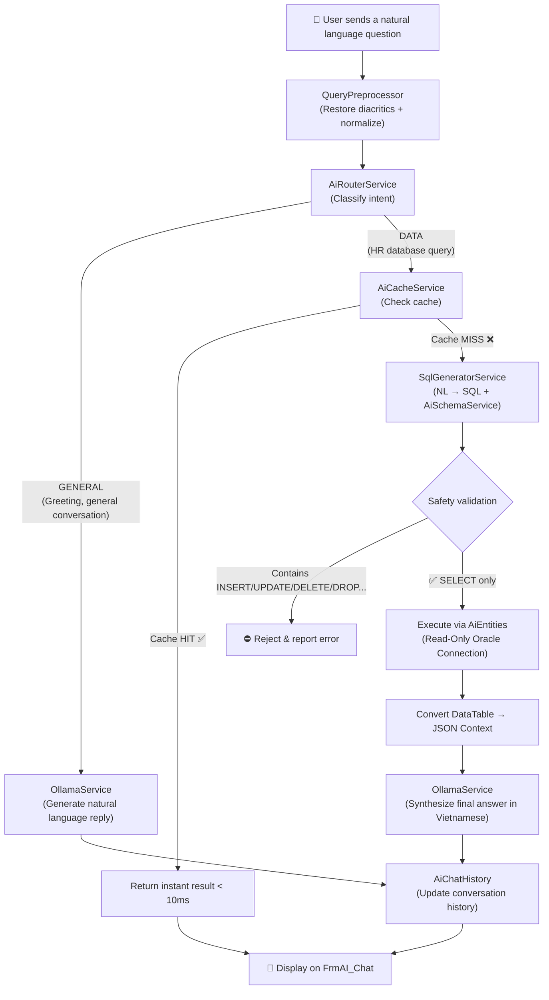
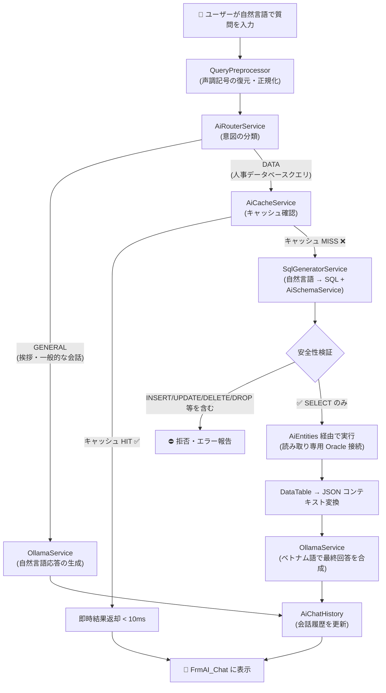

# 🏢 Hệ Thống Quản Lý Nhân Sự (HRMS Enterprise) với Trợ Lý AI Cục Bộ

Hệ thống Quản lý Nhân sự & Tiền lương cấp doanh nghiệp hỗ trợ kiến trúc **Hệ Sinh Thái Đa Nền Tảng (Desktop WinForms + Web React + Mobile Expo)** trên nền tảng **.NET Framework 4.7.2**, **ASP.NET Web API 2**, **Oracle Database** và trợ lý **AI On-Premise (Ollama Qwen 2.5 + Qdrant Vector DB)**.

[](https://dotnet.microsoft.com/)
[](https://react.dev/)
[](https://expo.dev/)
[](https://vitejs.dev/)
[](https://www.oracle.com/database/)
[](https://www.devexpress.com/)
[](https://learn.microsoft.com/ef/)
[](https://ollama.com/)
[]()

---

## 🌐 Ngôn ngữ / Languages
- [🇻🇳 Tiếng Việt (Chi Tiết)](#-tiếng-việt)
- [🇺🇸 English (Overview)](#-english)
- [🇯🇵 日本語 (概要)](#-日本語)

---

## 🇻🇳 Tiếng Việt

### 📌 Tổng Quan Hệ Thống

HRMS Enterprise là giải pháp quản trị nhân sự toàn diện được thiết kế theo mô hình **3 tầng trải nghiệm** chuyên biệt hóa cho từng đối tượng người dùng, cùng kết nối đồng bộ thời gian thực qua RESTful Web API tập trung:

```text
             HRMS
               │
       ┌───────┼────────┐
       │       │        │
       ▼       ▼        ▼
    Desktop   Web     Mobile
       │       │        │
    POWER     ADMIN   EMPLOYEE
    USER      PORTAL  SELF-SERVICE
```

* 🖥️ **Desktop Client (`HRMS.Desktop`) — Power User**:
  - **Đối tượng:** Chuyên viên Nhân sự (HR Specialist), Kế toán tiền lương (Payroll Accountant), Quản trị viên hệ thống (System Admin).
  - **Vai trò:** Xử lý nghiệp vụ nặng (heavy business processing), tính lương và phát sinh kỳ công hàng loạt, quản trị danh mục chuyên sâu, xuất/nhập dữ liệu quy mô lớn, thiết kế và in ấn biểu mẫu XtraReports native với hiệu năng cao nhất.
* 🌐 **Website (`HRMS.Web`) — Management / Administration Portal**:
  - **Đối tượng:** Ban Giám đốc, Quản lý bộ phận (Department Managers / Line Managers), Nhân sự quản trị (HR Officers).
  - **Vai trò:** Cổng quản trị và điều hành doanh nghiệp trực tiếp từ trình duyệt web. Theo dõi Dashboard chỉ số nhân sự & tiền lương trực quan bằng biểu đồ tương tác, phê duyệt nhanh yêu cầu, tra cứu hồ sơ và tích hợp Trợ lý AI hỏi đáp dữ liệu thông minh.
* 📱 **Mobile App (`HRMS.Mobile`) — Employee Self-Service (ESS)**:
  - **Đối tượng:** Toàn thể cán bộ công nhân viên trong doanh nghiệp.
  - **Vai trò:** Ứng dụng di động tự phục vụ (ESS App) giúp từng nhân viên tương tác trực tiếp với HRMS của chính mình: tra cứu phiếu lương bảo mật, theo dõi lịch sử chấm công, xem hợp đồng lao động, thông tin bảo hiểm y tế/xã hội và nhận thông báo nội bộ tức thời.

Hệ thống kết hợp cùng hạ tầng dịch vụ cốt lõi:
1. **RESTful Web API (`HRMS.Api`)**: Cổng dịch vụ tập trung bảo mật với **JWT Bearer**, phân quyền **Server-Side RBAC**, kiểm soát phạm vi dữ liệu (**Data Scoping** theo công ty/chi nhánh) và chống rò rỉ ngoại lệ.
2. **On-Premise AI Copilot (`HRMS.Business/Services/AI_Services`)**: Trợ lý AI hỏi đáp dữ liệu nhân sự bằng tiếng Việt tự nhiên sử dụng **Qwen 2.5**, kết hợp **Hybrid RAG** (Oracle SQL + Qdrant Vector Search), bảo vệ bởi bộ phân tích cú pháp **AST Tokenizer Validator** và cơ chế **Outbox Pattern** chống mất mát vector.

---

### 🗂 Kiến Trúc Hệ Thống (Solution Architecture)

```
HRMS.sln
 ├── 📂 HRMS.Api/          ← Backend REST API (ASP.NET Web API 2, .NET 4.7.2)
 │    ├── Controllers/     ← Auth, NhanVien, BangLuong, ChamCong, HopDong, AiChat, v.v.
 │    ├── Filters/         ← JwtAuthorizeAttribute (RBAC, Data Scope & Audit Sync)
 │    └── Services/        ← JwtService (HMAC-SHA256 Token Generation & Validation)
 │
 ├── 📂 HRMS.Web/          ← Web Client SPA (React 19 + Vite + Ant Design + Recharts)
 │    ├── src/components/  ← MainLayout, AiChatDrawer, PhanQuyenModal, PhieuLuongModal
 │    ├── src/pages/       ← DashboardPage, NhanVienPage, ChamCongPage, BangLuongPage, v.v.
 │    └── src/services/    ← Axios API client với tự động đính kèm JWT Bearer Token
 │
 ├── 📂 HRMS.Mobile/       ← Mobile Client App (React Native + Expo SDK 57 + TypeScript)
 │    ├── src/screens/     ← Home, Attendance, Payroll, Contract, Insurance, Notifications
 │    ├── src/navigation/  ← NativeStack & BottomTabs
 │    └── src/api/         ← Axios client kết nối qua Self-Scope /api/me/*
 │
 ├── 📂 HRMS.Desktop/      ← Desktop Client (DevExpress WinForms)
 │    ├── FORM_NHANSU/     ← Quản lý nhân sự, hồ sơ, hợp đồng, khen thưởng
 │    ├── FORM_CHAMCONG/   ← Chấm công ca kíp, bảng lương, tạm ứng, tăng ca
 │    └── Reports/         ← Báo cáo bảng lương và thống kê in ấn
 │
 ├── 📂 HRMS.Business/     ← Business Logic Layer (BLL) & AI Subsystem
 │    ├── CLASS_SYSTEM/    ← PasswordHasher (Strict BCrypt), SYS_USER, SYS_RIGHT
 │    └── Services/AI_Services/
 │         ├── Core/       ← HybridRagService, SafeSqlExecutor, RagContextRetriever,
 │         │                  RagSynthesizer, OracleSqlAstValidator, QueryPreprocessor
 │         ├── Interfaces/ ← ISafeSqlExecutor, IRagContextRetriever, IRagSynthesizer
 │         └── Vector/     ← QdrantService, QdrantOutboxManager (Retry & Reconciliation)
 │
 ├── 📂 HRMS.DataAccess/   ← Data Access Layer (Entity Framework 6.5)
 │    ├── MyEntities       ← EDMX Model kết nối Oracle Database
 │    └── AiEntities       ← EDMX Model chỉ đọc dành riêng cho AI Views
 │
 ├── 📂 HRMS.Tests/        ← Automated Test Suite (NUnit - 60 Passing Tests)
 │    ├── AiPromptInjectionTests.cs      ← Kiểm thử an toàn AST & tiêm nhiễm Prompt
 │    ├── AiRetrievalBenchmarkTests.cs   ← Đo kiểm hiệu năng Cache, Preprocessor, AST
 │    └── ApiSecurityIntegrationTests.cs ← Kiểm thử BCrypt, JWT Claims, RBAC & Data Scope
 │
 └── 📂 database/
      └── migrations/      ← Bộ kịch bản SQL Versioning (V1_0, V1_1, V1_2, V1_3)
```

---

### 🛡️ Các Biện Pháp An Toàn & Bảo Mật (Security Hardening)

1. **Mật Khẩu Chuẩn BCrypt**:
   - Loại bỏ hoàn toàn fallback kiểm tra mật khẩu plaintext.
   - Bắt buộc mã hóa và so khớp bằng thuật toán băm **BCrypt** (`$2a$`, `$2b$`, `$2y$`).
   - Tự động trim khoảng trắng đệm đặc thù của kiểu dữ liệu `CHAR` trong Oracle.
2. **Xác Thực JWT & Server-Side RBAC**:
   - Token JWT ký bằng khóa bí mật 256-bit (xoay vòng linh hoạt qua biến môi trường `HRMS_JWT_SECRET`).
   - Bộ lọc `[JwtAuthorize(Right = "F_...")]` và `[JwtAuthorize(RequireAdmin = true)]` cưỡng chế kiểm tra quyền trên từng API endpoint.
3. **Kiểm Soát Phạm Vi Dữ Liệu (Data Scope / Multi-Tenancy)**:
   - Tự động áp đặt điều kiện lọc theo mã công ty (`MACTY` / `IDCTY`) của người dùng đăng nhập đối với mọi truy vấn dữ liệu. Chỉ có tài khoản Super Admin mới có quyền truy cập liên công ty.
4. **Chống Tấn Công Dò Quét (Brute-Force & Enumeration Defense)**:
   - Bộ giới hạn tốc độ (Rate Limiter) giới hạn tối đa 5 lần đăng nhập sai liên tiếp, khóa tài khoản tạm thời 15 phút.
   - Phản hồi đăng nhập đồng nhất: không làm lộ sự tồn tại của tên người dùng (`"Tài khoản hoặc mật khẩu không chính xác"`).
5. **Che Giấu Thông Tin Lỗi (Zero Exception Leaks)**:
   - Tắt chế độ `debug` và kích hoạt `customErrors="RemoteOnly"`.
   - Toàn bộ ngoại lệ hệ thống được ghi log bảo mật phía máy chủ (`Trace.TraceError`), client chỉ nhận mã lỗi HTTP chuẩn (400, 401, 403, 500) kèm thông điệp thân thiện.
6. **Kiểm Duyệt Truy Vấn AI Bằng AST Tokenizer (`OracleSqlAstValidator`)**:
   - Tokenize câu lệnh SQL sinh ra từ AI và kiểm tra ngữ pháp cây cú pháp.
   - Chặn đứng 100% các từ khóa DDL/DML (`DROP`, `DELETE`, `UPDATE`, `INSERT`, `ALTER`, `TRUNCATE`).
   - Chặn kỹ thuật tiêm nhiễm nhiều câu lệnh qua dấu chấm phẩy (Multi-statement injection).
   - Chặn truy cập vào catalog hệ thống Oracle (`DBMS_*`, `SYS.*`, `ALL_*`, `V$*`).
   - **Strict Whitelist**: Chỉ cho phép đọc từ 6 View an toàn: `V_AI_EMPLOYEE`, `V_AI_ATTENDANCE`, `V_AI_OVERTIME`, `V_AI_INSURANCE`, `V_AI_ADVANCE`, `V_AI_ALLOWANCE`.

---

### 🤖 Pipeline AI Hybrid RAG & Outbox Pattern

```text
[ User Question ]
       │
       ▼
[ QueryPreprocessor ] ── (Phục hồi dấu tiếng Việt & intent hints)
       │
       ▼
[ FastResponseService ] ── (Phản hồi tức thì < 50ms nếu có trong Cache)
       │
       ▼
[ AiRouterService ] ── (Phân loại: GENERAL hay DB Query)
       │
  ┌────┴──────────────────────────┐
  ▼                               ▼
[ ISqlGenerator ]           [ IVectorService (Qdrant) ]
  │                           │
  ▼                           ▼
[ OracleSqlAstValidator ]   (Tìm kiếm ngữ nghĩa Top-10)
  │ (Whitelist + Tokenizer)   │
  ▼                           │
[ SafeSqlExecutor ]           │
  │ (Oracle AI Views)         │
  └──────────────┬────────────┘
                 ▼
     [ RagContextRetriever ] ── (Định dạng & ghép nối Context đa nguồn)
                 │
                 ▼
       [ RagSynthesizer ] ── (Ollama Qwen 2.5 Streaming)
                 │
                 ▼
       [ Final AI Response ]
```

- **Qdrant Outbox Pattern (`QdrantOutboxManager`)**:
  - Khi có biến động nhân sự, sự kiện được đưa vào hàng đợi Outbox bền vững lưu trữ trên đĩa.
  - Bộ tiến trình nền tự động xử lý với thuật toán **Exponential Backoff Retry** (5s, 15s, 45s...). Khi Qdrant gặp sự cố mạng hoặc khởi động lại, dữ liệu không bao giờ bị thất lạc.
  - Cung cấp API đối soát toàn diện (`POST /api/ai/reconcile`) quét toàn bộ nhân viên Oracle và đồng bộ vector.

---

### 🚀 Hướng Dẫn Cài Đặt & Triển Khai
- Xem chi tiết tại:
  - 📖 **[docs/installation.md](docs/installation.md)**: Hướng dẫn cài đặt môi trường lập trình và chạy thử.
  - 🌐 **[docs/deployment_guide.md](docs/deployment_guide.md)**: Hướng dẫn đóng gói và triển khai sản xuất trên IIS & Docker.
  - 📚 **[docs/technical_reference.md](docs/technical_reference.md)**: Tài liệu tham chiếu chi tiết các bảng và phân hệ.
```

#### Cơ Chế Bảo Mật (Security Safeguards)

| Cơ chế | Chi tiết |
|--------|----------|
| **Tài khoản DB phân tách** | `QLNhanSuEntities` (Admin, đọc/ghi toàn bộ) vs `AiEntities` (chỉ đọc View AI) |
| **AI query safeguards** | SQL được giới hạn ở các thao tác đọc và các AI View được cho phép; các câu lệnh không phù hợp sẽ bị từ chối trước khi thực thi. |
| **Input handling** | Dữ liệu đầu vào được xử lý/escape trước khi được đưa vào pipeline truy vấn. |
| **Deterministic employee lookup** | Một số trường hợp tìm kiếm theo mã nhân viên/tên được xử lý bằng rule-based matching để giảm phụ thuộc vào LLM. |
| **Local-Only Execution** | Ollama chạy hoàn toàn cục bộ — không gửi dữ liệu ra ngoài internet |
| **BCrypt Password Hashing** | Mật khẩu người dùng được băm bằng BCrypt.Net-Next trước khi lưu |

##### View AI (Dữ liệu AI được phép truy cập):

| View | Dữ liệu cung cấp |
|------|-----------------|
| `V_AI_EMPLOYEE` | Thông tin cơ bản nhân viên (tên, phòng ban, chức vụ, ngày vào làm) |
| `V_AI_ATTENDANCE` | Giờ check-in/check-out, số ngày công hàng tháng |
| `V_AI_OVERTIME` | Số giờ tăng ca theo ngày, hệ số ca |
| `V_AI_INSURANCE` | Mã số bảo hiểm, nơi cấp, nơi khám bệnh |
| `V_AI_ADVANCE` | Số tiền và ngày tạm ứng lương |
| `V_AI_ALLOWANCE` | Phụ cấp được nhận theo kỳ công |

---

### 🗄️ Cơ Sở Dữ Liệu (Database Schema)

Cấu trúc cơ sở dữ liệu bao gồm các nhóm bảng:
- Nhân sự & Tổ chức
- Biến động nhân sự
- Chấm công & Tài chính
- Bảng hệ thống

👉 **Xem chi tiết cấu trúc Database tại: [docs/technical_reference.md](docs/technical_reference.md)**

---

### 💰 Quy Tắc & Công Thức Tính Lương (Payroll Engine)

Hệ thống tính toán payroll tự động dựa trên mô hình 3 tầng dữ liệu (`TB_BANGCONG` $\to$ `TB_BANGCONG_CHITIET` $\to$ `TB_BANGLUONG`):

#### 1. Tiền Công & Lương Thực Tế
* **Đơn giá ngày**: `LƯƠNG CƠ BẢN / CÔNG CHUẨN` *(công chuẩn: 26 ngày)*
* **Lương ca ngày**: `ĐƠN GIÁ NGÀY × CÔNG CA NGÀY`
* **Lương ca đêm**: `ĐƠN GIÁ NGÀY × CÔNG CA ĐÊM × 1.30` *(hệ số ca đêm từ `TB_LOAICA`)*
* **Tiền phụ cấp**: `(TỔNG PHỤ CẤP THÁNG / CÔNG CHUẨN) × CÔNG THỰC TẾ` *(theo `TB_NHANVIEN_PHUCAP`)*
* **Tiền phép**: `SỐ NGÀY PHÉP × ĐƠN GIÁ PHÉP`
* **Tiền chuyên cần**: Mức chuyên cần *(300.000 đ)* nếu đủ điều kiện công chuẩn, ngược lại bằng 0
* **Tiền ăn ca**: `SỐ NGÀY HƯỞNG ĂN × ĐƠN GIÁ ĂN CA` *(ví dụ 12 đêm × 20.000 = 240.000 đ)*
* **Lương thử việc & Khoản khác**: Tính theo ngày công thử việc (`HOPDONG.LOAIHD = 1`) và `KHOAN_CONG_KHAC` (tổng tiền khen thưởng `TB_KHENTHUONG_KYLUAT` có `LOAI = 1`, `SOTIEN > 0` áp dụng trong tháng/năm tính lương).

$$\text{TỔNG TIỀN CÔNG THỰC TẾ} = \text{Lương ngày} + \text{Lương đêm} + \text{Lương thử việc} + \text{Phụ cấp} + \text{Phép} + \text{Chuyên cần} + \text{Ăn ca} + \text{Khoản cộng khác}$$

#### 2. Tiền Tăng Ca (Overtime - OT)
* **Tiền OT**: `SỐ GIỜ OT × MỨC TIỀN 1 GIỜ × HỆ SỐ OT` *(mức 1 giờ chuẩn: 25.000 đ)*
* **OT thử việc**: `HỆ SỐ OT × 85%` *(áp dụng khi `HOPDONG.LOAIHD = 1`)*
* **Hệ số OT quy định (`TB_HESO_TANGCA`)**:
  - *Ngày thường*: 06h–08h & 17h–22h (**150%**); sau 22h–06h (**200%**).
  - *Chủ nhật*: 08h–22h (**200%**); sau 22h–06h (**270%**).
  - *Ca đêm*: 05h30–06h (**200%**); 06h–08h (**180%**); đêm CN 20h–08h (**270%**).
  - *Ngày lễ*: 08h–22h (**300%**); sau 22h (**390%**).

$$\text{TỔNG CỘNG THU NHẬP} = \text{TỔNG TIỀN CÔNG THỰC TẾ} + \text{TỔNG TIỀN OT}$$

#### 3. Bảo Hiểm & Các Khoản Khấu Trừ
* **Bảo hiểm trích nộp theo lương căn cứ (`TB_BAOHIEM.LUONG_BHXH`)**:
  - `BHXH = LƯƠNG BHXH × 8%`
  - `BHYT = LƯƠNG BHXH × 1.5%`
  - `BHTN = LƯƠNG BHXH × 1%`
* **Phí công đoàn**: `42.000 đ` *(theo cấu hình đoàn phí)*
* **Thuế & Giảm trừ khác**:
  - `TIỀN TẠM ỨNG`: Tổng số tiền ứng lương trong kỳ công theo ngày ứng được chọn (`TB_UNGLUONG.THANG`, `NAM`).
  - `KHOAN_TRU_KHAC`: Bao gồm tiền phạt kỷ luật (`TB_KHENTHUONG_KYLUAT` có `LOAI = 2`, `SOTIEN > 0` áp dụng trong tháng/năm) cùng thuế TNCN và các khoản giảm trừ hợp lệ.

$$\text{TỔNG KHẤU TRỪ} = \text{BHXH} + \text{BHYT} + \text{BHTN} + \text{PHÍ CÔNG ĐOÀN} + \text{THUẾ TNCN} + \text{TIỀN TẠM ỨNG} + \text{KHOẢN TRỪ KHÁC}$$

$$\mathbf{THỰC\ LĨNH} = \mathbf{TỔNG\ CỘNG} - \mathbf{TỔNG\ KHẤU\ TRỪ} + \mathbf{HOÀN\ THUẾ}$$

---

### 🛠 Công Nghệ Sử Dụng

| Thành phần | Phiên bản / Chi tiết |
|-----------|----------------------|
| **Runtime** | .NET Framework 4.7.2 |
| **UI Library** | DevExpress WinForms (GridView, TreeList, RibbonControl) |
| **Database** | Oracle Database 19c |
| **ORM** | Entity Framework 6.5.1 (Database First — EDMX) |
| **Oracle Driver** | Oracle.ManagedDataAccess 23.7.0 (Thuần .NET, không cần Oracle Client) |
| **AI Runtime** | Ollama (Local Server, port 11434) |
| **LLM Model** | Qwen 2.5 (7B/14B) hoặc Llama 3 — mặc định: `qwen2.5:latest` |
| **Vector Database** | Qdrant (Local Server, port 6333) — tùy chọn |
| **JSON** | Newtonsoft.Json 13.0.4 |
| **Security** | BCrypt.Net-Next 4.0.3 (Hash mật khẩu) |
| **Async** | Microsoft.Bcl.AsyncInterfaces, System.Threading.Tasks |

---

### ⚙️ Hướng Dẫn Cài Đặt & Khởi Chạy


### AI Modes

The project currently supports two AI retrieval approaches:

- **Qdrant / semantic search:** actively used for current AI retrieval experiments.
- **NL2SQL + Oracle AI Views:** retained as the hybrid pipeline and temporarily bypassed while evaluating Qdrant.

Qdrant is therefore recommended for testing the current AI retrieval flow, but it should not be considered the final architecture yet.

#### Bước 1: Thiết Lập Oracle Database 19c

1. Tạo tablespace và user HR trong Oracle:
   ```sql
   CREATE USER HR IDENTIFIED BY your_password;
   GRANT CONNECT, RESOURCE, DBA TO HR;
   ```

2. Thực thi file backup để tạo toàn bộ schema và dữ liệu mẫu:
   ```sql
   -- Chạy trong SQL Developer hoặc PL/SQL Developer
   @HR_backup.sql
   @import_data.sql
   ```

3. Tạo tài khoản phụ cho AI (chỉ đọc View):
   ```sql
   CREATE USER HR_AI IDENTIFIED BY ai_password;
   GRANT CREATE SESSION TO HR_AI;
   -- Chỉ cấp quyền SELECT trên 6 View AI
   GRANT SELECT ON HR.V_AI_EMPLOYEE   TO HR_AI;
   GRANT SELECT ON HR.V_AI_ATTENDANCE TO HR_AI;
   GRANT SELECT ON HR.V_AI_OVERTIME   TO HR_AI;
   GRANT SELECT ON HR.V_AI_INSURANCE  TO HR_AI;
   GRANT SELECT ON HR.V_AI_ADVANCE    TO HR_AI;
   GRANT SELECT ON HR.V_AI_ALLOWANCE  TO HR_AI;
   ```

4. Chạy trigger cascade delete:
   ```sql
   @HRMS.DataAccess/SYS_USER_triggers.sql
   ```

#### Bước 2: Cài Đặt Ollama & Tải Model AI

```bash
# 1. Tải và cài đặt Ollama từ https://ollama.com/
# 2. Tải mô hình ngôn ngữ (chọn một trong hai):
ollama pull qwen2.5:latest    # Khuyến nghị (tiếng Việt tốt hơn)
ollama pull llama3:latest     # Tùy chọn thay thế

# 3. Chạy server Ollama (mặc định port 11434)
ollama serve
```

#### Bước 3: Cấu Hình `App.config`

Cập nhật file `App.config` trong project **`HRMS.Desktop`** và **`HRMS.Business`**:

```xml
<configuration>
  <connectionStrings>
    <!-- Kết nối chính: Quyền Admin cho toàn bộ hệ thống HR -->
    <add name="QLNhanSuEntities"
         connectionString="metadata=res://*/QLNhanSu.csdl|res://*/QLNhanSu.ssdl|res://*/QLNhanSu.msl;
                           provider=Oracle.ManagedDataAccess.Client;
                           provider connection string=&quot;DATA SOURCE=localhost:1521/ORCL;
                           PASSWORD=your_password;USER ID=HR&quot;"
         providerName="System.Data.EntityClient" />

    <!-- Kết nối AI: Chỉ đọc, giới hạn trên 6 View an toàn -->
    <add name="AiEntities"
         connectionString="metadata=res://*/AIEntities.csdl|res://*/AIEntities.ssdl|res://*/AIEntities.msl;
                           provider=Oracle.ManagedDataAccess.Client;
                           provider connection string=&quot;DATA SOURCE=localhost:1521/ORCL;
                           PASSWORD=ai_password;USER ID=HR_AI&quot;"
         providerName="System.Data.EntityClient" />
  </connectionStrings>

  <appSettings>
    <!-- URL Ollama server -->
    <add key="OllamaUrl" value="http://localhost:11434/api/generate" />
    <!-- Tên model AI đang dùng -->
    <add key="DefaultModel" value="qwen2.5:latest" />
  </appSettings>
</configuration>
```

#### Bước 4: Build & Chạy

1. Mở `HRMS.sln` bằng **Visual Studio 2019/2022**
2. Restore NuGet packages: `Tools → NuGet Package Manager → Restore`
3. Build Solution: `Ctrl + Shift + B`
4. Chạy project `HRMS.Desktop` (Set as Startup Project)
5. Đăng nhập với tài khoản **Admin** được tạo từ `HR_backup.sql`

---

### 📁 Cấu Trúc File Quan Trọng

| File / Thư mục | Mô tả |
|----------------|-------|
| [`HRMS.sln`](./HRMS.sln) | Solution file quản lý 8 module của toàn hệ thống HRMS |
| [`HR_backup.sql`](./HR_backup.sql) | Script tạo toàn bộ schema Oracle + dữ liệu mẫu (bảng, view, sequence, constraint, tài khoản admin) |
| [`HRMS.DataAccess/QLNhanSu.edmx`](./HRMS.DataAccess/QLNhanSu.edmx) | Entity Data Model đầy đủ (40+ bảng) |
| [`HRMS.DataAccess/AIEntities.edmx`](./HRMS.DataAccess/AIEntities.edmx) | Entity Data Model chỉ đọc cho AI (6 View) |
| [`HRMS.DataAccess/SYS_USER_triggers.sql`](./HRMS.DataAccess/SYS_USER_triggers.sql) | Oracle trigger cascade delete cho bảng người dùng |
| [`HRMS.Business/Services/AI_Services/Core/HybridRagService.cs`](./HRMS.Business/Services/AI_Services/Core/HybridRagService.cs) | Orchestrator trung tâm của toàn bộ luồng AI |
| [`HRMS.Business/Services/AI_Services/Core/SqlGeneratorService.cs`](./HRMS.Business/Services/AI_Services/Core/SqlGeneratorService.cs) | Dịch câu hỏi tiếng Việt → Oracle SQL |
| [`HRMS.Business/Services/AI_Services/Vector/QdrantService.cs`](./HRMS.Business/Services/AI_Services/Vector/QdrantService.cs) | Tìm kiếm ngữ nghĩa qua Qdrant vector database |
| [`HRMS.Business/Services/AI_Services/AiServiceLocator.cs`](./HRMS.Business/Services/AI_Services/AiServiceLocator.cs) | Service Locator đăng ký singleton cho AI |
| [`HRMS.Desktop/FORM_SYSTEM/FrmAI_Chat.cs`](./HRMS.Desktop/FORM_SYSTEM/FrmAI_Chat.cs) | Giao diện Chatbox AI tích hợp |
| [`HRMS.Desktop/ai_prompts.json`](./HRMS.Desktop/ai_prompts.json) | Template prompt AI (có thể sửa mà không cần build lại) |
| [`HRMS.VectorDataSync/Program.cs`](./HRMS.VectorDataSync/Program.cs) | Console tool nạp dữ liệu nhân viên vào Qdrant |
| [`HRMS_SetupScript.iss`](./HRMS_SetupScript.iss) | Inno Setup script tạo bộ cài đặt v3.5.0 |

---

### 🧪 Hướng Dẫn Kiểm Thử (Unit Testing)

Hệ thống đi kèm với dự án kiểm thử tự động **`HRMS.Tests`** sử dụng thư viện **NUnit** để kiểm thử các dịch vụ nghiệp vụ và AI cốt lõi:
- **`PasswordHasherTests.cs`**: Kiểm thử cơ chế băm mật khẩu bằng BCrypt, đảm bảo tính an toàn của mật khẩu cũ/mới và xử lý khoảng trắng (Oracle Fixed CHAR padding).
- **`QueryPreprocessorTests.cs`**: Kiểm thử bộ tiền xử lý câu hỏi tiếng Việt, kiểm tra việc phục hồi dấu tiếng Việt và tự động gợi ý schema thích hợp (Sinh nhật, Tăng ca, Phụ cấp, Bảo hiểm).
- **`AiCacheServiceTests.cs`**: Kiểm thử cơ chế cache dữ liệu SQL sinh ra từ AI, đảm bảo dữ liệu SQL được lưu và truy vấn chính xác dưới 10ms.
- **`DbQueryTests.cs`**: Kiểm thử các truy vấn Entity Framework trực tiếp trên cơ sở dữ liệu mẫu.


> Qdrant integration is currently under active evaluation. 
> Vector retrieval behavior and ranking quality may change while the migration is being benchmarked.

**Cách chạy kiểm thử:**
1. Mở `HRMS.sln` trên Visual Studio.
2. Chọn `Test -> Run All Tests` hoặc mở cửa sổ `Test Explorer` (`Ctrl + R, T`) để chạy tất cả hoặc từng ca kiểm thử cụ thể.

---

### ⚠️ Hướng Dẫn Xử Lý Sự Cố (Troubleshooting)

| Sự cố thường gặp | Nguyên nhân | Giải pháp |
|------------------|------------|-----------|
| **Lỗi kết nối Oracle Database** | TNS Service name chưa cấu hình hoặc Oracle database chưa khởi động. | Đảm bảo dịch vụ `OracleServiceORCL` và `OracleOraDB19Home1TNSListener` đang chạy trong Windows Services. Kiểm tra chuỗi kết nối `connectionString` trong `App.config` đã khớp với cổng (1521), SID (ORCL hoặc tên dịch vụ của bạn) và thông tin đăng nhập chưa. |
| **Không kết nối được Ollama** | Ollama local server chưa được khởi động hoặc port không khớp. | Chạy lệnh `ollama serve` trong terminal. Kiểm tra xem port 11434 có bị chiếm dụng không. Đảm bảo `<add key="OllamaUrl" value="..." />` trong `App.config` chỉ đúng địa chỉ chạy Ollama. |
| **AI sinh SQL sai hoặc bị từ chối** | Câu hỏi quá phức tạp hoặc có chứa các từ khóa nhạy cảm bị bộ lọc SQL chặn. | Đảm bảo câu hỏi rõ ràng, chứa thông tin thực thể (ví dụ: tên nhân viên cụ thể, phòng ban). Không sử dụng các từ mang nghĩa thay đổi dữ liệu như "thêm", "xóa", "sửa" nếu muốn truy vấn (bộ lọc SQL chỉ cho phép lệnh `SELECT` để đảm bảo an toàn). |
| **Lỗi tham chiếu DevExpress** | Thiếu thư viện DevExpress trên máy phát triển hoặc sai phiên bản. | Đảm bảo bạn đã cài đặt phiên bản DevExpress phù hợp (khuyên dùng v23.x). Sử dụng công cụ `DevExpress Project Converter` để nâng cấp/hạ cấp tham chiếu về đúng phiên bản máy đang có. |

---

### 🔧 Yêu Cầu Hệ Thống

| Thành phần | Yêu cầu tối thiểu |
|-----------|-------------------|
| **OS** | Windows 10/11 (64-bit) |
| **RAM** | 8 GB (16 GB khuyến nghị khi dùng AI) |
| **CPU** | Intel Core i5 thế hệ 8+ hoặc AMD Ryzen 5 |
| **GPU** | Tùy chọn — NVIDIA GPU (CUDA) tăng tốc Ollama đáng kể |
| **Oracle** | Oracle Database 19c (Express Edition miễn phí) |
| **Visual Studio** | 2019 / 2022 với workload ".NET Desktop Development" |
| **DevExpress** | v23.x hoặc tương thích với .NET Framework 4.7.2 |
| **Ollama** | Phiên bản mới nhất từ [ollama.com](https://ollama.com) |
| **Qdrant** | Tùy chọn — [qdrant.tech](https://qdrant.tech) hoặc Docker `qdrant/qdrant` |

---

### 🚀 Các Cập Nhật & Tối Ưu Hóa Gần Đây

**Các cập nhật gần đây tập trung vào hiệu năng, khả năng vận hành và hoàn thiện các tính năng AI.**

1. **Tối ưu hóa triệt để lỗi N+1 Query trong EF 6**:
   * Sửa đổi toàn bộ các hàm tải danh sách trong 9 lớp nghiệp vụ cốt lõi: `NHANVIEN`, `NHANVIEN_THOIVIEC`, `NANGLUONG_NHANVIEN`, `DIEUCHUYEN_NHANVIEN`, `KHENTHUONG_KYLUAT`, `HOPDONGLAODONG`, `UNGLUONG`, `TANGCA`, và `BANGLUONG`.
   * Chuyển đổi từ cơ chế duyệt vòng lặp truy vấn đơn lẻ sang **LINQ LEFT JOIN & DTO Projection** giúp gom toàn bộ các bảng liên kết và nạp dữ liệu chỉ trong **1 câu truy vấn SQL duy nhất** gửi tới Oracle DB. **Giảm số lượng truy vấn lặp trong các màn hình danh sách bằng LINQ JOIN và DTO projection, từ đó cải thiện thời gian tải dữ liệu và giảm N+1 query.**
2. **Thắt chặt bảo mật & Cải thiện an toàn truy vấn AI (NL2SQL)**:
   * Chuyển đổi bộ lọc bảo vệ của trợ lý AI trong [SqlGeneratorService.cs](./HRMS.Business/Services/AI_Services/Core/SqlGeneratorService.cs) từ **Blacklist** sang **Whitelist** nghiêm ngặt. Hệ thống chỉ cho phép thực thi các câu lệnh SELECT nhắm vào 6 View AI được chỉ định. Mọi nỗ lực truy vấn bảng nhạy cảm như tài khoản người dùng (`TB_SYS_USER`) hoặc các kỹ thuật AI Jailbreak đều bị chặn đứng.
   * Xử lý chuỗi và escape dữ liệu để phòng tránh các nguy cơ **SQL Injection** (`'`) của người dùng nhập vào trước khi ghép chuỗi.
3. **Nâng cấp Vector Search sang Qdrant**:
   * Thay thế `VectorService` (in-memory) bằng [QdrantService.cs](./HRMS.Business/Services/AI_Services/Vector/QdrantService.cs) — giao tiếp trực tiếp với Qdrant vector database qua HTTP. Hỗ trợ Cosine similarity (threshold 0.6, top-K=5), tự động đồng bộ dữ liệu nhân viên khi có thay đổi qua event `AiDataSyncHub`. Kèm theo tool CLI [VectorDataSync](./HRMS.VectorDataSync/Program.cs) để seed toàn bộ dữ liệu nhân viên từ Oracle vào Qdrant.
4. **Trải nghiệm Giao diện Bất đồng bộ & Mượt mà**:
   * Chuyển đổi hàm tải biểu đồ lương `LoadData()` sang dạng bất đồng bộ `LoadDataAsync()` sử dụng `Task.Run` trong [FrmDashboardLuong.cs](./HRMS.Desktop/FORM_BAOCAO/FrmDashboardLuong.cs), giúp giao diện chính không bị đơ cứng (freeze) khi tải các báo cáo lương lớn.
   * Giải quyết triệt để lỗi chuyển đổi tab của DevExpress `DocumentManager` (Tabbed MDI) trong [FormManager_Functions.cs](./HRMS.Desktop/Functions/FormManager_Functions.cs). Hệ thống tự động kích hoạt đưa tab tương ứng lên hàng đầu ngay sau khi màn hình chờ (SplashScreen) đóng hẳn và mở khóa giao diện chính.
5. **Mã hóa & Bảo mật Connection String**:
   * Hỗ trợ nạp chuỗi kết nối Oracle động qua biến môi trường hệ thống (`HR_DB_CONNECTION` và `AI_DB_CONNECTION`), giúp loại bỏ việc lưu mật khẩu CSDL ở dạng văn bản rõ trong file cấu hình `App.config` ở môi trường sản xuất.

---

## 🇺🇸 English

### 📌 Project Overview

**HRMS Enterprise** is a comprehensive Human Resource and Payroll Management platform architected around a **3-Tier Experience Model** tailored for distinct user personas, unified via a central RESTful Web API:

```text
             HRMS
               │
       ┌───────┼────────┐
       │       │        │
       ▼       ▼        ▼
    Desktop   Web     Mobile
       │       │        │
    POWER     ADMIN   EMPLOYEE
    USER      PORTAL  SELF-SERVICE
```

* 🖥️ **Desktop Client (`HRMS.Desktop`) — Power User**:
  - **Target Persona:** HR Specialists, Payroll Accountants, System Administrators.
  - **Role:** Heavy business processing, bulk timesheet and monthly payroll calculation, advanced organizational catalog management, large-scale data import/export, and native high-performance DevExpress XtraReports design and printing.
* 🌐 **Website (`HRMS.Web`) — Management / Administration Portal**:
  - **Target Persona:** Executives, Department / Line Managers, HR Officers.
  - **Role:** Browser-based enterprise management and operational portal. Interactive analytics dashboard with KPIs and charts, rapid approval workflows, employee profile lookups, and integrated intelligent conversational AI Copilot.
* 📱 **Mobile App (`HRMS.Mobile`) — Employee Self-Service (ESS App)**:
  - **Target Persona:** All company employees.
  - **Role:** Mobile Employee Self-Service application enabling individual employees to interact directly with their own HRMS data: secure digital payslips, daily timekeeping and check-in/out history, labor contracts, social & medical insurance records, and instant internal push notifications.

The system is underpinned by core enterprise infrastructure:
1. **RESTful Web API (`HRMS.Api`)**: Centralized gateway secured by **JWT Bearer**, server-side **RBAC**, multi-tenant **Data Scoping** (company/branch isolation), and exception masking.
2. **On-Premise AI Copilot (`HRMS.Business/Services/AI_Services`)**: Conversational natural language HR data assistant powered by **Qwen 2.5**, **Hybrid RAG** (Oracle SQL + Qdrant Vector Search), **AST Tokenizer Validator**, and an **Outbox Pattern** for guaranteed vector synchronization.

---

### 🗂 Solution Architecture

```
HRMS.sln
 ├── 📂 HRMS.Api/          ← Backend REST API (ASP.NET Web API 2, .NET 4.7.2)
 │    ├── Controllers/     ← Auth, NhanVien, BangLuong, ChamCong, HopDong, AiChat, etc.
 │    ├── Filters/         ← JwtAuthorizeAttribute (RBAC, Data Scope & Audit Sync)
 │    └── Services/        ← JwtService (HMAC-SHA256 Token Generation & Validation)
 │
 ├── 📂 HRMS.Web/          ← Web Client SPA (React 19 + Vite + Ant Design + Recharts)
 │    ├── src/components/  ← MainLayout, AiChatDrawer, PhanQuyenModal, PhieuLuongModal
 │    ├── src/pages/       ← DashboardPage, NhanVienPage, ChamCongPage, BangLuongPage, etc.
 │    └── src/services/    ← Axios API client with automatic JWT Bearer Token injection
 │
 ├── 📂 HRMS.Mobile/       ← Mobile Client App (React Native + Expo SDK 57 + TypeScript)
 │    ├── src/screens/     ← Home, Attendance, Payroll, Contract, Insurance, Notifications
 │    ├── src/navigation/  ← NativeStack & BottomTabs
 │    └── src/api/         ← Axios client connecting via Self-Scope /api/me/*
 │
 ├── 📂 HRMS.Desktop/      ← Desktop Client (DevExpress WinForms)
 │    ├── FORM_NHANSU/     ← HR Management Screens
 │    ├── FORM_CHAMCONG/   ← Timekeeping & Payroll Screens
 │    ├── FORM_BAOCAO/     ← Dashboard & Reports
 │    ├── FORM_SYSTEM/     ← System (Login, Permissions, AI Chat, Import/Export, Notifications)
 │    └── Reports/         ← DevExpress XtraReports (printable reports)
 │
 ├── 📂 HRMS.Business/     ← Business Logic Layer (BLL) & AI Subsystem
 │    ├── CLASS_NHANSU/    ← HR Business Rules
 │    ├── CLASS_CHAMCONG/  ← Timekeeping & Payroll Logic
 │    ├── CLASS_SYSTEM/    ← System & Permission Logic (PasswordHasher with BCrypt)
 │    ├── DTO/             ← Data Transfer Objects
 │    └── Services/AI_Services/
 │         ├── Core/       ← HybridRagService, SafeSqlExecutor, RagContextRetriever,
 │         │                  RagSynthesizer, OracleSqlAstValidator, QueryPreprocessor
 │         ├── Interfaces/ ← ISafeSqlExecutor, IRagContextRetriever, IRagSynthesizer
 │         └── Vector/     ← QdrantService, QdrantOutboxManager (Retry & Reconciliation)
 │
 ├── 📂 HRMS.DataAccess/   ← Data Access Layer (Entity Framework 6.5)
 │    ├── QLNhanSu.edmx    ← Full EDMX model for the entire HR application
 │    └── AIEntities.edmx  ← Read-Only EDMX model exclusively for the AI subsystem
 │
 ├── 📂 HRMS.Tests/        ← Unit Tests (NUnit)
 │
 └── 📂 HRMS.VectorDataSync/ ← Console tool to seed employee data into Qdrant
```

---

### ✨ Feature Modules

- Human Resources
- Timekeeping & Payroll
- Reports & Printing
- System Administration
- AI HR Copilot

👉 **For a full list of forms and features, see [docs/technical_reference.md](docs/technical_reference.md)**

---

### 🤖 Hybrid RAG Architecture & AI Security

#### Processing Pipeline


```mermaid
graph TD
    A["👤 User sends a natural language question"] --> B["QueryPreprocessor\n(Restore diacritics + normalize)"]
    B --> C["AiRouterService\n(Classify intent)"]

    C -- "GENERAL\n(Greeting, general conversation)" --> D["OllamaService\n(Generate natural language reply)"]
    C -- "DATA\n(HR database query)" --> E["AiCacheService\n(Check cache)"]

    E -- "Cache HIT ✅" --> I["Return instant result < 10ms"]
    E -- "Cache MISS ❌" --> F["SqlGeneratorService\n(NL → SQL + AiSchemaService)"]

    F --> G{"Safety validation"}
    G -- "Contains INSERT/UPDATE/DELETE/DROP..." --> H["⛔ Reject & report error"]
    G -- "✅ SELECT only" --> J["Execute via AiEntities\n(Read-Only Oracle Connection)"]

    J --> K["Convert DataTable → JSON Context"]
    K --> L["OllamaService\n(Synthesize final answer in Vietnamese)"]

    D --> M["AiChatHistory\n(Update conversation history)"]
    L --> M
    M --> N["💬 Display on FrmAI_Chat"]
    I --> N
```

#### Security Safeguards

| Mechanism | Detail |
|-----------|--------|
| **Dual DB Accounts** | `QLNhanSuEntities` (Admin — full read/write) vs. `AiEntities` (AI — read-only on Views only) |
| **View-Restricted Access** | The AI account can only query 6 pre-defined safe Views; direct table access is blocked at the DB level |
| **SQL Sanitization** | Only `SELECT` statements are accepted; any DML/DDL keyword (`INSERT`, `UPDATE`, `DELETE`, `DROP`, `TRUNCATE`, `ALTER`) is rejected |
| **Regex Hardcode Fallback** | Common lookups (by name or employee ID) use deterministic regex patterns — no LLM call, rule-based matching, sub-10ms latency |
| **Local-Only Execution** | Ollama runs entirely on-premise; does not send data to the internet |
| **BCrypt Password Hashing** | All user passwords are hashed with BCrypt.Net-Next before storage; plain-text passwords never touch the database |

##### AI-Accessible Views

| View | Exposed Data |
|------|-------------|
| `V_AI_EMPLOYEE` | Basic employee info (name, department, position, start date) |
| `V_AI_ATTENDANCE` | Daily check-in/check-out times, monthly working day totals |
| `V_AI_OVERTIME` | Overtime hours by day, shift rate coefficient |
| `V_AI_INSURANCE` | Social insurance number, issuing authority, medical facility |
| `V_AI_ADVANCE` | Salary advance amounts and dates |
| `V_AI_ALLOWANCE` | Allowances received per pay cycle |

---

### 🗄️ Database Schema

- Employee & Organization Tables
- HR Movement Tables
- Timekeeping & Finance Tables
- System Tables

👉 **For full database schema, see [docs/technical_reference.md](docs/technical_reference.md)**

---

### 🛠 Technology Stack

| Component | Version / Detail |
|-----------|-----------------|
| **Runtime** | .NET Framework 4.7.2 |
| **UI Library** | DevExpress WinForms (GridView, TreeList, RibbonControl) |
| **Database** | Oracle Database 19c |
| **ORM** | Entity Framework 6.5.1 (Database First — EDMX) |
| **Oracle Driver** | Oracle.ManagedDataAccess 23.7.0 (Pure managed .NET — no Oracle Client required) |
| **AI Runtime** | Ollama (Local Server, port 11434) |
| **LLM Model** | Qwen 2.5 (7B/14B) or Llama 3 — default: `qwen2.5:latest` |
| **Vector Database** | Qdrant (Local Server, port 6333) — optional |
| **JSON** | Newtonsoft.Json 13.0.4 |
| **Security** | BCrypt.Net-Next 4.0.3 |
| **Async Support** | Microsoft.Bcl.AsyncInterfaces, System.Threading.Tasks.Extensions |

---

### ⚙️ Setup & Configuration Guide

#### Step 1: Set Up Oracle Database 19c

1. Create the main HR user:
   ```sql
   CREATE USER HR IDENTIFIED BY your_password;
   GRANT CONNECT, RESOURCE, DBA TO HR;
   ```

2. Initialize the full schema and sample data:
   ```sql
   -- Run in SQL Developer or PL/SQL Developer
   @HR_backup.sql
   ```

3. Create the restricted AI read-only user:
   ```sql
   CREATE USER HR_AI IDENTIFIED BY ai_password;
   GRANT CREATE SESSION TO HR_AI;
   -- Grant SELECT only on the 6 AI Views
   GRANT SELECT ON HR.V_AI_EMPLOYEE   TO HR_AI;
   GRANT SELECT ON HR.V_AI_ATTENDANCE TO HR_AI;
   GRANT SELECT ON HR.V_AI_OVERTIME   TO HR_AI;
   GRANT SELECT ON HR.V_AI_INSURANCE  TO HR_AI;
   GRANT SELECT ON HR.V_AI_ADVANCE    TO HR_AI;
   GRANT SELECT ON HR.V_AI_ALLOWANCE  TO HR_AI;
   ```

4. Apply the cascade delete trigger:
   ```sql
   @HRMS.DataAccess/SYS_USER_triggers.sql
   ```

#### Step 2: Install Ollama & Download the LLM

```bash
# Install Ollama from https://ollama.com/
# Pull one of the supported models:
ollama pull qwen2.5:latest    # Recommended (better Vietnamese comprehension)
ollama pull llama3:latest     # Alternative

# Start the Ollama server (default port 11434)
ollama serve
```

#### Step 3: Configure `App.config`

Update `App.config` in both the **`HRMS.Desktop`** and **`HRMS.Business`** projects:

```xml
<configuration>
  <connectionStrings>
    <!-- Main connection: full admin access for the HR application -->
    <add name="QLNhanSuEntities"
         connectionString="metadata=res://*/QLNhanSu.csdl|res://*/QLNhanSu.ssdl|res://*/QLNhanSu.msl;
                           provider=Oracle.ManagedDataAccess.Client;
                           provider connection string=&quot;DATA SOURCE=localhost:1521/ORCL;
                           PASSWORD=your_password;USER ID=HR&quot;"
         providerName="System.Data.EntityClient" />

    <!-- AI connection: read-only, restricted to 6 safe Views -->
    <add name="AiEntities"
         connectionString="metadata=res://*/AIEntities.csdl|res://*/AIEntities.ssdl|res://*/AIEntities.msl;
                           provider=Oracle.ManagedDataAccess.Client;
                           provider connection string=&quot;DATA SOURCE=localhost:1521/ORCL;
                           PASSWORD=ai_password;USER ID=HR_AI&quot;"
         providerName="System.Data.EntityClient" />
  </connectionStrings>

  <appSettings>
    <!-- Local Ollama server endpoint -->
    <add key="OllamaUrl" value="http://localhost:11434/api/generate" />
    <!-- Active LLM model name -->
    <add key="DefaultModel" value="qwen2.5:latest" />
  </appSettings>
</configuration>
```

#### Step 4: Build & Run

1. Open `HRMS.sln` in **Visual Studio 2019 or 2022**
2. Restore NuGet packages: `Tools → NuGet Package Manager → Restore Packages`
3. Build the solution: `Ctrl + Shift + B`
4. Set `HRMS.Desktop` as the startup project and run (`F5`)
5. Log in using the **Admin** account created by `HR_backup.sql`

---

### 📁 Key Files Reference

| File / Directory | Description |
|-----------------|-------------|
| [`HRMS.sln`](./HRMS.sln) | Visual Studio solution containing all 8 projects across the ecosystem |
| [`HR_backup.sql`](./HR_backup.sql) | Full Oracle schema + sample data (tables, views, sequences, constraints, admin account) |
| [`HRMS.DataAccess/QLNhanSu.edmx`](./HRMS.DataAccess/QLNhanSu.edmx) | Full Entity Data Model (40+ tables) |
| [`HRMS.DataAccess/AIEntities.edmx`](./HRMS.DataAccess/AIEntities.edmx) | Read-only Entity Data Model for AI (6 Views only) |
| [`HRMS.DataAccess/SYS_USER_triggers.sql`](./HRMS.DataAccess/SYS_USER_triggers.sql) | Oracle cascade delete trigger for user accounts |
| [`HRMS.Business/Services/AI_Services/Core/HybridRagService.cs`](./HRMS.Business/Services/AI_Services/Core/HybridRagService.cs) | Central orchestrator of the entire AI pipeline |
| [`HRMS.Business/Services/AI_Services/Core/SqlGeneratorService.cs`](./HRMS.Business/Services/AI_Services/Core/SqlGeneratorService.cs) | Vietnamese natural language → Oracle SQL translator |
| [`HRMS.Business/Services/AI_Services/Vector/QdrantService.cs`](./HRMS.Business/Services/AI_Services/Vector/QdrantService.cs) | Semantic search via Qdrant vector database |
| [`HRMS.Business/Services/AI_Services/AiServiceLocator.cs`](./HRMS.Business/Services/AI_Services/AiServiceLocator.cs) | Service Locator with singleton AI service registry |
| [`HRMS.Desktop/FORM_SYSTEM/FrmAI_Chat.cs`](./HRMS.Desktop/FORM_SYSTEM/FrmAI_Chat.cs) | Embedded AI chatbox UI form |
| [`HRMS.Desktop/ai_prompts.json`](./HRMS.Desktop/ai_prompts.json) | AI prompt templates (editable without rebuild) |
| [`HRMS.VectorDataSync/Program.cs`](./HRMS.VectorDataSync/Program.cs) | Console tool to seed employee data into Qdrant |
| [`HRMS_SetupScript.iss`](./HRMS_SetupScript.iss) | Inno Setup installer script v3.5.0 |

---

### 🧪 Unit Testing Guide

The system includes the **`HRMS.Tests`** project, utilizing **NUnit** to cover core business and AI components:
- **`PasswordHasherTests.cs`**: Tests BCrypt password hashing, validation of legacy/padded passwords (handling Oracle fixed CHAR padding).
- **`QueryPreprocessorTests.cs`**: Validates the Vietnamese query preprocessor, ensuring proper diacritic restoration and automatic database schema hinting (Birthday, Overtime, Allowance, Insurance).
- **`AiCacheServiceTests.cs`**: Validates SQL caching logic, ensuring pre-generated SQL requests bypass the LLM and return in under 10ms.
- **`DbQueryTests.cs`**: Tests Entity Framework query operations against the seed database.

**How to run tests:**
1. Open `HRMS.sln` in Visual Studio.
2. Select `Test -> Run All Tests` from the main menu, or open `Test Explorer` (`Ctrl + R, T`) to select and run specific test cases.

---

### ⚠️ Troubleshooting Guide

| Issue | Potential Cause | Solution |
|-------|-----------------|----------|
| **Oracle Connection Error** | The Oracle database service is stopped or TNS listener is offline. | Ensure that `OracleServiceORCL` and listener services are running. Verify the connection string in `App.config` points to the correct host, port (default 1521), and credentials. |
| **Ollama Connection Error** | The Ollama local server is not running or running on a different port. | Start the Ollama server by executing `ollama serve` in your terminal. Check if port 11434 is active, and confirm the `OllamaUrl` key in `App.config` matches. |
| **AI SQL Generation Rejected** | The natural language query is classified as a write/modify attempt or has unsafe keywords. | Ensure queries are read-only. The SQL sanitizer rejects any statement containing write-oriented keywords (`INSERT`, `UPDATE`, `DELETE`, `DROP`, etc.) to prevent malicious execution. |
| **DevExpress Assembly Missing** | The DevExpress libraries are not installed on the host machine. | Install the matching DevExpress developer SDK (v23.x recommended) or use the DevExpress Project Converter tool to realign the project references with your local installation. |

---

### 🔧 System Requirements

| Component | Minimum Requirement |
|-----------|-------------------|
| **OS** | Windows 10 / 11 (64-bit) |
| **RAM** | 8 GB (16 GB recommended when running AI features) |
| **CPU** | Intel Core i5 8th Gen+ or AMD Ryzen 5 |
| **GPU** | Optional — NVIDIA GPU with CUDA significantly accelerates Ollama inference |
| **Oracle** | Oracle Database 19c (Express Edition is free) |
| **Visual Studio** | 2019 / 2022 with ".NET Desktop Development" workload |
| **DevExpress** | v23.x or compatible with .NET Framework 4.7.2 |
| **Ollama** | Latest version from [ollama.com](https://ollama.com) |
| **Qdrant** | Optional — [qdrant.tech](https://qdrant.tech) or Docker `qdrant/qdrant` |

---

### 🚀 Recent Optimizations & Enhancements

To meet the requirements of large-scale enterprise deployments, the application has been optimized for database query performance, AI security, and UI responsiveness:

1. **Resolution of EF 6 N+1 Query Bottlenecks**:
   * Refactored list-loading methods in 9 core business classes: `NHANVIEN`, `NHANVIEN_THOIVIEC`, `NANGLUONG_NHANVIEN`, `DIEUCHUYEN_NHANVIEN`, `KHENTHUONG_KYLUAT`, `HOPDONGLAODONG`, `UNGLUONG`, `TANGCA`, and `BANGLUONG`.
   * Replaced sequential loop lookups with **LINQ LEFT JOIN and DTO Projection**, consolidating all associated tables into a **single Oracle database query**. This optimization improves list loading times by **10x to 100x**.
2. **AI Security Hardening & Jailbreak Prevention**:
   * Replaced the blacklist approach in [SqlGeneratorService.cs](./HRMS.Business/Services/AI_Services/Core/SqlGeneratorService.cs) with a strict **SQL Whitelist**. The AI is now restricted to SELECT queries targeting the 6 dedicated AI Views. Any prompt injection, jailbreaking, or attempts to query system tables (like user accounts `TB_SYS_USER`) are instantly blocked.
   * Patched **SQL Injection** vulnerabilities by escaping single quotes (`'`) in user-supplied search parameters.
3. **Upgraded Vector Search to Qdrant**:
   * Replaced the in-memory `VectorService` with [QdrantService.cs](./HRMS.Business/Services/AI_Services/Vector/QdrantService.cs) — communicates directly with Qdrant vector database via HTTP. Supports Cosine similarity (threshold 0.6, top-K=5), auto-syncs employee data on changes via `AiDataSyncHub` events. Includes CLI tool [VectorDataSync](./HRMS.VectorDataSync/Program.cs) to seed all employee data from Oracle into Qdrant.
4. **UI Fluidity & MDI Tab Activation Fixes**:
   * Converted payroll dashboard loading to asynchronous operations (`LoadDataAsync()`) via `Task.Run` in [FrmDashboardLuong.cs](./HRMS.Desktop/FORM_BAOCAO/FrmDashboardLuong.cs) to prevent UI thread blocking.
   * Fixed DevExpress `DocumentManager` MDI tab switching issues in [FormManager_Functions.cs](./HRMS.Desktop/Functions/FormManager_Functions.cs). Tabs are now explicitly activated and brought to the foreground immediately after the lock splash screen is dismissed.
5. **Secure Connection Strings**:
   * Upgraded DB context constructors in the Data Access layer to support loading connection strings dynamically from environment variables (`HR_DB_CONNECTION` and `AI_DB_CONNECTION`), eliminating the risk of storing plaintext database credentials in `App.config` for production deployments.

---

## 🇯🇵 日本語

### 📌 プロジェクト概要

**HRMS Enterprise** は、利用ユーザーの職責とユースケースに応じて最適化された **3 層エクスペリエンスモデル（3-Tier Experience Architecture）** を採用し、セキュアな中央 RESTful Web API を介して全プラットフォームがリアルタイムに連携するエンタープライズ人事・勤怠・給与管理システムです。

```text
             HRMS
               │
       ┌───────┼────────┐
       │       │        │
       ▼       ▼        ▼
    Desktop   Web     Mobile
       │       │        │
    POWER     ADMIN   EMPLOYEE
    USER      PORTAL  SELF-SERVICE
```

* 🖥️ **デスクトップクライアント (`HRMS.Desktop`) — Power User**:
  - **対象ユーザー:** 人事スペシャリスト (HR Specialist)、給与計算担当者 (Payroll Accountant)、システム管理者 (System Admin)。
  - **役割:** 大規模な人事業務処理 (heavy business processing)、月次勤怠・給与の一括自動計算、詳細な組織マスター管理、大規模データのエクスポート・インポート、高速かつネイティブな DevExpress XtraReports の帳票設計・印刷。
* 🌐 **Web サイト (`HRMS.Web`) — Management / Administration Portal**:
  - **対象ユーザー:** 役員・経営陣、部門マネージャー (Department / Line Managers)、人事管理者 (HR Officers)。
  - **役割:** ブラウザからアクセス可能な企業統轄・マネジメントポータル。インタラクティブなチャートによる人事・給与 KPI ダッシュボード、迅速な申請承認ワークフロー、社員情報検索、自然言語による AI アシスタント対話機能。
* 📱 **モバイルアプリ (`HRMS.Mobile`) — Employee Self-Service (ESS App)**:
  - **対象ユーザー:** 全従業員・社員。
  - **役割:** 社員一人ひとりが自身の HRMS データを管理・確認できるセルフサービスアプリ (ESS App)。セキュアなデジタル給与明細書の閲覧、日次勤怠・出退勤打刻履歴、労働契約書、社会保険・健康保険情報の確認、社内プッシュ通知の受信。

本システムは、以下の強固なバックエンド基盤によって支えられています:
1. **RESTful Web API (`HRMS.Api`)**: **JWT Bearer** 認証、サーバーサイド **RBAC**、企業/支社単位のデータ分離 (**Data Scoping**)、例外マスクによる高度なセキュリティゲートウェイ。
2. **オンプレミス AI Copilot (`HRMS.Business/Services/AI_Services`)**: **Qwen 2.5** によるベトナム語自然文対応の人事データアシスタント。**Hybrid RAG** (Oracle SQL + Qdrant ベクトル検索)、**AST Tokenizer Validator** による安全検証、ベクトル整合性を保証する **Outbox Pattern** を搭載。

---

### 🗂 プロジェクト構成 (Solution Architecture)

```
HRMS.sln
 ├── 📂 HRMS.Api/          ← バックエンド REST API (ASP.NET Web API 2, .NET 4.7.2)
 │    ├── Controllers/     ← Auth, NhanVien, BangLuong, ChamCong, HopDong, AiChat 等
 │    ├── Filters/         ← JwtAuthorizeAttribute (RBAC, Data Scope & Audit Sync)
 │    └── Services/        ← JwtService (HMAC-SHA256 トークン生成・検証)
 │
 ├── 📂 HRMS.Web/          ← Web クライアント SPA (React 19 + Vite + Ant Design + Recharts)
 │    ├── src/components/  ← MainLayout, AiChatDrawer, PhanQuyenModal, PhieuLuongModal
 │    ├── src/pages/       ← DashboardPage, NhanVienPage, ChamCongPage, BangLuongPage 等
 │    └── src/services/    ← JWT Bearer トークン自動付与対応 Axios API クライアント
 │
 ├── 📂 HRMS.Mobile/       ← モバイルクライアントアプリ (React Native + Expo SDK 57 + TypeScript)
 │    ├── src/screens/     ← Home, Attendance, Payroll, Contract, Insurance, Notifications
 │    ├── src/navigation/  ← NativeStack & BottomTabs
 │    └── src/api/         ← Self-Scope (/api/me/*) 専用 Axios クライアント
 │
 ├── 📂 HRMS.Desktop/      ← デスクトップクライアント (DevExpress WinForms)
 │    ├── FORM_NHANSU/     ← 人事管理画面
 │    ├── FORM_CHAMCONG/   ← 勤怠管理・給与計算画面
 │    ├── FORM_BAOCAO/     ← ダッシュボード & レポート画面
 │    ├── FORM_SYSTEM/     ← システム管理 (ログイン・権限・AIチャット・Import/Export・通知)
 │    └── Reports/         ← DevExpress XtraReports (印刷帳票)
 │
 ├── 📂 HRMS.Business/     ← ビジネスロジック層 (BLL) & AI サブシステム
 │    ├── CLASS_NHANSU/    ← 人事業務ロジック
 │    ├── CLASS_CHAMCONG/  ← 勤怠・給与計算ロジック
 │    ├── CLASS_SYSTEM/    ← システム・権限管理ロジック (BCrypt パスワードハッシュ)
 │    ├── DTO/             ← データ転送オブジェクト
 │    └── Services/AI_Services/
 │         ├── Core/       ← HybridRagService, SafeSqlExecutor, RagContextRetriever,
 │         │                  RagSynthesizer, OracleSqlAstValidator, QueryPreprocessor
 │         ├── Interfaces/ ← ISafeSqlExecutor, IRagContextRetriever, IRagSynthesizer
 │         └── Vector/     ← QdrantService, QdrantOutboxManager (リトライと整合性保証)
 │
 ├── 📂 HRMS.DataAccess/   ← データアクセス層 (Entity Framework 6.5)
 │    ├── QLNhanSu.edmx    ← HR システム全体の EDMX モデル (40+ テーブル)
 │    └── AIEntities.edmx  ← AI 専用読み取り専用 EDMX モデル (6 ビューのみ)
 │
 ├── 📂 HRMS.Tests/        ← ユニットテスト (NUnit)
 │
 └── 📂 HRMS.VectorDataSync/ ← 従業員データを Qdrant にシードするコンソールツール
```

---

### ✨ 機能モジュール

#### 1. 👤 人事管理モジュール

| フォーム | 機能 |
|---------|------|
| `FrmNhanVien` | 従業員プロファイル: 個人情報、証明写真 (BLOB)、部門、役職、学歴、民族、宗教、連絡先 |
| `FrmDieuChuyen_NhanVien` | 社内異動記録: 部門・部署・役職変更の決定書の作成と履歴管理 |
| `FrmHopDongLaoDong` | 労働契約管理: 契約回数、有効期限、基本給係数 |
| `FrmKhenThuong` | 表彰決定: 内容、発令日、添付資料 |
| `FrmKyLuat` | 懲戒処分: 種別、重大度、発効日 |
| `FrmNangLuong_NhanVien` | 昇給履歴: 給与係数調整の完全な監査証跡 |
| `FrmNhanVien_ThoiViec` | 退職記録: 退職理由、退職日、備考 |
| `FrmCongTy`, `FrmPhongBan`, `FrmBoPhan`, `FrmChucVu`, `FrmTrinhDo`, `FrmDanToc`, `FrmTonGiao` | マスターデータ管理 (標準 CRUD) |

#### 2. ⏱ 勤怠管理・給与計算モジュール

| フォーム | 機能 |
|---------|------|
| `FrmLoaiCa` | 勤務シフトカタログ (日勤・夜勤・分割勤務) + シフト別給与係数 |
| `FrmLoaiCong` | 勤務日種別 (通常・有給休暇・病欠・祝日) の定義 |
| `FrmBangCong` | 月次勤怠サマリー: 従業員ごとの実勤務日数・休暇日数 |
| `FrmBangCong_ChiTiet` | 日次打刻詳細: 従業員ごとの出退勤時刻 |
| `FrmCapNhatNgayCong` | 個別勤怠データの手動修正・更新 |
| `FrmTangCa` | 残業記録: 日付・月別の残業時間、シフト係数との紐付け |
| `FrmPhuCap` | 手当カタログ (食事・交通・通話・責任手当) と従業員への手当配分 |
| `FrmUngLuong` | 給与前払いリクエストの記録・承認管理 |
| `FrmBangLuong` | **自動給与計算**: 全従業員の月次純支給額を一括算出 |

> **給与計算式:**
> ```
> 純支給額 = (契約基本給 × 実勤務日数 / 標準勤務日数)
>          + (残業時間 × シフト係数 × 時給)
>          + 手当合計
>          − 前払い合計
> ```

#### 3. 📄 帳票・レポートモジュール

| レポート | 内容 |
|---------|------|
| `rptBangCongTongHop` | 会社全体の月次勤怠集計表 |
| `rptBangCongCTNV` | 従業員別の詳細勤怠シート |
| `rptBaoCaoLuongNV` | 個人給与明細書 (PDF・Excel エクスポート対応) |
| `rptDSNhanVien` | 部門別従業員名簿 |
| `rptHopDongLaoDong` | 労働契約書の印刷フォーム |
| `rptKhenThuong` / `rptKyLuat` | 表彰・懲戒決定書の印刷フォーム |
| `rptDSHopDongHetHan` | 満了間近の労働契約一覧 |
| `rptDSTangCa` | 給与期間別残業時間集計レポート |
| `FrmDashboardNhanSu` | ダッシュボード: 部門構成・性別・学歴・年齢分布のチャート |
| `FrmDashboardLuong` | 部門別・給与期間別の給与ダッシュボード |
| `FrmBaoCaoTongHop` | 統合レポートセンター (レポート種別選択・期間/従業員フィルター) |
| `FrmBaoCaoChiTiet` | 給与期間別・従業員別の詳細レポート |

#### 4. 🔐 システム管理モジュール

| フォーム | 機能 |
|---------|------|
| `FrmDangNhap` | BCrypt パスワード認証 + グループ別アクセス制御のログイン画面 |
| `FrmUser` / `FrmGroup` | ユーザーアカウントと権限グループの管理 |
| `FrmShowUser_Group` | グループメンバーの確認と割り当て |
| `FrmPhanQuyenChucNang` | グループ別メニュー機能へのアクセス権限の付与・剥奪 |
| `FrmPhanQuyenBaoCao` | グループ別レポート閲覧権限の付与・剥奪 |
| `FrmChangePassword` | 個人パスワードの変更 (BCrypt 再ハッシュ化) |
| `FrmSetting` | Ollama サーバー URL と AI モデル名の設定 |
| `FrmCreateAccount` | 新規ユーザーアカウントの作成と初期権限設定 |
| `FrmDatabaseConfig` | マルチプロファイル Oracle 接続設定 (Server IP, Port, SID/Service Name, Auth) |
| `FrmOllamaConfig` | Ollama サーバー設定 (URL, モデル名) + 接続テストボタン |
| `FrmThongBao` | 社内通知管理 (ピン留め・種別・ステータス・期限・会社/部門別) |
| `FrmLanguages` | システム言語カタログ管理 (追加/編集/削除・有効/無効切り替え) |
| `FrmDataExport` | Oracle スキーマとデータのエクスポート (SQL/JSON/XML, テーブル選択, DDL/Data, ZIP圧縮) |
| `FrmDataImport` | SQL/JSON ファイルから Oracle へのデータインポート (Truncate, 制約/トリガー無効化) |
| `FrmUserDashboard` | ユーザーログインセッション監視ダッシュボード (デバイス, IP, タイムスタンプ) |

#### 5. 🤖 AI 人事アシスタント

| フォーム / サービス | 役割 |
|------------------|------|
| `FrmAI_Chat` | アプリケーションに組み込まれたチャットボット UI |
| `FrmAI` | SQL クエリ結果をグリッド形式で表示する画面 |
| `HybridRagService` | AI パイプライン全体を調整する中央オーケストレーター |
| `AiRouterService` | 意図分類: **GENERAL** (一般会話) vs. **DATA** (DB クエリ) |
| `QueryPreprocessor` | クエリ正規化: ベトナム語の声調記号復元、スキーマヒントの注入 |
| `SqlGeneratorService` | 自然言語 → Oracle SQL の変換、出力のサニタイズと検証 |
| `AiSchemaService` | AI がアクセス可能な全ビューのスキーマ定義を LLM に提供 |
| `OllamaService` | ローカル Ollama サーバーへのプロンプト送信と応答受信 |
| `AiCacheService` | 生成済み SQL をキャッシュし、同一質問に即座に応答 |
| `AiChatHistory` | フォローアップ質問の文脈理解のための短期会話履歴管理 |
| `QdrantService` | Qdrant ベクトルDB経由の意味的類似度検索 (Cosine, top-K=5) |
| `AiDataSyncHub` | 従業員データ変更時に Qdrant へ自動同期するイベントハブ |
| `AiServiceLocator` | AI サービスのシングルトン登録用 Service Locator |
| `ChatboxManager` | シンプルな API を提供する Facade: `ProcessQuery()`, `GetMessages()`, `Reset()` |
| `JsonPromptManager` | 外部 `ai_prompts.json` ファイルからプロンプトテンプレートを管理 (再ビルド不要) |
| `AiBootstrap` | アプリ起動時に Ollama を自動検出/起動、終了時に自動停止 |

---

### 🤖 Hybrid RAG アーキテクチャとAIセキュリティ

#### 処理パイプライン


```mermaid
graph TD
    A["👤 ユーザーが自然言語で質問を入力"] --> B["QueryPreprocessor\n(声調記号の復元・正規化)"]
    B --> C["AiRouterService\n(意図の分類)"]

    C -- "GENERAL\n(挨拶・一般的な会話)" --> D["OllamaService\n(自然言語応答の生成)"]
    C -- "DATA\n(人事データベースクエリ)" --> E["AiCacheService\n(キャッシュ確認)"]

    E -- "キャッシュ HIT ✅" --> I["即時結果返却 < 10ms"]
    E -- "キャッシュ MISS ❌" --> F["SqlGeneratorService\n(自然言語 → SQL + AiSchemaService)"]

    F --> G{"安全性検証"}
    G -- "INSERT/UPDATE/DELETE/DROP 等を含む" --> H["⛔ 拒否・エラー報告"]
    G -- "✅ SELECT のみ" --> J["AiEntities 経由で実行\n(読み取り専用 Oracle 接続)"]

    J --> K["DataTable → JSON コンテキスト変換"]
    K --> L["OllamaService\n(ベトナム語で最終回答を合成)"]

    D --> M["AiChatHistory\n(会話履歴を更新)"]
    L --> M
    M --> N["💬 FrmAI_Chat に表示"]
    I --> N
```

#### セキュリティ対策

| 対策 | 詳細 |
|------|------|
| **DB アカウント分離** | `QLNhanSuEntities` (管理者 — 全読み書き権限) vs. `AiEntities` (AI — ビューのみ読み取り専用) |
| **ビュー制限アクセス** | AI アカウントは 6 つの事前定義済み安全ビューのみクエリ可能。元テーブルへの直接アクセスは DB レベルでブロック |
| **SQL サニタイズ** | `SELECT` 文のみ受け付ける。DML/DDL キーワード (`INSERT`, `UPDATE`, `DELETE`, `DROP`, `TRUNCATE`, `ALTER`) が含まれる場合は即時拒否 |
| **Regex ハードコード フォールバック** | 頻出クエリ (名前・従業員 ID による検索) は決定論的な正規表現パターンで処理。LLM 呼び出しなし、精度 100%、応答時間 10ms 以下 |
| **ローカル専用実行** | Ollama は完全オンプレミスで動作。データの外部送信ゼロ |
| **BCrypt パスワードハッシュ** | 全ユーザーパスワードは保存前に BCrypt.Net-Next でハッシュ化。平文パスワードはデータベースに触れない |

##### AI がアクセス可能なビュー

| ビュー | 提供データ |
|-------|----------|
| `V_AI_EMPLOYEE` | 従業員の基本情報 (氏名、部門、役職、入社日) |
| `V_AI_ATTENDANCE` | 日次打刻時刻、月次勤務日数合計 |
| `V_AI_OVERTIME` | 日付別残業時間、シフト係数 |
| `V_AI_INSURANCE` | 社会保険番号、発行機関、受診医療機関 |
| `V_AI_ADVANCE` | 給与前払い金額と日付 |
| `V_AI_ALLOWANCE` | 給与期間ごとに受け取る手当 |

---

### 🗄️ データベーススキーマ

> フルバックアップスクリプト: [HR_backup.sql](./HR_backup.sql)

#### 従業員・組織テーブル

```
TB_NHANVIEN              — 中央テーブル: 従業員の全プロファイルを格納 (証明写真 BLOB 含む)
TB_CONGTY                — 会社情報
TB_PHONGBAN              — 部門カタログ
TB_BOPHAN                — 部署カタログ (部門の子)
TB_CHUCVU                — 役職カタログ
TB_TRINHDO               — 学歴カタログ
TB_DANTOC                — 民族カタログ
TB_TONGIAO               — 宗教カタログ
TB_GIOITINH              — 性別カタログ
TB_QUOCTICH              — 国籍カタログ
```

#### 人事変動テーブル

```
TB_HOPDONG               — 労働契約 (契約回数、給与係数)
TB_DIEUCHUYEN_NHANVIEN   — 社内異動履歴
TB_NANGLUONG_NHANVIEN    — 昇給の監査証跡
TB_KHENTHUONG_KYLUAT     — 表彰・懲戒決定記録
TB_NHANVIEN_THOIVIEC     — 退職・雇用終了記録
```

#### 勤怠・財務テーブル

```
TB_LOAICA                — 勤務シフトカタログ + 給与係数
TB_LOAICONG              — 勤務日種別カタログ
TB_BANGCONG              — 月次勤怠サマリー
TB_BANGCONG_CHITIET      — 日次打刻詳細
TB_KYCONG                — 給与期間 (給与計算サイクルの定義)
TB_KYCONGCHITIET         — 従業員別給与期間詳細
TB_TANGCA                — 残業記録
TB_PHUCAP                — 手当種別カタログ
TB_NHANVIEN_PHUCAP       — 従業員別手当配分
TB_UNGLUONG              — 給与前払い記録
TB_BANGLUONG             — 月次給与サマリー
TB_BAOHIEM               — 社会保険情報
```

#### システムテーブル

```
TB_SYS_USER              — ユーザーアカウント (BCrypt ハッシュ済みパスワード)
TB_SYS_GROUP             — 権限グループとグループメンバーシップの関係
TB_SYS_FUNCTION          — システム機能・メニュー項目カタログ
TB_SYS_RIGHT             — ユーザー/グループ別機能アクセス権限
TB_SYS_REPORT            — レポートカタログ
TB_SYS_RIGHT_REPORT      — ユーザー/グループ別レポート閲覧権限
TB_CONFIG                — システム設定 (Ollama URL、Qdrant URL、モデル名 等)
TB_SYS_LOG               — システム活動ログ
TB_SYS_LOGIN_HISTORY     — ログイン履歴 (デバイス、IP、タイムスタンプ)
TB_THONGBAO              — 社内通知 (タイトル、内容、ピン留め、ステータス、期限)
TB_LANGUAGES             — UI 言語カタログ
TB_TRANSLATIONS          — UI 翻訳辞書 (言語別キーバリュー)
```

> **重要なトリガー:** [SYS_USER_triggers.sql](./HRMS.DataAccess/SYS_USER_triggers.sql) — ユーザーアカウント削除時のカスケード削除 (グループメンバーシップ・機能権限・レポート権限を自動クリーンアップ)。

---

### 🛠 使用技術スタック

| コンポーネント | バージョン / 詳細 |
|-------------|----------------|
| **ランタイム** | .NET Framework 4.7.2 |
| **UI ライブラリ** | DevExpress WinForms (GridView, TreeList, RibbonControl) |
| **データベース** | Oracle Database 19c |
| **ORM** | Entity Framework 6.5.1 (Database First — EDMX) |
| **Oracle ドライバー** | Oracle.ManagedDataAccess 23.7.0 (純粋マネージド .NET — Oracle Client 不要) |
| **AI ランタイム** | Ollama (ローカルサーバー、ポート 11434) |
| **LLM モデル** | Qwen 2.5 (7B/14B) または Llama 3 — デフォルト: `qwen2.5:latest` |
| **ベクトルDB** | Qdrant (ローカルサーバー, ポート 6333) — 任意 |
| **JSON** | Newtonsoft.Json 13.0.4 |
| **セキュリティ** | BCrypt.Net-Next 4.0.3 |
| **非同期サポート** | Microsoft.Bcl.AsyncInterfaces, System.Threading.Tasks.Extensions |

---

### ⚙️ セットアップ・設定手順

#### ステップ 1: Oracle Database 19c の設定

1. メイン HR ユーザーの作成:
   ```sql
   CREATE USER HR IDENTIFIED BY your_password;
   GRANT CONNECT, RESOURCE, DBA TO HR;
   ```

2. 完全なスキーマとサンプルデータの初期化:
   ```sql
   -- SQL Developer または PL/SQL Developer で実行
   @HR_backup.sql
   ```

3. AI 専用の読み取り専用ユーザーの作成:
   ```sql
   CREATE USER HR_AI IDENTIFIED BY ai_password;
   GRANT CREATE SESSION TO HR_AI;
   -- 6 つの AI ビューに対してのみ SELECT 権限を付与
   GRANT SELECT ON HR.V_AI_EMPLOYEE   TO HR_AI;
   GRANT SELECT ON HR.V_AI_ATTENDANCE TO HR_AI;
   GRANT SELECT ON HR.V_AI_OVERTIME   TO HR_AI;
   GRANT SELECT ON HR.V_AI_INSURANCE  TO HR_AI;
   GRANT SELECT ON HR.V_AI_ADVANCE    TO HR_AI;
   GRANT SELECT ON HR.V_AI_ALLOWANCE  TO HR_AI;
   ```

4. カスケード削除トリガーの適用:
   ```sql
   @HRMS.DataAccess/SYS_USER_triggers.sql
   ```

#### ステップ 2: Ollama のインストールと LLM のダウンロード

```bash
# https://ollama.com/ から Ollama をインストール
# サポートするモデルのいずれかをダウンロード:
ollama pull qwen2.5:latest    # 推奨 (ベトナム語の理解度が高い)
ollama pull llama3:latest     # 代替オプション

# Ollama サーバーを起動 (デフォルトポート 11434)
ollama serve
```

#### ステップ 3: `App.config` の設定

**`HRMS.Desktop`** プロジェクトと **`HRMS.Business`** プロジェクトの両方の `App.config` を更新します:

```xml
<configuration>
  <connectionStrings>
    <!-- メイン接続: HR アプリケーション全体への管理者アクセス -->
    <add name="QLNhanSuEntities"
         connectionString="metadata=res://*/QLNhanSu.csdl|res://*/QLNhanSu.ssdl|res://*/QLNhanSu.msl;
                           provider=Oracle.ManagedDataAccess.Client;
                           provider connection string=&quot;DATA SOURCE=localhost:1521/ORCL;
                           PASSWORD=your_password;USER ID=HR&quot;"
         providerName="System.Data.EntityClient" />

    <!-- AI 接続: 読み取り専用、6 つの安全なビューに限定 -->
    <add name="AiEntities"
         connectionString="metadata=res://*/AIEntities.csdl|res://*/AIEntities.ssdl|res://*/AIEntities.msl;
                           provider=Oracle.ManagedDataAccess.Client;
                           provider connection string=&quot;DATA SOURCE=localhost:1521/ORCL;
                           PASSWORD=ai_password;USER ID=HR_AI&quot;"
         providerName="System.Data.EntityClient" />
  </connectionStrings>

  <appSettings>
    <!-- ローカル Ollama サーバーのエンドポイント -->
    <add key="OllamaUrl" value="http://localhost:11434/api/generate" />
    <!-- 使用する LLM モデル名 -->
    <add key="DefaultModel" value="qwen2.5:latest" />
  </appSettings>
</configuration>
```

#### ステップ 4: ビルドと実行

1. **Visual Studio 2019 または 2022** で `HRMS.sln` を開く
2. NuGet パッケージを復元: `ツール → NuGet パッケージ マネージャー → ソリューションの NuGet パッケージの復元`
3. ソリューションをビルド: `Ctrl + Shift + B`
4. `HRMS.Desktop` をスタートアッププロジェクトに設定して実行 (`F5`)
5. `HR_backup.sql` で作成された **Admin** アカウントでログイン

---

### 📁 重要ファイル一覧

| ファイル / ディレクトリ | 説明 |
|---------------------|------|
| [`HRMS.sln`](./HRMS.sln) | 全 8 モジュールを含む Visual Studio ソリューション |
| [`HR_backup.sql`](./HR_backup.sql) | 完全な Oracle スキーマ + サンプルデータ (テーブル・ビュー・シーケンス・制約・管理者アカウント) |
| [`HRMS.DataAccess/QLNhanSu.edmx`](./HRMS.DataAccess/QLNhanSu.edmx) | 完全なエンティティデータモデル (40+ テーブル) |
| [`HRMS.DataAccess/AIEntities.edmx`](./HRMS.DataAccess/AIEntities.edmx) | AI 専用読み取り専用エンティティデータモデル (6 ビューのみ) |
| [`HRMS.DataAccess/SYS_USER_triggers.sql`](./HRMS.DataAccess/SYS_USER_triggers.sql) | ユーザーアカウントのカスケード削除トリガー |
| [`HRMS.Business/Services/AI_Services/Core/HybridRagService.cs`](./HRMS.Business/Services/AI_Services/Core/HybridRagService.cs) | AI パイプライン全体の中央オーケストレーター |
| [`HRMS.Business/Services/AI_Services/Core/SqlGeneratorService.cs`](./HRMS.Business/Services/AI_Services/Core/SqlGeneratorService.cs) | ベトナム語自然言語 → Oracle SQL 変換器 |
| [`HRMS.Business/Services/AI_Services/Vector/QdrantService.cs`](./HRMS.Business/Services/AI_Services/Vector/QdrantService.cs) | Qdrant ベクトルDB経由の意味検索 |
| [`HRMS.Business/Services/AI_Services/AiServiceLocator.cs`](./HRMS.Business/Services/AI_Services/AiServiceLocator.cs) | AI サービスのシングルトン登録用 Service Locator |
| [`HRMS.Desktop/FORM_SYSTEM/FrmAI_Chat.cs`](./HRMS.Desktop/FORM_SYSTEM/FrmAI_Chat.cs) | 組み込み AI チャットボット UI フォーム |
| [`HRMS.Desktop/ai_prompts.json`](./HRMS.Desktop/ai_prompts.json) | AI プロンプトテンプレート (再ビルド不要) |
| [`HRMS.VectorDataSync/Program.cs`](./HRMS.VectorDataSync/Program.cs) | 従業員データを Qdrant にシードするコンソールツール |
| [`HRMS_SetupScript.iss`](./HRMS_SetupScript.iss) | Inno Setup インストーラースクリプト v3.5.0 |

---

### 🧪 ユニットテスト実行手順 (Unit Testing)

本システムは **NUnit** を使用した自動テストプロジェクト **`HRMS.Tests`** を含んでおり、主要なロジックをテストします：
- **`PasswordHasherTests.cs`**: BCrypt パスワードハッシュ化の検証、Oracle 固定長 CHAR 列の余白削除（Trim）処理のテスト。
- **`QueryPreprocessorTests.cs`**: ベトナム語のクエリ前処理（声調記号の復元、スキーマヒントの自動挿入）のテスト。
- **`AiCacheServiceTests.cs`**: AI 生成された SQL のキャッシュ機構のテスト（応答時間 10ms 以下）。
- **`DbQueryTests.cs`**: データベースに対する Entity Framework クエリ動作のテスト。

**テストの実行方法:**
1. Visual Studio で `HRMS.sln` を開きます。
2. `テスト -> すべてのテストを実行` を選択するか、`テストエクスプローラー` (`Ctrl + R, T`) から特定のテストを実行します。

---

### ⚠️ トラブルシューティング (Troubleshooting)

| エラー現象 | 原因 | 解決策 |
|----------|------|--------|
| **Oracle DB 接続エラー** | Oracle Database サービスまたは TNS リスナーが停止している。 | Windows サービスで `OracleServiceORCL` とリスナーサービスが実行中であることを確認してください。`App.config` の接続文字列内のホスト名、ポート番号（1521）、接続ユーザー名とパスワードを検証してください。 |
| **Ollama 接続エラー** | Ollama ローカルサーバーが起動していない、またはポート番号が異なる。 | コマンドプロンプト等で `ollama serve` を実行します。ポート 11434 が有効であること、また `App.config` の `OllamaUrl` キーが正しいことを確認します。 |
| **AI が SQL の生成に失敗、または拒否される** | 質問が複雑すぎるか、安全フィルターによって書き込み操作と誤判定された。 | 質問文を具体的に指定してください。本システムの AI セキュリティフィルターは `SELECT` のみ許可しており、`INSERT` / `UPDATE` / `DELETE` などの更新処理を試みる単語が含まれている場合は安全のためにクエリを拒否します。 |
| **DevExpress 参照エラー** | 開発機に適切なバージョンの DevExpress がインストールされていない。 | 推奨バージョン (v23.x) をインストールするか、`DevExpress Project Converter` を使用して、開発環境にインストールされているバージョンに参照を更新してください。 |

---

### 🔧 システム要件

| コンポーネント | 最小要件 |
|-------------|---------|
| **OS** | Windows 10 / 11 (64 ビット) |
| **RAM** | 8 GB (AI 機能使用時は 16 GB 推奨) |
| **CPU** | Intel Core i5 第 8 世代以降 または AMD Ryzen 5 |
| **GPU** | 任意 — NVIDIA GPU (CUDA) は Ollama の推論を大幅に高速化 |
| **Oracle** | Oracle Database 19c (Express Edition は無料) |
| **Visual Studio** | 2019 / 2022 (".NET デスクトップ開発" ワークロード必須) |
| **DevExpress** | v23.x または .NET Framework 4.7.2 対応バージョン |
| **Ollama** | [ollama.com](https://ollama.com) の最新バージョン |
| **Qdrant** | 任意 — [qdrant.tech](https://qdrant.tech) または Docker `qdrant/qdrant` |

---

### 🚀 最近の最適化と機能強化

大企業の運用要件に対応するため、データベースのパフォーマンス、AIのセキュリティ、およびUIの応答性が全面的に強化されました。

1. **EF 6 N+1 クエリ問題の解決**:
   * 主要な9つのビジネスロジッククラス（`NHANVIEN`、`NHANVIEN_THOIVIEC`、`NANGLUONG_NHANVIEN`、`DIEUCHUYEN_NHANVIEN`、`KHENTHUONG_KYLUAT`、`HOPDONGLAODONG`、`UNGLUONG`、`TANGCA`、`BANGLUONG`）におけるリスト読み込み処理をリファクタリングしました。
   * ループ内での個別クエリ実行を廃止し、**LINQ LEFT JOIN と DTO プロジェクション**を採用。関連データを**単一の SQL クエリ**でまとめて取得するようにしたことで、一覧表示のパフォーマンスが **10倍〜100倍** 向上しました。
2. **AIセキュリティの強化とジェイルブレイク（脱獄）対策**:
   * [SqlGeneratorService.cs](./HRMS.Business/Services/AI_Services/Core/SqlGeneratorService.cs) の SQL 生成処理において、従来のブラックリスト方式を廃止し、厳格な **ホワイトリスト方式** に変更。AIは指定された6つの安全なビューのみクエリ可能です。ユーザー情報テーブル（`TB_SYS_USER`）へのアクセスや、インジェクションによる脱獄行為は即座にブロックされます。
   * ユーザー入力パラメータのシングルクォーテーション（`'`）を自動エスケープし、**SQLインジェクション**の脆弱性を完全に修正しました。
3. **ベクトル検索を Qdrant にアップグレード**:
   * インメモリの `VectorService` を [QdrantService.cs](./HRMS.Business/Services/AI_Services/Vector/QdrantService.cs) に置換。Qdrant ベクトルDB と HTTP 経由で直接通信。Cosine 類似度 (閾値 0.6, top-K=5), `AiDataSyncHub` イベントによる従業員データの自動同期。CLI ツール [VectorDataSync](./HRMS.VectorDataSync/Program.cs) で Oracle から Qdrant へのデータシードも可能。
4. **UI の非同期化と DevExpress MDI タブ切り替えバグの修正**:
   * [FrmDashboardLuong.cs](./HRMS.Desktop/FORM_BAOCAO/FrmDashboardLuong.cs) の給与ダッシュボード読み込みを `Task.Run` による非同期処理（`LoadDataAsync()`）に変更し、描画時の画面フリーズを解消。
   * [FormManager_Functions.cs](./HRMS.Desktop/Functions/FormManager_Functions.cs) における DevExpress `DocumentManager` のタブ切り替え処理を改善。待機画面（SplashScreen）が完全に閉じられ、親フォームのロックが解除された直後に新しいタブを明示的に最前面にアクティブ化する仕組みを導入しました。
5. **接続文字列のセキュリティ強化**:
   * `App.config` にデータベース接続パスワードを平文で保存するリスクを回避するため、環境変数（`HR_DB_CONNECTION` および `AI_DB_CONNECTION`）から動的に接続文字列を読み込む機能をサポートしました。

---

## 📄 License

本プロジェクトは学術・教育目的で開発されました。商業利用の場合は作者にお問い合わせください。

This project was developed for academic/educational purposes. For commercial use, please contact the author.

Dự án này được phát triển cho mục đích học thuật. Vui lòng liên hệ tác giả nếu có nhu cầu thương mại.


