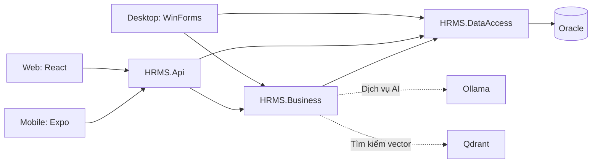

# Quản lý nhân sự (HRMS)

Dự án quản lý nhân sự gồm ứng dụng Desktop, Web và Mobile, dùng chung một số nghiệp vụ và cơ sở dữ liệu Oracle. Mã nguồn có các chức năng hồ sơ nhân viên, hợp đồng, chấm công, tính lương và xử lý yêu cầu của nhân viên.

Tài liệu được cập nhật ngày 01/10/2026 dựa trên mã nguồn trong workspace. Dự án vẫn đang được phát triển; build thành công hoặc một nhóm test đạt chưa đủ để kết luận toàn bộ hệ thống đã sẵn sàng vận hành.

## Bắt đầu đọc

- [Mục lục tài liệu](docs/README.md).
- [Cài đặt và chạy cục bộ](docs/installation.md).
- [Hiện trạng và những điểm còn cần xử lý](docs/current-status.md).
- [Kiến trúc và nguồn mã chính](docs/architecture.md).
- [Triển khai](docs/deployment.md).

## Kiến trúc


```mermaid
flowchart LR
    Desktop[Desktop: WinForms] --> Business[HRMS.Business]
    Desktop --> Data[HRMS.DataAccess]
    Web[Web: React] --> API[HRMS.Api]
    Mobile[Mobile: Expo] --> API
    API --> Business
    API --> Data
    Business --> Data
    Data --> Oracle[(Oracle)]
    Business -. Dịch vụ AI .-> Ollama[Ollama]
    Business -. Tìm kiếm vector .-> Qdrant[Qdrant]
```

Desktop gọi trực tiếp Business/DataAccess. Web và Mobile gọi REST API. API và Desktop đều có tham chiếu tới tầng dữ liệu; quy tắc nghiệp vụ chưa tập trung hoàn toàn trong một tầng duy nhất.

| Thành phần | Công nghệ trong cấu hình | Vai trò |
| --- | --- | --- |
| `HRMS.Desktop` | .NET Framework 4.7.2, WinForms, DevExpress 24.1 | Giao diện nghiệp vụ Desktop |
| `HRMS.Api` | .NET Framework 4.7.2, ASP.NET Web API 2 | Endpoint cho Web và Mobile |
| `HRMS.Business` | C#, namespace `Bu` | Nhân sự, chấm công, lương, bảo mật và AI |
| `HRMS.DataAccess` | EF 6.5.1, Oracle ManagedDataAccess 23.7.0, namespace `DA` | Model EDMX, context và truy cập Oracle |
| `HRMS.Web` | React 19, TypeScript, Vite 8, Ant Design 6 | Giao diện quản lý trên trình duyệt |
| `HRMS.Mobile` | Expo 57, React Native 0.86, TypeScript | Tra cứu cá nhân, gửi yêu cầu và màn hình phê duyệt quản lý |
| `HRMS.Tests` | NUnit, target `net472` | Có cả test độc lập và test dùng database |
| `HRMS.VectorDataSync` | Console C# | Đồng bộ dữ liệu phục vụ tìm kiếm vector |

Phiên bản chi tiết nằm trong các file project và `package.json`; các số trên không phải yêu cầu tương thích cho mọi máy.

## Các nhóm chức năng

- Nhân sự: hồ sơ, danh mục tổ chức, hợp đồng, khen thưởng/kỷ luật, nâng lương, điều chuyển và nghỉ việc.
- Chấm công: kỳ công, dữ liệu giờ vào/ra, lịch làm việc, phân đoạn thời gian, bất thường và công bố kết quả.
- Lương: công hưởng lương, phụ cấp, tăng ca, bảo hiểm, thuế, công đoàn, tạm ứng và chi tiết nguồn tính toán.
- Yêu cầu: nghỉ phép, điều chỉnh công, tăng ca và các luồng phê duyệt được cung cấp bởi API.
- Hệ thống: tài khoản, nhóm quyền, nhật ký và quản lý phiên đăng nhập.
- AI: luồng trả lời theo quy tắc, truy vấn dữ liệu và RAG dùng Ollama/Qdrant.

Phạm vi giao diện khác nhau giữa ba ứng dụng. Việc có màn hình hoặc endpoint chưa đồng nghĩa nghiệp vụ đó đã được kiểm thử đầy đủ.

## Cấu trúc thư mục

```text
QuanLyNhanSu/
├── HRMS.sln
├── HRMS.Api/
├── HRMS.Business/
├── HRMS.DataAccess/
├── HRMS.Desktop/
├── HRMS.Web/
├── HRMS.Mobile/
├── HRMS.Tests/
├── HRMS.VectorDataSync/
├── database/                 # Migration và các bộ dữ liệu kiểm thử
├── docs/                     # Hướng dẫn và tài liệu tham khảo theo chủ đề
├── prompts/                  # Prompt cục bộ, được Git bỏ qua
├── artifacts/                # Kết quả kiểm tra cục bộ, được Git bỏ qua
├── docker-compose.yml
└── build_deploy.ps1
```

## Chạy cục bộ

1. Chuẩn bị Visual Studio/MSBuild, .NET Framework 4.7.2 Developer Pack và thư viện DevExpress nếu chạy Desktop.
2. Chuẩn bị Oracle, cấu hình connection string và xác định schema/migration phù hợp. Xem [hướng dẫn cài đặt](docs/installation.md) trước khi khởi tạo database.
3. Mở `HRMS.sln`, restore các package cần thiết và build `HRMS.Api`.
4. Chạy `start_local_backend.bat` ở gốc repository. Script dùng IIS Express tại cổng `55463`.
5. Mở terminal khác để chạy Web:

```powershell
cd HRMS.Web
npm ci
npm run dev
```

Vite dùng cổng `5173` và proxy `/api` tới `http://localhost:55463`. Nếu `HRMS.Web/.env` có `VITE_API_BASE_URL`, giá trị đó sẽ được ưu tiên; file mẫu hiện dùng cổng khác nên cần đối chiếu trước khi sao chép.

Mobile có cấu hình URL riêng trong `HRMS.Mobile/src/config/index.ts`. Cần chọn địa chỉ của máy chạy API phù hợp với thiết bị/emulator. Xem [hướng dẫn Mobile](docs/mobile.md).

## Build và kiểm tra

```powershell
cd HRMS.Web
npm run build
npm run lint
npm run test
```

```powershell
cd HRMS.Mobile
npm run test
npx tsc --noEmit
```

Backend dùng MSBuild/Visual Studio cho project .NET Framework. `HRMS.Tests` có test thay đổi dữ liệu và schema; không chạy toàn bộ suite trên database đang sử dụng. Test có tham chiếu tới DLL API nên cần build API trước. Chi tiết kết quả đã quan sát và giới hạn nằm trong [hiện trạng](docs/current-status.md).

## Cấu hình và triển khai

- `.env.example` ở gốc là mẫu; không phải mọi biến trong đó đều được backend đọc. Ví dụ `HRMS_JWT_SECRET` được đọc trực tiếp, nhưng connection string và một số tham số khác vẫn được lấy từ cấu hình .NET.
- Docker Compose khai báo Oracle, Qdrant, Ollama và Web; không có service chạy API .NET Framework. Thư mục migration đang được mount chung vào init directory, có cả rollback và script nháp; cần rà soát trước khi dùng cho database mới.
- IIS có thể đặt API ở root hoặc sub-application. Hai cách bố trí làm URL khác nhau; cấu hình rõ base URL thay vì dựa vào việc thử lại sau lỗi 404.
- `build_deploy.ps1` chứa đường dẫn cố định tới `D:\QL_NS` và thao tác với bộ đóng gói `deploy_vps`. Chỉ chạy khi đã đọc script và xác định đúng đích.
- Không sử dụng mật khẩu/token mẫu làm cấu hình thật. README không liệt kê tài khoản hoặc mật khẩu đang sử dụng.

## Những điểm cần tiếp tục xử lý

Các điểm được nhận diện trong mã hiện tại gồm quyền truy cập AI qua GET, quyền xem/khóa kỳ lương, trạng thái audit dùng chung và sự khác nhau giữa duyệt lương với xác nhận chi trả. Các vấn đề này chưa được sửa trong đợt cập nhật tài liệu. Xem [danh sách hiện trạng](docs/current-status.md) để biết phạm vi và nguồn mã.

## English overview

This repository contains a WinForms desktop app, a React web app and an Expo mobile app backed by Oracle. Desktop uses the shared C# libraries directly; Web and Mobile use ASP.NET Web API 2. Development and verification are ongoing. Start with the [documentation index](docs/README.md) and [current status](docs/current-status.md).

## 日本語の概要

Oracle を利用する人事管理プロジェクトです。Desktop は共通の C# ライブラリを直接呼び出し、Web と Mobile は API を利用します。開発・検証は継続中です。[ドキュメント一覧](docs/README.md)と[現状](docs/current-status.md)を参照してください。
