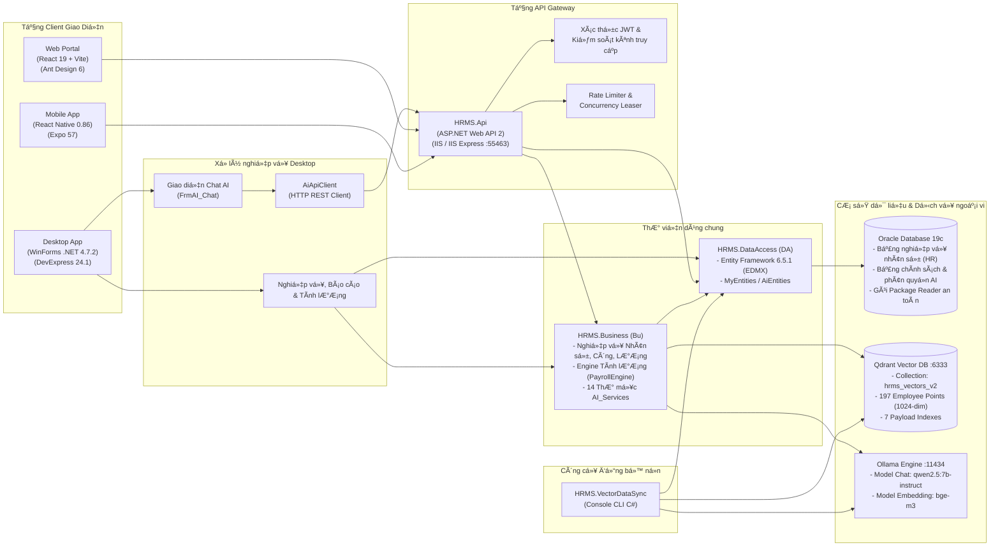
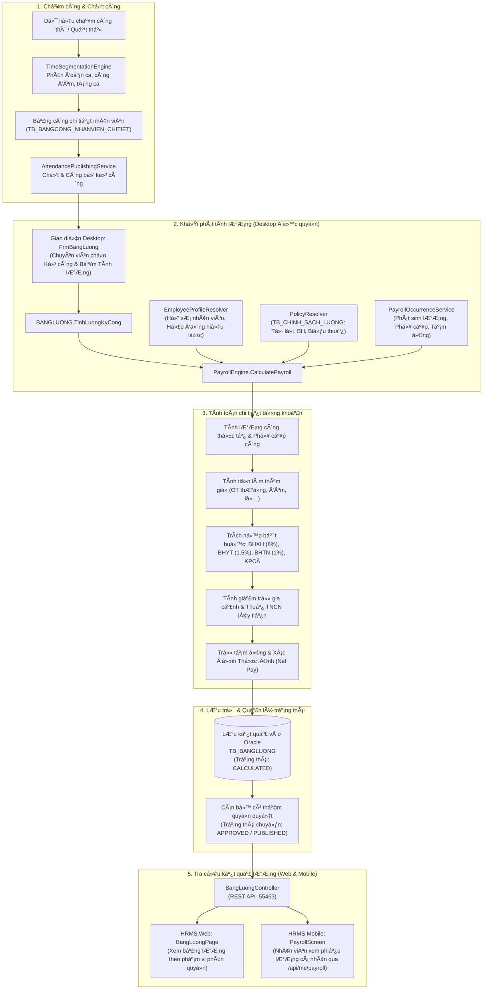
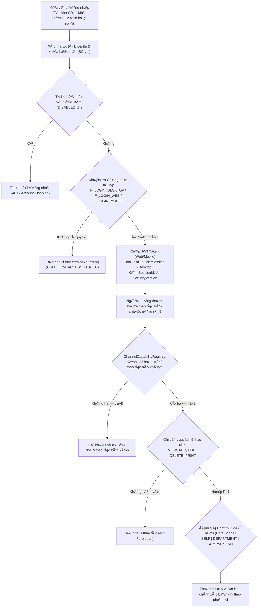
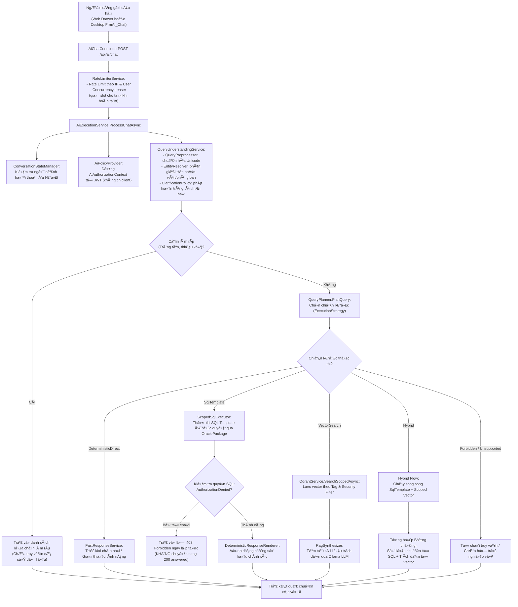
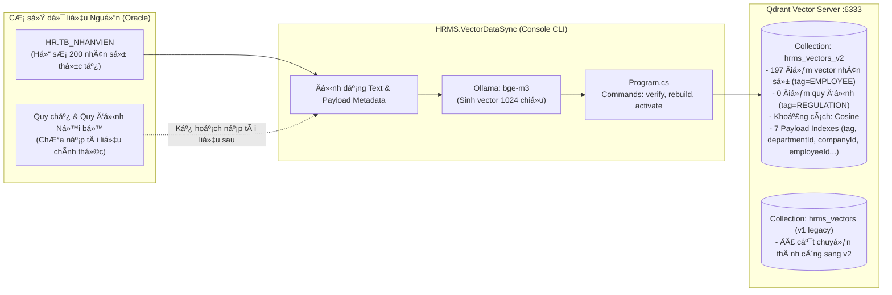

# Quản lý nhân sá»± (HRMS)

[Tiếng Việt](README.md) | [English](README.en.md) | [日本語](README.ja.md)

Hệ thống quản lý nhân sự đa nền tảng gồm Desktop (Windows WinForms), Web (React) và Mobile (React Native Expo), sử dụng cơ sở dữ liệu Oracle Database làm nguồn lưu trữ nghiệp vụ tập trung, kết hợp dịch vụ tìm kiếm vector Qdrant và mô hình ngôn ngữ Ollama phục vụ trợ lý tra cứu nội bộ.

Tài liệu được cập nhật ngày **09/10/2026** dựa trên mã nguồn, cấu hình và kết quả kiểm tra thực tế trong repository.

---

## Bốn mức trạng thái đánh giá trong tài liệu

Để đảm bảo tính trung thực và khách quan, các thông tin trong tài liệu này tuân thủ 4 mức trạng thái:
1. **Có trong mã nguồn:** Thành phần, màn hình, controller, service hoặc bảng dữ liệu đã tồn tại trong mã nguồn; chưa đồng nghĩa đã được kiểm thử toàn diện trên môi trường vận hành thực tế.
2. **Đã kiểm tra:** Đã chạy thử nghiệm với ngày ghi nhận, phạm vi lệnh và kết quả cụ thể; chỉ kết luận trong giới hạn bài kiểm tra đó.
3. **Chưa xác minh / còn hạn chế:** Chưa có môi trường thử nghiệm E2E đầy đủ, schema môi trường đích chưa đồng bộ hoặc còn tồn tại lỗi đã được ghi nhận trong các đợt rà soát.
4. **Hướng phát triển:** Tính năng, kiến trúc hoặc cải tiến được hoạch định trong tương lai; chưa triển khai trong mã nguồn hiện hành.

---

## Mục lục

1. [Giới thiệu và mục đích](#1-giới-thiệu-và-mục-đích)
2. [Đối tượng sử dụng](#2-đối-tượng-sử-dụng)
3. [Vai trò của Desktop, Web và Mobile](#3-vai-trò-của-desktop-web-và-mobile)
4. [Chức năng theo nghiệp vụ](#4-chức-năng-theo-nghiệp-vụ)
5. [Kiến trúc tổng thể](#5-kiến-trúc-tổng-thể)
6. [Công nghệ và vai trò](#6-công-nghệ-và-vai-trò)
7. [Cấu trúc repository](#7-cấu-trúc-repository)
8. [Các luồng nghiệp vụ](#8-các-luồng-nghiệp-vụ)
9. [Đăng nhập và phân quyền](#9-đăng-nhập-và-phân-quyền)
10. [AI, SQL và RAG](#10-ai-sql-và-rag)
11. [Dữ liệu và đồng bộ vector](#11-dữ-liệu-và-đồng-bộ-vector)
12. [Chuẩn bị và chạy cục bộ](#12-chuẩn-bị-và-chạy-cục-bộ)
13. [Kiểm tra và kết quả đã ghi nhận](#13-kiểm-tra-và-kết-quả-đã-ghi-nhận)
14. [Triển khai và vận hành](#14-triển-khai-và-vận-hành)
15. [Khó khăn và giới hạn hiện tại](#15-khó-khăn-và-giới-hạn-hiện-tại)
16. [Hướng phát triển](#16-hướng-phát-triển)
17. [Tài liệu liên quan](#17-tài-liệu-liên-quan)
18. [Bảo trì tài liệu và giấy phép](#18-bảo-trì-tài-liệu-và-giấy-phép)

---

## 1. Giới thiệu và mục đích

Dự án quản lý nhân sự gồm Desktop, Web và Mobile, sử dụng Oracle cho dữ liệu nghiệp vụ. Desktop khởi phát tính lương; Web và Mobile cung cấp các chức năng quản lý hoặc tra cứu theo quyền. Phần AI hỗ trợ tra cứu dữ liệu và tài liệu, hiện vẫn có các luồng cần hoàn thiện.

Hệ thống được xây dựng nhằm giải quyết các bài toán vận hành nhân sự cốt lõi:
- **Tập trung hóa hồ sơ và vòng đời nhân sự:** Quản lý thông tin ứng viên, tuyển dụng, hồ sơ nhân viên, hợp đồng lao động, khen thưởng, kỷ luật, nâng lương, điều chuyển và thôi việc.
- **Tự động hóa chấm công và phân đoạn giờ công:** Thu thập dữ liệu vào/ra, tính toán công chuẩn, công thực tế, làm đêm, nghỉ lễ, phép năm và phát hiện bất thường giờ làm.
- **Tính toán tiền lương theo chính sách:** Thực thi quy tắc tính lương dựa trên công thực tế, phụ cấp, tăng ca, các khoản trích nộp bắt buộc (BHXH, BHYT, BHTN, Kinh phí Công đoàn), thuế thu nhập cá nhân (TNCN), giảm trừ gia cảnh và tạm ứng lương.
- **Tự phục vụ nhân viên (ESS) và phê duyệt đa cấp:** Cho phép nhân viên gửi đơn xin nghỉ phép, tăng ca, bổ sung công và ứng lương trực tuyến; hỗ trợ cấp quản lý xét duyệt trên Web và Mobile.
- **Hỗ trợ hỏi đáp nội bộ bằng AI:** Tích hợp mô hình ngôn ngữ cục bộ và tìm kiếm ngữ nghĩa theo phạm vi bảo mật dữ liệu, cho phép tra cứu quy chế và thông tin nhân sự trong giới hạn quyền hạn được cấp.

---

## 2. Đối tượng sử dụng

1. **Chuyên viên Nhân sự (HR Specialist):**
   - Quản lý cơ cấu tổ chức (Công ty, Phòng ban, Bộ phận, Chức vụ).
   - Tiếp nhận hồ sơ, lập và ký hợp đồng lao động, theo dõi quá trình công tác, biến động nhân sự, khen thưởng, kỷ luật và quyết định thôi việc.
   - Thao tác chủ yếu trên giao diện Desktop và cổng Web quản trị.
2. **Chuyên viên Chấm công – Tiền lương (Payroll Specialist):**
   - Thiết lập ca làm việc, loại công, lịch nghỉ lễ và quy tắc chấm công.
   - Kiểm tra bảng chấm công chi tiết, xử lý bất thường và chốt/công bố kỳ công.
   - Khởi phát tính lương trên Desktop, kiểm tra các khoản trích nộp bảo hiểm, thuế, phụ cấp, phát sinh, đối soát bảng lương và quản lý trạng thái công bố chi trả.
3. **Cấp Quản lý / Trưởng bộ phận (Department Head / Manager):**
   - Giám sát tình hình chấm công, nhân sự trong bộ phận phụ trách.
   - Tiếp nhận và phê duyệt hoặc từ chối các yêu cầu nghỉ phép, làm thêm giờ, ứng lương và giải trình chấm công của cấp dưới qua Web hoặc Mobile.
4. **Nhân viên (Employee):**
   - Tra cứu hồ sơ cá nhân, hợp đồng hiện hành, dữ liệu chấm công hàng ngày và phiếu lương cá nhân của các kỳ đã được công bố.
   - Gửi yêu cầu xin nghỉ phép, đăng ký tăng ca, xin ứng lương và theo dõi trạng thái phê duyệt qua ứng dụng Web hoặc Mobile.
5. **Quản trị viên Hệ thống (System Administrator):**
   - Quản trị tài khoản, nhóm người dùng, ma trận phân quyền 3 nền tảng (Desktop, Web, Mobile) theo 5 hành vi thao tác (Xem, Thêm, Sửa, Xóa, In).
   - Quản trị phạm vi truy cập dữ liệu AI (Self, Department, Company, All), giám sát phiên đăng nhập và cấu hình tham số hệ thống.

---

## 3. Vai trò của Desktop, Web và Mobile

Ba nền tảng được phân định trách nhiệm rõ ràng nhằm đáp ứng các môi trường làm việc đặc thù:

```
+-----------------------------------------------------------------------------------+
|                               PHÂN ĐỊNH VAI TRÒ NỀN TẢNG                          |
+-----------------------------------------------------------------------------------+
|  HRMS.Desktop (Windows WinForms)                                                  |
|  - Vận hành nghiệp vụ chuyên sâu của phòng Nhân sự & Kế toán lương               |
|  - Nhập liệu hồ sơ, hợp đồng, danh mục tổ chức, biểu mẫu in ấn DevExpress         |
|  - NƠI DUY NHẤT KHỞI PHÁT TÍNH TOÁN KỲ LƯƠNG (FrmBangLuong -> PayrollEngine)       |
|  - Kết nối trực tiếp C# Business Library & DataAccess tới Oracle                  |
|  - Chat AI qua giao diện tích hợp gọi REST API (AiApiClient)                      |
+-----------------------------------------------------------------------------------+
|  HRMS.Web (React 19 + TypeScript + Ant Design)                                    |
|  - Cổng thông tin quản trị và vận hành dành cho quản lý và nhân sự                |
|  - Bảng điều khiển (Dashboard KPI), danh sách nhân viên, hợp đồng, bảng công      |
|  - Trung tâm phê duyệt đơn từ (ApprovalCenterPage)                                |
|  - Phân quyền kênh & thao tác (PhanQuyenModal), quản trị phạm vi AI               |
|  - Xem bảng lương đã công bố (chỉ đọc); KHÔNG khởi phát tính lương                |
|  - Trợ lý AI Copilot Drawer (hỏi đáp theo quyền đăng nhập)                        |
|  - 100% giao tiếp qua REST API (HRMS.Api) có xác thực JWT                         |
+-----------------------------------------------------------------------------------+
|  HRMS.Mobile (React Native + Expo)                                                |
|  - Ứng dụng tự phục vụ nhân viên (ESS) trên thiết bị di động cá nhân              |
|  - Xem hồ sơ cá nhân, bảng công tháng, phiếu lương cá nhân đã duyệt (api/me)      |
|  - Gửi đơn xin nghỉ phép, tăng ca, ứng lương                                      |
|  - Quản lý duyệt nhanh đơn từ cấp dưới (ManagerApprovalsScreen)                   |
|  - KHÔNG có tính năng khởi phát tính lương hoặc quản trị hệ thống                 |
|  - 100% giao tiếp qua REST API (HRMS.Api) có xác thực JWT                         |
+-----------------------------------------------------------------------------------+
```

---

## 4. Chức năng theo nghiệp vụ

### 4.1. Ma trận chức năng trên các nền tảng

| Phân hệ nghiệp vụ | Desktop | Web | Mobile | Quyền hạn yêu cầu | Trạng thái kỹ thuật |
| :--- | :---: | :---: | :---: | :---: | :--- |
| **Hồ sơ nhân sự** | Quản lý toàn diện | Quản lý & tra cứu | Xem hồ sơ cá nhân | `F_DM_NHANVIEN` | Có trong mã nguồn, Web/Mobile qua API |
| **Hợp đồng lao động** | Soạn thảo, in ấn, ký | Quản lý danh sách | Xem hợp đồng của mình | `F_NV_HOPDONG` | Có trong mã nguồn, tính lương đọc trực tiếp |
| **Danh mục tổ chức/ca** | Thiết lập toàn bộ | Tra cứu danh mục | Không hỗ trợ | `F_DM_*`, `F_CC_*` | Có trong mã nguồn trên Desktop & API |
| **Quản lý chấm công** | Import máy chấm công, chốt | Xem bảng công, KPI | Xem công cá nhân | `F_CC_BANGCONG` | Có trong mã nguồn; engine phân đoạn giờ |
| **Khởi phát tính lương** | **Khởi phát tính toán** | Không hỗ trợ | Không hỗ trợ | `F_CC_BANGLUONG` (Desktop) | Đã kiểm tra qua NUnit; WinForms gọi Engine |
| **Tra cứu bảng lương** | Xem chi tiết, in phiếu | Tra cứu theo quyền | Xem phiếu lương cá nhân | `F_CC_BANGLUONG`, `/me` | Có trong mã nguồn; Web/Mobile đọc qua API |
| **Phát sinh & điều chỉnh lương** | Nhập phát sinh, phụ cấp | Tra cứu theo kỳ | Không hỗ trợ | `F_CC_PHUCAP`, `F_CC_UNGLUONG` | Có trong mã nguồn trên Desktop |
| **Khen thưởng, kỷ luật** | Ban hành quyết định | Xem danh sách | Xem quyết định cá nhân | `F_NV_KHENTHUONG`, `KYLUAT` | Có trong mã nguồn |
| **Tự phục vụ nhân viên (ESS)** | Giới hạn | Nộp đơn, xem kết quả | Nộp đơn, xem kết quả | Token người dùng (`/api/me`) | Có trong mã nguồn; Web & Mobile hoạt động |
| **Phê duyệt đơn từ** | Không ưu tiên | Trung tâm phê duyệt | Phê duyệt nhanh | Quyền quản lý duyệt đơn | Có trong mã nguồn trên API, Web, Mobile |
| **Báo cáo & Thống kê** | In ấn DevExpress | Biểu đồ Dashboard | Dashboard thu gọn | `F_BC_BAOCAO`, `F_DB_*` | Có trong mã nguồn; Desktop in qua Reports |
| **Phân quyền & Tài khoản** | Quản lý tài khoản | Ma trận quyền 3 kênh | Không hỗ trợ | `F_SYSTEM_USER`, `PQ_CHUCNANG` | Đã kiểm tra 32/32 tests; batch API atomic |
| **Trợ lý AI & RAG** | Chat Form (qua API) | Chat Drawer (qua API) | Chưa tích hợp UI | `F_SYSTEM_AI` + Scope Grant | Đã kiểm tra 234 tests; cutover v2 |

### 4.2. Chi tiết các nhóm nghiệp vụ chính

#### A. Hồ sơ nhân sự và Hợp đồng lao động
- **Mục đích:** Lưu trữ lý lịch nhân viên, hồ sơ căn cước, trình độ, quá trình công tác; quản lý thời hạn hợp đồng, mức lương cơ bản, hệ số lương và các thỏa thuận phụ cấp.
- **Dữ liệu đầu vào:** Thông tin cá nhân, phòng ban, bộ phận, chức vụ, loại hợp đồng, lương đóng bảo hiểm, ngày hiệu lực và ngày hết hạn.
- **Thao tác chính:** Thêm mới hồ sơ, quét căn cước, ký hợp đồng mới, gia hạn hợp đồng, ban hành quyết định điều chuyển, nâng lương, khen thưởng, kỷ luật, chấm dứt hợp đồng.
- **Kết quả:** Bản ghi nhân viên trong `TB_NHANVIEN`, hồ sơ hợp đồng trong `TB_HOPDONG`, dữ liệu cung cấp trực tiếp cho `EmployeeProfileResolver` phục vụ tính lương.

#### B. Chấm công và Phân đoạn giờ
- **Mục đích:** Quản lý kỳ công hàng tháng, ghi nhận thời gian làm việc thực tế, chia tách chính xác công ngày, công đêm, tăng ca ngày thường, tăng ca chủ nhật và ngày lễ.
- **Dữ liệu đầu vào:** Dữ liệu quẹt thẻ từ máy chấm công, đơn xin nghỉ phép, đơn làm thêm giờ đã được duyệt.
- **Thao tác chính:** Cập nhật ngày công, xử lý ngoại lệ đi trễ/về sớm, tính toán theo công thức chuẩn thông qua `TimeSegmentationEngine`, công bố dữ liệu bảng công chi tiết qua `AttendancePublishingService`.
- **Kết quả:** Bảng công tổng hợp `TB_BANGCONG` và chi tiết ngày `TB_BANGCONG_NHANVIEN_CHITIET`.

#### C. Tính toán tiền lương (Quy trình cốt lõi)
- **Đặc tả khởi phát:** Quá trình tính toán lương **bắt buộc được khởi phát từ Desktop** (`FrmBangLuong` -> gọi `BANGLUONG.TinhLuongKyCong` -> gọi `PayrollEngine`).
- **Dữ liệu đầu vào:** Bảng công đã chốt, hợp đồng lao động hiệu lực, chính sách bảo hiểm và thuế trong `TB_CHINH_SACH_LUONG`, các khoản phát sinh lương (`TB_PHATSINH_LUONG`), tạm ứng (`TB_UNGLUONG`), phụ cấp (`TB_PHUCAP`).
- **Thao tác chính:**
  1. Kiểm tra trạng thái kỳ công (đã chốt công chưa).
  2. Nạp chính sách thuế/bảo hiểm hiệu lực thông qua `PolicyResolver`.
  3. Tính toán công nhật chuẩn, lương công thực tế, phụ cấp theo ngày công.
  4. Tính tiền làm thêm giờ (ngày thường, nghỉ tuần, lễ/tết).
  5. Tính toán các khoản trích theo lương của người lao động: BHXH (8%), BHYT (1.5%), BHTN (1%), Kinh phí công đoàn (theo quy định).
  6. Tính giảm trừ gia cảnh (bản thân, người phụ thuộc) và thuế TNCN theo biểu thuế lũy tiến từng phần.
  7. Trừ tạm ứng và các khoản giảm trừ khác; xác định Số tiền thực lĩnh (Net Pay).
- **Kết quả:** Dữ liệu lưu vào bảng `TB_BANGLUONG`. Web và Mobile chỉ đọc dữ liệu này qua `BangLuongController` và `MeController` khi kỳ lương đã được đánh dấu công bố (`APPROVED` hoặc `PUBLISHED`).

---

## 5. Kiến trúc tổng thể

### 5.1. Sơ đồ tương tác giữa các thành phần


```mermaid
flowchart LR
    subgraph Clients["Tầng Client Giao Diện"]
        D["Desktop App\n(WinForms .NET 4.7.2)\n(DevExpress 24.1)"]
        W["Web Portal\n(React 19 + Vite)\n(Ant Design 6)"]
        M["Mobile App\n(React Native 0.86)\n(Expo 57)"]
    end

    subgraph DesktopLogic["Xử lý nghiệp vụ Desktop"]
        D_Ops["Nghiệp vụ, Báo cáo & Tính lương"]
        D_AI["Giao diện Chat AI\n(FrmAI_Chat)"]
        D_Client["AiApiClient\n(HTTP REST Client)"]
    end

    subgraph ApiGateway["Tầng API Gateway"]
        API["HRMS.Api\n(ASP.NET Web API 2)\n(IIS / IIS Express :55463)"]
        JWT["Xác thực JWT &\nKiểm soát kênh truy cập"]
        RateLimit["Rate Limiter &\nConcurrency Leaser"]
    end

    subgraph CoreLibraries["Thư viện dùng chung"]
        BUS["HRMS.Business (Bu)\n- Nghiệp vụ Nhân sự, Công, Lương\n- Engine Tính lương (PayrollEngine)\n- 14 Thư mục AI_Services"]
        DA["HRMS.DataAccess (DA)\n- Entity Framework 6.5.1 (EDMX)\n- MyEntities / AiEntities"]
    end

    subgraph DataStorage["Cơ sở dữ liệu & Dịch vụ ngoại vi"]
        Oracle[("Oracle Database 19c\n- Bảng nghiệp vụ nhân sự (HR)\n- Bảng chính sách & phân quyền AI\n- Gói Package Reader an toàn")]
        Qdrant[("Qdrant Vector DB :6333\n- Collection: hrms_vectors_v2\n- 197 Employee Points (1024-dim)\n- 7 Payload Indexes")]
        Ollama["Ollama Engine :11434\n- Model Chat: qwen2.5:7b-instruct\n- Model Embedding: bge-m3"]
    end

    subgraph SyncTool["Công cụ đồng bộ nền"]
        Sync["HRMS.VectorDataSync\n(Console CLI C#)"]
    end

    %% Luồng Desktop nghiệp vụ
    D --> D_Ops
    D_Ops --> BUS
    D_Ops --> DA

    %% Luồng Desktop AI
    D --> D_AI
    D_AI --> D_Client
    D_Client --> API

    %% Luồng Web & Mobile
    W --> API
    M --> API

    %% Xử lý tại API
    API --> JWT
    API --> RateLimit
    API --> BUS
    API --> DA

    %% Tầng dữ liệu
    BUS --> DA
    DA --> Oracle

    %% AI Integrations
    BUS --> Ollama
    BUS --> Qdrant

    %% Sync Tool
    Sync --> DA
    Sync --> Ollama
    Sync --> Qdrant
```

### 5.2. Nguyên lý kiến trúc
- **Mô hình lai n-Tier:** Không phải kiến trúc microservice phân tán mà là mô hình n-tier truyền thống có chia sẻ thư viện. Desktop chia sẻ trực tiếp các assembly nghiệp vụ (`Bu.dll`, `DA.dll`), trong khi Web và Mobile bắt buộc đi qua cổng kiểm soát tập trung `HRMS.Api`.
- **Phân tách luồng AI của Desktop:** Giao diện Chat AI trên Desktop (`FrmAI_Chat`) **không** tự mở kết nối Oracle hay Qdrant để truy vấn mà đi qua `AiApiClient` gửi request HTTP tới `HRMS.Api`, đảm bảo mọi câu hỏi đều chịu sự kiểm soát của Rate Limiting, xác thực JWT và kiểm tra Scope Grant như Web.

---

## 6. Công nghệ và vai trò

| Công nghệ | Phiên bản cấu hình | Vai trò kỹ thuật trong dự án | Ràng buộc & Ghi chú |
| :--- | :--- | :--- | :--- |
| **C# / .NET Framework** | `v4.7.2` | Nền tảng backend cho API, Business, DataAccess, Desktop và VectorDataSync | Chạy trên Windows; biên dịch qua MSBuild của Visual Studio 2022 |
| **WinForms** | .NET 4.7.2 | Giao diện ứng dụng máy trạm Desktop cho cán bộ nhân sự | Đòi hỏi môi trường Windows; xử lý sự kiện client trực tiếp |
| **DevExpress** | `24.1` | Bộ giao diện nâng cao cho Desktop: GridView, TreeList, Ribbon, XtraReports | Cần bộ cài đặt và bản quyền DevExpress 24.1 khi phát triển |
| **ASP.NET Web API 2** | `5.2.9` | Cung cấp RESTful API cho Web, Mobile và Desktop AI Client | Lưu trữ trên IIS / IIS Express (cổng mặc định `55463`) |
| **Entity Framework** | `6.5.1` | ORM Database-First kết nối Oracle thông qua tệp EDMX | `MyEntities` (nghiệp vụ) và `AiEntities` (chỉ đọc view AI) |
| **Oracle Client** | `23.7.0` (Managed) | Driver .NET kết nối trực tiếp Oracle Database 19c | Sử dụng thư viện `Oracle.ManagedDataAccess` chính hãng |
| **Oracle Database** | 19c Enterprise / XE | Nguồn lưu trữ nghiệp vụ chính (HR schema) và chính sách bảo mật AI | Độc lập với Qdrant; mọi số liệu công - lương chuẩn nằm tại đây |
| **React** | `19.2.0` | Thư viện UI xây dựng ứng dụng Web SPA quản trị | Quản lý trạng thái bằng React Hooks; chia sẻ Theme Context |
| **TypeScript** | `~5.9.3` / TS 6 | Đảm bảo tính an toàn kiểu dữ liệu cho toàn bộ frontend Web | Biên dịch nghiêm ngặt qua `tsc -b` không phát sinh lỗi |
| **Vite** | `^8.0.0` | Công cụ build frontend và development server cho Web | Cổng mặc định `5173`; proxy `/api` sang backend IIS Express |
| **Ant Design** | `^6.3.0` | Bộ component giao diện doanh nghiệp cho Web (Table, Modal, Drawer, Form) | Tích hợp chế độ Dark/Light và hỗ trợ chuyển đổi đa ngôn ngữ |
| **Expo** | `~57.0.0` | Framework phát triển và đóng gói ứng dụng di động đa nền tảng | Hỗ trợ phát triển và chạy giả lập qua Expo CLI |
| **React Native** | `0.86.0` | Nền tảng di động cho Mobile Client | Ứng dụng tập trung vào tính năng ESS cho người lao động |
| **Qdrant Vector DB** | `v1.12.1` / `v1.19.0` | Cơ sở dữ liệu vector lưu trữ ngữ nghĩa hồ sơ nhân sự và tài liệu nội bộ | Collection mục tiêu: `hrms_vectors_v2` (1024 chiều, cosine) |
| **Ollama** | Local runtime | Cung cấp mô hình ngôn ngữ lớn (LLM) và mô hình vector hóa (Embedding) | Model chat: `qwen2.5:7b-instruct`; Model embedding: `bge-m3` |
| **NUnit** | `3.14.0` | Framework kiểm thử tự động cho hệ thống backend .NET | Tích hợp bộ chạy NUnit3TestAdapter cho Visual Studio & CLI |

---

## 7. Cấu trúc repository

```text
QuanLyNhanSu/
├── HRMS.sln                                # Solution chính chứa các project .NET
├── README.md                               # Hướng dẫn chính (Tiếng Việt)
├── README.en.md                            # Hướng dẫn Tiếng Anh (English)
├── README.ja.md                            # Hướng dẫn Tiếng Nhật (日本語)
│
├── HRMS.Desktop/                           # Ứng dụng Windows Forms (.NET Framework 4.7.2)
│   ├── FORM_NHANSU/                        # Màn hình quản lý hồ sơ, hợp đồng, khen thưởng
│   ├── FORM_CHAMCONG/                      # Màn hình bảng công, tính lương (FrmBangLuong), phụ cấp
│   ├── FORM_SYSTEM/                        # Màn hình tài khoản, phân quyền, cấu hình AI (FrmOllamaConfig)
│   ├── FORM_BAOCAO/ & Reports/             # Mẫu in ấn phiếu lương, bảng công DevExpress
│   └── Functions/                          # AiApiClient, AiBootstrap, cấu hình trạm
│
├── HRMS.Api/                               # Backend REST API (ASP.NET Web API 2)
│   ├── Controllers/                        # AiChat, BangLuong, ChamCong, Me, User, ScopeAdmin...
│   ├── Filters/                            # JwtAuthorize, RateLimitAttribute...
│   ├── Services/                           # RateLimiterService, JwtService...
│   └── App_Start/                          # WebApiConfig, RouteConfig, CorsHandler...
│
├── HRMS.Business/                          # Thư viện nghiệp vụ dùng chung (Namespace: Bu)
│   ├── CLASS_NHANSU/                       # Nghiệp vụ nhân viên, hợp đồng, phòng ban
│   ├── CLASS_CHAMCONG/                     # BANGLUONG (facade tính lương), TimeSegmentationEngine...
│   ├── CLASS_PAYROLL/                      # PayrollEngine, PolicyResolver, EmployeeProfileResolver...
│   ├── CLASS_SECURITY/                     # ChannelCapabilityRegistry, PlatformAccessGuard...
│   ├── CLASS_SYSTEM/                       # UserSession, SYS_USER, SYS_CONFIG...
│   ├── DTO/                                # Đối tượng truyền dữ liệu (Data Transfer Objects)
│   └── Services/AI_Services/               # 53 file C# phân bổ trong 14 thư mục chức năng:
│       ├── Bootstrap/                      # AiServiceLocator
│       ├── Configuration/                  # AiConfigurationCoordinator
│       ├── Chat/                           # AiExecutionService, ChatboxManager
│       ├── Understanding/                  # QueryUnderstandingService, EntityResolver, ClarificationPolicy...
│       ├── Planning/                       # QueryPlanner, ExecutionPlan
│       ├── Retrieval/                      # ScopedSqlExecutor, QdrantService, HybridRagService...
│       ├── Responses/                      # DeterministicResponseRenderer, RagSynthesizer, FastResponseService
│       ├── Providers/                      # OllamaService (LLM & Embedding HTTP client)
│       ├── Prompts/                        # JsonPromptManager (nạp prompt ứng dụng)
│       ├── Memory/                         # AiCacheCoordinator, ConversationStateManager...
│       ├── Security/                       # AiAuthorizationService, AiScopeEvaluator, ScopeGrantManagement...
│       ├── Indexing/                       # AiDataSyncHub, QdrantOutboxManager
│       ├── Interfaces/                     # Hợp đồng IVectorService, ILlmService, IScopedSqlExecutor...
│       └── Runtime/                        # SystemClockProvider, FakeClockProvider
│
├── HRMS.DataAccess/                        # Tầng kết nối dữ liệu Entity Framework 6 (Namespace: DA)
│   ├── QLNhanSu.edmx                       # Database-First Model (Oracle)
│   ├── MyEntities.cs                       # Context nghiệp vụ chính
│   └── MyEntities.ChannelRights.cs         # Phân quyền 3 kênh và bảng TB_SYS_RIGHT_CHANNEL
│
├── HRMS.Web/                               # Ứng dụng Web Quản trị (React 19 + TypeScript + Vite)
│   ├── src/pages/                          # DashboardPage, NhanVienPage, BangLuongPage, ApprovalCenterPage...
│   ├── src/components/                     # PhanQuyenModal, AiChatDrawer, CommandPaletteModal...
│   └── src/locales/                        # Bản dịch đa ngôn ngữ: vi, en, ja, ko, zh-CN
│
├── HRMS.Mobile/                            # Ứng dụng Di động Tự phục vụ (React Native Expo 57)
│   └── src/                                # Screens (Profile, Attendance, Payroll), Navigation, Api...
│
├── HRMS.VectorDataSync/                    # Console CLI quản trị và đồng bộ vector Qdrant
│   └── Program.cs                          # CLI: preflight, verify, rebuild, activate, reconcile...
│
├── HRMS.Tests/                             # Dự án kiểm thử NUnit 3 (net472)
│   ├── PlatformAccessAndSessionEnforcementTests.cs # Kiểm thử 32 kịch bản phân quyền nền tảng
│   ├── PostReviewRemediationVerificationTests.cs    # Kiểm thử cắt chuyển Qdrant v2 & coordinator
│   └── AntigravityUnifiedAiAndPermissionsVerificationTests.cs # Kiểm thử tích hợp AI & Scope
│
├── database/                               # Script cơ sở dữ liệu
│   ├── migrations/                         # Migration V1_0 đến V1_33 (DDL, DML, Rollback, Verify)
│   ├── realistic200/                       # Bộ dữ liệu mẫu 200 nhân sự thực tế
│   └── backups/                            # Bản sao lưu cấu hình và metadata
│
├── docs/                                   # Tài liệu kỹ thuật dự án (13 tài liệu hoạt động)
│   ├── README.md                           # Mục lục hướng dẫn chi tiết
│   ├── ai-services-guide.md                # Sổ tay chi tiết 53 file C# AI trong 14 thư mục
│   ├── ai-rag-and-account-permissions-guide.md # Hướng dẫn RAG & Phân quyền nền tảng
│   └── archive/                            # Nơi lưu trữ tài liệu kỹ thuật và báo cáo lịch sử
│
├── docker-compose.yml                      # Cấu hình container dịch vụ: Oracle, Qdrant, Ollama, Web
├── start_local_backend.bat                 # Script chạy IIS Express backend cổng 55463
└── build_deploy.ps1                        # Script build và đóng gói triển khai cục bộ
```

---

## 8. Các luồng nghiệp vụ

### 8.1. Luồng tính lương và đối soát công bố


```mermaid
flowchart TD
    subgraph AttendancePhase["1. Chấm công & Chốt công"]
        Raw["Dữ liệu chấm công thô / Quẹt thẻ"] --> Seg["TimeSegmentationEngine\nPhân đoạn ca, công đêm, tăng ca"]
        Seg --> Detail["Bảng công chi tiết nhân viên\n(TB_BANGCONG_NHANVIEN_CHITIET)"]
        Detail --> Pub["AttendancePublishingService\nChốt & Công bố kỳ công"]
    end

    subgraph DesktopPayroll["2. Khởi phát tính lương (Desktop độc quyền)"]
        Pub --> FrmBL["Giao diện Desktop: FrmBangLuong\n(Chuyên viên chọn Kỳ công & Bấm Tính lương)"]
        FrmBL --> BL_Facade["BANGLUONG.TinhLuongKyCong"]
        BL_Facade --> Engine["PayrollEngine.CalculatePayroll"]

        Profile["EmployeeProfileResolver\n(Hồ sơ nhân viên, Hợp đồng hiệu lực)"] --> Engine
        Policy["PolicyResolver\n(TB_CHINH_SACH_LUONG: Tỷ lệ BH, Biểu thuế)"] --> Engine
        Occur["PayrollOccurrenceService\n(Phát sinh lương, Phụ cấp, Tạm ứng)"] --> Engine
    end

    subgraph CalculationCore["3. Tính toán chi tiết từng khoản"]
        Engine --> Cal1["Tính lương công thực tế & Phụ cấp công"]
        Cal1 --> Cal2["Tính tiền làm thêm giờ (OT thường, đêm, lễ)"]
        Cal2 --> Cal3["Trích nộp bắt buộc: BHXH (8%), BHYT (1.5%), BHTN (1%), KPCĐ"]
        Cal3 --> Cal4["Tính giảm trừ gia cảnh & Thuế TNCN lũy tiến"]
        Cal4 --> Cal5["Trừ tạm ứng & Xác định Thực lĩnh (Net Pay)"]
    end

    subgraph PersistenceAndPublishing["4. Lưu trữ & Quản lý trạng thái"]
        Cal5 --> SaveDB[("Lưu kết quả vào Oracle\nTB_BANGLUONG\n(Trạng thái: CALCULATED)")]
        SaveDB --> Approve["Cán bộ có thẩm quyền duyệt\n(Trạng thái chuyển: APPROVED / PUBLISHED)"]
    end

    subgraph LookupPhase["5. Tra cứu kết quả lương (Web & Mobile)"]
        Approve --> API_BL["BangLuongController\n(REST API :55463)"]
        API_BL --> Web_BL["HRMS.Web: BangLuongPage\n(Xem bảng lương theo phạm vi phân quyền)"]
        API_BL --> Mob_BL["HRMS.Mobile: PayrollScreen\n(Nhân viên xem phiếu lương cá nhân qua /api/me/payroll)"]
    end
```

### 8.2. Quy trình xử lý yêu cầu và phê duyệt (ESS)
1. **Nhân viên lập đơn:** Người dùng mở Web (`ApprovalCenterPage`) hoặc Mobile (`LeaveRequestScreen`, `OvertimeRequestScreen`, `AdvanceSalaryScreen`), nhập thông tin (ngày nghỉ, lý do, số tiền ứng).
2. **Tiếp nhận tại API:** `MeController` tiếp nhận request, kiểm tra danh tính từ JWT, lưu bản ghi vào `TB_YEUCAU` với trạng thái `PENDING`.
3. **Thông báo quản lý:** Người quản lý trực tiếp nhận thông tin yêu cầu trong danh sách chờ duyệt.
4. **Phê duyệt / Từ chối:** Quản lý bấm Duyệt hoặc Từ chối kèm lý do. `ApprovalController` kiểm tra quyền phê duyệt, ghi nhận `APPROVED` hoặc `REJECTED`, ghi log audit và cập nhật dữ liệu liên quan (công, phép hoặc tạm ứng).

---

## 9. Đăng nhập và phân quyền

### 9.1. Ma trận bảo mật 3 tầng


```mermaid
flowchart TD
    Login["Yêu cầu Đăng nhập\n(Tài khoản + Mật khẩu + Kênh kết nối)"] --> Auth["Xác thực tài khoản & Khóa bảo mật (BCrypt)"]
    Auth --> ChkDisable{"Tài khoản bị\nvô hiệu hóa (DISABLED=1)?"}
    ChkDisable -- Có --> DenyLogin["Từ chối đăng nhập (401 / Account Disabled)"]

    ChkDisable -- Không --> ChkGate{"Kiểm tra Cổng nền tảng:\nF_LOGIN_DESKTOP / F_LOGIN_WEB / F_LOGIN_MOBILE"}
    ChkGate -- Không có quyền --> DenyPlatform["Từ chối truy cập nền tảng\n(PLATFORM_ACCESS_DENIED)"]

    ChkGate -- Được phép --> GenToken["Cấp JWT Token (Web/Mobile)\nHoặc tạo UserSession (Desktop)\nKèm SessionId, Jti, SecurityVersion"]

    GenToken --> ReqAction["Người dùng thực hiện thao tác trên chức năng (F_*)"]

    ReqAction --> ChkChannelSupport{"ChannelCapabilityRegistry:\nKênh có hỗ trợ thao tác này không?"}
    ChkChannelSupport -- Không hỗ trợ --> DenyCap["Vô hiệu hóa / Từ chối thao tác trên kênh"]

    ChkChannelSupport -- Có hỗ trợ --> ChkActionRight{"Chi tiết quyền 5 thao tác:\nVIEW, ADD, EDIT, DELETE, PRINT"}
    ChkActionRight -- Không có quyền --> DenyAction["Từ chối thao tác (403 Forbidden)"]

    ChkActionRight -- Hợp lệ --> EvalScope{"Đánh giá Phạm vi dữ liệu (Data Scope):\nSELF | DEPARTMENT | COMPANY | ALL"}
    EvalScope --> ExecSQL["Thực thi truy vấn lọc chính xác bản ghi theo phạm vi"]
```

### 9.2. Các nguyên tắc phân quyền cốt lõi
- **Quyền cha của kênh (Platform Gate):** `F_LOGIN_DESKTOP`, `F_LOGIN_WEB`, `F_LOGIN_MOBILE` đóng vai trò là "cổng kiểm soát" vào hệ thống. Nếu tài khoản bị tắt quyền cha của kênh nào, toàn bộ quyền con trên kênh đó đều bị vô hiệu hóa lập tức, kể cả đối với quản trị viên.
- **Fail-Closed Security (An toàn khi lỗi):** Tuyệt đối không kiểm tra quyền bằng so sánh chuỗi tên tài khoản `USERNAME == "admin"`. Mọi người dùng (kể cả Admin) đều phải có bản ghi quyền hợp lệ trong `TB_SYS_RIGHT_CHANNEL` hoặc `TB_AI_SCOPE_GRANT`.
- **Zero-Trust Session Guard:** Mọi request đều kiểm tra tính hợp lệ của phiên làm việc (`SessionId`, `Jti`, `TokenVersion`). Khi quyền bị thay đổi hoặc tài khoản bị khóa, `TokenVersion` tăng lên làm mất hiệu lực token ngay lập tức.
- **Atomic Batch Save:** Giao diện phân quyền `PhanQuyenModal` gọi endpoint lưu gộp đồng thời 3 kênh (`SaveBatchChannelPermissions`) trong một Transaction CSDL duy nhất, tránh tình trạng bất đồng bộ trạng thái khi lưu từng kênh.

---

## 10. AI, SQL và RAG

### 10.1. Sơ đồ xử lý hội thoại Copilot


```mermaid
flowchart TD
    UserQuery["Người dùng gửi câu hỏi\n(Web Drawer hoặc Desktop FrmAI_Chat)"] --> API_Chat["AiChatController: POST /api/ai/chat"]
    API_Chat --> RateGuard["RateLimiterService:\n- Rate Limit theo IP & User\n- Concurrency Leaser (giữ slot cho tới khi hoàn tất)"]

    RateGuard --> ExecService["AiExecutionService.ProcessChatAsync"]
    ExecService --> StateMgr["ConversationStateManager:\nKiểm tra ngữ cảnh hội thoại đa lượt"]
    ExecService --> AuthCtx["AiPolicyProvider:\nDựng AiAuthorizationContext từ JWT (không tin client)"]

    ExecService --> NLP["QueryUnderstandingService:\n- QueryPreprocessor: chuẩn hóa Unicode\n- EntityResolver: phân giải tên nhân viên/phòng ban\n- ClarificationPolicy: phát hiện trùng tên/mơ hồ"]

    NLP --> NeedClarify{"Cần làm rõ\n(Trùng tên, thiếu kỳ)?"}
    NeedClarify -- Có --> ReturnClarify["Trả về danh sách lựa chọn làm rõ\n(Chưa truy vấn cơ sở dữ liệu)"]

    NeedClarify -- Không --> Planner["QueryPlanner.PlanQuery:\nChọn chiến lược (ExecutionStrategy)"]

    Planner --> StrategySwitch{"Chiến lược thực thi?"}

    StrategySwitch -- DeterministicDirect --> FastResp["FastResponseService:\nTrả lời chào hỏi / Giới thiệu tính năng"]
    StrategySwitch -- SqlTemplate --> SqlExec["ScopedSqlExecutor:\nThực thi SQL Template được duyệt qua OraclePackage"]
    StrategySwitch -- VectorSearch --> VecExec["QdrantService.SearchScopedAsync:\nLọc vector theo Tag & Security Filter"]
    StrategySwitch -- Hybrid --> HybridExec["Hybrid Flow:\nChạy song song SqlTemplate + Scoped Vector"]
    StrategySwitch -- Forbidden / Unsupported --> DenyResp["Từ chối truy vấn / Chưa hỗ trợ nghiệp vụ"]

    SqlExec --> EvalPerm{"Kiểm tra quyền SQL:\nAuthorizationDenied?"}
    EvalPerm -- Bị từ chối --> RespForbidden["Trả về lỗi 403 Forbidden ngay lập tức\n(KHÔNG chuyển sang 200 answered)"]

    EvalPerm -- Thành công --> Renderer["DeterministicResponseRenderer:\nĐịnh dạng bảng số liệu chính xác"]
    VecExec --> Synthesizer["RagSynthesizer:\nTóm tắt tài liệu trích dẫn qua Ollama LLM"]
    HybridExec --> MergeResp["Tổng hợp Bằng chứng:\nSố liệu chuẩn từ SQL + Trích dẫn từ Vector"]

    Renderer --> FinalResp["Trả kết quả chuẩn xác về UI"]
    Synthesizer --> FinalResp
    MergeResp --> FinalResp
    FastResp --> FinalResp
    ReturnClarify --> FinalResp
    DenyResp --> FinalResp
```

### 10.2. Các quy tắc an toàn trong xử lý AI
- **Ngăn chặn SQL Injection tuyệt đối:** Loại bỏ hoàn toàn việc cho LLM tự sinh câu lệnh SQL tùy ý. Hệ thống chỉ sử dụng các mẫu SQL cố định (`SqlTemplate`) đã đăng ký trong `AiCapabilityCatalog`, truyền tham số bằng `OracleParameter` có định kiểu.
- **Fail-closed ở chiến lược Hybrid:** Trong luồng truy vấn lai (kết hợp SQL số liệu và Vector tài liệu), nếu nhánh SQL bị từ chối quyền hoặc gặp lỗi thực thi, hệ thống trả về ngay mã trạng thái `forbidden` (403) hoặc `error` (500), tuyệt đối không giấu lỗi để trả về 200.
- **Lọc Vector đa tầng (Security Filter):** Tìm kiếm vector trong Qdrant luôn áp dụng bộ lọc quyền hiệu lực:
  - `SELF`: Chỉ tìm thấy dữ liệu vector của chính nhân viên gọi truy vấn (`employeeId`).
  - `DEPARTMENT`: Chỉ tìm thấy nhân viên trong các phòng ban được phép (`departmentId`). Nhân viên chưa gán phòng ban (`departmentId <= 0`) không thể xem dữ liệu phòng ban của người khác.
  - `COMPANY` / `ALL`: Giới hạn theo công ty hoặc toàn quyền theo phạm vi quản trị.
- **Bảo toàn Slot Concurrency:** Hệ thống giữ chỗ thực thi (concurrency lease) trong `RateLimiterService` suốt thời gian LLM sinh văn bản và chỉ giải phóng sau khi request hoàn tất, bảo vệ tài nguyên máy chủ.

---

## 11. Dữ liệu và đồng bộ vector

### 11.1. Hiện trạng kho lưu trữ Vector (Qdrant)


```mermaid
flowchart LR
    subgraph SourceDB["Cơ sở dữ liệu Nguồn (Oracle)"]
        HR_NV["HR.TB_NHANVIEN\n(Hồ sơ 200 nhân sự thực tế)"]
        RegDocs["Quy chế & Quy định Nội bộ\n(Chưa nạp tài liệu chính thức)"]
    end

    subgraph SyncEngine["HRMS.VectorDataSync (Console CLI)"]
        CLI["Program.cs\nCommands: verify, rebuild, activate"]
        Chunker["Định dạng Text & Payload Metadata"]
        Embedder["Ollama: bge-m3\n(Sinh vector 1024 chiều)"]
    end

    subgraph QdrantTarget["Qdrant Vector Server :6333"]
        V2[("Collection: hrms_vectors_v2\n- 197 Điểm vector nhân sự (tag=EMPLOYEE)\n- 0 Điểm quy định (tag=REGULATION)\n- Khoảng cách: Cosine\n- 7 Payload Indexes (tag, departmentId, companyId, employeeId...)")]
        Legacy[("Collection: hrms_vectors (v1 legacy)\n- Đã cắt chuyển thành công sang v2")]
    end

    HR_NV --> Chunker
    Chunker --> Embedder
    Embedder --> CLI
    CLI --> V2

    RegDocs -. "Kế hoạch nạp tài liệu sau" .-> Chunker
```

### 11.2. Trạng thái quan sát thực tế (Ghi nhận 09/10/2026)
- **Collection hoạt động:** `hrms_vectors_v2` là collection mặc định được cấu hình trong `QdrantService.cs`.
- **Số lượng điểm vector:** Có chính xác **197 điểm vector** nhân viên hợp lệ (trên tổng số 200 nhân sự, do 2 nhân viên chưa gán phòng ban và 1 nhân viên thử việc chưa kích hoạt hồ sơ đầy đủ).
- **Trạng thái tài liệu quy chế:** Nhãn `tag = "REGULATION"` hiện có **0 điểm vector** (chưa nạp văn bản chính sách đã được duyệt). Khi người dùng hỏi về quy chế, AI trả lời trung thực là thiếu nguồn tài liệu thay vì bịa đặt quy định.
- **7 Payload Index tối ưu hóa:** Đã tạo index trường trên Qdrant cho: `tag` (keyword), `departmentId` (integer), `companyId` (integer), `employeeId` (integer), `domain` (keyword), `documentType` (keyword), `visibility_profile` (keyword).
- **Nguyên tắc đọc bất biến:** Hàm tìm kiếm `SearchScopedAsync` chỉ thực hiện lệnh `GET /collections/{name}` và không bao giờ tự ý gửi lệnh `PUT` để tạo collection khi đọc.

---

## 12. Chuẩn bị và chạy cục bộ

### 12.1. Yêu cầu môi trường
- **Hệ điều hành:** Windows 10 / 11 hoặc Windows Server 2019 / 2022.
- **Công cụ phát triển:** Visual Studio 2022 (bản Community, Professional hoặc Enterprise) kèm workload *.NET desktop development* và *.NET Framework 4.7.2 targeting pack*.
- **Bộ thư viện UI:** DevExpress V24.1 (bắt buộc để mở và build project `HRMS.Desktop`).
- **Cơ sở dữ liệu:** Oracle Database 19c (Local hoặc Docker) đã import schema `HR` và các bảng chính sách AI.
- **Node.js & npm:** Node.js phiên bản `>= 20.19.0` (khuyên dùng Node 20 LTS hoặc 22 LTS).
- **Dịch vụ AI:**
  - Ollama chạy cục bộ tại `http://localhost:11434` (đã kéo model: `ollama pull qwen2.5:7b-instruct` và `ollama pull bge-m3`).
  - Qdrant chạy tại `http://localhost:6333`.

### 12.2. Thứ tự khởi động các thành phần

#### Bước 1: Khởi động Cơ sở dữ liệu và AI Engine
Khởi động container hoặc dịch vụ Oracle, Ollama và Qdrant:
```powershell
# Kiểm tra dịch vụ Ollama
curl http://localhost:11434/api/tags

# Kiểm tra dịch vụ Qdrant
curl http://localhost:6333/collections
```

#### Bước 2: Cấu hình và Khởi động Backend API
1. Mở file [HRMS.Api/Web.config](HRMS.Api/Web.config), kiểm tra chuỗi kết nối Oracle trong `connectionStrings`:
   - `QLNhanSuEntities` (truy cập schema chính `HR`).
   - `AiEntities` (truy cập view AI).
2. Biên dịch solution qua Visual Studio hoặc chạy lệnh MSBuild:
   ```powershell
   & "C:\Program Files\Microsoft Visual Studio\2022\Enterprise\MSBuild\Current\Bin\MSBuild.exe" HRMS.Api\HRMS.Api.csproj /p:Configuration=Debug /v:m
   ```
3. Chạy backend bằng IIS Express thông qua script có sẵn tại thư mục gốc:
   ```powershell
   .\start_local_backend.bat
   ```
   *Backend API sẽ lắng nghe tại địa chỉ:* `http://localhost:55463`

#### Bước 3: Khởi động Web Quản trị
Mở cửa sổ dòng lệnh mới:
```powershell
cd HRMS.Web
npm ci
npm run dev
```
*Giao diện Web sẽ chạy tại:* `http://localhost:5173`. Tệp cấu hình Vite tự động proxy các request `/api` sang `http://localhost:55463`.

#### Bước 4: Khởi động Desktop App
1. Mở `HRMS.sln` trong Visual Studio 2022.
2. Đặt `HRMS.Desktop` làm Startup Project.
3. Nhấn **F5** hoặc **Ctrl + F5** để chạy ứng dụng.
4. Đăng nhập bằng tài khoản được cấp quyền Desktop (ví dụ: `ADMIN`).

#### Bước 5: Khởi động Mobile App (Tùy chọn)
Mở cửa sổ dòng lệnh mới:
```powershell
cd HRMS.Mobile
npm ci
npm run start
```
Sử dụng ứng dụng Expo Go trên điện thoại hoặc máy ảo Android/iOS để quét mã QR. Lưu ý cập nhật `API_BASE_URL` trong [HRMS.Mobile/src/config/index.ts](HRMS.Mobile/src/config/index.ts) thành IP mạng LAN của máy chạy API (không dùng `localhost` trên thiết bị thật).

---

## 13. Kiểm tra và kết quả đã ghi nhận

Dưới đây là các kết quả kiểm chứng thực tế đã chạy trên repository vào ngày **09/10/2026**:

| Hạng mục kiểm tra | Lệnh / Công cụ thực hiện | Phạm vi kiểm tra | Kết quả ghi nhận | Giới hạn đã xác định |
| :--- | :--- | :--- | :---: | :--- |
| **Phân quyền nền tảng (3 kênh)** | `dotnet test --filter "PlatformAccess..."` | 32 kịch bản phân quyền nền tảng, token version, wildcard star | **32/32 PASSED (100%)** | Test chạy offline trên mock context |
| **AI Security & RBAC** | `dotnet test --filter "Ai|Antigravity|Rate..."` | 234 test kiểm thử Prompt injection, Cache, Scope, Rate Limiter | **234/234 PASSED (100%)** | Dùng schema test và in-memory probe |
| **Qdrant v2 Cutover & Index** | `FollowupReviewProbe.exe` | 11 probe kiểm tra bộ lọc bảo mật, concurrency leaser, collection v2 | **11/11 PASSED (100%)** | Kiểm tra trực tiếp server Qdrant local |
| **Kiểm thử Web Frontend** | `npm test` trong `HRMS.Web` | 5 test suite: KPI, Intro, Carousel, AI Chatbot, Permission Modal | **5/5 SUITES PASSED** | Kiểm thử logic trên node test runner |
| **Biên dịch TypeScript** | `npx tsc -b` trong `HRMS.Web` | Toàn bộ codebase TypeScript của ứng dụng Web | **0 LỖI (Build Succeeded)** | Đảm bảo tính toàn vẹn kiểu dữ liệu |
| **Biên dịch Backend C#** | MSBuild cho Business, Api, Tests | Mã nguồn C# toàn dự án sau tái cấu trúc 14 thư mục AI | **0 LỖI (Build Succeeded)** | 53 file C# AI được bảo toàn nguyên vẹn |
| **Kiểm tra dữ liệu Qdrant** | HTTP GET `/collections/hrms_vectors_v2` | Kiểm tra số lượng point vector và 7 index trường payload | **197 points nhân sự, 0 point quy chế** | Cần quy trình nạp quy chế đã duyệt |

---

## 14. Triển khai và vận hành

- **Môi trường Backend:** Máy chủ Windows Server 2019/2022 cài đặt IIS 10, cấu hình Application Pool chế độ `.NET CLR Version v4.0.30319`, Pipeline Mode: *Integrated*.
- **Môi trường Web:** Biên dịch tĩnh qua `npm run build` sinh thư mục `dist/`, triển khai trên IIS (kèm URL Rewrite) hoặc Nginx làm reverse proxy.
- **Biến môi trường và Cấu hình bảo mật:**
  - `HRMS_JWT_SECRET`: Khóa bí mật ký token JWT (tối thiểu 32 ký tự, đặt trong biến môi trường máy chủ).
  - Chuỗi kết nối Oracle đặt trong file cấu hình máy chủ, mã hóa bằng `aspnet_regiis` khi đưa lên production.
  - Cấu hình CORS: Giới hạn chính xác domain của cổng Web quản trị, không dùng wildcard `*`.
- **Dữ liệu sao lưu:**
  - Định kỳ sao lưu Oracle Database qua tiện ích `expdp` (tệp `HR_BACKUP.DMP`).
  - Định kỳ tạo snapshot dữ liệu Qdrant qua API `POST /collections/{name}/snapshots`.

---

## 15. Khó khăn và giới hạn hiện tại

1. **Kiến trúc công nghệ không đồng nhất:** Hệ thống kết hợp giữa .NET Framework 4.7.2 cũ (WinForms, Web API 2) và ngăn xếp hiện đại (React 19, TypeScript, Expo 57). Không có một công cụ build duy nhất cho toàn bộ hệ thống; việc thiết lập môi trường mới đòi hỏi cài đặt cả Visual Studio, DevExpress và Node.js.
2. **Khởi phát tính lương phụ thuộc máy trạm Desktop:** Do toàn bộ engine tính lương sâu và các biểu mẫu báo cáo DevExpress gắn liền với `HRMS.Desktop`, việc tính lương hiện tại bắt buộc phải thực hiện trên máy tính cài đặt Windows có bản quyền DevExpress.
3. **Cấu hình phân tán:** Các tham số kết nối nằm rải rác ở `Web.config`, `App.config`, `.env` và bảng `TB_CONFIG` trong CSDL, đòi hỏi quản trị viên phải kiểm tra kỹ lưỡng khi đổi địa chỉ máy chủ.
4. **Kho tài liệu vector quy chế còn thiếu:** Dữ liệu vector hiện tại mới chỉ phản ánh thông tin nhân sự (`tag=EMPLOYEE`), chưa có kho văn bản quy định, quy chế công ty chính thức (`tag=REGULATION=0`). AI sẽ từ chối trả lời hoặc báo thiếu nguồn khi hỏi sâu về chính sách nội bộ.
5. **Đồng bộ sự kiện vector chưa hoàn toàn bền vững (Outbox):** Cơ chế outbox hiện tại còn dựa trên bộ nhớ RAM và hàng đợi nội bộ; khi ứng dụng khởi động lại đột ngột, một số sự kiện thay đổi dữ liệu nhân sự có thể cần lệnh đồng bộ thủ công (`HRMS.VectorDataSync --reconcile`).
6. **Mức độ bao phủ đa ngôn ngữ:** Dù cổng Web đã có tệp ngôn ngữ hoàn chỉnh (Việt, Anh, Nhật, Hàn, Trung), giao diện Desktop WinForms vẫn hiển thị tiếng Việt là chủ đạo; một số nhãn chức năng trong cơ sở dữ liệu cũ còn tồn tại lỗi mã hóa ký tự.

---

## 16. Hướng phát triển

| Thứ tự ưu tiên | Hướng phát triển | Mục tiêu & Giá trị mang lại | Điều kiện nghiệm thu |
| :---: | :--- | :--- | :--- |
| **P1** | **Số hóa & nạp kho văn bản quy chế (Approved Corpus Ingestion)** | Nạp tài liệu nội bộ (nội quy, quy chế lương, quy định phép) vào Qdrant để AI trả lời chính xác quy định. | Điểm vector `tag=REGULATION` > 0; câu hỏi quy chế có citation nguồn hợp lệ. |
| **P1** | **Hoàn thiện bền vững hóa Outbox (Durable Outbox)** | Lưu các sự kiện thay đổi nhân sự vào bảng outbox Oracle trong cùng Transaction nghiệp vụ. | Worker tự động khôi phục và đồng bộ lại vector sau khi tiến trình khởi động lại mà không mất sự kiện. |
| **P2** | **Cổng API kích hoạt tính lương an toàn** | Nghiên cứu đóng gói `PayrollEngine` thành dịch vụ độc lập để Web có thể kích hoạt tính lương có giám sát. | Có endpoint POST tính lương được kiểm soát quyền chặt chẽ; audit đầy đủ và khóa tranh chấp kỳ công. |
| **P2** | **Chuẩn hóa đa ngôn ngữ toàn diện trên Desktop** | Hoàn thiện cơ chế nạp resource đa ngôn ngữ trên các form Desktop và làm sạch dữ liệu mã hóa nhãn cũ. | Chuyển đổi ngôn ngữ trên Desktop không phát sinh lỗi hiển thị ký tự (mojibake). |
| **P3** | **Đánh giá hiện đại hóa nền tảng (.NET Core / .NET 9)** | Đánh giá tính khả thi chuyển đổi backend ASP.NET Web API 2 sang ASP.NET Core để chạy được trên Linux container. | Báo cáo đánh giá tương thích, kế hoạch tái cấu trúc EF sang EF Core và lộ trình thực thi không làm gián đoạn hệ thống. |

---

## 17. Tài liệu liên quan

Tất cả các tài liệu kỹ thuật chi tiết được lưu trữ trong thư mục [docs/](docs/):
- [Mục lục tài liệu](docs/README.md): Tổng quan toàn bộ hệ thống tài liệu.
- [Sổ tay Kiến trúc & Vận hành AI Services](docs/ai-services-guide.md): Bản đồ chi tiết 53 file C# AI trong 14 thư mục chức năng, sơ đồ và hướng dẫn mở rộng.
- [Hướng dẫn RAG & Phân quyền nền tảng](docs/ai-rag-and-account-permissions-guide.md): Chi tiết cơ chế phân quyền 3 kênh và an toàn AI.
- [Hướng dẫn Cài đặt & Khởi chạy](docs/installation.md): Chi tiết các bước thiết lập môi trường cho lập trình viên mới.
- [Kiến trúc hệ thống](docs/architecture.md): Tham khảo cấu trúc các tầng và luồng dữ liệu.
- [Hiện trạng hệ thống](docs/current-status.md): Đánh giá hiện trạng và các điểm cần xử lý kỹ thuật.
- [Quy trình Công – Lương](docs/payroll.md): Diễn giải công thức, chính sách và đối soát dữ liệu lương.
- [Hướng dẫn Ứng dụng Di động](docs/mobile.md): Thiết lập, cấu hình API và đóng gói Mobile Expo.
- [Thư mục Lưu trữ Lịch sử](docs/archive/): Lưu trữ các báo cáo kiểm thử và tài liệu thiết kế các giai đoạn trước.

---

## 18. Bảo trì tài liệu và giấy phép

### 18.1. Quy tắc đồng bộ 3 ngôn ngữ
Tài liệu hướng dẫn tại thư mục gốc repository được duy trì đồng bộ ở ba phiên bản ngôn ngữ:
- [Tiếng Việt (README.md)](README.md) - Tài liệu tham chiếu gốc.
- [English (README.en.md)](README.en.md) - Phiên bản Tiếng Anh với cùng cấu trúc 18 mục và bảng kỹ thuật tương đương.
- [日本語 (README.ja.md)](README.ja.md) - Phiên bản Tiếng Nhật sử dụng thuật ngữ nghiệp vụ tự nhiên, giữ nguyên bối cảnh luật lao động và bảo hiểm Việt Nam.

Mọi thay đổi lớn về kiến trúc, chức năng hoặc kết quả kiểm thử bắt buộc phải được cập nhật đồng thời trên cả ba phiên bản.

### 18.2. Bản quyền và Giấy phép
Mã nguồn dự án là sản phẩm phần mềm nội bộ doanh nghiệp. Hệ thống có sử dụng các thư viện mã nguồn mở theo giấy phép tương ứng (MIT, Apache 2.0) và thành phần giao diện thương mại DevExpress (yêu cầu giấy phép thương mại hợp lệ khi triển khai sản xuất). Không tự ý sao chép hoặc phân phối mã nguồn ra bên ngoài khi chưa được sự cho phép bằng văn bản của chủ sở hữu dự án.
