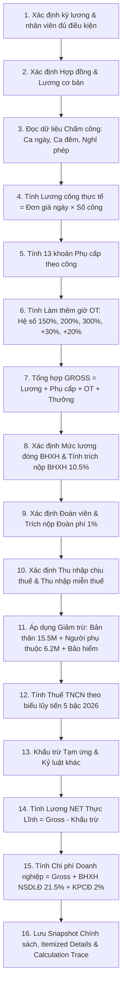

# HƯỚNG DẪN TÍNH LƯƠNG TOÀN DIỆN CHO NGƯỜI MỚI BẮT ĐẦU (PAYROLL CALCULATION GUIDE)

> **Mục tiêu**: Giải thích toàn bộ cơ chế tính lương của hệ thống bằng ngôn ngữ đơn giản, trực quan, dễ hiểu nhất dành cho người chưa từng biết về kế toán, tiền lương hay lập trình. Mọi công thức đều gắn liền với căn cứ pháp lý thực tế tại Việt Nam năm 2026.

---

## 1. PAYROLL (TÍNH LƯƠNG) LÀ GÌ?

**Payroll (Tính lương)** là quá trình tự động thu thập thông tin làm việc của một nhân viên trong một tháng (hợp đồng, ngày công, giờ làm thêm, các khoản trợ cấp, tiền ứng, các khoản đóng bảo hiểm và thuế nhà nước) để tính ra chính xác:
1. **Số tiền thực tế công ty phải trả vào tài khoản ngân hàng của nhân viên** (gọi là *Thực lĩnh* hay *Net pay*).
2. **Số tiền công ty phải thay mặt nhân viên nộp cho Nhà nước** (Bảo hiểm xã hội, Bảo hiểm y tế, Bảo hiểm thất nghiệp, Đoàn phí công đoàn, Thuế thu nhập cá nhân).
3. **Tổng số tiền mà công ty thực tế phải chi trả cho vị trí nhân sự đó** (gọi là *Tổng chi phí doanh nghiệp* hay *Employer total cost*).

---

## 2. GROSS VÀ NET LÀ GÌ?

Để hiểu bảng lương, cần phân biệt rõ hai khái niệm cốt lõi:

* **Lương GROSS (Tổng thu nhập trước giảm trừ)**:  
  Là toàn bộ số tiền mà nhân viên kiếm được trong tháng từ sức lao động của mình, bao gồm: lương theo ngày công thực tế + tất cả các khoản phụ cấp + tiền làm thêm giờ (tăng ca) + tiền thưởng/hỗ trợ khác.
  $$\text{GROSS} = \text{Lương công thực tế} + \text{Phụ cấp} + \text{Tiền tăng ca} + \text{Thưởng/Khoản cộng khác}$$

* **Lương NET (Thực lĩnh về tài khoản)**:  
  Là số tiền thực tế đổ về tài khoản nhân viên sau khi đã trừ đi các nghĩa vụ bắt buộc (bảo hiểm xã hội NLĐ đóng, đoàn phí công đoàn, thuế thu nhập cá nhân, tiền đã ứng trước, các khoản phạt kỷ luật nếu có).
  $$\text{NET} = \text{GROSS} - (\text{BHXH} + \text{BHYT} + \text{BHTN}) - \text{Đoàn phí} - \text{Thuế TNCN} - \text{Tạm ứng} - \text{Khấu trừ khác}$$

---

## 3. DỮ LIỆU ĐẦU VÀO CỦA MỘT KỲ TÍNH LƯƠNG

Hệ thống tính lương không tự phát minh ra số tiền, mà đọc từ các nguồn dữ liệu gốc:
1. **Hồ sơ nhân viên & Hợp đồng lao động (`TB_HOPDONG`)**: Mức lương cơ bản thỏa thuận, hệ số lương, loại hợp đồng, ngày bắt đầu và ngày hết hạn.
2. **Dữ liệu chấm công thực tế (`TB_BANGCONG_CHITIET`)**: Nhân viên đi làm bao nhiêu ngày, làm ca ngày bao nhiêu công, làm ca đêm bao nhiêu công, nghỉ phép hưởng lương bao nhiêu ngày, nghỉ không lương bao nhiêu ngày.
3. **Dữ liệu làm thêm giờ (`TB_TANGCA`)**: Số giờ tăng ca ngày thường, số giờ tăng ca chủ nhật, số giờ tăng ca ngày lễ/tết, tăng ca đêm, tình trạng chứng từ phê duyệt (`CHUNG_TU_PHE_DUYET`).
4. **Danh mục phụ cấp (`TB_PHUCAP`, `TB_NHANVIEN_PHUCAP`)**: 13 loại phụ cấp theo hợp đồng hoặc chính sách (nhà ở, đi lại, thâm niên, chuyên cần, chức vụ, ăn ca, v.v.).
5. **Hồ sơ tham gia bảo hiểm & công đoàn (`TB_NHANVIEN_BAOHIEM_THAM_GIA`, `TB_NHANVIEN_CONG_DOAN_THAM_GIA`)**: Nhân viên có thuộc diện đóng BHXH bắt buộc không, có tham gia tổ chức công đoàn không.
6. **Hồ sơ thuế & người phụ thuộc (`TB_NHANVIEN_THUE`, `TB_NGUOI_PHU_THUOC`)**: Tình trạng cư trú (cư trú hay không cư trú), số người phụ thuộc đã đăng ký và có hiệu lực mã số thuế.
7. **Tạm ứng & Kỷ luật (`TB_UNGLUONG`, `TB_KHENTHUONG_KYLUAT`)**: Tiền nhân viên đã ứng giữa tháng, các khoản tiền phạt vi phạm nội quy lao động đã được duyệt.

---

## 4. QUY TRÌNH MỘT THÁNG LƯƠNG ĐI QUA HỆ THỐNG (PAYROLL PIPELINE)

---

## 5. GIẢI THÍCH CHI TIẾT TỪNG BƯỚC TÍNH TOÁN

### Bước 1: Xác định Lương cơ bản & Đơn giá ngày (Daily Rate)
* **Nguồn dữ liệu (Input)**: Mức lương thỏa thuận trên Hợp đồng (`TB_HOPDONG.LUONG_THOA_THUAN`), Số ngày công chuẩn của tháng (`TB_KYCONG.SO_NGAY_CONG`).
* **Quy tắc (Rule)**: Chính sách lương áp dụng (`TB_CHINH_SACH_LUONG`).
* **Công thức (Formula)**:
  $$\text{Đơn giá ngày (Daily Rate)} = \frac{\text{Lương cơ bản}}{\text{Số công chuẩn (ví dụ 26 ngày)}}$$
* **Ví dụ minh họa (ILLUSTRATIVE)**:
  Lương cơ bản = $13.000.000$ đ, Tháng có $26$ ngày công chuẩn:
  $$\text{Daily Rate} = \frac{13.000.000}{26} = 500.000 \text{ đ/ngày}$$

### Bước 2: Tính Lương theo công thực tế (Actual Work Salary)
* **Nguồn dữ liệu (Input)**: Bảng chấm công chi tiết (`TB_BANGCONG_NHANVIEN_CHITIET`).
* **Công thức (Formula)**:
  $$\text{Lương ca ngày} = \text{Daily Rate} \times \text{Công làm ngày}$$
  $$\text{Lương ca đêm} = \text{Daily Rate} \times \text{Công làm đêm} \times 1.30 \quad (\text{phụ cấp thêm ít nhất 30\% theo Điều 98 BLLĐ})$$
  $$\text{Lương công thực tế} = \text{Lương ca ngày} + \text{Lương ca đêm}$$

### Bước 3: Tính Phụ cấp (Allowances)
Hệ thống quản lý đầy đủ 13 loại phụ cấp trong danh mục `TB_PHUCAP`:
1. Phụ cấp nhà ở
2. Phụ cấp đi lại
3. Phụ cấp gia đình
4. Phụ cấp người phụ thuộc
5. Phụ cấp chức vụ (Trách nhiệm)
6. Phụ cấp chứng chỉ (Ngoại ngữ, tin học)
7. Phụ cấp kỹ năng
8. Phụ cấp khu vực
9. Phụ cấp chuyên cần
10. Phụ cấp thâm niên
11. Phụ cấp làm việc tại nhà (WFH)
12. Phụ cấp đặc biệt
13. Phụ cấp khác

* **Quy tắc phân loại**:
  - *Chịu thuế TNCN*: Phụ cấp chức vụ, thâm niên, chứng chỉ, kỹ năng.
  - *Miễn thuế TNCN trong hạn mức*: Phụ cấp ăn ca (tối đa theo quy định), phụ cấp đi lại, phụ cấp nhà ở (vượt 15% tổng thu nhập mới tính thuế).
  - *Đóng bảo hiểm*: Các khoản phụ cấp lương cố định theo quy định đóng BHXH của Luật BHXH.

### Bước 4: Tính Làm thêm giờ (Overtime - OT)
Căn cứ Điều 98 Bộ luật Lao động 2019 và Nghị định 253/2026/NĐ-CP:
* **Đơn giá giờ (Hourly Base)**:
  $$\text{Hourly Base} = \frac{\text{Daily Rate}}{8 \text{ giờ}}$$
* **Hệ số làm thêm**:
  - Ngày làm việc bình thường: $150\%$
  - Ngày nghỉ hàng tuần (Chủ nhật): $200\%$
  - Ngày lễ, tết, ngày nghỉ có hưởng lương: $300\%$
  - Làm việc ban đêm: Phụ cấp thêm $30\%$ tiền lương giờ ban ngày
  - Làm thêm giờ ban đêm: Được trả thêm $20\%$ tiền lương tính theo đơn giá ban ngày của ngày đó
* **Xử lý thuế TNCN đối với OT (Điều 26 Nghị định 253/2026/NĐ-CP)**:
  - Phần tiền lương trả cao hơn do làm thêm giờ (ví dụ $50\%$ chênh lệch ngày thường, $100\%$ chênh lệch chủ nhật, $200\%$ chênh lệch ngày lễ) được **MIỄN THUẾ TNCN**.
  - Phần tiền lương giờ cơ bản ($100\%$) vẫn tính vào thu nhập chịu thuế bình thường.
  - Trường hợp giờ OT vượt quy định pháp luật (trên 40h/tháng hoặc 200h-300h/năm) thì toàn bộ phần vượt bị tính vào thu nhập chịu thuế.

### Bước 5: Tính Bảo hiểm bắt buộc (BHXH, BHYT, BHTN)
Căn cứ Luật Bảo hiểm xã hội số 41/2024/QH15 và Nghị định 293/2025/NĐ-CP:
* **Mức lương đóng BHXH**:
  - Không thấp hơn mức lương tối thiểu vùng (Vùng I: 5.310.000 đ, Vùng II: 4.730.000 đ, Vùng III: 4.140.000 đ, Vùng IV: 3.700.000 đ).
  - Không cao hơn 20 lần mức tham chiếu bảo hiểm (Mức tham chiếu: 2.340.000 đ giai đoạn 01/01/2026 - 30/06/2026, trần là 46.800.000 đ; từ 01/07/2026 mức tham chiếu là 2.530.000 đ, trần là 50.600.000 đ).
* **Tỷ lệ trích nộp**:
  | Loại bảo hiểm | Người lao động đóng | Doanh nghiệp đóng | Tổng cộng |
  | :--- | :---: | :---: | :---: |
  | BHXH (Hưu trí, tử tuất, ốm đau, thai sản) | $8,0\%$ | $17,0\%$ | $25,0\%$ |
  | BHYT (Khám chữa bệnh) | $1,5\%$ | $3,0\%$ | $4,5\%$ |
  | BHTN (Thất nghiệp) | $1,0\%$ | $1,0\%$ | $2,0\%$ |
  | TNLĐ - BNN (Tai nạn lao động) | $0\%$ | $0,5\%$ | $0,5\%$ |
  | **Tổng cộng trích nộp** | **$10,5\%$** | **$21,5\%$** | **$32,0\%$** |

### Bước 6: Tính Đoàn phí Công đoàn (Union Fee)
Căn cứ Điều lệ Công đoàn Việt Nam và Nghị định về kinh phí công đoàn:
* **Đoàn viên công đoàn (NLĐ)**: Nộp đoàn phí $= 1\%$ mức lương làm căn cứ đóng BHXH. Mức thu tối đa không quá $10\%$ mức lương tối thiểu vùng. Người không tham gia công đoàn đóng $0$ đ.
* **Doanh nghiệp (NSDLĐ)**: Đóng kinh phí công đoàn $= 2\%$ quỹ lương làm căn cứ đóng BHXH (doanh nghiệp nộp, không trừ vào lương nhân viên).

### Bước 7: Tính Thuế thu nhập cá nhân (PIT)
Căn cứ Luật Thuế TNCN số 109/2025/QH15 (áp dụng từ kỳ tính thuế 2026):
1. **Thu nhập chịu thuế**:
   $$\text{TNCT} = \text{GROSS} - \text{Các khoản phụ cấp/thu nhập miễn thuế}$$
2. **Các khoản giảm trừ**:
   - Giảm trừ bản thân: $15.500.000$ đ/tháng ($186.000.000$ đ/năm).
   - Giảm trừ người phụ thuộc: $6.200.000$ đ/người/tháng ($74.400.000$ đ/người/năm).
   - Các khoản đóng bảo hiểm bắt buộc ($10,5\%$).
3. **Thu nhập tính thuế (TNTT)**:
   $$\text{TNTT} = \text{TNCT} - (\text{Giảm trừ bản thân} + \text{Giảm trừ người phụ thuộc} + \text{Giảm trừ bảo hiểm})$$
   *(Nếu TNTT $\le 0$, Thuế TNCN $= 0$ đ)*.
4. **Biểu thuế lũy tiến từng phần 5 bậc mới năm 2026**:
   | Bậc thuế | Thu nhập tính thuế tháng | Thu nhập tính thuế năm | Thuế suất |
   | :---: | :--- | :--- | :---: |
   | **1** | Đến $10$ triệu đồng | Đến $120$ triệu đồng | $5\%$ |
   | **2** | Trên $10$ đến $30$ triệu đồng | Trên $120$ đến $360$ triệu đồng | $10\%$ |
   | **3** | Trên $30$ đến $60$ triệu đồng | Trên $360$ đến $720$ triệu đồng | $20\%$ |
   | **4** | Trên $60$ đến $100$ triệu đồng | Trên $720$ đến $1.200$ triệu đồng | $30\%$ |
   | **5** | Trên $100$ triệu đồng | Trên $1.200$ triệu đồng | $35\%$ |

---

## 6. DANH MỤC CÁC TRƯỜNG DỮ LIỆU BẢNG LƯƠNG (FIELD GLOSSARY)

| Tên trường (Field) | Tên hiển thị dễ hiểu | Ý nghĩa nghiệp vụ | Nguồn gốc | Hiển thị ở đâu |
| :--- | :--- | :--- | :--- | :--- |
| `IDBL` | Mã bảng lương | Định danh duy nhất bản ghi | Oracle Sequence | Màn hình Admin/Audit |
| `MANV` | Mã nhân viên | Mã nhân sự của người lao động | `TB_NHANVIEN` | Tất cả UI |
| `HOTEN` | Họ và tên | Tên nhân viên | `TB_NHANVIEN` | Tất cả UI |
| `CONG_CHUAN` | Ngày công chuẩn | Số ngày làm việc định mức trong tháng | `TB_KYCONG` | Bảng tổng hợp & Phiếu lương |
| `CONG_THUCTE` | Ngày công thực tế | Tổng số ngày nhân viên thực tế đi làm | `TB_BANGCONG_CHITIET` | Bảng tổng hợp & Phiếu lương |
| `CONG_LAMNGAY` | Công làm ban ngày | Số ngày làm ca ngày tiêu chuẩn | `TB_BANGCONG_CHITIET` | Chi tiết chấm công |
| `CONG_LAMDEM` | Công làm ban đêm | Số ca làm đêm (22h - 6h) | `TB_BANGCONG_CHITIET` | Chi tiết chấm công |
| `DAILY_RATE` | Đơn giá 1 ngày công | Tiền lương cơ bản của 1 ngày làm việc | Lương cơ bản / Công chuẩn | Chi tiết lương |
| `LUONG_CONG_THUCTE` | Lương ngày công | Tiền lương nhận được theo số ngày đi làm | Daily Rate × Công thực tế | Lương thu nhập |
| `PHUCAP_CONG_THUCTE` | Tổng tiền phụ cấp | Tổng 13 khoản phụ cấp nhận được | Danh mục `TB_PHUCAP` | Lương thu nhập |
| `TIEN_TANGCA` | Tiền làm thêm giờ | Tiền làm thêm ca ngày, đêm, chủ nhật, lễ | Bảng `TB_TANGCA` | Lương thu nhập & Thẻ OT |
| `TONG_CONG` | Tổng thu nhập (GROSS) | Toàn bộ tiền nhân viên kiếm được trong tháng | Tổng các khoản cộng | Cột Gross tất cả giao diện |
| `LUONG_BHXH` | Lương đóng bảo hiểm | Căn cứ tính các khoản trích bảo hiểm | Hợp đồng & chính sách trần/sàn | Chi tiết bảo hiểm |
| `TIEN_BHXH` | Trích nộp BHXH | $8\%$ BHXH nhân viên đóng | $8\% \times$ Lương BHXH | Khoản giảm trừ |
| `TIEN_BHYT` | Trích nộp BHYT | $1,5\%$ BHYT nhân viên đóng | $1,5\% \times$ Lương BHXH | Khoản giảm trừ |
| `TIEN_BHTN` | Trích nộp BHTN | $1,0\%$ BHTN nhân viên đóng | $1,0\% \times$ Lương BHXH | Khoản giảm trừ |
| `TIEN_CONG_DOAN` | Đoàn phí công đoàn | $1\%$ đoàn phí người lao động đóng | Chính sách công đoàn | Khoản giảm trừ |
| `THUE_TNCN` | Thuế TNCN khấu trừ | Thuế TNCN phải nộp tháng này | Biểu lũy tiến 5 bậc | Khoản giảm trừ & Thẻ thuế |
| `HOAN_THUE` | Hoàn thuế TNCN | Số tiền thuế được hoàn lại nếu có | Quyết toán/điều chỉnh | Chi tiết thuế |
| `TIEN_TAMUNG` | Tiền tạm ứng | Tiền đã ứng trước trong kỳ | Bảng `TB_UNGLUONG` | Khoản giảm trừ |
| `KHOAN_TRU_KHAC` | Khấu trừ khác | Kỷ luật, tiền phạt vi phạm nội quy | `TB_KHENTHUONG_KYLUAT` | Khoản giảm trừ |
| `THUC_LINH` | Thực lĩnh (NET) | Số tiền thực chuyển vào tài khoản | Gross - Tổng khấu trừ | Highlight card lớn |
| `TONG_CHI_PHI_NSDLD` | Tổng chi phí công ty | Gross + BHXH công ty nộp + KPCĐ | Gross + 21,5% BH + 2% KPCĐ | Thẻ Doanh nghiệp (HR/Admin) |
| `IS_LEGACY` | Cờ dữ liệu lịch sử | Phân biệt dữ liệu cũ và chuẩn 2026 | Schema version | Badge trạng thái |

---

## 7. CÁCH ĐỌC CALCULATION TRACE (TRUY VẾT CÔNG THỨC)

Bất kỳ số tiền nào hiển thị trên giao diện đều có thể trả lời câu hỏi: **"Con số này từ đâu mà ra?"**.
Khi người dùng mở phần **"Cách tính lương & thuế"** (hoặc tab **Calculation Trace** trên Web):
1. **Lương thực tế**: Hiển thị rõ `Đơn giá ngày × Số công thực tế` (ví dụ: `500.000 đ × 24 công = 12.000.000 đ`).
2. **Tiền làm thêm giờ (OT)**: Phân rã từng ca tăng ca: `Ngày làm thêm`, `Số giờ`, `Hệ số 150%/200%/300%`, `Đơn giá giờ`, `Chứng từ phê duyệt`.
3. **Bảo hiểm xã hội**: Hiển thị `Mức lương làm căn cứ đóng BHXH` (đã so sánh với trần 20 lần mức tham chiếu và sàn tối thiểu vùng) $\times$ `Tỷ lệ 8%`.
4. **Thuế TNCN**: Hiển thị từng bước:
   - Thu nhập chịu thuế: Tổng thu nhập trừ các khoản phụ cấp miễn thuế.
   - Các khoản giảm trừ: Bản thân (15,5 triệu) + Người phụ thuộc (6,2 triệu/người) + BHXH.
   - Thu nhập tính thuế còn lại.
   - Bảng tính từng bậc lũy tiến (Bậc 1: bao nhiêu tiền $\times 5\%$, Bậc 2: bao nhiêu tiền $\times 10\%$, v.v.).

---

## 8. SỰ KHÁC NHAU GIỮA DỮ LIỆU LỊCH SỬ (LEGACY) VÀ CHUẨN MỚI (PRODUCTION)

* **Dữ liệu lịch sử (Legacy - các kỳ lương trước năm 2026, ví dụ bản ghi IDBL = 1934)**:
  - Được sinh ra theo quy trình cũ của hệ thống.
  - Mang tính **bất biến tuyệt đối (immutable)**: Hệ thống cấm chỉnh sửa, cấm ghi đè, cấm "làm đẹp" dữ liệu lịch sử.
  - Trên giao diện được gắn nhãn màu cam: `Dữ liệu lịch sử (Legacy)`.
* **Dữ liệu chuẩn sản xuất (Production - từ kỳ 202601 trở đi)**:
  - Được tính toán bởi duy nhất một **Payroll Engine chuẩn**.
  - Lưu đầy đủ 16 section dữ liệu: chi tiết từng phụ cấp, chi tiết bảo hiểm 2 chiều (NLĐ & NSDLĐ), chi tiết đoàn phí, biểu thuế lũy tiến 5 bậc, kiểm tra tuân thủ làm thêm giờ, snapshot chính sách và calculation trace.
  - Trên giao diện được gắn nhãn màu xanh: `Quy chuẩn sản xuất (Production)`.

---

## 9. CÁC TRƯỜNG HỢP HỆ THỐNG TỪ CHỐI TÍNH LƯƠNG (FAIL-FAST ERRORS)

Hệ thống được thiết kế theo nguyên tắc an toàn cao nhất, sẽ **ngay lập tức dừng tính lương và báo lỗi cụ thể** (không âm thầm dùng giá trị mặc định để che đậy lỗi) trong các trường hợp sau:
1. **Nhân viên không có Hợp đồng lao động có hiệu lực**: Không thể xác định được mức lương cơ bản và chế độ đãi ngộ.
2. **Thiếu dữ liệu chấm công kỳ công**: Kỳ công chưa được chốt hoặc thiếu bảng chấm công chi tiết của nhân viên.
3. **Không tìm thấy Bộ chính sách có hiệu lực**: Không có chính sách lương, chính sách BHXH, chính sách công đoàn hoặc chính sách thuế TNCN tương ứng với ngày tính lương.
4. **Xảy ra trùng lặp chính sách (Ambiguous Policy)**: Có từ 2 bộ chính sách cùng có hiệu lực tại một thời điểm (được kiểm soát bởi Trigger và Code guard).
5. **Dữ liệu người phụ thuộc không hợp lệ**: Ngày bắt đầu giảm trừ lớn hơn ngày kết thúc, hoặc thiếu mã số thuế người phụ thuộc khi chính sách yêu cầu.
6. **Làm thêm giờ chưa có chứng từ phê duyệt**: Khi quy định công ty bắt buộc OT phải có phê duyệt trước khi chi trả.
7. **Bảng lương đã được chốt/khóa (`KHOA = 1` hoặc `TRANG_THAI = 'APPROVED'`)**: Ngăn chặn tính toán lại làm sai lệch số liệu đã chi trả.

---

## 10. CÂU HỎI THƯỜNG GẶP (FAQ CHO NGƯỜI DÙNG)

**Q1: Tại sao lương cơ bản trong hợp đồng là 15 triệu nhưng tháng này tôi chỉ nhận thực lĩnh 12 triệu?**  
*Trả lời*: Lương cơ bản là mức thỏa thuận trước khi khấu trừ. Thực lĩnh bị giảm đi do: (1) Bạn có thể nghỉ 1-2 ngày không hưởng lương, (2) Khấu trừ 10,5% tiền đóng BHXH, BHYT, BHTN, (3) Khấu trừ đoàn phí công đoàn (nếu là đoàn viên), (4) Khấu trừ thuế TNCN, (5) Bạn đã tạm ứng lương giữa tháng. Bạn có thể mở thẻ "Các khoản giảm trừ" để xem chi tiết từng đồng bị trừ.

**Q2: Phụ cấp ăn trưa của tôi có bị trừ thuế thu nhập cá nhân không?**  
*Trả lời*: Theo quy định pháp luật hiện hành, phụ cấp tiền ăn ca trong định mức quy định của Bộ LĐ-TB&XH là khoản thu nhập **miễn thuế**. Chỉ phần tiền ăn vượt quá định mức (nếu công ty chi thêm) mới bị tính thuế TNCN.

**Q3: Tôi và đồng nghiệp cùng mức lương cơ bản 20 triệu, tại sao tiền thuế TNCN của tôi lại ít hơn đồng nghiệp?**  
*Trả lời*: Mức thuế TNCN phụ thuộc vào số người phụ thuộc bạn đã đăng ký giảm trừ gia cảnh. Năm 2026, mỗi người phụ thuộc hợp pháp giúp bạn giảm trừ thêm $6.200.000$ đ/tháng tiền thu nhập chịu thuế. Nếu bạn nuôi 2 con nhỏ, bạn được giảm thêm $12.400.000$ đ/tháng, do đó số thuế phải nộp sẽ thấp hơn đáng kể so với người chưa đăng ký người phụ thuộc.

**Q4: Tiền làm thêm giờ (tăng ca) có bị đóng BHXH không?**  
*Trả lời*: Không. Tiền làm thêm giờ là khoản chi trả theo kết quả công việc phát sinh ngoài giờ tiêu chuẩn, không phải là lương hay phụ cấp lương cố định ghi trong hợp đồng, nên **không phải trích đóng BHXH**.

**Q5: Tại sao trên ứng dụng Mobile tôi không thấy tổng chi phí công ty phải trả cho tôi?**  
*Trả lời*: Ứng dụng Mobile dành cho nhân viên (Employee Self-Service) tập trung hiển thị các thông tin liên quan trực tiếp đến quyền lợi của bạn (Lương Gross, Các khoản khấu trừ từ lương của bạn, Lương thực lĩnh Net). Các khoản bảo hiểm doanh nghiệp nộp thêm ($21,5\%$) và kinh phí công đoàn ($2\%$) thuộc về chi phí vận hành nội bộ của công ty, được bảo mật và chỉ hiển thị trên giao diện quản trị của bộ phận Nhân sự và Ban Giám đốc.
