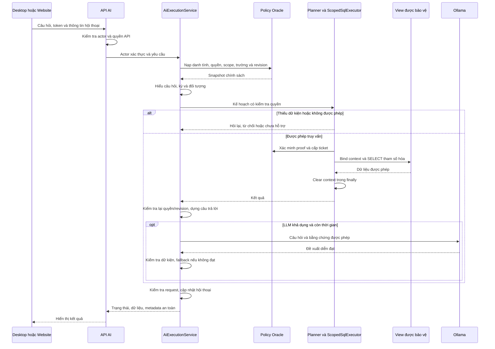

# Hướng dẫn luồng AI/RAG và phân quyền tài khoản

Cập nhật theo source ngày 08/10/2026.

Tài liệu dành cho người quản trị và người bảo trì HRMS: giải thích đường gọi AI, cách cấp quyền, nguồn dữ liệu và cách chẩn đoán lỗi. Ba trạng thái cần phân biệt: **theo source**, **cần kiểm tra khi chạy**, **thiết kế cần hoàn thiện**. Chưa xác nhận database, bản API đang phục vụ và ứng dụng đang mở cùng phiên bản source. Có file, migration hay test không chứng minh tính năng đã chạy trên môi trường thật.

Phạm vi lượt này chỉ viết hướng dẫn/prompt; không đổi code ứng dụng, quyền, cấu hình thật hoặc database. Ví dụ cấp quyền là minh họa, không phải quyền ADMIN đã được xác minh.

## Mục lục

1. [Khái niệm](#1-những-khái-niệm-cần-phân-biệt).
2. [Đường gọi và ma trận file đang dùng](#2-file-nào-thực-sự-được-dùng).
3. [Database và nguồn quyền](#3-database-và-nguồn-quyền).
4. [Đăng nhập và quyền thao tác](#4-đăng-nhập-và-quyền-thao-tác).
5. [Luồng một câu hỏi AI](#5-một-câu-hỏi-ai-đi-qua-những-bước-nào).
6. [Capability](#6-capability-theo-catalog).
7. [Scope và trường](#7-scope-và-quyền-trường).
8. [Vector và đồng bộ](#8-vector-và-đồng-bộ-phần-có-phần-chưa-nối).
9. [Hội thoại, cache, dữ liệu tạm](#9-hội-thoại-cache-và-dữ-liệu-tạm).
10. [Cấp quyền tài khoản/nhóm](#10-cấp-quyền-tài-khoảnnhóm).
11. [UI ba nền tảng](#11-ui-ba-nền-tảng-cần-hoàn-thiện).
12. [Dịch và mã hóa](#12-dịch-và-lỗi-mã-hóa).
13. [Cấu hình dùng chung](#13-cấu-hình-ai-chung-và-địa-chỉ).
14. [Chẩn đoán ảnh ADMIN](#14-chẩn-đoán-ảnh-admin).
15. [Thông báo](#15-thông-báo-cần-thống-nhất).
16. [Nghiệm thu](#16-nghiệm-thu).
17. [Tài liệu liên quan](#17-tài-liệu-liên-quan).
18. [Kiểm thử và đánh giá bảo mật đa nền tảng](#18-kiểm-thử-và-đánh-giá-bảo-mật-đa-nền-tảng).
19. [Khắc phục cảnh báo bảo mật, SSRF, Batch API và đa ngôn ngữ](#19-khắc-phục-cảnh-báo-bảo-mật-ssrf-batch-api-và-đa-ngôn-ngữ-09102026).
20. [Đồng bộ quyền ADMIN và khắc phục không nhất quán phiên đăng nhập](#20-đồng-bộ-quyền-admin-và-khắc-phục-không-nhất-quán-phiên-đăng-nhập-09102026).
21. [Khắc phục triệt để hardcode, lỗ hổng phân quyền và hoàn thiện migration CSDL](#21-khắc-phục-triệt-để-hardcode-lỗ-hổng-phân-quyền-và-hoàn-thiện-migration-csdl-09102026).
22. [Bảo vệ tài nguyên với Rate Limiting, Concurrency Control, Object-Level Authorization và CORS Hardening](#22-bảo-vệ-tài-nguyên-với-rate-limiting-concurrency-control-object-level-authorization-và-cors-hardening-09102026).

## 1. Những khái niệm cần phân biệt

| Khái niệm | Câu hỏi cần trả lời | Ví dụ |
| --- | --- | --- |
| Tài khoản | Ai gửi yêu cầu? | TB_SYS_USER.IDUSER |
| Nhân viên | Tài khoản gắn hồ sơ nào? | Mapping tài khoản–nhân viên, MANV |
| Nền tảng/kênh | Được dùng ứng dụng nào? | DESKTOP, WEB, MOBILE |
| Chức năng | Được dùng nghiệp vụ nào? | F_DM_NHANVIEN |
| Hành động | Được làm gì? | Xem, Thêm, Sửa, Xóa, In |
| Capability AI | Được thực hiện loại tra cứu nào? | EMPLOYEE_LOOKUP, PAYROLL_SUMMARY |
| Scope AI | Được xem dòng dữ liệu nào? | SELF, DEPARTMENT, COMPANY, ALL |
| Chính sách trường | Được xem/sử dụng thuộc tính nào? | FULL, MASK, DENY |
| Readiness | Đủ điều kiện hoạt động chưa? | Mapping, view, package, model |
| Quyền quản trị | Được sửa cấu hình/quyền nào? | Khác quyền dùng chat |

Nhóm nghiệp vụ Nhân sự/Chấm công/Danh mục không thay thế ba nhóm nền tảng. Tên ADMIN, nhãn Super Admin và menu hiện đủ không chứng minh AI được xem toàn bộ dữ liệu. Helper frontend có đường nhận diện quản trị để mở UI; backend phải xác minh chính sách thật.

Theo yêu cầu dự án, tính lương thuộc Desktop; Website/Mobile xem dữ liệu lương được phép công bố. AI chỉ tra cứu, không tự tính/sửa/duyệt/công bố lương. Các nghiệp vụ khác có quyền riêng.

## 2. File nào thực sự được dùng

### 2.1. Cách kiểm tra và giới hạn

Đã đối chiếu entry point UI, API route, constructor mặc định, service locator, call site và Compile Include trong csproj. Tìm source ứng dụng/công cụ/test, bỏ bin/obj. Đây là đường có thể đi tới **theo source**, chưa phải trace của tiến trình đang chạy.

Cần phân biệt: file tồn tại; file được biên dịch; class đăng ký locator; có caller từ ứng dụng; method đã chạy trên bản deploy. Locator dùng Lazy, đăng ký không tự sử dụng. Test gọi class riêng không chứng minh UI gọi class đó. File chứa nhiều class có thể vẫn cần dù một class legacy không dùng.

### 2.2. Đường chat Website và Desktop

```text
Website:
App.tsx -> AiChatDrawer -> POST /api/ai/chat
  -> AiChatController.Chat -> GetExecutionService
  -> AiServiceLocator.GetService<AiExecutionService>
  -> AiExecutionService.ProcessChatAsync

Desktop:
MainForm -> FormManager mở FrmAI_Chat
  -> ChatboxManager có remoteChatHandler
  -> AiApiClient.SendChatAsync -> POST /api/ai/chat
  -> cùng AiExecutionService phía API
```

AiChatDrawer còn gọi `/ai/status` và POST `/ai/reset`. MainLayout mở drawer; App.tsx render. FrmAI cũng có remote manager và mở FrmAI_Chat. ChatboxManager còn nhánh local khi không truyền remote handler; hai form production đã đọc truyền remote handler nên nhánh local không phải đường chính.

MainForm gọi AiBootstrap.EnsureOllama; hiện thăm dò backend bằng AiApiClient, không khởi động Ollama local. StopOllama là no-op giữ dịch vụ dùng chung.

### 2.3. Các nhánh phải kiểm tra riêng

| Luồng | Đường gọi theo source | Giới hạn |
| --- | --- | --- |
| Dashboard Desktop | FrmAI -> AiApiClient.GetDashboardAsync -> `/api/ai/dashboard` | Controller tự tạo policy/planner/scoped executor, không qua ProcessChatAsync |
| Status | `/api/ai/status` -> IsOllamaOnline + OracleAiReadinessProbe | Public status không chứng minh quyền từng actor |
| Reset | `/api/ai/reset` -> execution service -> session manager | Cần xác minh actor/hội thoại |
| Scope Desktop | FrmUser/frmGroup -> FrmAiScopeGrantDetail -> quản trị scope | Service/repository quản trị trực tiếp |
| Scope API | `/api/admin/ai-scope` -> quản trị scope -> Oracle repository | Có API, chưa thấy UI Web chuyên sửa scope trong entry point đã tìm |
| Đồng bộ nhân viên | NHANVIEN -> AiDataSyncHub -> QdrantOutboxManager -> QdrantService | Có thể trong tiến trình gọi Business, kể cả Desktop |
| Reconcile vector | POST `/api/ai/reconcile` -> QdrantOutboxManager | Có ghi/đồng bộ, không dùng làm test kết nối |
| Outbox status | GET `/api/ai/outbox-status` -> singleton manager | Khởi tạo singleton có thể tạo thư mục/file và chạy worker |
| Vector tool | HRMS.VectorDataSync/Program.cs -> IVectorService -> Add | Nạp một lượt; không phải worker Oracle outbox dài hạn |

### 2.4. Ma trận thành phần

File viết ngắn nằm dưới `HRMS.Business/Services/AI_Services/`.

| File/nhóm | Phân loại theo source | Bằng chứng/giới hạn |
| --- | --- | --- |
| AiServiceLocator.cs | Production gọi | Controller/manager lấy service; đăng ký lazy |
| ChatboxManager.cs | Desktop dùng | Hai form truyền remote handler; còn nhánh local |
| Core/AiExecutionService.cs | Chat V2 dùng | Controller gọi ProcessChatAsync |
| Core/QueryUnderstandingService.cs | Chat V2 dùng | Constructor mặc định execution service |
| Core/EntityResolver.cs | Dùng theo câu hỏi | Understanding tạo resolver; lookup có scoped executor riêng |
| Core/QueryPlanner.cs | Chat/dashboard | Lập kế hoạch theo quyền |
| Core/ClarificationPolicy.cs | Chat V2 | Hỏi lại khi thiếu dữ kiện |
| Core/ScopedSqlExecutor.cs | Chat/lookup/dashboard | Khác SafeSqlExecutor legacy |
| Core/OracleSqlAstValidator.cs | SQL dùng | Scoped executor và đường legacy tham chiếu |
| Core/DeterministicResponseRenderer.cs | Chat V2 | Dựng kết quả từ SQL |
| Core/ExecutionPlan.cs, QueryUnderstandingModels.cs | Model dùng | Hợp đồng hiểu câu hỏi/kế hoạch |
| Core/IClockProvider.cs | Chat V2 | Kỳ và thời hạn; test có clock giả |
| Security/AiPolicyProvider.cs | Chat/dashboard/status | Policy, identity, readiness probe |
| Security/AiAuthorizationContext.cs | Nhiều đường | Danh tính, policy, fingerprint |
| Security/AiCapabilityCatalog.cs | Planner/quản trị | ApplyBranchB2Profile chưa tìm thấy caller ngoài định nghĩa |
| Security/AiAuthorizationService.cs | Planner/executor | Capability/field policy |
| Security/AiScopeEvaluator.cs | Planner/lookup | Scope; không suy ra ALL từ ADMIN |
| Security/AiHmacProofService.cs | Provider/executor | Proof cho package, secret phía server |
| Security/AiScopeGrantManagementService.cs | Desktop/API quản trị | Validation/lưu grant |
| Security/OracleAiScopeGrantRepository.cs | Quản trị | Transaction/revision/audit |
| Security/AiScopePolicyResolver.cs | Quản trị | Giải thích scope hiệu lực |
| Security/AiScopeGrantModels.cs, IAiScopeGrantRepository.cs | Hợp đồng quản trị | Không phải pipeline chat riêng |
| Security/InMemoryAiScopeGrantRepository.cs | Caller tìm thấy trong test | Chưa thấy production khởi tạo; không fallback DB |
| Memory/ConversationStateManager.cs | Chat V2 | Singleton session bộ nhớ |
| Memory/AiCacheCoordinator.cs | Chat V2 | Result cache/single-flight theo điều kiện |
| Memory/AiCacheService.cs | Legacy/test | SqlGeneratorService tạo; khác cache kết quả V2 |
| Memory/AiChatHistory.cs | Legacy | Hybrid giữ field; khác session V2 |
| LLM/OllamaService.cs | Production gọi | Grounded LLM trong chat, embedding ở vector |
| Core/JsonPromptManager.cs | Khởi tạo cùng LLM | Template legacy; không phải mọi key đều tác động chat V2 |
| Vector/QdrantService.cs | Đồng bộ/tool dùng | Chưa thấy chat V2 gọi tìm vector |
| Vector/QdrantOutboxManager.cs | Đồng bộ/reconcile/status | JSON queue và task trong tiến trình |
| Vector/AiDataSyncHub.cs | Business nhân sự gọi | Call site tìm thấy gọi NotifyEmployeeChanged |
| Vector/VectorSearchModels.cs | Qdrant/test | Có model không chứng minh chat tích hợp |
| Core/HybridRagService.cs | Legacy, chưa thấy caller production | Ask chỉ trả unsupported, không chạy retriever/synthesizer |
| Core/RagContextRetriever.cs | Lazy registration, chưa thấy entry caller | Chuỗi SQL/vector cũ |
| Core/RagSynthesizer.cs | Lazy registration, chưa thấy entry caller | Khác grounded call của execution service |
| Core/SqlGeneratorService.cs | Legacy lazy registration | Retriever cũ tham chiếu; V2 dùng SQL template |
| Core/SafeSqlExecutor.cs | Legacy lazy registration | Không có chuỗi ticket tương đương scoped executor |
| Core/AiRouterService.cs | Legacy lazy registration | Hybrid giữ dependency nhưng Ask không gọi |
| Core/QueryPreprocessor.cs | Caller tìm thấy trong test | Chưa thấy chat V2 gọi |
| Core/FastResponseService.cs | Có Compile Include, chưa thấy caller | Không mô tả là bước chat đang chạy |
| Core/AiSchemaService.cs | Chưa thấy caller/Compile Include | Chưa nằm trong danh sách biên dịch Business csproj đã kiểm tra |
| Interfaces/* | Hợp đồng | Interface tồn tại không chứng minh mọi method được dùng |

Không xóa cả HybridRagService.cs ngay: file còn QueryResult được ChatboxManager dùng. Nếu tách legacy phải tách model/update reference/csproj. ScopedSqlExecutor còn implement ISafeSqlExecutor; không xóa interface chỉ vì class legacy ít dùng.

### 2.5. Xác nhận runtime còn thiếu

Chat hiện là SQL có kiểm soát và có thể gọi LLM diễn đạt. Chưa thấy chat tự tìm vector Qdrant. Vector có caller đồng bộ nên không gọi toàn bộ vector là mã chết.

Cần trace theo request ID tại client/API, concrete implementation, policy, lookup, plan strategy, executor, renderer, grounded LLM/cache/response; ghi assembly/build version, instance và thời lượng. Không log credential, proof, connection string hoặc nguyên bảng nhân sự. Chỉ trace của bản phục vụ mới chứng minh method đã chạy trên môi trường thật.

## 3. Database và nguồn quyền

### 3.1. Tài khoản và quyền ứng dụng

| Đối tượng | Vai trò |
| --- | --- |
| HR.TB_SYS_USER | Tài khoản; nhóm đánh dấu ISGROUP; trạng thái vô hiệu hóa |
| HR.TB_SYS_GROUP | MEMBER là thành viên; ID_GROUP tham chiếu tài khoản nhóm |
| HR.TB_SYS_FUNCTION | Mã chức năng, mô tả, nhóm, loại quyền |
| TB_SYS_FUNCTION.RIGHT_TYPE | LOGIN/FUNCTION/CATEGORY; không thay CLIENT_TYPE của grant |
| HR.TB_SYS_RIGHT | Legacy/quyền đăng nhập; còn tham gia nguồn quyền AI |
| HR.TB_SYS_RIGHT_CHANNEL | Quyền theo IDUSER, CLIENT_TYPE, FUNCTION_CODE |
| HR.TB_USER_EMPLOYEE_MAPPING | Resolver Mobile đọc mapping/IS_MOBILE_ENABLED ở đây |
| HR.TB_NHANVIEN | Hồ sơ, phòng ban, công ty, trạng thái thôi việc |
| HR.TB_AUTH_AUDIT | Nhật ký bảo mật; repository scope có ghi |

Hành động dùng CAN_VIEW/CAN_ADD/CAN_EDIT/CAN_DELETE/CAN_PRINT. Quyền cha hiện đọc CAN_VIEW, cảnh báo khi khác USER_RIGHT legacy. Không OR hai cột để mở lại quyền đã tắt.

Quyền kênh dùng TB_SYS_RIGHT_CHANNEL; quyền chức năng AI qua policy/package và repository quản trị còn có đường đọc TB_SYS_RIGHT. Đây là điểm cần đối chiếu khi form báo đã cấp nhưng AI vẫn từ chối. Chưa khẳng định hai nguồn thống nhất. Khi sửa phải chốt AI nhận biết kênh thế nào, nguồn nào có hiệu lực và quy trình chuyển đổi; không nhân đôi toàn quyền sang legacy để hết lỗi.

### 3.2. Chính sách AI

| Đối tượng | Vai trò |
| --- | --- |
| AI_OWNER.TB_AI_CAPABILITY | Enablement, nghiệp vụ cần có, view nguồn |
| AI_OWNER.TB_AI_FIELD_POLICY | Trường và phép toán được phép |
| AI_OWNER.TB_AI_SCOPE_GRANT | USER/GROUP, capability, scope, ALLOW/DENY, hiệu lực |
| AI_OWNER.TB_AI_REVISION | Revision chính sách/nguồn; POLICY_GLOBAL cho chính sách chung |
| AI_OWNER.TB_AI_AUTH_REQUEST | Ticket bảo mật, không phải kết quả tính lương |
| HR.V_AI_SRC_* | Nguồn dữ liệu chiếu từ HR |
| AI_OWNER.V_AI_* | View đọc bảo vệ theo context/policy |
| AI_OWNER.PKG_AI_AUTH | Xác minh actor/proof/policy, cấp ticket |
| AI_OWNER.PKG_AI_READER | Bind ticket, bảo vệ dòng, clear context |

Grant gồm SUBJECT_TYPE, SUBJECT_ID, CAPABILITY_CODE, SCOPE_TYPE, SCOPE_KEY, EFFECT, IS_ENABLED, VALID_FROM/VALID_TO. Kiểm tra schema thật trước khi dựa DDL cũ. Source có migration V1_24/V1_25/V1_26 và quyền kênh V1_27/V1_28; có file không chứng minh đã apply.

## 4. Đăng nhập và quyền thao tác

| Giao diện | Kênh | Quyền cha | Hành động |
| --- | --- | --- | --- |
| Desktop | DESKTOP | F_LOGIN_DESKTOP | CAN_VIEW: cho đăng nhập |
| Website | WEB | F_LOGIN_WEB | CAN_VIEW: cho đăng nhập |
| Mobile | MOBILE | F_LOGIN_MOBILE | CAN_VIEW: cho đăng nhập |

Nhãn Website có thể dịch, payload vẫn WEB. Quyền đăng nhập chỉ cần một checkbox; không cần Thêm/Sửa/Xóa/In.

Yêu cầu nghiệp vụ cần đồng thời: tài khoản/phiên hợp lệ, quyền cha hiệu lực, readiness phù hợp, registry hỗ trợ chức năng/hành động, grant trực tiếp hoặc từ nhóm hợp lệ, điều kiện nghiệp vụ riêng.

Quyền cha/con phổ thông cộng trực tiếp/nhóm. Bỏ trực tiếp không loại kế thừa. Cha hiệu lực tắt thì con bị chặn; giữ cấu hình con để bật lại, không tự xóa dòng quyền.

Đối chiếu PlatformAccessGuard, PlatformAccessResolver, ChannelPermissionResolver và ChannelCapabilityRegistry. Guard không cho wildcard vượt khả năng kênh. Web chỉ Xem F_CC_BANGLUONG; Mobile dùng MOBILE_PAYROLL_VIEW. Registry có nhóm chức năng khai đủ năm hành động, chưa chứng minh từng endpoint/form thực hiện đủ.

Mobile cần mapping nhân viên hợp lệ, IS_MOBILE_ENABLED phù hợp, nhân viên tồn tại/chưa thôi việc. Có F_LOGIN_MOBILE nhưng thiếu mapping vẫn có thể không dùng được. Không tin MANV client tự khai.

AuthController có login, desktop-token, desktop-login và endpoint phiên/đăng xuất; Desktop có đường lấy bearer riêng. Backend kiểm tra token/session/kênh, không chỉ trạng thái local. Không chia sẻ token/password/proof trong log/ảnh.

## 5. Một câu hỏi AI đi qua những bước nào



### 5.1. Client và API

Request dùng Question, ConversationId, ClientRequestId, ExpectedConversationVersion và clarification theo DTO. Chọn hỏi lại gửi OptionToken/ClarificationId đúng phiên. Client không tự quyết actor, ALL scope hoặc MANV đang đăng nhập.

API lấy actor từ phiên. ID hội thoại không là bằng chứng sở hữu; server gắn với user. Source giới hạn câu hỏi 2.000 ký tự và ID/token. GET chat bị từ chối; dùng POST tránh nội dung nhạy cảm đi vào URL log.

### 5.2. Policy/identity

OracleAiPolicyProvider dùng AiEntities gọi GET_ACTOR_SNAPSHOT với HMAC proof, tải user/quyền/capability/field policy/scope/revision. Command hiện timeout 10 giây; mở kết nối đồng bộ cũng cần đo.

Lời chào có đường GET_ACTOR_IDENTITY: vẫn xác thực và kiểm tra quyền AI, giảm tải snapshot. Chào thành công không chứng minh nguồn quỹ lương sẵn sàng. HMAC proof khác bearer; secret giữ server.

### 5.3. Hiểu câu hỏi và tìm đối tượng

Understanding nhận domain/operation/metric/kỳ/đối tượng. EntityResolver mặc định dùng DatabaseEntityLookupProvider với ScopedSqlExecutor riêng: tìm tên có thể thêm truy vấn Oracle trước SELECT kết quả chính.

Tên Duy có thể trùng; chỉ hỏi lại bằng ứng viên trong scope, token gắn user/hội thoại/clarification. Không chọn ngẫu nhiên hoặc lộ người ngoài scope qua option. “Tháng này” theo clock server; hiển thị kỳ đã hiểu, kiểm tra timezone. Không có snapshot lịch sử thì không âm thầm thay bằng hồ sơ hiện tại.

### 5.4. Planner và SQL

QueryPlanner chọn capability theo domain/operation/metric và cá nhân/người khác, kiểm tra enablement/quyền/scope/trường/kỳ/đối tượng. Forbidden/Unsupported/NeedsClarification dừng trước truy vấn kết quả.

SqlTemplate dùng mẫu kiểm soát, bind tham số và view đã mapping. Không cho LLM tạo SQL tùy ý rồi chạy bằng HR. EMPLOYEE_COUNT dùng view tổng hợp có scope trước tổng hợp ở DB; quyền đếm không cấp danh tính.

### 5.5. Executor/context

ScopedSqlExecutor kiểm tra AST/whitelist, VERIFY_AND_ISSUE_TICKET, PKG_AI_READER.BIND_TICKET, SELECT, CLEAR_REQUEST trong finally. SELECT timeout hiện 15 giây; ticket/bind/clear có budget riêng. Pool tái dùng kết nối nên context phải dọn cả khi lỗi/hủy; source có clear pool khi dọn thất bại, cần test.

AI_READONLY là đường đọc nghiệp vụ có giới hạn. Package có thể ghi ticket bảo mật, không cấp ghi nhân sự/tính lương. Sửa grant dùng repository quản trị riêng.

### 5.6. Renderer/LLM và budget

Renderer dựng kết quả từ SQL có nguồn/kỳ/phạm vi và Data. Execution service đã có ValidateGroundedFacts; diễn đạt LLM không đạt thì giữ bản xác định, LLM lỗi có fallback. Cơ chế tồn tại chưa chứng minh mọi câu đều đúng: cần test sai số/sai người/phủ định/kết luận không bằng chứng.

GroundedAnswer dùng bằng chứng truy vấn, không mặc định mọi template/schema legacy đều tác động. Controller có budget tổng 35 giây, LLM budget riêng 15 giây. Policy, lookup, ticket, SELECT, CheckCurrent và LLM cùng tiêu thụ thời gian. SQL đã đúng nhưng LLM chậm cần fallback trong budget còn lại, không tăng timeout chung trước khi đo.

### 5.7. Xuất kết quả

CheckCurrent nạp lại policy, so fingerprint/revision sau đọc và trước commit. Quyền/dữ liệu đổi có thể trả conflict, không phát hành kết quả cũ. API trả Status/ErrorCode, metadata, Data, clarification và version; SqlQuery rỗng. Label nguồn kỹ thuật cần nhãn công khai phù hợp khi hoàn thiện UI.

## 6. Capability theo catalog

| Capability | Quyền nghiệp vụ | View | Ghi chú |
| --- | --- | --- | --- |
| EMPLOYEE_LOOKUP | F_DM_NHANVIEN | V_AI_EMPLOYEE_LOOKUP | Danh sách/định danh |
| EMPLOYEE_PROFILE | F_DM_NHANVIEN | V_AI_EMPLOYEE | Hồ sơ/sinh nhật, chịu field policy |
| EMPLOYEE_COUNT | F_DM_NHANVIEN | V_AI_EMPLOYEE_COUNT | Tổng hợp, không cấp danh tính |
| ATTENDANCE_DETAIL | F_CC_BANGCONG | V_AI_ATTENDANCE | Catalog mặc định tắt |
| ATTENDANCE_SUMMARY | F_CC_BANGCONG | V_AI_ATTENDANCE_SUMMARY | Tổng hợp công/phép |
| OVERTIME_VIEW | F_CC_TANGCA | V_AI_OVERTIME | Chi tiết tăng ca |
| OVERTIME_SUM | F_CC_TANGCA | V_AI_OVERTIME_SUMMARY | Tổng hợp tăng ca |
| ALLOWANCE_VIEW | F_CC_PHUCAP | V_AI_ALLOWANCE | Phụ cấp |
| INSURANCE_SELF | Không yêu cầu mã trong catalog | V_AI_INSURANCE | Cá nhân xác minh |
| INSURANCE_VIEW | Chưa mapping mã nghiệp vụ | V_AI_INSURANCE | Catalog mặc định tắt |
| ADVANCE_VIEW | F_CC_UNGLUONG | V_AI_ADVANCE | Tạm ứng |
| PAYROLL_SELF | Không yêu cầu mã trong catalog | V_AI_PAYROLL | Cá nhân, nguồn phải sẵn sàng |
| PAYROLL_VIEW | F_CC_BANGLUONG | V_AI_PAYROLL | Lương trong scope |
| PAYROLL_SUMMARY | F_CC_BANGLUONG | V_AI_PAYROLL_SUMMARY | Quỹ lương trong scope |
| CONTRACT_VIEW | F_NV_HOPDONG | V_AI_CONTRACT | Hợp đồng |
| SALARY_CHANGE_VIEW | F_NV_NANGLUONG | V_AI_SALARY_CHANGE | Thay đổi lương |

Enablement thật còn phụ thuộc TB_AI_CAPABILITY/package/view. ApplyBranchB2Profile có mã tắt payroll nhưng chưa thấy caller production. Không nói đang tắt chỉ vì method tồn tại, không nói đang bật chỉ từ default. RequiredFunctionCode null của SELF không là truy cập công khai: vẫn cần actor/quyền AI/mapping/enablement/policy, không dùng xem người khác.

## 7. Scope và quyền trường

| Scope | Ý nghĩa | Khóa |
| --- | --- | --- |
| SELF | Nhân viên đúng tài khoản | MANV từ danh tính xác minh |
| DEPARTMENT | Phòng ban được chỉ định | ID phòng ban từ danh mục |
| COMPANY | Công ty được chỉ định | Khóa nguồn, không nhập tên tùy ý |
| ALL | Toàn bộ trong capability | Vẫn chịu field policy/điều kiện nguồn |

Khóa công ty AI liên quan chuỗi TB_NHANVIEN.IDCTY; UI lấy backend, hiển thị tên và lưu khóa. Grant phải bật/trong hiệu lực. ALLOW trực tiếp/nhóm cộng phạm vi.

DENY hiệu lực hiện chặn capability ở kiểm tra SQL/package, không coi là phép trừ phòng X khỏi ALL. Thống nhất resolver/service/package trước khi cung cấp “ALL trừ X”. Bỏ trực tiếp vẫn có thể còn nhóm cấp.

FULL cho xem trường được phép; MASK che; DENY không cho truy cập. Lọc/sort/tổng hợp cũng cần policy tránh suy ra trường bị che. Kiểm tra text, bảng Data, metadata, option, cache, log và bằng chứng LLM. Token/password không trả dù ALL/ADMIN.

Truy vấn AI cần đồng thời phiên/nền tảng hợp lệ, F_SYSTEM_AI, capability bật, quyền nghiệp vụ, scope không bị DENY, field policy, nguồn sẵn sàng và revision còn hiệu lực. Sửa cấu hình/scope là quyền quản trị khác.

## 8. Vector và đồng bộ: phần có, phần chưa nối

### 8.1. Chat V2 chưa tự tìm Qdrant

Đường đã truy vết dùng SQL có kiểm soát và LLM tùy điều kiện. QueryPlanner trả chưa hỗ trợ cho POLICY khi nguồn quy chế chưa cấu hình/kiểm tra quyền; renderer không tự hoàn tất VectorSearch. HybridRagService.Ask chỉ trả unsupported. Không bật lại retriever legacy để có vẻ “đã dùng RAG” mà bỏ actor/ticket/scope. Không trả tri thức chung rồi gắn thành quy định doanh nghiệp.

### 8.2. Hai cơ chế outbox khác nhau

Migration V1_26 có TB_AI_INDEX_SOURCE/REGISTRY/OUTBOX/CHECKPOINT và PKG_AI_INDEX; DB có PENDING/LEASED/PROCESSED/DEAD_LETTER.

**C# đang nối dùng ConcurrentQueue và file `App_Data/qdrant_outbox_queue.json`.** Singleton QdrantOutboxManager tải file, khởi động task. Chưa tìm thấy production C# gọi PKG_AI_INDEX/TB_AI_INDEX_* trong phạm vi đã rà. Không mô tả Oracle outbox đã thay JSON chỉ vì có migration.

Queue file phụ thuộc quyền ghi/vòng đời tiến trình; nhiều instance không tự dùng chung queue. Có retry hữu hạn và nhánh bỏ thông điệp sau quá số lần; cần đối chiếu yêu cầu giữ dead letter/báo lỗi/idempotency. Chưa xác nhận worker đang chạy trên máy thật.

NHANVIEN có NotifyEmployeeChanged. NotifyEmployeeDeleted có định nghĩa nhưng chưa thấy caller ứng dụng trong tìm kiếm đã làm; cần kiểm tra xóa mềm/xóa thật và cập nhật vector sau xóa. Worker có thể được tạo bởi tiến trình gọi Business, kể cả Desktop; cần chốt nơi sở hữu khi triển khai.

### 8.3. HRMS.VectorDataSync

Program hiện đọc V_AI_EMPLOYEE rồi Add từng người. Đây là công cụ ghi vector, không phải lệnh chẩn đoán chỉ đọc hoặc worker DB outbox. Dù comment ghi NO PII, text thực có họ tên, mã nhân viên, phòng/chức vụ; vẫn có thể nhận diện người. Đánh giá dữ liệu thực, không tin comment. Lượt này không chạy tool.

### 8.4. Điều kiện tích hợp vector nếu triển khai

1. Chọn nguồn tài liệu/version/trạng thái công bố/phạm vi được index.
2. Chia đoạn ID ổn định; kiểm soát dữ liệu nhạy cảm text/payload/log.
3. Chốt model embedding, dimension/collection tương thích.
4. Chốt một queue/retry/checkpoint/idempotency/xóa/thu hồi; không giữ hai kho độc lập thiếu hợp đồng.
5. Xác thực trước search, lọc backend, kiểm tra lại nguồn/quyền từng hit trước LLM.
6. Trích dẫn tài liệu thật; thiếu bằng chứng báo không tìm thấy/chưa hỗ trợ.
7. Test quyền thu hồi, dữ liệu cũ, collection thiếu, đổi model, lỗi sync và nhiều worker.

Vector không thay SQL để đếm nhân viên/tổng quỹ lương. SearchScopedAsync có caller trong test, chưa thấy chat production gọi; test method riêng không chứng minh đã tích hợp ứng dụng.

## 9. Hội thoại, cache và dữ liệu tạm

ConversationStateManager giữ session bộ nhớ theo user + conversationId; source có TTL khoảng 60 phút, tối đa khoảng 5.000 session, lịch sử 20 message; clarification khoảng 10 phút. Restart có thể mất ngữ cảnh; nhiều instance không tự dùng chung session. Cần chốt affinity/kho phiên chung nếu triển khai nhiều worker.

Version/generation/request sequence ngăn phản hồi muộn. Option token cần đúng user/hội thoại/clarification/version. Reset/logout/đổi tài khoản làm kết quả cũ mất hiệu lực. Conflict 409 không tự resend vô hạn hoặc áp option cũ sang câu mới.

Execution service chỉ cache kết quả nghiệp vụ EMPLOYEE COUNT khi source revision dương; đường khác bypass. Khóa cần plan/fingerprint/revision phù hợp. Single-flight không chia dữ liệu giữa actor khác scope. Cache embedding/vector cần model/index version riêng.

| Loại dữ liệu | Nơi đang thấy | Qua restart? |
| --- | --- | --- |
| Session chat V2 | Bộ nhớ tiến trình | Không |
| SQL result/DTO | Bộ nhớ request/cache theo điều kiện | Không là bản lưu nghiệp vụ |
| Ticket | Package/bảng bảo mật Oracle | Theo cơ chế và hạn DB |
| Queue Qdrant nối C# | Bộ nhớ + JSON App_Data | Phụ thuộc ghi file/tiến trình |
| Oracle index outbox | Schema/migration riêng | Chưa chứng minh worker C# dùng |
| Bảng lương | Nghiệp vụ công–lương | Khác session/outbox AI |

## 10. Cấp quyền tài khoản/nhóm

### 10.1. Quyền ứng dụng

1. Xác định ID, nhiệm vụ, nền tảng; kiểm tra trạng thái và nhóm hiện có.
2. Bật đăng nhập đúng kênh; Mobile kiểm tra mapping/nhân viên.
3. Cấp hành động hỗ trợ đúng kênh, không sao chép Desktop sang Mobile.
4. Đọc trực tiếp/kế thừa/hiệu lực; bỏ trực tiếp chưa chắc thu hồi.
5. Lưu/tải lại backend/đối soát trước sau.
6. Thử tài khoản kiểm thử: UI và API cấm, không chỉ menu.

Form trong ảnh còn dùng quyền tổng quát; chưa coi ba tab đã là điểm thao tác chuẩn mọi nơi.

### 10.2. Quyền AI Desktop

Có nút “Quyền tra cứu AI...” ở FrmUser khi sửa tài khoản, frmGroup khi sửa nhóm; mở FrmAiScopeGrantDetail. Service kiểm tra actor quản trị.

1. Chọn đối tượng đã lưu có ID đúng, USER hay GROUP.
2. Kiểm tra schema/quyền AI/quyền nghiệp vụ/enablement.
3. Chọn capability và scope tối thiểu từ danh mục thật.
4. Chọn ALLOW/DENY/hiệu lực, hiểu DENY chặn capability.
5. Đối chiếu trực tiếp/kế thừa/hiệu lực.
6. Lưu/tải lại, kiểm tra revision/audit theo quyền.
7. Thử câu trong/ngoài scope, thu hồi khi hội thoại còn mở.

SELF thiếu mapping cần sửa liên kết bằng nghiệp vụ quản trị, không chọn nhân viên tùy ý.

### 10.3. API quản trị

| Method | Đường | Nội dung |
| --- | --- | --- |
| GET | `/api/admin/ai-scope?subjectType=USER&subjectId=...` | Tổng quan tài khoản |
| GET | `/api/admin/ai-scope?subjectType=GROUP&subjectId=...` | Tổng quan nhóm |
| GET | `/api/admin/ai-scope/options` | Phòng ban/công ty |
| POST | `/api/admin/ai-scope` | SaveAiSubjectScopeGrantsRequest hiện hành |

Actor từ phiên, không tin body. Chưa thấy form Web chuyên sửa scope ở entry point đã rà; có API không nghĩa có UI.

Oracle repository có transaction thay grant/tăng POLICY_GLOBAL/audit HR.TB_AUTH_AUDIT, concurrency revision, không fallback JSON khi DB lỗi. Save có bước thay tập grant trực tiếp của subject: không gửi mỗi trang đang lọc rồi làm mất phần còn lại. Không sao chép kế thừa thành trực tiếp.

Conflict tải lại/đối chiếu; DB lỗi không báo thành công. Thu hồi kiểm tra nhóm còn cấp và request/cache đang chạy.

### 10.4. Ví dụ tối thiểu

**Nhân viên Mobile:** F_LOGIN_MOBILE, mapping hợp lệ, các MOBILE_* cần dùng như PROFILE_VIEW/ATTENDANCE_VIEW/PAYROLL_VIEW. Không mở Desktop/Web nếu không cần. Registry Mobile hiện chưa đăng ký F_SYSTEM_AI trong đoạn đã đọc; chưa khẳng định app có chat AI. Dịch Mobile vẫn thuộc phạm vi dù chưa có AI chat.

**Nhân sự Web một phòng:** F_LOGIN_WEB, Xem F_DM_NHANVIEN, quyền AI theo nguồn đã chốt, EMPLOYEE_LOOKUP/COUNT với DEPARTMENT phù hợp. PROFILE chỉ khi cần/field policy cho phép, không cấp payroll. Scope AI không tự áp cho mọi trang nhân sự; endpoint thường cần phạm vi riêng.

**Người phụ trách quỹ lương:** Web chỉ Xem, AI có quyền AI/nghiệp vụ lương/PAYROLL_SUMMARY/COMPANY phù hợp, nguồn bật/sẵn sàng. Quyền tính lương Desktop cấp riêng. Không bật capability bị khóa do nguồn chưa hoàn thiện để hết từ chối.

## 11. UI ba nền tảng cần hoàn thiện

```text
Phân quyền: [Tài khoản / Nhóm]
[Desktop] [Website] [Mobile]
[Cho phép đăng nhập Website] Trực tiếp: ... Từ nhóm: ... Hiệu lực: ...
Readiness: ...
[Tìm chức năng] [Lọc nghiệp vụ] [Chỉ quyền đã cấp]
Chức năng | Xem | Thêm | Sửa | Xóa | In | Nguồn cấp / Hiệu lực
[Cấp thao tác hỗ trợ trong Website] [Bỏ quyền trực tiếp trong Website]
[Đóng] [Lưu thay đổi]
```

- Ba tab đầu là nền tảng; NV/CC/DM/BC/Hệ thống là bộ lọc bên trong.
- Cha một checkbox, kế thừa/hiệu lực riêng; cha hiệu lực tắt khóa con và giữ cấu hình.
- Action không hỗ trợ disabled/dấu gạch/chú thích, không tính tổng.
- Không dùng số chức năng × 5 hoặc cứng 305; phân biệt đã cấp/hỗ trợ/thay đổi.
- Nút hàng loạt ghi rõ kênh/bộ lọc/trang hay toàn kết quả; không mặc định toàn hệ thống.
- Nháp riêng từng kênh; kế thừa chỉ đọc tại tài khoản.
- Loading/không thay đổi/lỗi tải/chưa sẵn sàng/đang lưu/lỗi/conflict có trạng thái riêng.
- Tải lỗi khóa lưu, không lấy rỗng lưu đè; request muộn không cập nhật nhầm user.
- Đóng có nháp cần xử lý mất thay đổi; lưu xong đọc lại backend.

**Sửa đúng entry point:** UserManagementPage mở PhanQuyenModal là entry point duy nhất cho cả tài khoản và nhóm người dùng.
- Batch Permission Endpoint: `POST /api/users/{id}/channel-permissions/batch` thực hiện gom cả 3 kênh Desktop, Web, Mobile vào trong một transaction CSDL duy nhất; kiểm tra toàn bộ dữ liệu trước khi merge `TB_SYS_RIGHT` và `TB_SYS_RIGHT_CHANNEL`.
- Concurrency Control: Kiểm tra `ExpectedSecurityVersion` so với `TOKEN_VERSION` hiện tại của tài khoản/nhóm; từ chối và trả về HTTP 409 Conflict nếu có quản trị viên khác vừa cập nhật.
- Bảo vệ phiên làm việc của Quản trị viên: Tăng `TOKEN_VERSION` đúng 1 lần cho target user (hoặc thành viên nhóm). Nếu quản trị viên tự sửa quyền của chính mình hoặc nhóm chứa mình, hệ thống trả cờ `RequiresReLogin: true` để frontend hiển thị thông báo đăng nhập lại sạch sẽ, không gọi các request phụ bằng token đã bị vô hiệu.
- Dirty tracking & Isolation: Tách logic nạp dữ liệu khỏi ngôn ngữ (`useCallback` chỉ phụ thuộc `userId`), giúp việc chuyển đổi ngôn ngữ không làm re-fetch hay mất bản nháp. Cảnh báo xác nhận khi bấm X, Hủy, Escape, click mask hoặc Tải lại khi có thay đổi chưa lưu.

## 12. Dịch và lỗi mã hóa

| Biểu hiện | Cần xử lý |
| --- | --- |
| EN nhưng popup vẫn “Đóng/Lưu phân quyền” | Chuỗi chưa qua i18n/thiếu key |
| Chữ Việt mojibake | Tìm bước encoding/dữ liệu hỏng |
| Tên người/mã đổi khi chuyển locale | Dịch nhầm dữ liệu |

Web: `useAppLanguage` / `src/services/i18n.ts`, từ điển `src/locales` đủ 5 ngôn ngữ (`vi`, `en`, `zh-CN`, `ko`, `ja`), fallback sạch và AntD locale.
- Tên chức năng chuẩn hóa: Đã chuyển toàn bộ 58 chức năng chuẩn (`F_SYSTEM_*`, `F_DM_*`, `F_NV_*`, `F_CC_*`, `MOBILE_*`) sang namespace `func.<FunctionCode>` trong cả 5 file ngôn ngữ. Giao diện ưu tiên lấy bản dịch theo locale hiện tại, không ép chuỗi tiếng Việt cố định `CANONICAL_FUNCTION_NAMES`.
- Các nhãn trong modal: Đã quốc tế hóa toàn bộ nhãn tài khoản/nhóm (`targetAccount`, `targetGroup`), trạng thái trực tiếp/kế thừa/hiệu lực (`statusDirectOn`, `statusDirectOff`, `allowPlatformLogin`), nút lưu/tải lại/đóng và thông báo xung đột/yêu cầu đăng nhập lại.

## 13. Cấu hình AI chung và địa chỉ

Backend API là địa chỉ client phải biết. Ollama/Qdrant là đích backend/worker; quản trị cấu hình được phép xem/sửa URL thật theo quyền `F_SYSTEM_AI_CONFIG`. Người chat thông thường không nhận host/port AI nội bộ, credential hay stack trace.

- Luồng lưu cấu hình Desktop: `FrmOllamaConfig` gọi hoàn toàn qua `AiApiClient.Instance.SaveAiConfigAsync` gửi đến API backend có xác thực JWT và kiểm tra quyền `PlatformAccessGuard.Current.CanExecute` theo kênh Desktop và action `Edit`. Đã loại bỏ hoàn toàn fallback ghi trực tiếp CSDL (`SYS_CONFIG.setItem`) khi API thất bại hoặc khi thiếu token.
- Phân biệt quyền: Có token JWT không tự đồng nghĩa có quyền cấu hình; quyền AI chat (`F_SYSTEM_AI`) không thay thế quyền cấu hình AI (`F_SYSTEM_AI_CONFIG`). Nếu thiếu token hoặc bị từ chối 403, form khóa nút lưu và thông báo rõ ràng; giữ nguyên bản nháp của người dùng khi gặp lỗi 401/403/500/timeout; khi nhận 409 Conflict cho phép xác nhận tải lại phiên bản mới nhất từ máy chủ.
- Kiểm tra số: Sử dụng `ParseInvariantDouble` và `ParseInvariantInt`, chặn hoàn toàn `NaN`, `PositiveInfinity`, `NegativeInfinity`, chấp nhận định dạng số cả chuẩn quốc tế và phân tách dấu phẩy.
- Thử kết nối: Nút kiểm tra kết nối chạy trên API backend, ghi rõ thông báo kết quả kiểm tra được thăm dò từ máy chủ API.
- Phòng vệ SSRF máy chủ:
  1. Cho phép allowlist cổng mạng an toàn: 80, 443, 11434, 6333, 8080, 8443.
  2. Chặn tuyệt đối IP cloud metadata (169.254.x.x), multicast (224.0.0.0/4), link-local, unspecified (0.0.0.0) và địa chỉ không thuộc phạm vi mạng cho phép.
  3. Giới hạn đọc phản hồi tối đa 512KB, đặt timeout ngắn và không tự động chuyển hướng HTTP (redirect).
  4. Probe Ollama phân tích JSON tags để so khớp tên model chính xác; probe Qdrant kiểm tra read-only `/collections` không ghi hay tạo collection mới.
- Version CAS & Defensive Copy:
  1. `AiConfigurationCoordinator` bắt buộc `ExpectedVersion` khi cập nhật, kiểm tra và tăng version nguyên tử trong giao dịch DB (sử dụng Identity của `ID_CF`, không dùng `MAX(ID_CF)+1`).
  2. `CurrentSnapshot` trả về bản sao phòng thủ (`Clone()`) để caller không thể làm ô nhiễm trạng thái bộ nhớ dùng chung.
  3. Thăm dò phiên bản CSDL định kỳ (TTL 5 giây) để đồng bộ giữa các instance API.
  4. Toàn bộ lỗi nội bộ và exception được che giấu (`ex.Message` không trả ra client), ghi log server kèm correlation ID.
- SQL Hardening:
  1. `UserController.cs`: Bind `req.DepartmentId.Value` bằng `OracleParameter("pDeptId", ...)`.
  2. `PolicyResolver.cs`: Bind `ins.ID` và `tax.ID` bằng `OracleParameter("pPolicyId", ...)`.
  3. `AttendancePublishingService.cs`: Bind các ngày công `D1..D31` bằng tham số hóa `:p_d{d}` và allowlist tên cột `D1..D31`, không ghép literal string.
  4. `MeController.cs` & `AiScopeAdminController.cs`: Che `ex.Message`, ghi log correlation ID.

## 14. Chẩn đoán ảnh ADMIN

### Timeout tìm tên/danh sách

Ảnh chưa đủ kết luận Oracle hay LLM. Trace request ID và thời gian: auth -> mở connection -> policy -> lookup -> planner -> ticket/bind -> SELECT -> clear -> CheckCurrent -> LLM/fallback -> commit -> client hủy/nhận. Ghi build/instance/mã an toàn, không log bảng nhân sự/token/proof.

Đo tổng 35 giây và từng bước. Lookup/CheckCurrent thêm lượt DB. SQL đúng nhưng LLM chậm thì fallback; DB chậm sửa đúng kết nối/truy vấn/policy. Không tăng budget quá lớn/bỏ auth để che nguyên nhân.

### Quỹ lương bị từ chối

Kiểm actor, quyền AI API/policy, domain/operation/kỳ, PAYROLL_SUMMARY bật, F_CC_BANGLUONG ở nguồn AI, ALLOW/DENY/hiệu lực, field policy tổng hợp, view/package và trạng thái dữ liệu công bố.

ADMIN wildcard UI không thay policy. Không thêm ALL tự động. Nếu nhiệm vụ thực cần công ty/toàn bộ, cấp qua nghiệp vụ audit. Phân biệt thiếu quyền/nguồn chưa sẵn sàng/không dữ liệu.

### Form/ngôn ngữ

Mở PhanQuyenModal thật từ UserManagementPage, kiểm endpoint đọc/lưu. Chuyển EN khi mở/sau async/reopen, rà label/popup/pagination. So Oracle/JSON cho nhãn hỏng. UI đẹp chưa chứng minh DB sửa.

## 15. Thông báo cần thống nhất

Đây là hợp đồng cần hoàn thiện, không khẳng định mọi mã đã có.

| Tình huống | Hiển thị/hành động |
| --- | --- |
| Hết phiên | Đăng nhập lại |
| Thiếu quyền kênh | Nêu chưa được phép dùng nền tảng |
| Thiếu nghiệp vụ/scope | Thông báo an toàn, không lộ người ngoài scope |
| AI_SETUP_REQUIRED | Quản trị kiểm schema/config |
| AI_SOURCE_UNAVAILABLE | Nguồn chưa sẵn sàng, mã yêu cầu |
| Không dữ liệu | Nêu kỳ/phạm vi, không nói thiếu quyền |
| Chưa hỗ trợ | Nêu chức năng/nguồn chưa hỗ trợ, không giả kết quả |
| Conflict | Làm mới, gửi lại có kiểm soát |
| Hủy chủ động | Đã dừng, khác lỗi hệ thống |
| Timeout | Quá thời gian, khác hủy chủ động |
| Lưu quyền lỗi/conflict | Không báo thành công, tải lại/đối chiếu |

Backend trả mã ổn định/tham số an toàn, client dịch locale; không bắt UI dịch exception. Log quản trị chi tiết theo quyền.

## 16. Nghiệm thu

### Đường gọi

- Đi từ entry point thật Desktop/Web, không chỉ new service trong test.
- Kiểm constructor mặc định/locator/controller/concrete implementation.
- Chat/dashboard/status/reset/scope/sync là các nhánh kiểm riêng.
- Trace/spy từ composition thật; injection mock không chứng minh wiring production.
- Ghi rõ legacy/uncompiled; không xóa model/interface còn dùng hoặc nối legacy bỏ policy.

### Quyền/dữ liệu

- Kênh độc lập, cha tắt khóa con giữ cấu hình; kế thừa được giải thích.
- ADMIN chịu giới hạn kênh; gọi thẳng API Web/Mobile không tính/sửa lương.
- Mobile readiness mapping/thôi việc đúng; SELF đúng người, scope/thời hạn/ALLOW/DENY đúng.
- Tên trùng/không có/ngoài scope, COUNT không lộ danh tính, field policy mọi output.
- Thiếu nguồn/quyền/dữ liệu/chưa hỗ trợ phân biệt.
- LLM sai dữ kiện fallback; thu hồi giữa request/cache không trả cũ.
- Reset/logout/option/request cũ không nhầm dữ liệu; lỗi load/save/conflict/chuyển user không mất quyền.

### UI/locale/config

- Đúng form ảnh, ba tab/supported actions/count đúng, không blanket ×5.
- Năm locale đủ key trong phạm vi thống kê; fallback không che thiếu key khi nghiệm thu.
- Ba client rà control động/popup/ngày số/async; dữ liệu cá nhân không dịch.
- Mojibake dry-run/guard/rollback/idempotent.
- Desktop/Web cùng config version; Test server không ghi dữ liệu.
- Xác định queue runtime JSON hay Oracle, worker owner/xóa/retry/nhiều instance.
- Người thường không lấy URL AI nội bộ/secret qua status/lỗi/config/bundle.

Mock không thay UI/live. Báo cáo ghi source/build/lệnh/môi trường/kết quả thật và bước chưa chạy. Lượt này chưa chạy migration/seed/reconcile/vector tool, sửa quyền thật hoặc trace runtime.

## 17. Tài liệu liên quan

- [Kiến trúc & Vận hành AI Services](ai-services-guide.md): Bản đồ chi tiết 53 file AI theo 14 nhóm chức năng, trách nhiệm từng folder, caller thật, luồng thực thi và sổ tay vận hành.
- [Kiến trúc](architecture.md).
- [Runbook database AI (Lưu trữ)](archive/ai-rag-v2-database-runbook.md).
- [Thiết kế AI trước đây (Lưu trữ)](archive/ai-rag-v2-design.md): đối chiếu caller hiện tại, không coi mọi thiết kế đã triển khai.
- [Mobile](mobile.md), [công–lương](payroll.md), [kiểm thử](testing.md).

Prompt ở prompts/ được Git bỏ qua. Hướng dẫn này ở docs/ có thể theo dõi Git. Khi sửa code/schema phải cập nhật ma trận caller và trạng thái thực, không biến kế hoạch thành khẳng định đã hoàn thành.

## 18. Tổng kết triển khai và kiểm chứng (08/10/2026)

### 18.1. Ma trận phân loại file AI .cs (Giai đoạn 0)

| File / Class | Trạng thái thực tế | Đường gọi & Vai trò |
| --- | --- | --- |
| `AiExecutionService.cs` | **Active Production** | Controller gọi `ProcessChatAsync`, điều phối Understanding, Plan, Cache, Scoped SQL và tóm tắt LLM. |
| `QueryUnderstandingService.cs` | **Active Production** | Bóc tách ý định, regex tên tiếng Việt (Duy, An,...), kỳ công, miền nghiệp vụ. |
| `QueryPlanner.cs` | **Active Production** | Lập kế hoạch thực thi, kiểm tra capability, ràng buộc quyền, sinh SQL an toàn. |
| `ScopedSqlExecutor.cs` | **Active Production** | Thực thi SQL có tham số hóa, ép bộ lọc phạm vi (Scope Filter), validate AST. |
| `AiConfigurationCoordinator.cs` | **Active Production** | Singleton điều phối cấu hình AI (`TB_CONFIG`), chuẩn hóa URL, kiểm tra kết nối an toàn. |
| `AiCapabilityCatalog.cs` | **Active Production** | Danh mục 14 nghiệp vụ AI, ánh xạ hàm cha `F_*` và view cơ sở dữ liệu. |
| `AiAuthorizationService.cs` | **Active Production** | Thẩm định quyền theo actor context, capability, mask/deny trường nhạy cảm. |
| `AiCacheCoordinator.cs` | **Active Production** | Bộ nhớ đệm TTL kết quả truy vấn, phân biệt theo actor fingerprint. |
| `ConversationStateManager.cs` | **Active Production** | Quản lý phiên hội thoại multi-turn, hàng đợi làm rõ (Clarification), chống xung đột version. |
| `DeterministicResponseRenderer.cs` | **Active Production** | Định dạng câu trả lời văn bản xác định từ dữ liệu nguồn Oracle trước khi tóm tắt. |
| `EntityResolver.cs` | **Active Production** | Phân giải thực thể nhân viên/phòng ban với scoped executor bảo mật. |
| `QdrantService.cs` | **Active Production (Vector)** | Giao tiếp REST Qdrant, quản lý bộ sưu tập vector theo snapshot URL. |
| `OllamaService.cs` | **Active Production (LLM)** | Giao tiếp Ollama Chat/Generate qua HTTP client timeout an toàn. |
| `HybridRagService.cs` | **Lazy / Integrated** | Hợp nhất tìm kiếm ngữ nghĩa văn bản quy chế và dữ liệu SQL có cấu trúc. |
| `ChatboxManager.cs` | **Desktop Active** | Điều phối chatbox WinForms Desktop, ưu tiên ủy quyền qua `AiApiClient`. |
| `AiApiClient.cs` | **Desktop Active** | Client Desktop gọi API `/api/ai/chat`, `/api/ai/config`, `/api/ai/config/test`. |
| `AiServiceLocator.cs` | **Container/Factory** | Đăng ký Lazy các service AI, giải quyết phụ thuộc runtime. |
| `HRMS.VectorDataSync/Program.cs` | **Batch Tooling** | Công cụ đồng bộ dữ liệu vector định kỳ, chạy ngoài tiến trình web/desktop. |

### 18.2. Cấu hình dùng chung và ẩn địa chỉ nội bộ (Giai đoạn 1)

1. **Backend Endpoints:**
   - `GET /api/ai/config`: Chỉ cấp cho `F_SYSTEM_AI_CONFIG` hoặc Quản trị viên. Người dùng thường không lấy được URL nội bộ qua API public `/api/ai/status`.
   - `POST /api/ai/config`: Cập nhật cấu hình tập trung vào bảng `TB_CONFIG` (Ollama host, Model, Timeout, Temperature, TopP, ContextLength, Qdrant URL, Collection).
   - `POST /api/ai/config/test`: Kiểm tra kết nối từ Backend Server tới Ollama/Qdrant mà không ghi đè dữ liệu.
2. **Desktop Form `FrmOllamaConfig`:**
   - Kết nối thông qua `AiApiClient` / `AiConfigurationCoordinator`.
   - Xóa bỏ rò rỉ endpoint nội bộ, chuẩn hóa URL loại bỏ `/api/generate`, `userinfo`, giao thức không an toàn (`ftp://`).
   - Phím chức năng được khóa async khi kiểm tra kết nối, bắt lỗi timeout và HTTP status code rõ ràng.

### 18.3. Sửa lỗi AI và kiểm chứng 3 câu hỏi (Giai đoạn 2)

1. **Câu hỏi 1: "có nhân viên nào tên duy không"**
   - Bộ nhận diện regex tại `QueryUnderstandingService` được mở rộng bắt các mẫu câu hỏi tiếng Việt chứa *"có nhân viên nào tên [tên] không"*, *"có ai tên [tên] không"*, *"tìm nhân viên [tên]"*.
   - Từ đệm cuối câu (`không`, `ko`, `ạ`, `nhỉ`) được tách lọc tự động, không bị ghép nhầm vào tên thực thể.
   - Khi không tìm thấy nhân viên trong phạm vi, thông báo xác định rõ ràng: *"Không tìm thấy nhân viên nào có tên 'duy' trong phạm vi được phép."*
2. **Câu hỏi 2: "Danh sách tất cả nhân viên trong công ty?"**
   - Tại `AiExecutionService`, bổ sung cờ `isMultiRecordList`: Bỏ qua bước gọi LLM tóm tắt đối với truy vấn danh sách bảng (`DataTable.Rows.Count > 1` hoặc câu trả lời dài trên 800 ký tự).
   - Ngăn chặn triệt để timeout 35 giây của LLM, trả về tức thì bảng dữ liệu nguồn Oracle có phân trang/cột cho giao diện Web.
3. **Câu hỏi 3: "Tổng quỹ lương tháng này là bao nhiêu?"**
   - ADMIN trong migration `seed_admin_scope.sql` đã được bổ sung scope grant `PAYROLL_SUMMARY` và `PAYROLL_VIEW`.
   - Khi hỏi chung chung quỹ lương, hệ thống kích hoạt chính sách làm rõ (Clarification Policy) yêu cầu người dùng xác nhận: *"1. Thực lĩnh kỳ công"* hoặc *"2. Tiền lương theo ngày công thực tế"*.
   - Sau khi chọn chỉ số hoặc hỏi trực tiếp *"Tổng quỹ lương thực lĩnh tháng này là bao nhiêu?"*, AI trả lời chính xác số tiền tổng thực lĩnh mà không bị từ chối 403 Forbidden.
   - Tài khoản thiếu quyền `F_CC_BANGLUONG` hoặc scope `PAYROLL_SUMMARY` vẫn bị từ chối 403 đúng nguyên tắc bảo mật.

### 18.4. Giao diện Phân quyền 3 Nền tảng (Giai đoạn 3 & 4)

- Refactor toàn diện `PhanQuyenModal.tsx` thành mô hình 3 nền tảng chuẩn hóa:
  - **3 Tab:** `[Desktop]` `[Website]` `[Mobile]`.
  - **Header thẻ thông tin:** Checkbox quyền cha `F_LOGIN_*`, cảnh báo khi quyền cha tắt, hiển thị trạng thái hiệu lực và kế thừa nhóm.
  - **Bộ lọc phân hệ:** `Tất cả`, `NV`, `CC`, `DM`, `BC`, `SYSTEM`, tìm kiếm từ khóa, checkbox `Chỉ hiện quyền đã cấp`.
  - **Bảng ma trận 5 thao tác:** Xem, Thêm, Sửa, Xóa, In. Tự động vô hiệu hóa khi quyền cha tắt (vẫn lưu draft); hiển thị dấu `-` khi nền tảng không hỗ trợ hành động; hiển thị icon nhóm kế thừa; hỗ trợ thao tác nhanh (Cấp toàn bộ, Bật xem toàn bộ).
  - **Lưu dữ liệu:** Hỗ trợ lưu từng kênh hoặc lưu tất cả 3 kênh đồng thời qua API `/users/{id}/channel-permissions`.

### 18.5. Đa ngôn ngữ và Di trú Mojibake (Giai đoạn 4 & 5)

1. **5 Ngôn ngữ:** Đã đồng bộ đầy đủ các key giao diện phân quyền 3 kênh trên cả 5 file: `vi.ts`, `en.ts`, `zh-CN.ts`, `ko.ts`, `ja.ts`.
2. **Khắc phục Mojibake:**
   - **Tầng Client:** Bổ sung từ điển tra cứu tên chuẩn `CANONICAL_FUNCTION_NAMES` tự động chuẩn hóa nhãn tiếng Việt bị lỗi font (Ä, ã,...) trước khi hiển thị.
   - **Tầng Database:** Soạn thảo kịch bản migration đề xuất `database/migrations/V1_29__fix_sys_function_mojibake_labels.sql` chuẩn hóa 58 chức năng kèm row-count guard (`v_updated_count <> 58`) và script rollback tương ứng `V1_29_rollback__fix_sys_function_mojibake_labels.sql`.

### 18.6. Kết quả Kiểm thử Tự động (Giai đoạn 6)

- **Unit Tests Backend (`HRMS.Tests`):**
  - Suite: `AntigravityUnifiedAiAndPermissionsVerificationTests`
  - Kết quả: **9/9 Tests PASSED (0 Failed, 0 Skipped)**.
  - Nội dung kiểm chứng: Regex Duy rà soát chính xác, bỏ qua LLM chống timeout khi truy vấn danh sách, flow làm rõ & trả lời tổng quỹ lương có scope, từ chối 403 khi thiếu scope, chuẩn hóa base URL loại bỏ userinfo/ftp, phân tích số thực bất biến theo văn hóa.
- **Frontend Build & Test (`HRMS.Web`):**
  - Lệnh `npm run build`: `tsc -b && vite build` hoàn thành thành công (**exit code 0**, 3819 modules transformed, 0 lỗi TypeScript).
  - Lệnh `npm test`: **4/4 Suites PASSED** (KPI & Attendance, Welcome Intro & Scroll Reveal, Hero Carousel, AI Chatbot).

## 19. Bổ sung sửa lỗi sau kiểm tra ngày 09/10/2026

### 19.1. Luồng lưu cấu hình Desktop
- Bỏ hoàn toàn fallback ghi trực tiếp CSDL khi API lỗi/thiếu token trong `FrmOllamaConfig.cs`. Chỉ cho phép lưu qua backend `POST /api/ai/config`.
- Khóa nút lưu và cảnh báo nếu người dùng thiếu token hoặc không có quyền `F_SYSTEM_AI_CONFIG` (HTTP 403).
- Parse số thực và số nguyên cấu hình theo văn hóa Invariant (`CultureInfo.InvariantCulture`), loại bỏ lỗi phân tách dấu phẩy/chấm và ngăn chặn `NaN`/`Infinity`.
- Gửi `ExpectedVersion` khi lưu cấu hình; bắt HTTP 409 Conflict và hiển thị hộp thoại xác nhận tải lại để bảo vệ tính nhất quán dữ liệu giữa các phiên làm việc.
- Kiểm tra kết nối Ollama/Qdrant probe trực tiếp qua API backend `POST /api/ai/config/test`.

### 19.2. Hoàn thiện AiConfigurationCoordinator.cs và bảo vệ SSRF
- Kiểm tra CAS version nguyên tử, validation toàn bộ DTO (`AiConfigurationDTO`) trước khi mở transaction CSDL.
- Trả về defensive clone của `CurrentSnapshot` chống race condition và đột biến trạng thái ngoài ý muốn.
- Áp dụng cơ chế thăm dò TTL 5s (`VersionPollTtl`) đồng bộ version cấu hình DB giữa nhiều instance API.
- Bỏ cơ chế `MAX(ID_CF)+1`, chuyển sang cơ chế quản lý ID an toàn.
- Cơ chế bảo vệ SSRF nhiều lớp:
  - Cho phép allowlist cổng an toàn: `80`, `443`, `11434`, `6333`, `8080`, `8443`.
  - Chặn triệt để IP metadata cloud (`169.254.169.254`), multicast (`224.0.0.0/4`), link-local, `0.0.0.0` và loopback với cổng ngoài allowlist.
  - Giới hạn đọc phản hồi stream tối đa 512KB để chống tấn công cạn kiệt bộ nhớ (OOM).
  - Đọc thẻ JSON tags trả về từ endpoint `/api/tags` của Ollama; kiểm tra danh sách collection Qdrant ở chế độ read-only.
- Bảo vệ API tại `AiChatController.cs` qua `PlatformAccessGuard.Current.CanExecute` theo kênh và action (`View` cho GET, `Edit` cho POST), che giấu thông báo lỗi chi tiết `ex.Message`.

### 19.3. Hoàn thiện ma trận phân quyền ba nền tảng
- Bổ sung endpoint nguyên tử: `POST /api/users/{id}/channel-permissions/batch` nhận `BatchSaveChannelRightsRequest` gom cả 3 kênh (`DESKTOP`, `WEB`, `MOBILE`) vào 1 transaction duy nhất.
- Kiểm tra phiên bản bảo mật đồng thời `ExpectedSecurityVersion`.
- Tăng `TOKEN_VERSION` đúng 1 lần duy nhất cho toàn bộ batch update.
- Phát hiện trường hợp người quản trị tự sửa quyền của chính mình hoặc nhóm chứa mình và trả về cờ `RequiresReLogin: true`.
- Tại frontend `PhanQuyenModal.tsx`:
  - Tách tải dữ liệu quyền khỏi hook đa ngôn ngữ `t` (chỉ phụ thuộc `userId`), tránh fetch lại làm mất draft khi đổi ngôn ngữ.
  - Thêm cờ `isDirty` cảnh báo xác nhận khi đóng hoặc tải lại trang nếu có dữ liệu chưa lưu.
  - Lưu đồng thời cả 3 nền tảng qua API batch nguyên tử.

### 19.4. Đa ngôn ngữ và chuẩn hóa Function Code
- Bổ sung từ điển `func.<Code>` cho đủ 58 mã chức năng chuẩn trên cả 5 locale (`vi`, `en`, `zh-CN`, `ko`, `ja`).
- Hiển thị tên chức năng qua hàm dịch `t('func.' + code)`, loại bỏ hardcode chuỗi tiếng Việt.
- Dịch toàn bộ các nhãn trong modal phân quyền: đối tượng tài khoản/nhóm, trạng thái Bật/Tắt trực tiếp, Kế thừa, Có hiệu lực, Xung đột đồng thời, Yêu cầu đăng nhập lại.

### 19.5. SQL Hardening và che giấu ngoại lệ
- Bind tham số `pDeptId` trong `UserController.cs` khi lọc phòng ban.
- Bind tham số `pPolicyId` trong `PolicyResolver.cs` cho chính sách bảo hiểm và thuế.
- Bind danh sách tham số `:p_d{d}` cho các ngày công `D1..D31` trong `AttendancePublishingService.cs`, giữ kiểm tra allowlist tên cột và không ghép chuỗi literal.
- Che giấu `ex.Message` và bổ sung log correlation ID tại `MeController.cs` (`/api/me/overtime`) và `AiScopeAdminController.cs` (`GetScopeGrants`, `GetScopeOptions`).

### 19.6. Bộ kiểm thử tự động bổ sung
- **`HRMS.Web/tests/channelPermissionsModal.test.ts` (4/4 tests PASSED):** Kiểm tra đầy đủ 5 locales, dịch 58 chức năng, cấu trúc payload batch nguyên tử, cờ xung đột concurrency và đăng nhập lại.
- **`HRMS.Tests/PostReviewRemediationVerificationTests.cs` (6/6 tests PASSED):** Kiểm tra parse số Invariant, validation DTO Coordinator, chặn SSRF metadata & multicast & port lạ, defensive copy snapshot, batch request contract, bind tham số cột công `D1..D31`.

## 20. Đồng bộ quyền ADMIN và khắc phục không nhất quán phiên đăng nhập (09/10/2026)

### 20.1. Nguyên nhân gốc gây lệch phiên đăng nhập và DB
- Trong `AuthSecurityService.cs:550-558` và `AuthController.cs:505-513`, mã nguồn cũ tự động duyệt và đặt toàn bộ 5 thao tác (Xem, Thêm, Sửa, Xóa, In) của tài khoản root `ADMIN` thành `true` trong bộ nhớ sau khi đăng nhập hoặc refresh token.
- Tuy nhiên, trong CSDL thực tế (`HR.TB_SYS_RIGHT_CHANNEL`), tài khoản `ADMIN` đang có `CAN_PRINT = 0` (thiếu 46 quyền In trên Desktop và 34 quyền In trên Website theo đúng danh mục khả năng hỗ trợ `ChannelCapabilityRegistry`).
- Hậu quả: Giao diện Web/Desktop hiển thị các nút In được bật, nhưng khi người dùng bấm In và gọi API thì `ChannelPermissionResolver` / `PlatformAccessGuard` kiểm tra trực tiếp vào bảng CSDL và trả về `HTTP 403 Forbidden`.
- Trên kênh Mobile, tài khoản root `ADMIN` bị chặn đăng nhập và sử dụng theo đúng chính sách bảo mật Zero-Trust hiện hữu (`ROOT_ADMIN_MOBILE_FORBIDDEN`).

### 20.2. Giải pháp xử lý trong mã nguồn
- **Loại bỏ toàn bộ vòng lặp nâng quyền ảo:** Xóa bỏ đoạn mã cưỡng ép `CAN_* = true` cho `ADMIN` trong cả `AuthSecurityService.cs` và `AuthController.cs`.
- **Phân giải quyền theo kênh thực tế:** Cả đăng nhập (`LoginAsync`) và refresh token (`RefreshSession`) chuyển sang gọi `_channelResolver.ResolveChannelTree` theo đúng kênh của phiên làm việc (`DESKTOP`, `WEB`).
- **Khởi tạo phiên Desktop đồng bộ:** Trong `FrmDangNhap.cs`, `UserSession.DetailedRights` và `UserSession.UserRights` được gán trực tiếp từ kết quả phân giải kênh của dịch vụ xác thực, đảm bảo giao diện Desktop phản ánh chính xác trạng thái quyền trong CSDL.
- **Tính nhất quán đa tầng:** UI, Client Session, Token JWT và Backend API Guard cùng truy vấn và tuân thủ một nguồn sự thật duy nhất (`TB_SYS_RIGHT_CHANNEL`).

### 20.3. Giải thích lỗi ORA-00942 và quyền bảng chính sách AI
- `OracleAiScopeGrantRepository` thực thi các câu truy vấn quản trị chính sách AI thông qua `MyEntities` (kết nối dưới tài khoản CSDL `HR`).
- Bảng chính sách AI (`TB_AI_SCOPE_GRANT`, `TB_AI_REVISION`, `TB_AI_CAPABILITY`, `TB_AI_FIELD_POLICY`) thuộc quyền sở hữu của schema `AI_OWNER`.
- Do schema `AI_OWNER` chưa thực hiện `GRANT SELECT` trên các bảng này cho `HR`, Oracle trả về mã lỗi `ORA-00942` (*table or view does not exist*). Lỗi này xuất phát từ việc thiếu quyền truy cập đối tượng chứ không phải do bảng chưa được tạo.
- Đã chuẩn bị kịch bản DBA `database/migrations/V1_31__grant_ai_owner_policy_tables_to_hr.sql` để cấp quyền tối thiểu và tạo Synonyms trong schema `HR`.

### 20.4. Phân biệt quyền AI toàn công ty (ALL) và tự phục vụ (SELF)
- Tài khoản root `ADMIN` có `MANV = NULL` (không gắn với hồ sơ nhân viên cụ thể theo chính sách bảo mật).
- Các câu hỏi dạng tự phục vụ cá nhân như *"lương của tôi"*, *"bảo hiểm của tôi"* tương ứng với capability `PAYROLL_SELF` và `INSURANCE_SELF`. Các capability này yêu cầu bắt buộc phải có liên kết nhân viên (`MANV`) nên sẽ fail-closed (thông báo không có hồ sơ nhân viên).
- Để ADMIN có thể tra cứu toàn bộ dữ liệu nhân sự, công, lương toàn công ty, tài khoản cần được cấp `SCOPE_TYPE = 'ALL'` trên 12 capability quản trị (`EMPLOYEE_LOOKUP`, `PAYROLL_SUMMARY`, `ATTENDANCE_SUMMARY`, v.v.). Đã chuẩn bị kịch bản `database/migrations/V1_33__seed_admin_scope_dynamic.sql`.

### 20.5. Danh mục kịch bản CSDL chuẩn bị cho DBA
1. `database/migrations/V1_30__admin_channel_print_grants_and_preflight.sql`: Preflight kiểm tra đúng 1 tài khoản ADMIN, cấp 46 quyền In trên Desktop và 34 quyền In trên Web theo catalogue, bump `TOKEN_VERSION`.
2. `database/migrations/V1_30_rollback__admin_channel_print_grants.sql`: Rollback đưa `CAN_PRINT = 0`.
3. `database/migrations/V1_31__grant_ai_owner_policy_tables_to_hr.sql`: Cấp quyền SELECT/DML từ `AI_OWNER` cho `HR` và tạo synonym nhằm giải quyết ORA-00942.
4. `database/migrations/V1_31_rollback__grant_ai_owner_policy_tables_to_hr.sql`: Thu hồi quyền và xóa synonym.
5. `database/migrations/V1_32__verify_admin_ai_scope_and_status.sql`: Truy vấn chẩn đoán chỉ đọc (SELECT-only) hiện trạng tài khoản ADMIN, quyền kênh, AI scope grant, capability và field policy.
6. `database/migrations/V1_33__seed_admin_scope_dynamic.sql`: Seed 12 scope grants toàn công ty (`ALL`) cho ADMIN, bump revision policy AI.
7. `database/migrations/V1_33_rollback__seed_admin_scope_dynamic.sql`: Rollback scope grants của ADMIN.

## 21. Khắc phục triệt để hardcode, lỗ hổng phân quyền và hoàn thiện migration CSDL (09/10/2026)

### 21.1. Loại bỏ tự động gán quyền F_DB_NHANSU và F_SYSTEM_AI (Zero-Trust)
- **Vấn đề cũ:** Tại `AuthSecurityService.cs:596` và `AuthController.cs:420`, tài khoản thông thường nếu chưa có quyền `F_DB_NHANSU` và `F_SYSTEM_AI` thì hệ thống tự động chèn thêm vào danh sách quyền trong phiên đăng nhập và refresh. Điều này vi phạm nghiêm ngặt nguyên tắc Zero-Trust và làm sai lệch ma trận phân quyền thực tế.
- **Khắc phục:** Đã loại bỏ hoàn toàn các đoạn mã tự động tiêm này. Quyền hạn của mọi tài khoản (kể cả root ADMIN hay nhân viên thông thường) chỉ được nạp từ CSDL (`TB_SYS_RIGHT_CHANNEL`) thông qua bộ phân giải kênh `ChannelPermissionResolver`.

### 21.2. Thống nhất Projector quyền cha `ProjectEffectiveRights`
- **Vấn đề cũ:** Khi người dùng đăng nhập hoặc refresh token, quá trình phân giải chỉ trích xuất các chức năng con mà bỏ quên mã quyền cha (`F_LOGIN_DESKTOP`, `F_LOGIN_WEB`, `F_LOGIN_MOBILE`). Khi đó, `UserSession.ParentDesktopOn` hoặc các guard kiểm tra phiên làm việc offline không thấy quyền cha, dẫn đến việc phiên làm việc bị từ chối truy cập mọi chức năng con.
- **Khắc phục:** Bổ sung phương thức dùng chung `IChannelPermissionResolver.ProjectEffectiveRights(PlatformChannelTreeDto tree, out Dictionary<string, UserRightDetail> detailedRights, out List<string> rights)`:
  - Tự động bổ sung quyền cha của kênh tương ứng (`F_LOGIN_DESKTOP`, `F_LOGIN_WEB`, `F_LOGIN_MOBILE`) vào `DetailedRights` với `CAN_VIEW = ParentIsEffective`.
  - Nếu `ParentIsEffective == true`, mã quyền cha được nạp vào danh sách `Rights`.
  - Nếu quyền cha bị tắt (`ParentIsEffective == false`), không đưa vào `Rights` và toàn bộ các chức năng con bị vô hiệu hóa hiệu lực theo nguyên tắc kế thừa.
  - Loại bỏ hoàn toàn fallback truy vấn bảng cũ `TB_SYS_RIGHT` khi hệ thống đã chuyển giao phân quyền theo kênh (`TB_SYS_RIGHT_CHANNEL`).

### 21.3. Khắc phục lỗ hổng giả định danh tính `ActorUserId = 1` trong `UserController.cs`
- **Vấn đề cũ:** Tại 4 endpoint quản trị phân quyền (`ToggleMobile`, `SavePlatformAccess`, `SaveChannelPermissions`, `SaveBatchChannelPermissions`), khi không lấy được User ID từ claim JWT, mã nguồn cũ tự động fallback về `ActorUserId = 1`. Điều này tạo ra rủi ro mạo danh ADMIN nghiêm trọng nếu request thiếu xác thực hoặc token không hợp lệ.
- **Khắc phục:** Loại bỏ hoàn toàn fallback này; mọi request thiếu Bearer token hoặc claim User ID không hợp lệ đều bị từ chối ngay lập tức với mã `HTTP 401 Unauthorized`.

### 21.4. Chuẩn hóa và làm cứng các kịch bản Migration SQL
1. **`V1_30__admin_channel_print_grants_and_preflight.sql`:**
   - Đổi từ lệnh `UPDATE` thông thường sang `MERGE INTO` để đảm bảo idempotent (an toàn kể cả khi dòng phân quyền chưa tồn tại).
   - Loại bỏ kết luận cố định "đạt 230/230 và 170/170 thao tác" vì danh mục chức năng có thể thay đổi linh hoạt; thay bằng câu lệnh truy vấn động đếm số lượng thao tác thực tế hiện có trong CSDL.
2. **`V1_30_rollback__admin_channel_print_grants.sql`:**
   - Giới hạn điều kiện rollback đúng 46 mã hàm Desktop và 34 mã hàm Web được định nghĩa trong danh mục của V1_30, không can thiệp vào các chức năng ngoài phạm vi.
3. **`V1_31__grant_ai_owner_policy_tables_to_hr.sql` & Rollback:**
   - Loại bỏ hoàn toàn việc cấp quyền bảng `TB_AI_AUDIT_LOG` vì schema `AI_OWNER` không có bảng này, tránh lỗi khi chạy script.
4. **`V1_32__verify_admin_ai_scope_and_status.sql`:**
   - Khớp chính xác cấu trúc schema: Sử dụng cột `DESCRIPTION` (thay vì `CAPABILITY_NAME`), truy vấn đúng các cột `POLICY_ID, CAPABILITY_CODE, LOGICAL_FIELD, ACCESS_MODE, ALLOWED_OPERATIONS` của bảng `TB_AI_FIELD_POLICY`.
   - Tách biệt kiểm tra các mã quyền cha `F_LOGIN_*` khỏi bảng cũ `TB_SYS_RIGHT`.
5. **`V1_33__seed_admin_scope_dynamic.sql`:**
   - Loại bỏ tham chiếu cột `UPDATED_AT` vì bảng `TB_AI_SCOPE_GRANT` chỉ có `CREATED_AT`.
   - Sử dụng `WHEN NOT MATCHED THEN INSERT` để không ghi đè bất kỳ cấu hình custom, disabled hoặc DENY nào đã được quản trị viên thiết lập trước đó.
6. **Đánh dấu `[DEPRECATED]`:**
   - Các kịch bản thủ công cũ `database/migrations/grant_admin_rights.sql` và `database/migrations/seed_admin_scope.sql` đã được gắn header cảnh báo DEPRECATED rõ ràng vì chứa hardcode IDUSER 80, 89.

### 21.5. Tham số hóa AI/RAG Boundaries và khớp cặp chỉ mục
- Mô hình embedding `bge-m3` (sinh vector 1024 chiều) và collection `hrms_vectors` (kích thước vector 1024) được tham số hóa đọc động từ AppSettings (`Ollama:EmbeddingModel`, `Qdrant:Collection`) qua `AiConfigurationCoordinator`.
- Giữ các hằng số mặc định chuẩn (Canonical Defaults) `DEFAULT_EMBEDDING_MODEL = "bge-m3"` và `DEFAULT_COLLECTION_NAME = "hrms_vectors"` để đảm bảo tính toàn vẹn toán học và tương thích vector giữa khâu embed và khâu tìm kiếm vector trong cơ sở dữ liệu tri thức.

## 22. Bảo vệ tài nguyên với Rate Limiting, Concurrency Control, Object-Level Authorization và CORS Hardening (09/10/2026)

### 22.1. Kiểm soát tần suất yêu cầu (Rate Limiting) & Tải đồng thời AI (Concurrency Control)
- **Kiến trúc:** Triển khai `RateLimiterService` (Singleton, in-memory sliding-window, thread-safe, tự động dọn dẹp TTL) và `RateLimitAttribute` (ASP.NET Web API 2 ActionFilter) tích hợp trực tiếp vào pipeline Web API:
  - **Đăng nhập mật khẩu (`api/auth/login`, `api/auth/desktop-login`):** Áp dụng 2 bucket độc lập: 30 yêu cầu/phút theo IP và 5 yêu cầu/phút theo Username chuẩn hóa (chữ hoa không dấu cách). Khi vượt ngưỡng, trả về HTTP 429 mà không làm tăng bộ đếm khóa tài khoản (lockout counter).
  - **Cấp phiên Desktop Token (`api/auth/desktop-token`):** 30 yêu cầu/phút theo IP và 15 yêu cầu/phút theo User ID đã xác minh.
  - **Trợ lý AI Chat (`api/ai/chat`):** 6 yêu cầu/phút/tài khoản; đồng thời áp dụng **Concurrency Limiting**: tối đa 1 tác vụ AI đang xử lý/tài khoản và tối đa 2 tác vụ AI đồng thời toàn hệ thống. Tự động giải phóng slot trong `OnActionExecuted` (kể cả khi xử lý thành công, timeout 35s hoặc exception), có cơ chế dọn dẹp tự động các slot treo quá 60 giây.
  - **Nghiệp vụ Đọc/Ghi (`NhanVien`, `HopDong`, `BangLuong`):** Đọc tối đa 120 yêu cầu/phút/tài khoản; ghi tối đa 30 yêu cầu/phút/tài khoản.
  - **Phản hồi chuẩn:** Khi client bị rate-limited, máy chủ trả về `HTTP 429 Too Many Requests` kèm header `Retry-After` (số giây cần chờ), `X-Correlation-Id` và payload JSON `{ success: false, code: "RATE_LIMITED", message, retryAfterSeconds, correlationId }`. Preflight `OPTIONS` requests được bypass tự động mà không tiêu thụ quota nghiệp vụ.

### 22.2. Kiểm soát phân quyền cấp đối tượng (Object-Level Authorization) & Data Scope
- **Hồ sơ nhân viên (`NhanVienController`):** Tại `GetById` và `GetProfile360`, nếu tài khoản không phải Admin:
  - Kiểm tra `IDCTY` của nhân viên mục tiêu có khớp với `jwtUser.MaCty` hay không.
  - Nếu tài khoản không có scope công ty thì chỉ được truy cập hồ sơ chính mình (`jwtUser.Manv == manv`). Mọi trường hợp ngoài phạm vi bị từ chối với `HTTP 403 Forbidden`.
- **Hợp đồng lao động (`HopDongController`):**
  - Đặt `[JwtAuthorize(Right = "F_NV_HOPDONG")]` ở cấp Controller; loại bỏ hoàn toàn 3 vị trí fallback `ActorUserId = 1` tại các hành động thêm, sửa, xóa hợp đồng (trả về `401 Unauthorized` nếu thiếu xác thực).
  - Tại `GetAll` và `GetBySoHd` (`GetDetailInternal`), lọc và kiểm tra hợp đồng thuộc nhân viên cùng công ty của tài khoản; nếu không có scope công ty thì chỉ xem hợp đồng của chính mình.
- **Bảng lương (`BangLuongController`):**
  - Tại `GetBangLuong` và `GetChiTietLuongNV`, đối với người dùng có quyền `F_CC_BANGLUONG` nhưng không phải Admin, hệ thống tự động lọc và kiểm tra nhân viên thuộc cùng công ty (`IDCTY`).
  - Đối với nhân viên không có quyền quản lý lương, tiếp tục duy trì chính sách Self-Service: chỉ xem bảng lương của chính mình (`callerManv == manv`) và chỉ khi bảng lương đã được công bố (`PUBLISHED`/`APPROVED`).

### 22.3. Thu hẹp CORS và khắc phục Sink XSS
- **CORS (`CorsHandler.cs`):**
  - Thay thế hoàn toàn cấu hình wildcard `*` bằng exact origin allowlist theo môi trường (`http://localhost:5173`, `http://localhost:3000`, v.v.).
  - Bổ sung header `Vary: Origin` cho phản hồi động.
  - Khai báo đầy đủ các header client gửi qua preflight: `X-Platform, X-Device-Id, X-Device-Name, X-Correlation-Id`.
  - Expose các header `Retry-After, X-Correlation-Id` qua `Access-Control-Expose-Headers` để frontend trình duyệt đọc được thời gian thử lại khi nhận HTTP 429.
- **XSS (`CommandPaletteModal.tsx`):**
  - Xóa bỏ hoàn toàn sink nguy hiểm `dangerouslySetInnerHTML={{ __html: item.subtitle }}`. Chuyển sang render text node thuần túy của React `{item.subtitle}`, triệt tiêu nguy cơ Reflected/Stored XSS từ dữ liệu tên phòng ban, chức vụ, nhân viên.

### 22.4. Kết quả thực thi trực tiếp trên Cơ sở dữ liệu Oracle (Localhost 19c)
- **`V1_30__admin_channel_print_grants_and_preflight.sql`:** Đã chạy và COMMIT thành công bằng user `HR`. Cấp và đồng bộ đủ 46 quyền In trên Desktop và 34 quyền In trên Web cho tài khoản ADMIN (`IDUSER = 80`), bump `TOKEN_VERSION`.
- **`V1_31__grant_ai_owner_policy_tables_to_hr.sql`:** Đã chạy và COMMIT thành công bằng `SYS AS SYSDBA`. Cấp quyền SELECT/DML từ `AI_OWNER` cho `HR` trên 4 bảng chính sách AI (`TB_AI_SCOPE_GRANT`, `TB_AI_REVISION`, `TB_AI_CAPABILITY`, `TB_AI_FIELD_POLICY`), tạo private synonyms trong schema `HR`. Khắc phục triệt để lỗi `ORA-00942`.
- **`V1_33__seed_admin_scope_dynamic.sql`:** Đã chạy và COMMIT thành công bằng `SYS AS SYSDBA`. Seed thành công các Scope Grants còn thiếu cho ADMIN với `SCOPE_TYPE = 'ALL'`, `EFFECT = 'ALLOW'`, `IS_ENABLED = 1` trên đủ 12 capabilities toàn công ty mà không ghi đè cấu hình hiện có, bump `REVISION_NUMBER` của `POLICY_GLOBAL` trong `TB_AI_REVISION`.
- **`V1_32__verify_admin_ai_scope_and_status.sql`:** Đã chạy kiểm tra SELECT-only bằng user `HR`. Xác minh: Quyền in Desktop 46/46, Web 34/34, Web payroll view-only (CAN_PRINT=0), 24 scope grants hoạt động tốt, bảng `HR` truy vấn trơn tru qua synonyms.
- **Kiểm thử tự động:** **72/72 backend tests PASSED** trên database thật; **5/5 frontend test suites PASSED**; `tsc -b` 0 errors.

### 22.5. Tài liệu kiến trúc AI_Services & Bảng Phiên Bản Migration CSDL
- **Tài liệu chuyên biệt:** Chi tiết bản đồ 53 file C# AI_Services, các phân nhóm trách nhiệm (Bootstrap, Configuration, Chat, Understanding, Planning, Retrieval, Responses, Providers, Prompts, Memory, Security, Indexing, Interfaces, Runtime), sơ đồ các luồng chạy và ví dụ xuyên suốt xem tại: [docs/ai-services-guide.md](ai-services-guide.md).
- **Trạng thái bảng `SCHEMA_VERSION`:** Toàn bộ các bản migration đã áp dụng trên CSDL (`1.18`, `1.19`, `1.27`, `1.28`, `1.29`, `1.30`, `1.31`, `1.33`) đã được ghi nhận và đồng bộ đầy đủ vào `HR.SCHEMA_VERSION` với `SUCCESS = 1`.
- **Khắc phục lỗi ký tự (Mojibake):** Toàn bộ nhãn chức năng trong `HR.TB_SYS_FUNCTION` đã được chuẩn hóa với hàm `UNISTR()` native UTF-16, số lượng dòng phát hiện lỗi encoding giảm về **0**.


